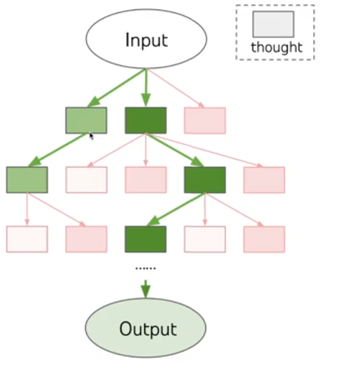

# Tree of Thought (ToT)

Tree of Thought (ToT) é uma extensão da técnica Chain of Thought (CoT) que permite que o modelo explore múltiplos caminhos de raciocínio paralelos ou alternativos antes de tomar uma decisão final. Em vez de um raciocínio linear, o ToT incentiva o modelo a ramificar ideias e avaliar alternativas, como se estivesse construindo uma árvore de decisões.

## Estudo

A técnica foi formalizada por Yao et al., 2023, no paper Tree of Thoughts: Deliberate Problem Solving with Large Language Models, mostrando ganhos significativos em tarefas complexas como jogos de lógica, planejamento e raciocínio analítico estruturado.

## Quando utilizar

- A tarefa é ambígua ou tem múltiplas soluções possíveis.
- É necessário comparar estratégias ou caminhos distintos.
- A decisão final depende de múltiplos critérios ou trade-offs.
- Deseja-se simular raciocínio humano deliberado com ponderações.

[Link paper](https://arxiv.org/abs/2305.10601)

## Exemplo

### Prompt

Você é um engenheiro de software especialista em sistemas distribuídos. Um cliente quer limitar o acesso à sua API que recebe até 100 mil requisições por segundo. Gere múltiplas abordagens (caminhos de raciocínio) para resolver esse problema. Para cada abordagem, exponha os prós e contras. Ao final, selecione a mais adequada com base em escalabilidade, confiabilidade e latência.

### Resposta esperada

#### Caminho 1: Token Bucket com Redis
- Permite bursts controlados.
- Fácil de implementar.
- Redis pode ser um gargalo sob carga intensa.
- Exige replicação e scripts atômicos.
#### Caminho 2: Leaky Bucket com cache local
- Boa regularização de tráfego.
- Alta previsibilidade de latência.
- Menos flexível para bursts.
- Cache local pode divergir entre instâncias.
#### Caminho 3: Algoritmo Sliding Window Log
- Precisão de tempo real por requisição.
- Alta granularidade.
- Alto consumo de memória e custo computacional.
- Difícil de escalar sem otimizações.

#### Avaliação dos caminhos
- Escalabilidade: Caminhos 1 e 2 são melhores.
- Baixa latência: Caminho 2 se destaca.
- Facilidade de manutenção: Caminho 1 é mais consolidado.

#### Escolha final:

Token Bucket com Redis + buffer local representa o melhor equilíbrio entre simplicidade, performance e tolerância a
falhas.

## Tecnicas auxiliares

### Expansão controlada de caminhos: limite a profundidade e número de alternativas para evitar dispersão.

- "Apresente no máximo 3 caminhos distintos para resolver este problema e desenvolva até 2 níveis de subetapas para cada um."

### Critérios de decisão explícitos: guie o modelo com parâmetros como "menor custo, maior confiabilidade", etc.

- "Para cada abordagem proposta, avalie com base em custo, latência e escalabilidade. Escolha a melhor com base nesses
critérios."

### Reavaliação iterativa: o modelo pode revisar suas escolhas se uma nova ramificação se mostrar superior.

- "Depois de explorar todas as opções, reavalie as decisões com base nos resultados observados em cada caminho e corrija se necessário."

## Combinação com outras técnicas: ToT + CoT + SoT

### Prompt

Você é um engenheiro de software especialista em sistemas distribuídos. Sua tarefa é projetar uma solução de rate limiting para uma API que suporta 100 mil requisições por segundo. Apresente 3 estratégias distintas, usando o seguinte esqueleto para cada uma:

- Visão geral da abordagem
- Etapas detalhadas do raciocínio (pense passo a passo, como um engenheiro resolveria isso em produção)
- Principais vantagens
- Principais desvantagens
- Quando usar essa abordagem
Ao final, decida qual abordagem representa o melhor equilíbrio para o caso proposto.

## Comparativo com outras técnicas

| Técnica              | Requer estrutura? | Raciocina passo a passo? | Gera múltiplas alternativas? | Ideal para...                                                   |
|----------------------|-------------------|---------------------------|------------------------------|-----------------------------------------------------------------|
| Zero-Shot            | Não               | Não                       | Não                          | Consultas diretas, respostas factuais                          |
| Few-Shot             | Parcial           | Opcional                  | Não                          | Repetir padrões de exemplo com precisão                        |
| Chain of Thought     | Não               | Sim                       | Não                          | Diagnóstico, debugging, raciocínio técnico                     |
| Skeleton of Thought  | Sim               | Opcional                  | Não                          | Respostas organizadas, documentações, especificações           |
| Tree of Thought      | Parcial           | Sim                       | Sim                          | Decisão entre estratégias, brainstorming estruturado           |