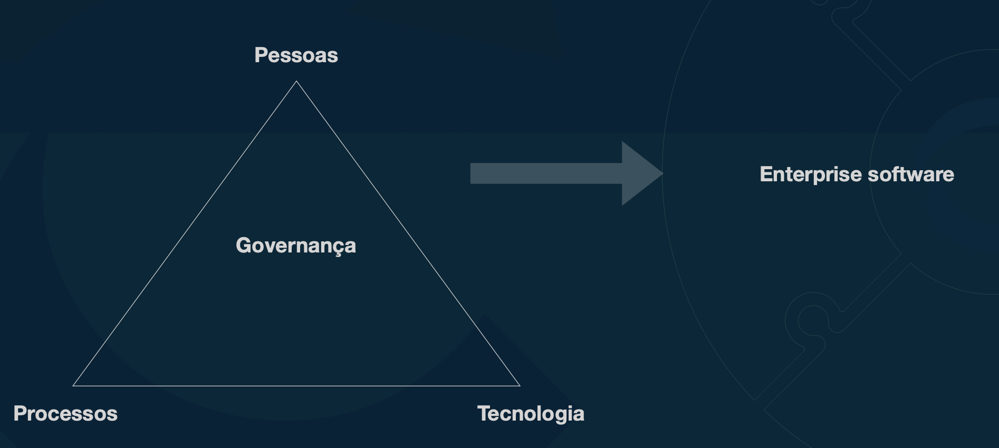

# Enterprise Software

[slides](https://mbafullcycle.s3.us-east-1.amazonaws.com/fundamentos-arquitetura-de-solucao/EnterpriseSoftwares.pdf)

## Grande sistemas de grandes coorporacoes

Software que roda em:

- Grande empresa ou unidade de negocio de grande empresa
- Agencia e governo ou unidade de agencial governamental
- Multinacional que engloba diferentes tipos de negocio
- Pequenas e medias empresas que que operam de forma global
    - Tera que lidar com questoes contabeis, seguindo leis de cada país

## Principais carct de um sistema entreprise

- Escalabilidade
    - capaz de manter a mesma capacidade de operacao indepente da quantidade de pessoas e sistemas que vao fazer parte
- Disponibilidade
    - Deixar o sistema no ar a todo momento
    - Afeta Curso
    - Que estategia utilizar?
    - Estar disponivel em momento de stress
    - Pode se por exemplo selecionar funcionalidades para estar disponivel todo o tempo (alinhando trade-offs)
- Segurança
    - Pode ser: Rede, operacional, compartilhamento de informacao, Autent/Autorizacao de pessoas, dados
    - Processos, pessoas e tecnologia fazem parte da governaca para manter a segurança
- Customização / Modularização
    - Solucoes que precisam ser customizavies para se adaptar a empresa e nao o contrario
    - Quanto maior nivel de costumizacao, mais cara a solucao fica
    - Com modularizacao, a customizacao é mais facil
    - No code e low code pode ajudar
- Integração
    - Muito comum em ambiente enterprise
    - Falar com sistemas internos
    - Falar com sistemas de terceiros e vice-versa
    - Padroes de arq. e solucoes que servem para diminir a dor de integracao de sistemas 
- Observabilidade
    - Ajudar a garantir que sistemas estao funcionando
    - Verificar metricas
    - Acompanhar performance
    - Rastrear caminho das informacoes nos sistemas
