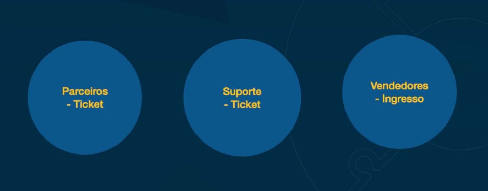
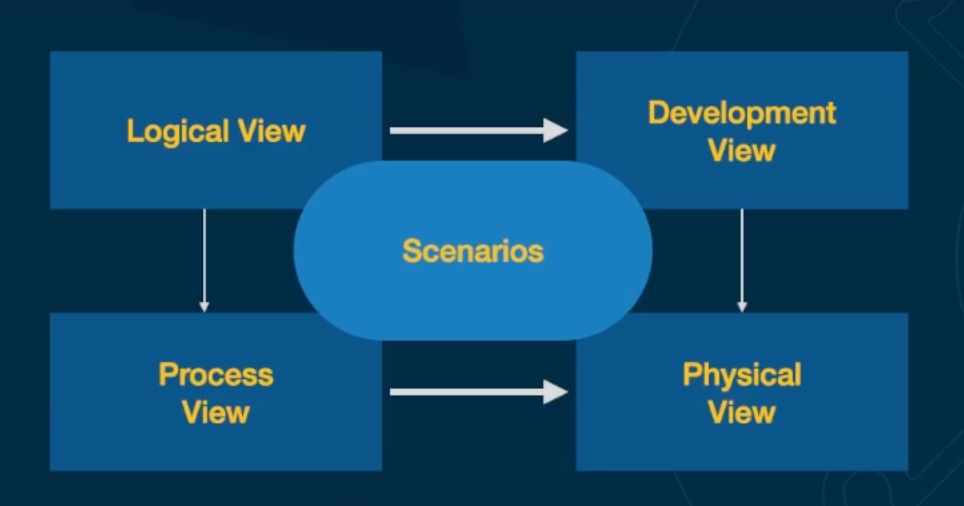

# O que é arquiterura de solucao

Processo de definição da estrutura, componentes, módulos, interfaces de uma solução de software para satisfazer requisitos funcionais e não funcionais bem como seu comportamento.

Ao criar solucao, levar em conta:
- Requisitos funcionais
- Requisito nao funcional (Comportamento)

Define / sugere a stack de tecnologia, plataformas, ferramentas, infraestrutura que serão utilizadas para implementar tal solução

Provê um blueprint do desenho e caminhos do desenvolvimento, integração de uma solução para sua melhor eficiência.

Normalmente é praticada em sistemas de software enterprise

# Pessoa arquiteta de solucao

- Diversos dominios
    - Bagagem em diversos negocios
- Conhecimento de diversas tecnologias de acordo com experiencias anteriores
- Consegue levar em consideracao contexto, restricoes de negocio, aspectos operecionais, custos e tecnicos
    - Conhece ate a empresa e suas restrições
- Preparada para entregar solucoes complexas para ambientes enterprise

## Soft skills da pessoa arquiteta

- Saber se adaptar em diversos tipos de projetos e contextos
    - Maturidade e controle emocional para mudar para projetos, culturas diferentes
- Comunicação
    - Vai estar em contato com pessoas de dominio, pessoas tecnicas, terceiros, area juridica, gestores..
    - Fome de conseguir informacao para modelar da melhor maneira possivel
- Liderança
    - Convencer pessoas a seguir sua solucao
    - Liderar pelo exemplo
- Pensamento estrategico
    - Pensar no negocio o tempo todo, pensar na ducacao ao longo do tempo
- Criatividade
    - Lidar com workaround
    - Fazer mais com menos
- Inteligencia emocional
    - Conseguir lidar com pressao
    - Lidar com decepcoes
- Trabalho em equipe
- Saber ouvir

# Principios que uma pessoa arquiteta leva em consideracao para arquitetar uma solucao

- Alinhamento com objetivos de negocio
    - Olhar para empresa e ver a estrategia geral
- Flexibilidade
    - Egolir sapo
    - Tomar decisao que talvez nao seja a melhor
- Reusabilidade
- Interoperabilidade
    - Como outros sitemas vao se comunicar com o meu sistema
- Mantenabilidade
    - Facil de manutencao
    - Facil de fazer deploy
    - Rollbacks
- Compliance com regras regularias
- Portabilidade
    - O sistema pode absorver o seu sistema
    - Isolar bem dominio

Uma boa arquitetura de solução abrange os casos de uso de negócios, a solução técnica e os serviços de infraestrutura subjacentes como componentes separados. Ele também pode ser usado para calcular o custo total de propriedade (TCO) do sistema, para que os gestores da empresa possam entender o impacto financeiro da solução.

TCO (Total cost of ownership), nao se trata apenas do custo para desevolver (Muitas empresas erram ao levar apenas isso em consideracao). vai abrangir tambem o custos de manter, corrigir e atualizar.

# Observabilidade

A Capacidade de monitorar o estado interno de um sistema

## 3 Pilares da observabilidade

1. Métricas: O Pilar dos Dados Quantitativos

As métricas representam dados quantitativos que descrevem o estado e o desempenho de um sistema em um determinado momento. Elas incluem informações como CPU, memória, uso de rede, solicitações por segundo e muito mais. As métricas são essenciais para monitorar o desempenho geral do sistema e identificar tendências ao longo do tempo. Ao analisar métricas, as equipes de operações podem detectar anomalias, prever capacidades futuras e otimizar recursos para garantir uma experiência contínua para os usuários finais.

2. Logs: O Pilar da Narrativa Detalhada

Os logs consistem em registros detalhados de eventos e atividades que ocorrem em um sistema. Eles oferecem uma narrativa detalhada do que está acontecendo em um determinado momento, permitindo que as equipes rastreiem eventos específicos, identifiquem problemas e compreendam o contexto em que ocorreram. Os logs são cruciais para investigações de incidentes, solução de problemas e conformidade regulatória. Com ferramentas avançadas de análise de logs, as equipes podem extrair insights valiosos e tomar medidas proativas para evitar interrupções no sistema.

3. Traces: O Pilar da Visibilidade End-to-End

Os traces, ou rastros de execução, fornecem uma visão detalhada do fluxo de uma solicitação através de um sistema distribuído. Eles capturam informações sobre cada etapa da jornada de uma solicitação, incluindo tempo de resposta, latência, chamadas de serviço e muito mais. Os traces são essenciais para entender o desempenho de sistemas complexos, como arquiteturas de microsserviços, onde uma única solicitação pode percorrer várias camadas de serviços. Com traces, as equipes podem identificar gargalos, entender relacionamentos entre componentes e otimizar o desempenho de ponta a ponta.

# TCO (Total cost of ownership)

- Métrica financeira que representa o custo total de comprar, desenvolver e operar uma solução ao longo do tempo.
    - Pode estar na desenvolvimento
    - Na compra
    - No suporte
    - Custos de ingra
    - Pode ser impacto de um requisito nao funcional que te afeta em custo (ex: gateway de pamento lento que atrapalha vendas)
- Não inclui apenas o preço inicial da solução, mas também os custos de manutenção.
    - As vezes voce ate tem a solucao pronta, ou a ideia, mas nao vale a pena utilizar por custo
- Formato de custos
    - Aquisição
    - Implementação
    - Manutenção
        - Manter no dia dia
    - Operacao
        - Manter funcionando estavel
    - Inativacao
        - Para desativar, pode se precisar ter impactos em pegar dados, quebras de contrato, maquinas alugadas com antecipacao...

# Diferenca entre enterprise architecture e Solution architecture

EA possui uma visão da corporação como um todo, já SA tem um foco normalmente em uma solução específica.

EA: planejamento, implementação da estrutura organizacional de uma corporação. Incluindo: pessoas, processos, e tecnologia.

SA: define a estrutura, características, comportamentos e relações entre um sistema específico.

# 3 Niveis de arquitetura de solucao

- Arquitetura focada no negócio (Nível 0)
    - Como que eu vou entender o problema que eu vou resolver? 
    - O que é possível? O que não é possível? 
    - Quais são os módulos que eu vou ter que trabalhar? 
    - Quais são as decisões? 
    - Quais são requisitos funcionais, não funcionais? 
    - Como que aquilo vai funcionar na empresa? 
    - Quantas pessoas vão utilizar esse servico?
- Arquitetura focada na área técnica (Nível 1)
    - Como que eu consigo trazer aquilo que a gente pensou e que o negócio precisa para um plano de ação técnico? Ou seja, como isso vai ser desenvolvido? 
    - Quais as tecnologias que vão trabalhar? 
    - Como é que vão funcionar as integrações? 
    - Quanto esse negócio vai custar? 
    - Quanto desenvolvedores eu vou precisar? 
    - Quais soluções que nós vamos ter que desenvolver? 
    - O que a gente vai integrar, o que não vamos integrar, etc
- Arquitetura focada no deployment (Nível 2)
    - Infraestura que vai rodar
    - Como garantir qualidade, testes

É bom para dvidir o entendimento, nao pensar em tudo ao mesmo tempo

## Nivel 0 - Visão

- A visão deixa claro os objetivos da solução de uma forma mais empírica, lógica e que deixe claro sua razão de existir.
    - As vezes a ideia ou demanda vem da direcao simples. O arquiteto de solução tem que entender essa visão, ele tem que ter aquele feeling

- Define os principais objetivos que vão guiar a solução.
    - Entender o diferenciais da solucao

- Apresenta uma visão de alto nível do que a solução vai realizar, suas necessidades, bem como todos os envolvidos.

## Nivel 0 - Escopo

- Define os limites da solução
- Problema que será resolvido, requisitos funcionais e não funcionais
- Componentes, sistemas e tecnologias
- Considera restrições e pressupostos que podem influenciar no design da solução

# Dominio e contextos

- Trabalhar em sistemas enteprise exige entendimento apropriado do negocio

- Ver o negocio pelo ponto de vista do participantes (Vendedor, parceiro, diferente participantes )
    - Cada area tem um visao diferente, cultura diferente. é preciso ver a na visao deles

- Como os contextos se comunicam e qual linguagem

## Linguagem

A mesma coisa em diferentes areas pode ter nomes diferentes

Criar um glossario por area pode ser útil

# Lei de Conway

A Lei de Conway é um princípio que afirma que o design de um sistema é influenciado pela estrutura organizacional do grupo que o produz. Isso significa que a estrutura de comunicação de um grupo será refletida na estrutura dos sistemas que eles criam. A arquitetura de um sistema reflete os limites sociais do grupo que o criou.

Ou seja, a estrutura de uma solucao de software espelhará a estrutura de comunicacao da organizacao que a construiu

# View e viewpoints

- Uma visão (view) é uma representação de um ou mais aspectos estruturais de uma arquitetura que ilustra como a arquitetura aborda uma ou mais questões mantidas por um ou mais de seus stakeholders.’

- Um ponto de vista (viewpoint) é uma coleção de padrões, modelos e convenções para construir um tipo de visão. Ele define as partes interessadas cujas preocupações são refletidas no ponto de vista e nas diretrizes, princípios e templates para a construção de seus pontos de vista.

A ideia é ajudar o arquiteto se comunicar por diferentes pontos de vista

É possivel criar varias visoes a partir de pontos de vista diferentes de um cenario. 

- Logico (Focado em condicoes e regras)
- Desenvolvimento (Codigo, design)
- Fisico (Armazenar dados, escala, servidos)
- Processo (Processo, retentativas, onde manda email, etc)

[The “4+1” ViewModel of Software Architecture](https://www.researchgate.net/publication/220018231_The_41_View_Model_of_Architecture)

# Risco vs Documentação

- Para avaliar a necessidade de ter ou quantidade de documentacao, pode ser avaliar o risco.

Quao mais complexo o sistema e arriscado de termos problemas (inclusive pela falta de documentacao), maior a chance