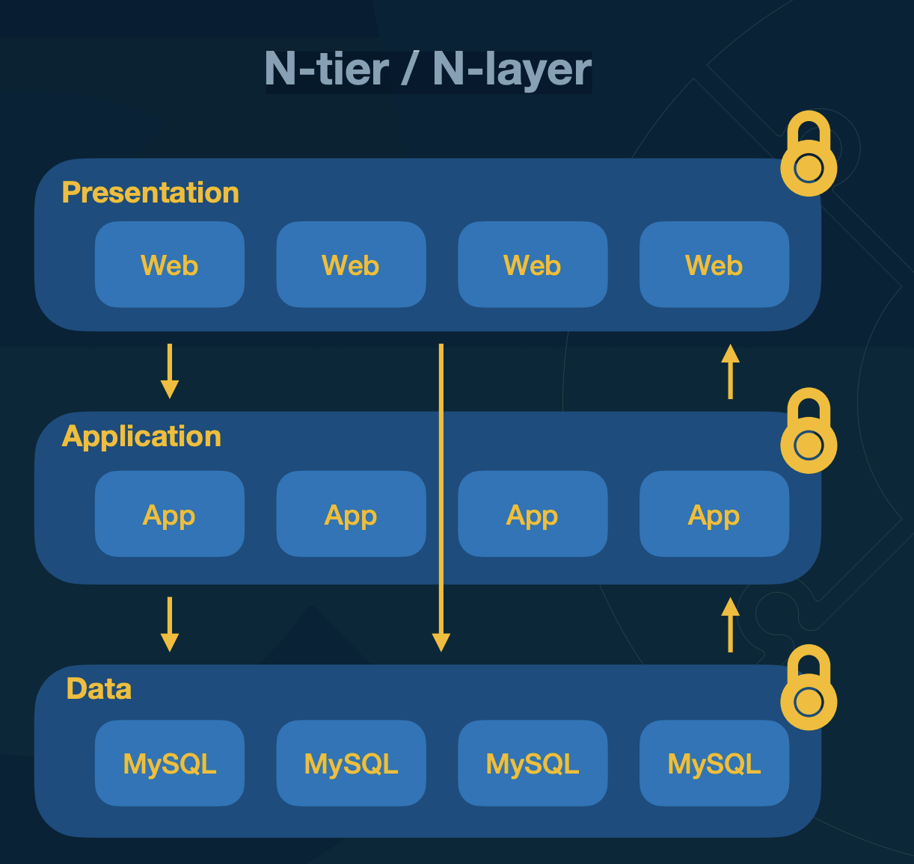
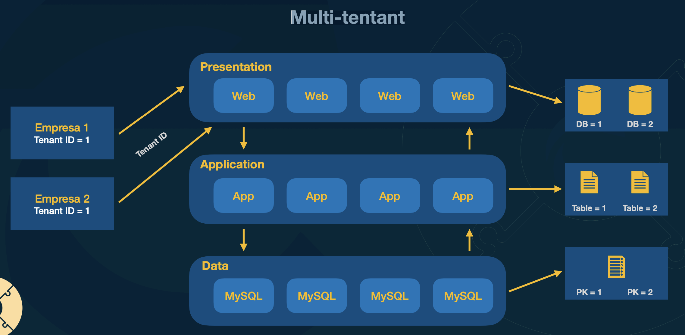
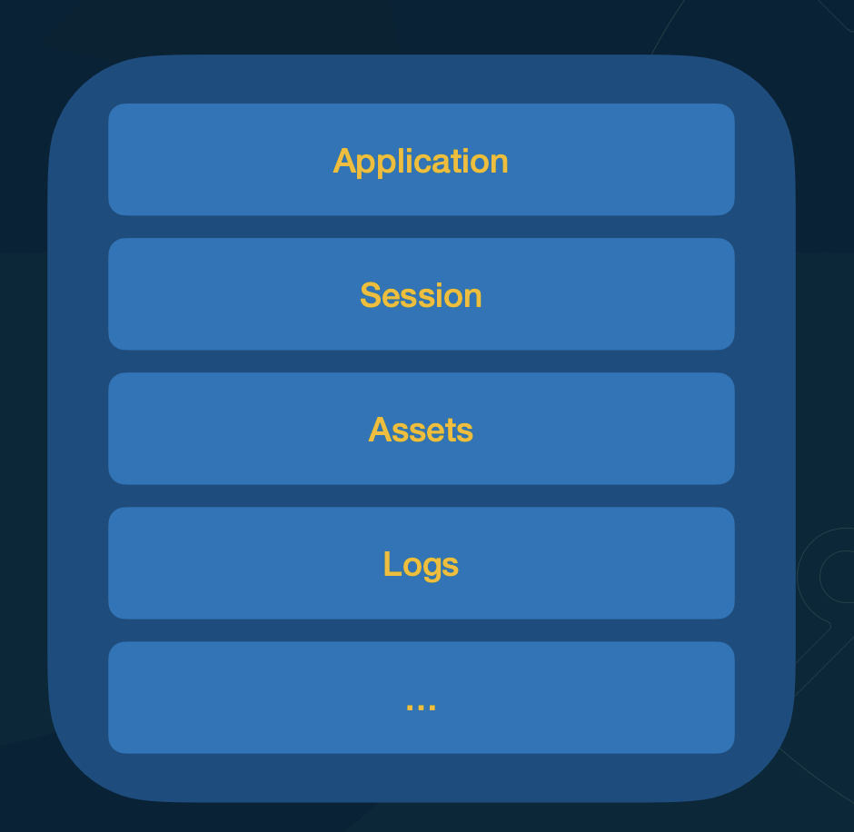
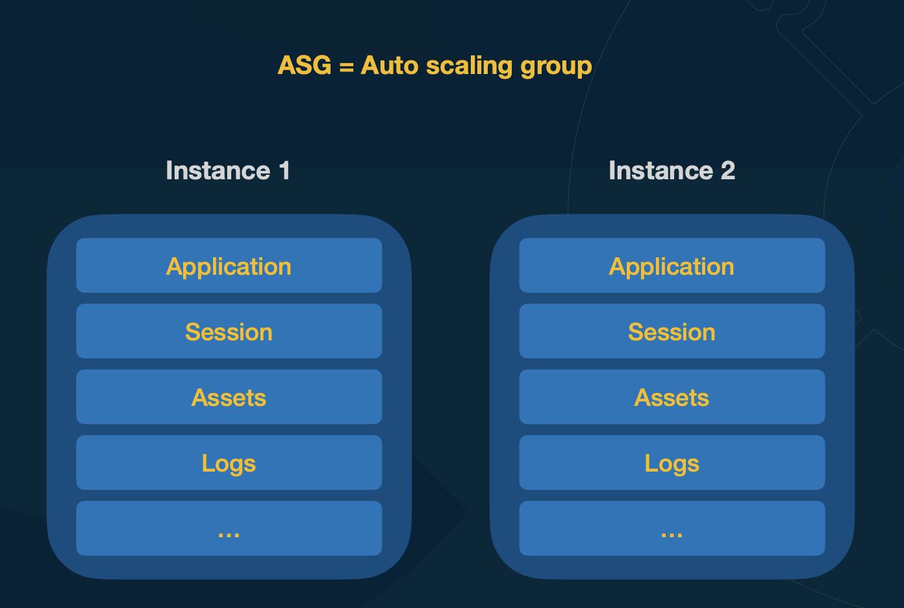

Solucoes comuns para diversos tipos de problemas

(Os casos citados aqui, mais formalmente se paracem mais padroes arquiteturais do que design patterns)

[Slides](https://mbafullcycle.s3.us-east-1.amazonaws.com/fundamentos-arquitetura-de-solucao/DesingPatternsArquiteturaSolucao.pdf)

# N-tier / N-layer

Cria camadas separadas para a aplicação. 
- Posso ter um presentation eu vou ter um sistema, uma aplicação e essa aplicação pode escalar. Comoo diversos web. Que seria um layer que vai focar em apresentação. Pode ser um front end feito em React, ou um framework que faz server side rendering. assim exibição é desacoplada da parte das outras áreas da aplicação

-  A aplicação vai rodar as regras de negócio, as orquestrações dos processos, etc.

- E também um tier só referente a data, então eu posso ter os meus bancos de dados, posso ter os meus bancos de dados utilizando sharding, posso estar trabalhando com réplicas ou tenho uma escrita, os outros fazem leitura e tudo mais.

Podemos definir a seguraca/exposicao de camada de forma diferente e restrigir que camada pode acessar outra. O mais comum seria apreseantacao so acessar applicacao e aplicacao acessar data (Mas pode acontecer excessoes)

# Multi-tentant

Tenant é como se fosse um inquilino. Como se cada inquilino fosse um empresa que quer usar o sistema de forma separada. Em que nao é desejado fazer um deploy para cada tenant.

Cada tenant nao pode ver os dados da outra empresa. Isso é muito comum ao se trabalhar com PAAS(Plataforma é a service).

Cada empresa passa seu id ao utilizar

3 abordagens:

- Bancos diferentes por tenant
- Tabelas diferentes por tenant
- Coluna (possivelmente PK) para diferencias registros (forma mais utilizada)
    - Não é adequado quando um trafego de um tenant é muito maior do que outros

# Stateless vs Stateful

## Aplicacao Stateful

Guarda estado

- Nao possibilita scaling, os acessos gravam itens no proprio servidor, em que uma maquina nova nao teria

## Aplicacao stateless

Nao guarda estado, para isso pode utilizar servicos como Redis(para guardar sessoes), S3 para assets, algo para coletar os logs do stdout, etc

## Serverless

Possibilidade de pagar apenas para utilizacao real. Ex durante a madrugada se ninguem utilizar nao tera taxa.

Nesse exemplo tenho todo um conjunto que utiliza serveless, pois sao servicos que cobram apenas pela utilizacao por acesso

- S3 - Posso ter um app em react que está no S3, que alem do espaco vai cobrar pelo acesso ao arquivos. Esse app react pode apontar para um backend
- API gateway - Ele pode redicionar para uma lambda por uma regra utilizando `/home` como base por exemplo. function. A API gateway sera tambem cobrado so pelos acessos
- Lambda function - So vai ser cobrado quando se utiliza (A primeira vez vai ser feito um cold start)
- Cloud Trail - Um servico para guardar logs que só cobra quanto tem log
- DynamoDB - Tem uma forma de cobrar apenas pelo acesso.

Portanto, quando estamos falando em Serverless, não etamos falando apenas em Lambda Functions. Serverless, significa que eu não ter que preocupar com dimensionamento de infraestrutura, deployment de infraestrutura e pagar por algo que não é estou utilizado. 

Significa que o Cloud Provider vai provisionar e deixar tudo pronto e ele cobrar on demand conforme o uso. Logo, Serverless vai desde o S3 até uma Lambda Function, até um banco de dados.

