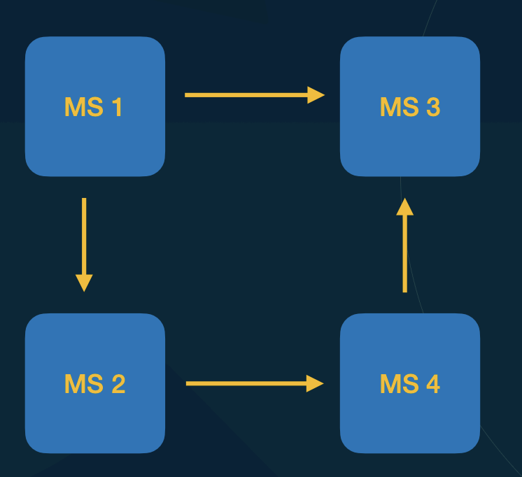
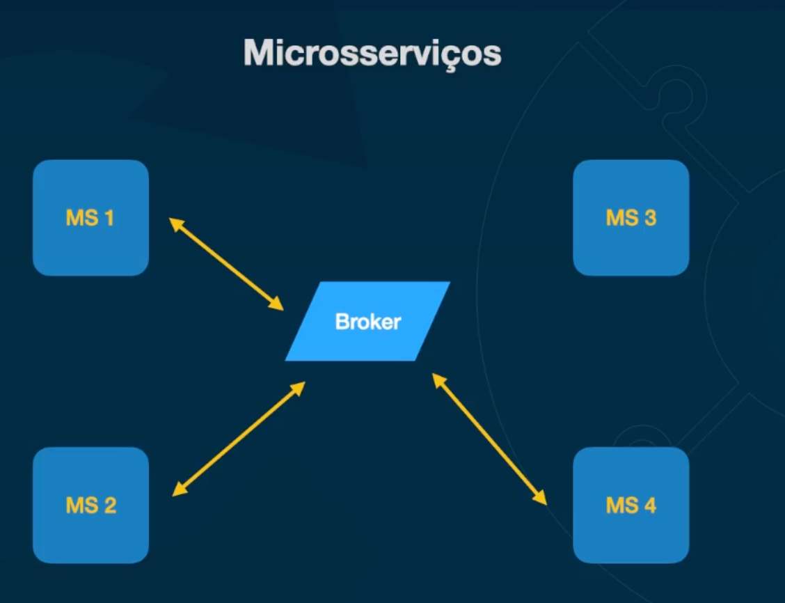
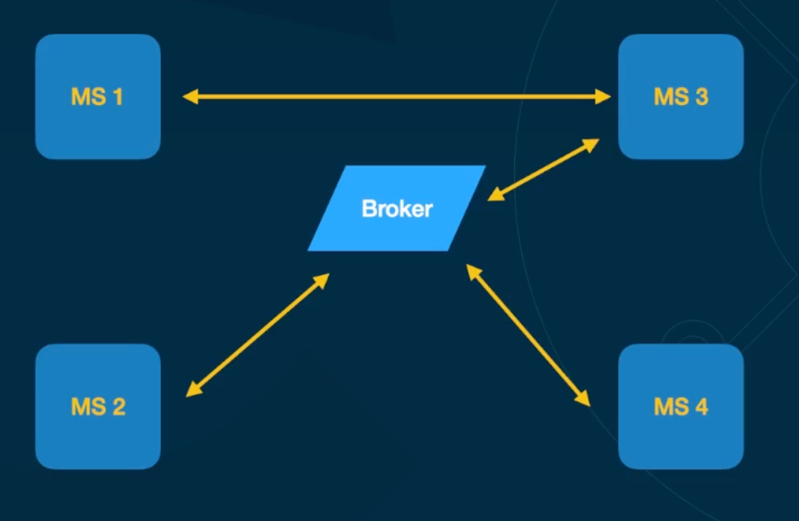
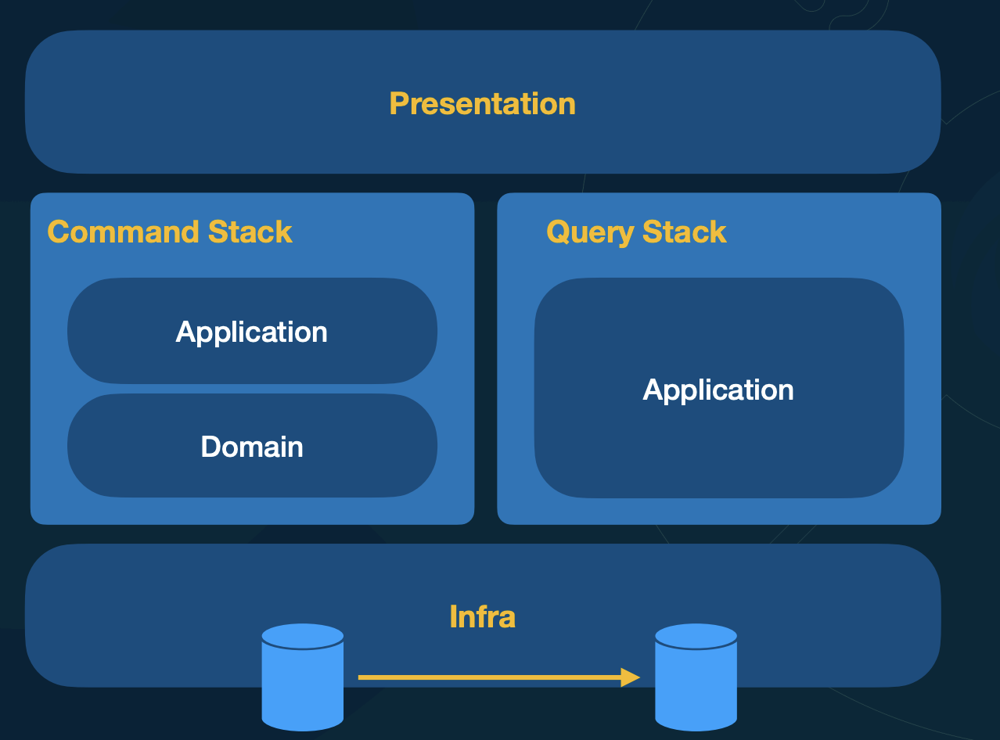
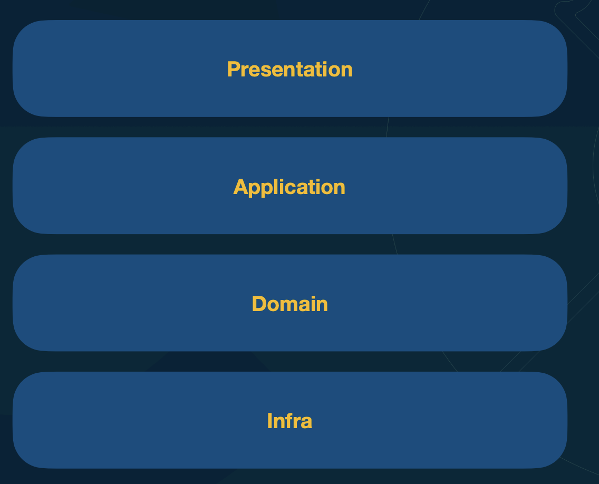
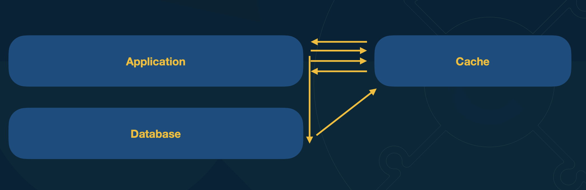
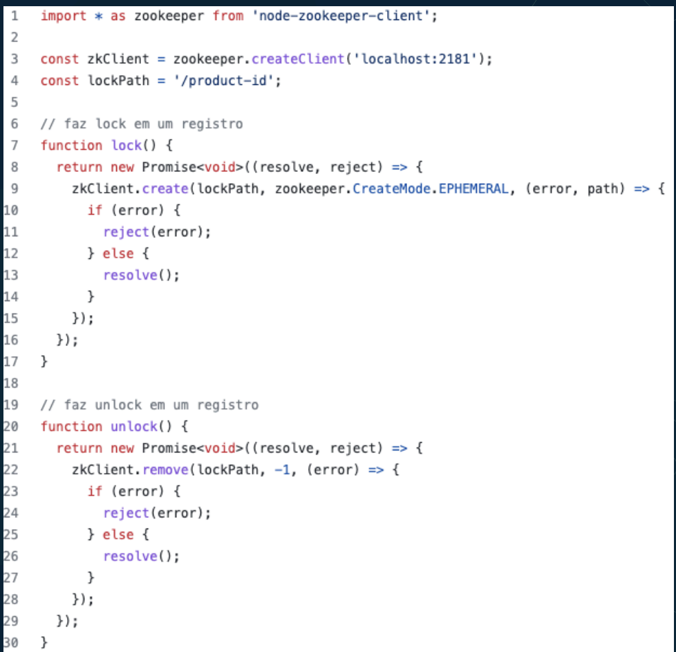

Solucoes comuns para diversos tipos de problemas

(Os casos citados aqui, mais formalmente se paracem mais padroes arquiteturais do que design patterns)

[Slides](https://mbafullcycle.s3.us-east-1.amazonaws.com/fundamentos-arquitetura-de-solucao/DesingPatternsArquiteturaSolucao.pdf)

# N-tier / N-layer

Cria camadas separadas para a aplicação. 
- Posso ter um presentation eu vou ter um sistema, uma aplicação e essa aplicação pode escalar. Comoo diversos web. Que seria um layer que vai focar em apresentação. Pode ser um front end feito em React, ou um framework que faz server side rendering. assim exibição é desacoplada da parte das outras áreas da aplicação

-  A aplicação vai rodar as regras de negócio, as orquestrações dos processos, etc.

- E também um tier só referente a data, então eu posso ter os meus bancos de dados, posso ter os meus bancos de dados utilizando sharding, posso estar trabalhando com réplicas ou tenho uma escrita, os outros fazem leitura e tudo mais.

Podemos definir a seguraca/exposicao de camada de forma diferente e restrigir que camada pode acessar outra. O mais comum seria apreseantacao so acessar applicacao e aplicacao acessar data (Mas pode acontecer excessoes)

# Multi-tentant

Tenant é como se fosse um inquilino. Como se cada inquilino fosse um empresa que quer usar o sistema de forma separada. Em que nao é desejado fazer um deploy para cada tenant.

Cada tenant nao pode ver os dados da outra empresa. Isso é muito comum ao se trabalhar com PAAS(Plataforma é a service).

Cada empresa passa seu id ao utilizar

3 abordagens:

- Bancos diferentes por tenant
- Tabelas diferentes por tenant
- Coluna (possivelmente PK) para diferencias registros (forma mais utilizada)
    - Não é adequado quando um trafego de um tenant é muito maior do que outros

# Stateless vs Stateful

## Aplicacao Stateful

Guarda estado

- Nao possibilita scaling, os acessos gravam itens no proprio servidor, em que uma maquina nova nao teria

## Aplicacao stateless

Nao guarda estado, para isso pode utilizar servicos como Redis(para guardar sessoes), S3 para assets, algo para coletar os logs do stdout, etc

# Serverless

Possibilidade de pagar apenas para utilizacao real. Ex durante a madrugada se ninguem utilizar nao tera taxa.

Nesse exemplo tenho todo um conjunto que utiliza serveless, pois sao servicos que cobram apenas pela utilizacao por acesso

- S3 - Posso ter um app em react que está no S3, que alem do espaco vai cobrar pelo acesso ao arquivos. Esse app react pode apontar para um backend
- API gateway - Ele pode redicionar para uma lambda por uma regra utilizando `/home` como base por exemplo. function. A API gateway sera tambem cobrado so pelos acessos
- Lambda function - So vai ser cobrado quando se utiliza (A primeira vez vai ser feito um cold start)
- Cloud Trail - Um servico para guardar logs que só cobra quanto tem log
- DynamoDB - Tem uma forma de cobrar apenas pelo acesso.

Portanto, quando estamos falando em Serverless, não etamos falando apenas em Lambda Functions. Serverless, significa que eu não ter que preocupar com dimensionamento de infraestrutura, deployment de infraestrutura e pagar por algo que não é estou utilizado. 

Significa que o Cloud Provider vai provisionar e deixar tudo pronto e ele cobrar on demand conforme o uso. Logo, Serverless vai desde o S3 até uma Lambda Function, até um banco de dados.

# Microsservicos

 - Microsserviços são sistemas que normalmente têm responsabilidades específicas e essas responsabilidades podem ser projetos totalmente diferentes dentro de uma organização. 
 
- Uma vantagem é que quando eu separo tudo isso, fica mais fácil inclusive organizacionalmente eu criar diversas equipes. 

- Uma desvantagem porém, quando um microsserviço chama o outro e o outro estiver fora do ar, o microsserviço que chamou também vai ficar fora do ar e isso pode gerar um efeito dominó muito grande dentro da organização.

- A coisa mais importante que a gente tem que fazer quando nós trabalhamos com microsserviços é lutar contra o acoplamento. O que é o acoplamento? Fazer um microsserviço depender de outro microsserviço diretamente.

- Quando um microsserviço chama o outro de forma síncrona, ou seja, diretamente, por exemplo, uma requisição REST, você sempre vai ter a chance de receber um 404, um erro 500 ou qualquer coisa desse tipo. Logo, você vai ter que ter mecanismos para conseguir viver, mesmo fazendo chamadas que possam te atrapalhar

- Uma das melhores formas para resolver esse tipo de problema é trabalhar de forma assíncrona.

- Se um microsservico cair o resto funciona normalmente

- Pode acontecer um funcionamento de forma mista (sync e assync)

## Vantagens

- Principal motivacao: Organizacional. Equipes.
- Escalacalabilidade
- Separacao de responsabilidade
- Diferentes tecnologias
- Baixo acoplamento

## Complexidades

- Maturidade da organizacao
- Maturidades do times
    - Time vai se especializar no dominio, lidar com comunicacao, diferente tecnologicas
- Deployment
- Observabilidade
- Troubleshooting

# CQRS (Command Query Responsibility Segregation)

No caminho mais comum, em servico com camadas, uma request de post, salvaria no banco e retornaria o corpo. Sendo assim requisicao na pratica está fazendo mais do que apenas salvar, está tambem consultando.

Usando o padrao CQRS, a tente separa o que é leitura do que é escrita

Pode ser criar um lado da minha aplicação chamado de Command Stack. Que é uma camada, uma área da minha aplicação onde eu tenho apenas mudanças de estado na minha aplicação. Ex: Criei um usuário, alterei um email, fiz um update ou alguma coisa, ou seja, a minha intenção é de causar mutação, então, eu estou na minha command stack. A minha apresentação recebe essa informação, bate na minha aplicação, rodo regras de domínio, acesso o banco de dados e acabou. Se deu algo errado, o que eu vou fazer é retornar uma simples exception

Para obter o usuario (Registro). Não tem nada a ver comigo, porque eu só gravo essa minha área do meu sistema, ela serve apenas para gravação. Para isso existe a Query Stack, onde eu tenho apenas a minha aplicação. Se você perceber, eu não estou nem passando pelo modelo de domínio. Por quê? Porque se alguém quer os usuários, eu não quero saber. Se o usuário tem que chamar um repositório para carregar um modelo de domínio, para retornar o meu agregado inteiro, nada disso. O cara quer receber os usuários, eu bato na aplicação, seleciono os usuários, retorna esses usuário e não interessa mais nada, ou seja, eu posso pular regras de negócio e eu posso fazer muita coisa.

E por que isso pode me ajudar? De forma geral, se você tem 10.000 visualizações, é porque você teve, por exemplo, 1.000 escritas. Normalmente, a visualização é muito mais forte do que a escrita. Assim, para eu conseguir deixar o meu sistema eventualmente mais performático, alem de também evitar com que o meu sistema tenha que ficar rodando regras de domínio ou qualquer coisa desse tipo, o que simplesmente eu posso fazer? Quando a pessoa quiser consultar, eu vou resolver o problema dela de consulta e acabou. 

Então, por exemplo, se eu for querer gerar um crediário, eu vou gerar, ele vai criar o número de parcelas, vai fazer todas as regras malucas e difíceis. Agora, se eu quiser saber só as parcelas, eu não preciso acessar o modelo de domínio, eu pego as parcelas onde usuário é tal e retorne para o cara, por exemplo. É uma facilidade muito maior.

Tenho diversas vantagens. Uma, eu consigo retornar os dados da forma mais fácil para o usuário, eu consigo ter views materializadas para retornar tudo da forma mais fácil, consigo ter mais performance para trabalhar dessa forma inclusive e eu consigo deixar a parte com responsabilidade de modelo de domínio somente em uma parte da aplicação. , Uma opção tambem é a seguinte: você pode criar um banco de dados de escrita e um banco de dados de leitura. Olha só que interessante. O meu banco de dados de escrita vai recebendo todas as gravações. O banco de dados de escrita sincroniza no banco de dados de leitura e a minha leitura acontece totalmente separada da minha escrita. Isso não é obrigatoriedade do CQRS, mas você pode fazer isso. 

Pode ser tambem por exemplo, gravar em uma SQL e fazer a minha a em um Cassandra, etc.

# Caching

A ideia do cache é simples, porém, tem diversas variações. Eu recebi uma requisição, a minha aplicação vai buscar se o resultado dessa requisição está em um cache. Normalmente o cache é um sistema à parte e normalmente é um banco de dados que guarda as coisas em memória para ter um acesso muito rápido. 

Logo, a  aplicação busca o cache e vai ver que não existe a informação que ela está buscando na primeira vez. Sendo assim a aplicação, vai no banco de dados, grava essa informação no cache e essa informação é retornada para a minha aplicação, para o usuário final. Assim, a partir de agora essa informação está no cache. 

Na proxima vez aplicação vai buscar no cache, o cache vai existir daquela informação e já vai retornar direto para a aplicação de uma forma muito rápida, sem ter que bater no banco de dados, sem ter que fazer processamento pesado. 

## Estratégias de invalidação de cache

O dado do cache pode ficar ultrapassado

- Time-based invalidation
    - Fala que daqui x horas o cache será limpo
    - Utilizado em sites de muito acesso
    - Em locais que vc sabe o horario que alguma atualizacao em bacth roda
- Least Recently Used (LRU)
    - Gravando A, B e C na ordem
    - Ao gravar D e ser necessario mais memoria, é descardado o A por ser o menos recente
- Most Recently Used (MRU)
    - Geralmente so se tem uma versao desse cache e vc apaga ele(ele sendo o mais recente)
- Least Frequently Used (LFU)
    - Apaga o menos utilizado
- TTL-based invalidation
- Write-through invalidation
    - Menos comum
    - Sempre quando a alteracao no disco o cache é atualizao em conjunto
    - Funciona bem quando nao se tem alto indice de escrita
- Write-back invalidation
    - Menos comum
    - Da prioridade no cache sobre o banco de dados.
    - Muitas vezes o dado em disco é atualizado quando o cache já está para expirar de alguma forma

# Distributed Locking

Para resolver problemas de concorrencia como:

> Vamos imaginar que nós temos um e-commerce e esse e-commerce tem um único produto para venda. Só tem um produto em estoque, e estamos no meio de uma Black Friday. Já pensou se o cliente A e o cliente B compram esse produto no exato momento, e para eles fazerem a compra, o que eles precisam fazer? Consultar o estoque. Mas, na hora que eles consultam o estoque simultaneamente, consta que tem um produto, mas na hora que eles vão fazer o restante da compra, você vai perceber que eles venderam um único produto para duas pessoas.

É necessario fazer um lock distribuido ate pelo fato de fazer lock para varias maquinas

## Vantagens

- Consistência de dados
- Contenção de recursos
    - Evita acessos a banco de dados, evitando operaçoes em si
- Evita dead locks
    - Pessoa 1 precisa alterar primeiro A e depois B
    - Pessoa 2 precisa alterar primeiro B e depois A
    - Isso sendo feito ao mesmo tempo, A estará locado pela primeira transacao e B estará lockado pela segunda transacao. Ambos vao ficar aguardando eternamente
- Garante mais eficiência dos recursos
    - Esse centralizador é otimizado a parte para lidar com os locks
- Ferramentas: Apache Zookeeper, ETCD, Redis, Consul

No geral, voce pede para lockar um path, caso já esteja locakado será retornado uma exception.

Ex: 

