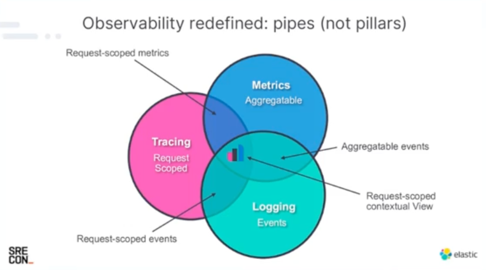
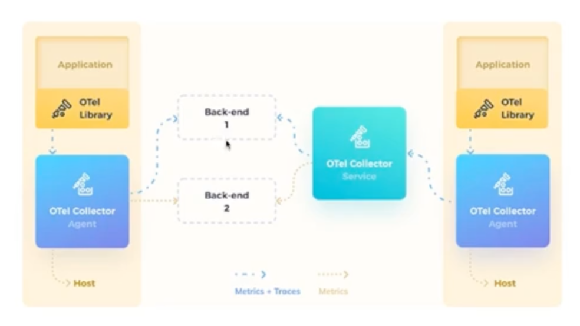

Vamos imaginar que quem vai ter observabilidade, nao desenvolveu. Portanto uma caixa preta.

Definicao em traducao livre do newrelic

> Na teoria de controle, a observabilidade é definida como uma medida de quão bem os estados internos de um sistema podem ser inferidos a partir do conhecimento das saídas externas desse sistema. Simplificando, observabilidade é quão bem você pode entender seu sistema complexo.

## Monitoramento

Observabilidade vs monitoramento

- Monitoramento nos mostra que há algo errado
- Monitoramento se baseia em saber com antecedência quais sinais você deseja monitorar
- Observabilidade nos permite perguntar o porquê

Sendo assim, monitor significa conseguir ler o que está acontecendo, pegar aquelas informações e, eventualmente, informar essa informação. Informar para quem deseja saber o que está acontecendo ou se ela está fora dos padrões.

Para monitorar eu tenho saber o que monitorar (parametros)

Uma vez que tem algo errado visto pelo monitoramento, a observalidade nos permite interpretar para saber motivos

# Pilares vs pipes

Considerando os 3 pilares da observabilidade:

- Logging
    - Eventos: algo que aconteceu no passado. Ex:  sistema botou, usuário criado, e-mail enviado, etc.
    - Geralmente tem informacoes completas do que aconteceu

- Metrics
    - Qualquer medida que temos, sao possiveis de agregar. Ex: estou com 80% de memória RAM, tenho 200 pessoas no meu site agora, tenho 30 compras por minuto.
    - 

- Tracing
    - Forma de você rastrear o que está acontecendo dentro daquela caixa preta.
    - Ex: Fiz uma request, essa request bateu no meu sistema, um monte de operação aconteceu e meu sistema está demorando. Quando eu consigo olhar essa request, vendo por todas as entranhas, vamos dizer assim, do meu software, posso falar o seguinte: “olha, aqui demorou porque eu tenho uma consulta no banco de dados que está demorando 5 segundos, então, já era
    - Pode ser uma request que passa por diversos sistemas

Os 3 pilares tem areas em comum. Isso são as pipes. Os pontos de intersecção em um determinado momento.
Ex: Sistema deu um erro. Na hora que esse meu sistema deu um erro, ele gerou um log de um tracing falando que o erro foi porque não conseguiu inserir o dado no banco. Eu consigo ver naquele momento quanto estava. Ou seja, o quanto o meu banco de dados estava ocupado naquele momento com relação à memória. E ao mesmo tempo, eu consigo ver qual foi o comando de inserção no banco de dados através do meu tracing. Então, você consegue naquele instante, naquela request, ver qual log ela gerou, o que aconteceu com ela e como estavam as métricas naquele momento. Você não observa as coisas apenas de forma separada. Eu observo as coisas com os dados em conjunto

Quando eu olho dados em conjunto, eu tenho o contexto e quando eu olho o contexto, as coisas ficam mais fáceis.

Ex: Vamos imaginar que eu fiz uma requisição e eu vou olhar no tracing. Ela mostrou para mim que demorou para inserir nos dados no banco. Eu quero pensar: “poxa vida, por que demorou para inserir?” Então, naquele momento, eu vou ver quanto estavam as métricas e eu vou ver que naquele momento o CPU do meu banco de dados estava em 100%. Com isso, eu falo: “ops, não inseriu porque as métricas estavam zoadas por conta do meu banco de dados”. Ou não inseriu porque, olhando no log, houve um erro de conexão.

# Principais ferramentas

- Elastic Stack
    - De forma geral é open source.
    - No kibana tem plugins que sao pagos
- Datadog
    - Muitos servicos que complementam as pipes
- New Relic
    - Bem tradicional que soube se reinventar
- Splunk
    - Muito utilizado em logs
- Dynatrace
- Prometheus/Grafana
    - Prometheus é para metricas (Banco timeseries database)
    - Prometheus, acessa um endpoint para pegar metricas
    - Para metricas de SO, DB por exemplo, é utilizado um exporter pra isso
- Jaeger
    - Tracing distribuido
- Zipkin
    - Mais antiga que o Jaeger
- Kiali
    - Fazer rastreabilidade e comunicacao entre sistemas
    - Nasceu para ser utilizado junto istio (Service Mesh)    

# Open Telemetry

- Mantido pela CNCF (Cloud Native Computing Foundation)
- Baseado no Open Tracing e Open Census
- Baseado em:
    - Especificações
    - Protocolos
    - SDKs
    - Ferramentas de integração

