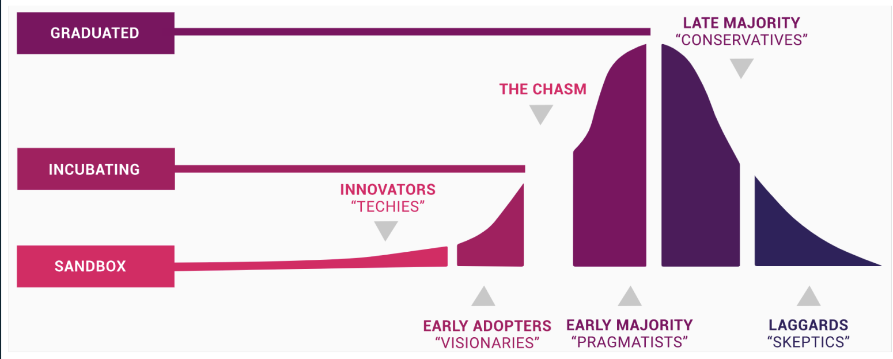
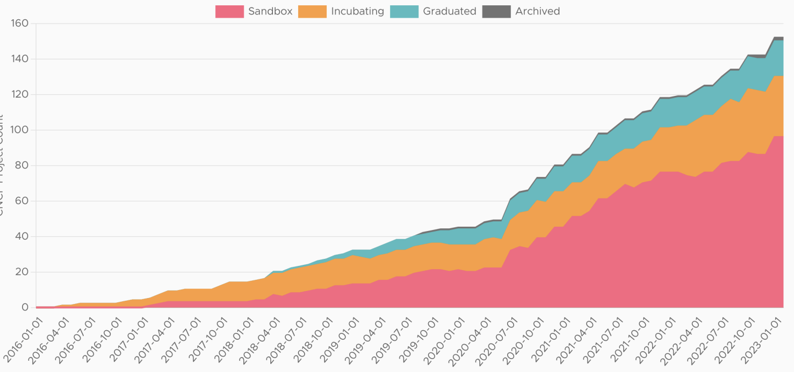

Soluções cloud native são soluções específicas, que foram criadas após o momento cloud, ou seja, após a cloud, nasceu o mundo da cloud computing.
E sao independentes de qual cloud

# Soluções Cloud Native

- Soluções desenhadas para rodar em ambientes de Cloud Computing
    - Já crio pensando que vai rodar na nuvem, para tirar vantagem disso
- São desenhados para tirar vantagens desses ambientes
- Modulares
    - Elas se formam em máquinas diferentes, em nós diferentes e rodam em formatos de cluster
- Prontas para rodar de forma distribuída
    - quando algo roda de forma distribuída na nuvem e essa distribuição, cada módulo, cada parte faz algo diferente, você consegue fazer com que a nuvem potencialize e mantenha alta disponibilidade, segurança e confiabilidade. Isso porque você sabe que se cai uma máquina, sobe outra. Se teve muito acesso, escala. E caso tenha muito acesso nesse módulo, escala só esse módulo.
- Ex:
    - Docker
        - Conteiners feitos para rodar em qualquer nuvem
    - Kubernetes, Helm, Istio, Linkerd, Envoy
    - Apache Kafka
    - Prometheus
    - OpenTelemetry
    - AWS Lambda
    - ArgoCD
    - Produtos HashiCorp (Vault, Consul, Terraform)

# CNCF (Cloud Native Computing Foundation)

> "We bring together the world’s top developers, end users, and vendors and run the largest open source developer conferences. CNCF is part of the nonprofit Linux Foundation."

- Organização sem fins lucrativos
- 153 Projetos e contando
- Criada em 2015
- Parte da Linux Foundation
- Responsável por famosos projetos:
    - Kubernetes, Prometheus, OTEL, Envoy, Jaeger
    - Cria comissoes, ajuda, junta comunidades
- Programas de certificação
    - CKAD (Certified Kubernetes Application Developer)
    - CKD (Certified Kubernetes Administration)
    - CKS (Certified Kubernetes Security Specialist)
    - KCNA (Kubernetes an Cloud Native Associate)
    - PCA (Prometheus Certified Associate)

    

Configura e categoriza esses projetos em três níveis de projetos.

- Graduated
    - Ex: K8s
    - O mundo inteiro está utilizando Kubernetes, é um projeto estável,  em andamento e que já está largamente testado
    - Maioria das pessoas que trabalham com esses projetos são inclusive pessoas mais conservadoras
- Incubating
    - São projetos que são novos, mas muitos deles já podem ser utilizados em produção
    - quem vai acessar esses tipos de projetos, ou seja, quem vai utilizar normalmente, são pessoas mais pragmáticas
- Sandbox
    - São projetos que a CNCF acredita que são promissores
    - Esses projetos são para early adopters
    - São projetos que podem mudar constantemente e quebrar a compatibilidade

O suporte da CNCF consiste em uma aplicação de um projeto que ira para uma comissão. Se o projeto é adotado, a CNCF junta muitos desenvolvedores para que a partir daquele momento ela consiga mentorear, ajudar, direcionar ou divulgar esse projeto para tentar fazer ele crescer ao máximo. Para que o projeto possa receber mais contribuição e poder crescer. 

