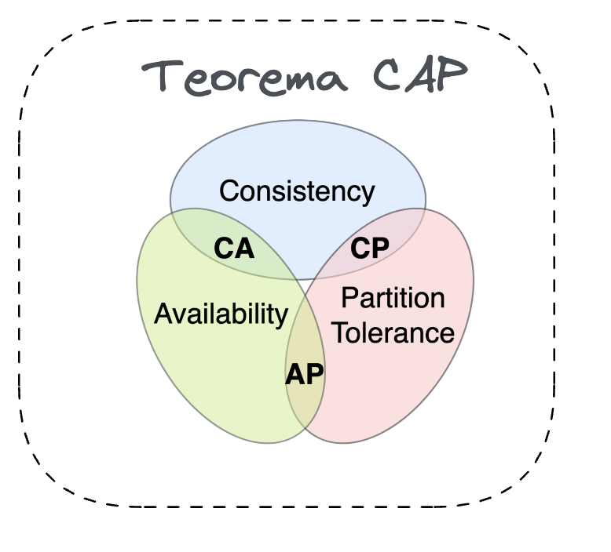

# O que é system design

> "O System Design é um processo de definição de arquitetura, componentes, módulos, interfaces e dados para atender os requisitos especificados"

- De uma forma geral, ele é um processo para gente definir a arquitetura, não é apensar desenhar a arquitetura

# Importancia

- Pensar na arquiteruta de forma intencional
    - O faco de seguir etapas do processo ajuda a pensar de forma intencional o problema
- Racionaliza as definicoes que realmente importam
    - Nao vai ter todos os detalhes, vao ter mais aproximaçoes
- Explorar possíveis solucoes
    - De acordo com que passa pelos processos, acaba explorando possibilidades
- Nos ajuda a ter uma visão de presente e futuro do software
- Exercita a forma de pensar e planejar diferentes tipos de solucao de software
    - Ex: As vezes vc quer que sua aplicacao seja rapida, e vc quer usar cache em memoria, porem isso sai caro...

# System Design vc Big Techs

- Forma do candidato pensar
- Repertório e o nível de profundidade nas tecnologias
- Capacidade de dedução
- Capacidade de comunicação
- Capacidade de ser confrontado
    - Agir sob pressao

# System Design no mundo real

- System design é uma ferramente na mão do arquiteto de solucoes
- É uma forma do arquiteto se expressar
    - um sistema eventualmente tem tanta complexidade, mas tanta complexidade, que se você tentar falar tudo de uma vez, de alguma forma, vai ficar muito complexo. Então, se você tem uma maneira organizada, estruturada, de se expressar para que as pessoas consigam entender a forma como você está desenhando a solução
 - Gerar conviccões
    - Pelo fator de ter tempo e esforco de pensar na solucao de verdade
- Vender
- Especificar e documentar

# Os 6 elementos

- Requisitos
- Estimativa e capacidade
    - Ex: Quantos requests, Quantas compras, Picos de acesso
- Modelagem de dados
    - Espeficar pelo menos a principais relacoes
    - Tipo de banco de dados
- API Design
    - Aqui os stakeholders vao entender quais sao a principais funcionalidade
- **System Design** 
    - Aqui sim é o desenho mesmo
- Exploração
    - "Confrontar o desenho, os porques das coisas"

# Requisitos

- Core features e dominio
    - Entendimento do dominio da aplicacao e suas principais feature
    - O que o sistema realmente faz
    - Qual a razao do sistema existir

- Support features
    - Funcionalidades auxiliares que farão com que as funcionalidades principais sejam atendidas
        - Ex: Na venda de ingresso vamos precisar de ter pagamento

## Mão na massa com requisitos funcionaais

## Requitos nao funcionais e terorema de CAP

A listagem pode parecer obvia mas nao é...

### Teorema CAP

Cocê tem três pilares e você tem que escolher dois deles. Você não consegue ter essas três coisas ao mesmo tempo. Quais são esses três pilares? Consistência, disponibilidade e tolerância de partição

ChatGPT:

> - Consistência (C): Todos os nós veem a mesma versão dos dados ao mesmo tempo. Em outras palavras, após uma gravação bem-sucedida, todos os acessos futuros retornam a última versão gravada.
> - Disponibilidade (A): Cada solicitação recebe uma resposta, mesmo que parte do sistema falhe. O sistema deve estar sempre acessível para responder.
> - Tolerância à Partição (P): O sistema continua funcionando, mesmo que ocorra uma falha de comunicação entre partes do sistema (partições).

De forma simplificada por agora...

Considerando que vamos ter tolerancia de particao, obtida atraves de tecnicas como utilizacao de multiplas regioes, replicaSets no k8s. Vamos precisar escolher no caso de multiplas tentativas de venda para o mesmo ingresso entre consistencia a disponibilidade.

#### Possiveis abordagens
 
1 - Priorização de Consistência (CP):
- Explicação: O sistema garante que duas transações concorrentes não possam comprar o mesmo ingresso ao mesmo tempo. Durante uma partição de rede, a consistência é priorizada, mas a disponibilidade pode ser afetada, e os usuários podem enfrentar falhas temporárias.
- Implementação: Utilização de bancos de dados que suportam transações ACID (como o PostgreSQL) ou implementação de mecanismos de bloqueio/distribuição para garantir a exclusividade.

2 - Priorização de Disponibilidade (AP):
- Explicação: O sistema continua a aceitar operações mesmo em caso de partições, mas pode haver inconsistências temporárias. Isso pode resultar em duas pessoas comprando o mesmo ingresso, com o sistema corrigindo a duplicidade posteriormente.
- Implementação: Usar bancos de dados NoSQL que priorizam a disponibilidade (por exemplo, Cassandra) e lidar com resoluções de conflito de maneira manual ou através de compensações após a venda.

Estratégia Recomendada

Para evitar vender o mesmo ingresso para duas pessoas e manter uma experiência de usuário razoável, você pode adotar um modelo CP (Consistência e Partição), onde transações concorrentes são tratadas de forma cuidadosa, garantindo que o ingresso só possa ser vendido uma vez. Se a partição ocorrer, o sistema pode negar temporariamente a operação, garantindo a consistência.

Essa decisão é de negocio!!

## Dados importantes

Eu não posso simplesmente fazer um System Design sem partir do princípio de que eu preciso ter uma ideia de tráfego, de acessos e de como vai ser o comportamento desse sistema.

- Pode ser de acordo com experiencias passadas
- Batendo com algum negocio parecido
- Ou entao se nao tem ideia, vai ter que ser partindo do principio

Considerando por exemplo Usuarios por dia - DAU(Daily active users), mas a partir disso temos que pensar o uso de cada usuario. Em que pode se saber que por exemplo cada usuario faz 5 requests.

Podemos ir mais fundo a saber o trafego disso... Em que se pode concluir que cada request pode chegar a 50Kb

Pensando na conversao da venda de ingressos, quantos desses 1M por dia acabam comprando? Pode ser chegar a conclusao de 5%.

Outra coisa importante, é o quanto de gravacao que sistema faz comparado com leitura. Ex: um sistema de log puro, vai gravar tudo o que acontece. Ex: Netflix tem muito mais gente vendo videos do que uploads de novos videos. Podemos chegar a conclusao que o nosso READS versus WRITES, vai ser de 9 e 1. O que significa? A cada 9 leituras, a gente vai ter uma escrita no sistema. Ou seja, a cada 10 requisições, uma é gravação e as outras é leitura.

Outra coisa é definir que o sistema pode ter picos de acessos. Como vendas de eventos muito grandes e com muita procura

