O plano de capacidade pode ser feito antes ou depois do system design...

No system design é onde vamos fazer a modelagem em si.

Podemos preocupar aqui a principio apenas com as funcionalidades core

# Premissas

Então, sempre que a gente vai começar alguma coisa, a gente tem algum pressuposto, Assumptions,  temos que pensar: “bom, eu vou partir da premissa que…

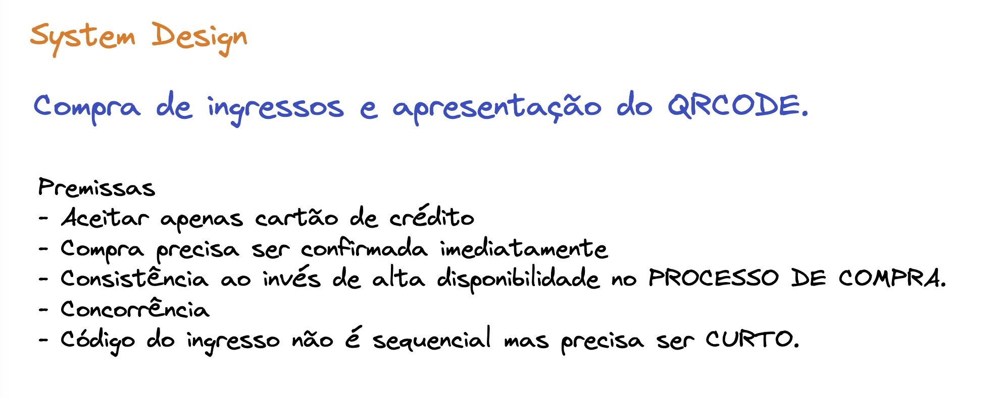

# Modelagem inicial

## Opcao 1

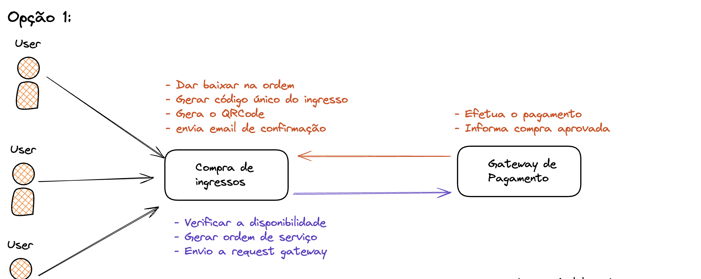

# Discutindo modelagem

É sempre necessario ver vantagens e desvantagens na soliucao que voce está criando... Ver os trade-offs
Sendo assim podemos procurar na modelagem "Pontos unicos de falha" (baseado em coisas fora do nosso controle) e "Pontos de possivel lentidão".

- Se o gateway cair, vai prejudicar muito a gente
    - Nao podemos simplemente culpar o outro nesse momento e perder a venda
- Geracao de codigo unico pode causar lentidao ao consultar DB, o algoritmo que gera o codigo, etc
- QRCode para gerar uma imagem

Sendo assim podemos fazer uma opcao 2 com melhorias

## Opcao 2

Apenas colocar um message broker em que o servico de compra de ingressos envia um mensagem para fila e nao sofre com degradaçoes no envio de email a ser feito por outro serviço

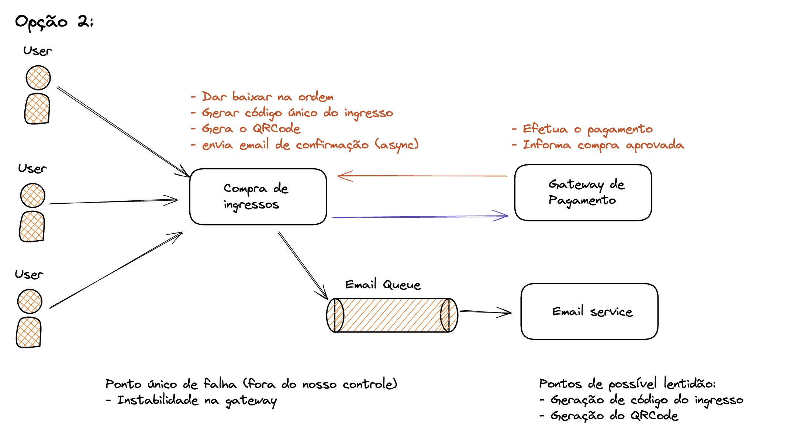

## Opcao 3

Usando o pattern (padrao arquitetural) sequence podemos resolver tambem o caso da lentidao com ids unicos sendo gerados no momento do thput alto.

Posso ter um servico apartado que de tempo em tempos gerar um codigo sequencial e QRcode armazenando por exemplo em um bucket. No momento da compra do ingresso esse servico sera requisitado e terá apenas o trabalho de baixa falando que esse codido está em uso. Sendo assim eu tiro a carga com esse trabalho pre-feito.

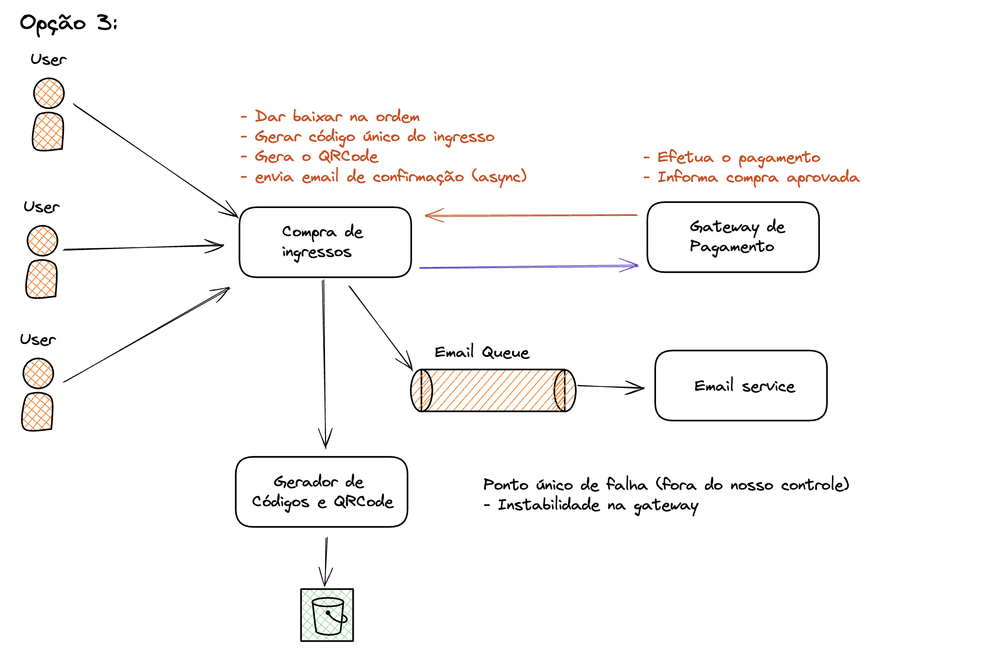

## Opcao 4

Considerando ainda o ponto unico de falha no gataway de pagamento.

Podemos usar mais de um gateway caso um falhar. Sendo assim precisamos um servico para lidar com os gateways de forma organizada. Que seria um ACL (anti corruption layer), que inclusive evita o acoplamento com regras diretas dos gateways que vamos utilizar

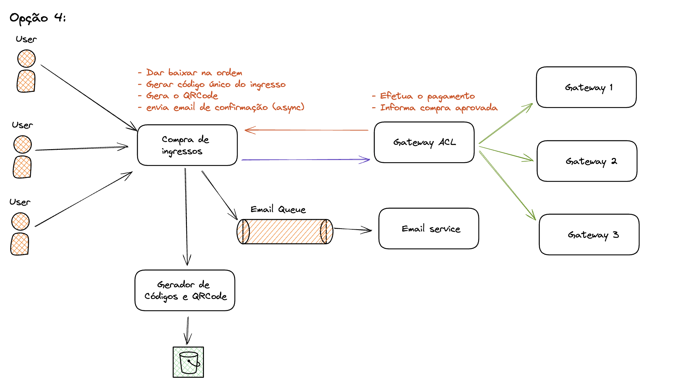

Uma possibilidade de evitar o SPOF, seria incluir uma fila na comunicacao, porém como nessa modelagem atual estamos priorizando consistencia ao inves de disponibilidade considerando que queremos ter certeza que o pagamento foi efetuado para reservar um lugar na venda de um ingresso, nao vamos utilizar async nesse trecho

## Modelagem de dados

Interessante ter para ja compartilhar as operações macro

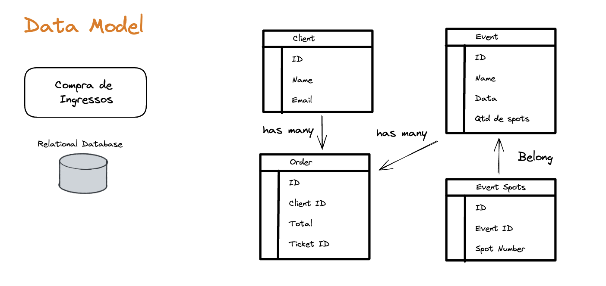

Vendo a modelagem com ssses tipos de relacionamento, a gente precisa, de uma forma geral, garantir uma forma de consistência nos dados. 
A gente vai ter que trabalhar com concorrência, para garantir que não vai ter perigo de alguém comprar mesmo lugares, eu preciso de isolamento, eu vou trabalhar com concorrência. Eu tenho que trabalhar de forma atômica... Quando a gente começa a pensar nesses tipos de requisitos, a gente começa a pensar assim, se “bobear”, aqui um banco de dados relacional faz sentido, eu consigo resolver um monte de problema que eu tenho aqui para mim, apenas com um banco de dados relacional que a gente acaba organizando.

Outra modelagem de dados é referente ao gerador de codigos e QRCode.
Que é simples, com o id do ticket, um booleano dizendo se ja foi atribuito e qual oder_id ele foi atribuido.

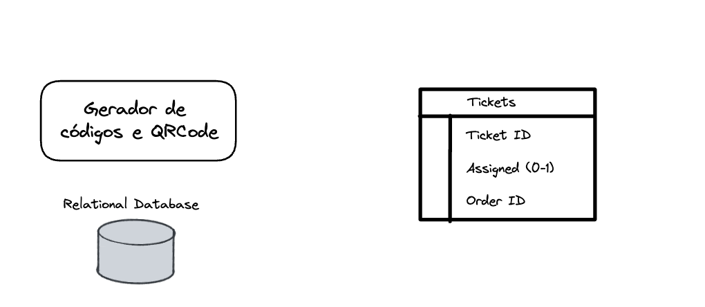

Uma outra coisa que a gente precisa pensar aqui também é na parte de concorrência. Porque eu não posso ter a mínima chance de um ticket ter sido atribuído para duas ordens. Então, a parte de concorrência me ajuda muito. Honestamente, um banco de dados relacional também resolve a parte de ACID. Sendo assim um simples banco relacional aqui resolve o nosso problema. Não tem outra situação assim, que vá fazer e com que você justifique tanto um banco de dados nosql da vida para fazer esses tipos de coisa. Isso porque, eu preciso de concorrência. Eu preciso de garantia de que ninguém consiga mexer nessa tabela ao mesmo tempo. Esses tipos de coisa aqui para gente fica muito simples no select for update, num registro específico. Quando a gente atribuiu no outro a gente, só dá um commit, e acabou.

Para a parte de envio de emails precisamos tambem de ver a modelagem do banco. Em que pensando bem, o que precisamos é apenas o id da order a informacao se foi enviado ou nao.

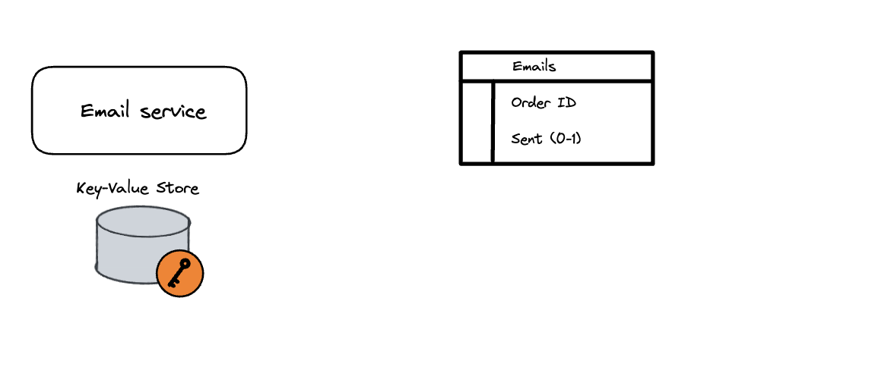

Analisando, eu vou ter que trabalhar com concorrência nesse caso aqui, não vou? Eu vou ter que fazer alguma coisa tão diferente aqui, não vou? Basicamente, eu preciso de um ID, e saber se ele foi enviado ou não. Se você perceber aqui, um banco de dados relacional para fazer isso não faz tanto sentido, pode até fazer, vai funcionar também. Mas se você perceber eu tenho uma chave e eu tenho um valor. E é, por conta disso, que nesse caso aqui, eu poderia trabalhar tranquilamente com um key-value store, ou seja, um banco de dados que através da chave e do valor que é guardado, eu simplesmente tenho esse tipo de controle. Eu não preciso de mais nada além disso. Existem vários bancos de dados key-value store, por exemplo, o DynamoDB da AWS é um key-value store, ou seja, você tem uma coluna… você tem as suas colunas, que você vai trabalhar dentro de uma “tabelona”, e o valor que você guarda pode ser guardado em diversos formatos, desde um JSON até uma string, até um booleano, e você consegue ter essa informação. Um outro key-value store é o Redis, por exemplo. O Redis aguenta uma pancada muito grande, porém a grande performance que o Redis tem  principalmente se ele for utilizado apenas na memória, o Redis consegue tirar snapshots. Ele consegue também persistir dados em disco. Tem gente que não sabe disso, mas ele consegue. Mas, honestamente, para ter uma velocidade desse tipo, não sei se valeria a pena. 

a gente não precisa necessariamente citar qual vai ser a tecnologia, vai se ser um Cassandra, se vai ser um Dynamo, ou se vai ser um Redis, não interessa nesse momento. Eu posso até fazer uma sugestão, porém, o importante aqui para mim é eu pelo menos saber categorizar qual é o tipo de banco de dados.

Um mongo ja seria demais, guardar um documento inteiro apenas para algo mais key-value store

Ao colocar o resumo se pode colocar as constraints no caso dos bando relacionais

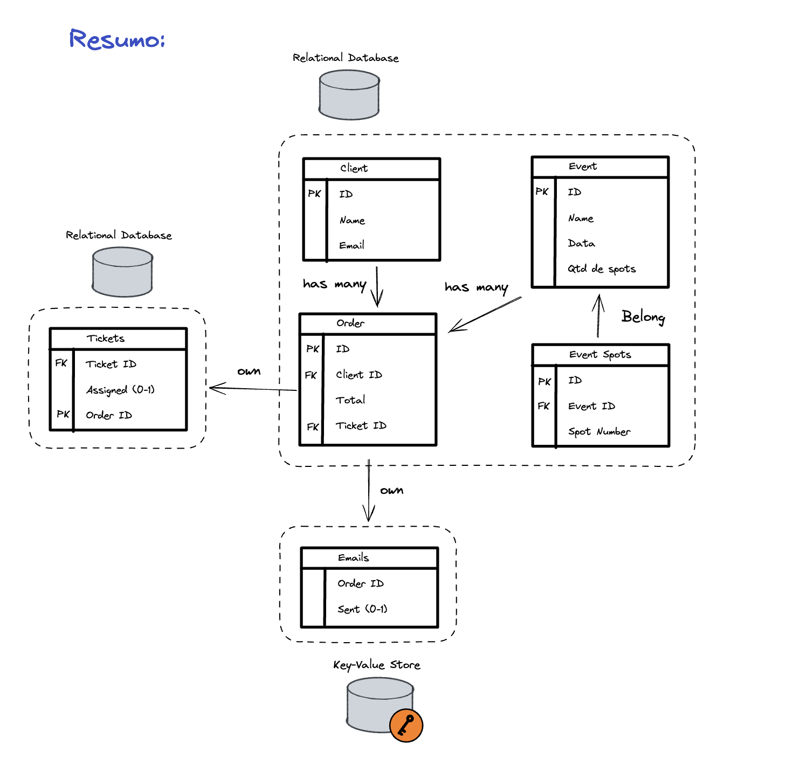

## API Design

Serve para ajudar a perceber como as operacoes vão funcionar. 

No nosso caso, a gente precisa mostrar as principais operacoes. Sendo bom tambem detalhar como vai ficar os responses.

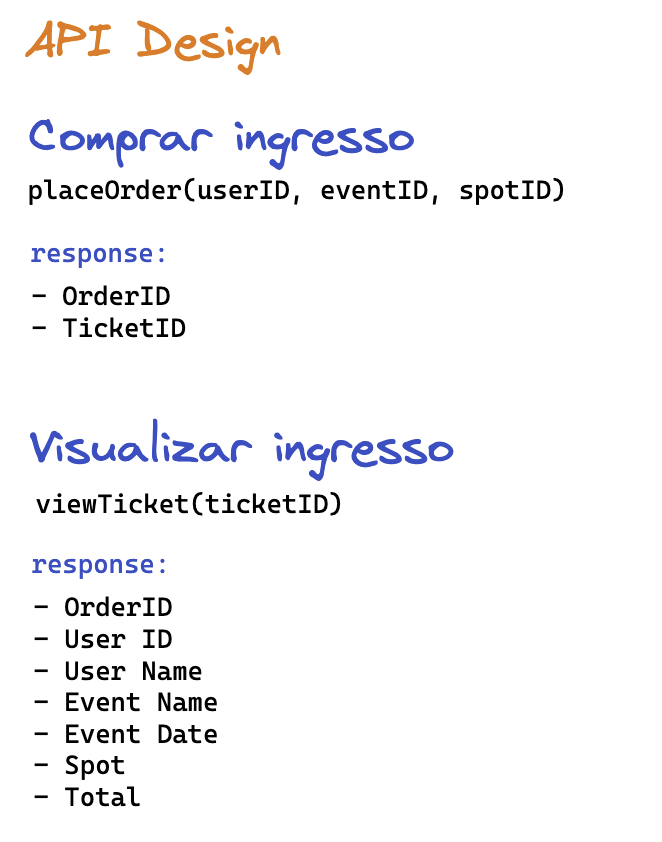

## System Design /Serveless

Podemos ter o design mais focado na arquitetura do sistema.
Em, que nesse caso considerando um arquitetura serverless, seria no formato:

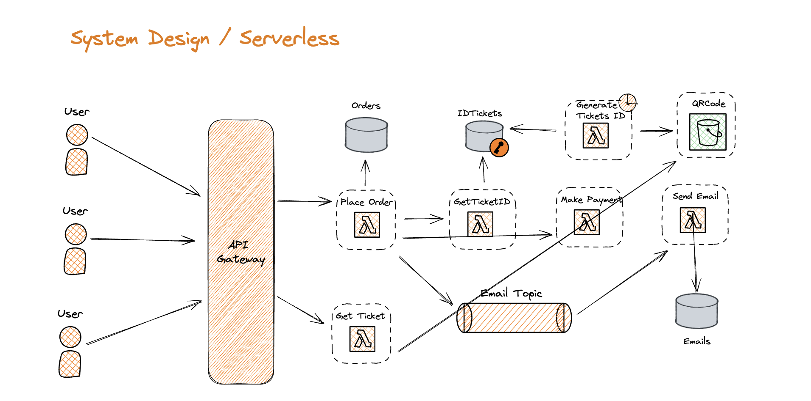

## Metricas e monitoramento

Todo sistema que desenvolvemos temos que ter na cabeça: Metricas e monitoramento.

