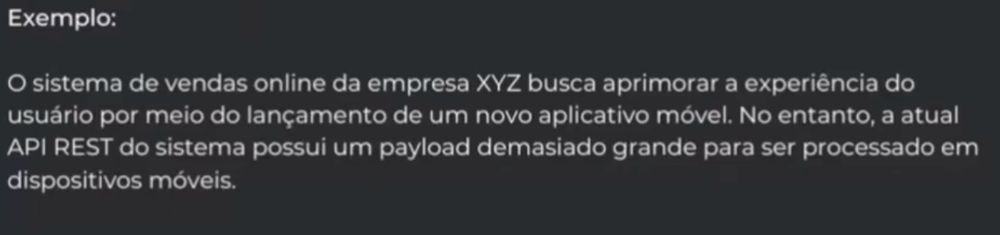

[Material](<Design Docs.pdf>)

# Definicao

Comecou a pensar em um sistema, ja vale escrever um design doc.

A ideia é ser relativamente informal, template serve apenas para guiar.

- Ele documenta a estrategia de implementacao em ALTO NIVEL as as principais decisoes de design com enfase nas COMPENSACOES (TRADE-OFFS) que foram consideradas durante essas decisoes

- Feitos pelo TIME com objetico de tornar claro e compativel todo o processos de desenvolvimento de uma solucao

Pensar que nem todo mundo tem o contexto

- É documentado o **RACIONAL** da solução
adotada, **alternativas**, **objetivos**,
arquitetura entre outros pontos.

## Objetivos

- Itentificacao precoce de problemas quando ainda é barato
- Alcançar consenso
- Considerar preocupacao transversais
    - Seguranca
    - Observabilidae
    - contrato
- Escalar o conhecimento

# Estrutura

(Recomendacoes)

## Cabeçalho

Contém o nome das pessoas autoras do documento, nome das pessoas que revisaram o documento, o estado atual do documento (rascunho, em revisão, proposto, aprovado, rejeitado), datas de criação.

Dicas:
- Nao deixar de atulizar o estado
- Envolva e peça revisão para pessoas com maior senioridade de áreas relevantes
(segurança, infraestrutura, plataforma etc) ou times envolvidos e impactados;
- Adicionar rótulos (tag) podem ajudar na busca e classificação.
    - Indexar

## Visão Geral

Texto breve e de alto nível sobre o que este documento se trata. Visa trazer o que esperar na leitura do documento

(A pessoa pode ja decidir nao continuar a ler o doc pois nao faz sentido pra ela)

Dicas
- Tipicamente será um parágrafo ou no máximo dois;
- Não deve conter detalhes;
- Alguém sem contexto deve conseguir entender.

## Escopo e Contexto

Explicação:  Descreve o cenário o qual o sistema está inserido, os motivadores da escrita do documento e outras informações para entendimento do contexto onde o
problema está inserido (Tipicamente contém informações de tecnologia atual, dívidas técnicas etc).

O objetivo é que os leitores sejam atualizados, mas algum conhecimento prévio pode ser assumido e informações detalhadas podem ser vinculadas.

(Atulizar os leitores como estou fazendo, dando contexto. Sem falar como vai resoulver problema)

Dicas

- Seja sucinto!
- Não coloque objetivos e soluções propostas;
- Encare como um plano de fundo.

## Objetivos e Fora de escopo

Enquanto os objetivos são requisitos de negócio ou técnicos que serão alcançados com a conclusão da atividade. Fora de escopo são pontos que não serão contemplados ou não são uma preocupação na atividade.

Ambos podem ser em formatos de listas e devem ser objetivos.

Dicas

- Dê preferência a objetivos metrificáveis;
- Em Fora de escopo não negue apenas os objetivos;
- Seja sucinto, porém objetivo. Ao invés de escrever "Reduzir custos" escreva "Reduzir custos através da redução do tráfego"

## O Design

Dado o contexto (fatos), objetivos e não objetivos (requisitos), mostre por que uma determinada solução atende melhor a esses objetivos. 

Comece por dar uma visão geral(agora da solucao) e depois entre em detalhes.

Pode conter diagramas com contexto e aplicações, API's, os dados que serão manipulados e informações sobre sensibilidade dos mesmos, se necessário mas não
comum, códigos e pseudo códigos, telas e payloads que serão trafegados.

Outros diagramas como os de sequência também podem ser úteis.

Dê foco nas compensações(trade-offs) para produzir um documento útil com valor a longo prazo. 

As soluções podem estar restritas a um sistema antigo ou biblioteca ou podem ocasionar em soluções não ótimas, nestes casos, foque na melhor solução considerando todas as compensações.

Dicas

- Utilize fatos e dados para trazerem valor ao seu design;
- Evite copiar e colar todo um schema ou API;
- Elementos visuais são complementares e não substitutos de explicações.

## Alternativas consideradas

Os sistemas ou soluções alternativas que foram consideradas para a resolução do problema, explicando compensações(trade-offs) e motivações da escolha. 

- Uma alternativa sempre a ser considerada é não fazer nada;
- O foco deve estar nas compensações que cada design faz e como isto levou ao tópico principal do documento;
- Seja sucinto, mas destaque o porque a solução escolhida é a melhor opção.

## Preocupacao transversais

Descreva o que pode impactar outras pessoas. Pode ser uma
preocupação de segurança, quebra de compatibilidade de API, aumento de fluxo em outros sistemas ou questões relacionadas a infraestrutura.

Está relacionado com a colaboração com outros times que estejam envolvidos ou sejam impactados. 

Dicas
- Envolva os times o mais cedo possível;
- Peça revisões aos times;

## Outros

- Testabilidade e Observabilidade
    - Descreva como a solução será testada e como métricas serão criadas para garantir o atingimento do sucesso. Inclua como a solução será observada.
- Plano de implantação
    - Segmentação das entregas e passos necessários para entrega de valor da solução.
    - Como será feito o rollout
- Perguntas em aberto
    - Pontos que ainda não foram definidos ou ainda são desconhidos. 

# Ferramentas na pratica

