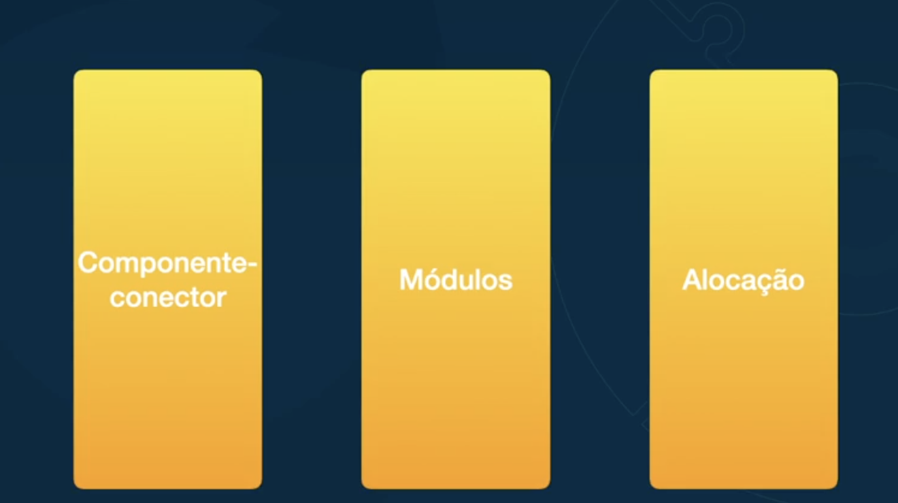
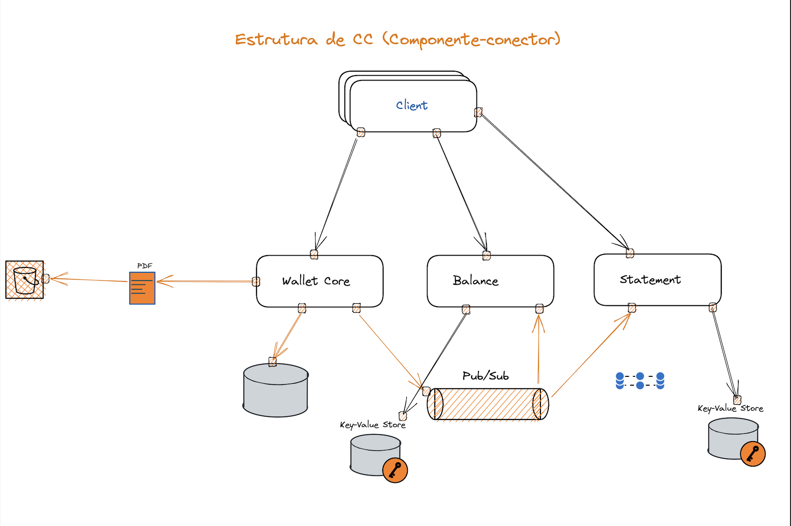
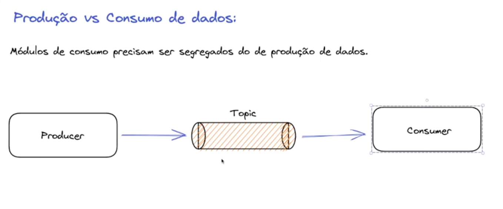

# Arquitetura é uma abstracao

> Thus an architecture is foremost an abstraction of a system that selects certain details and suppresses others. In all modern systems, elements interact with each other by means of interfaces that partition details about an element into public and private parts. Architecture is concerned with the public side of this division; private details of elements—details having to do solely with internal implementation—are not architectural.

As decisões arquiteturais estão muito mais focadas nessa parte pública do que necessariamente na privada. As partes privadas, é ponto de resolução de quem está desenvolvendo e não faz sentido isso ser exposto, necessariamente, para quem está consumindo.

# Arquitura como razao

Ao falar de estrutura arquitural estamos preocupando imediatamente com a razao do software existir... O que diretamente significa atender atributos dos stakeholders

- Todo software possui uma arquitetura  
- Nem todas as arquiteturas são boas arquiteturas  
- Arquitetura inclui comportamentos  

# Estruturas

## Componente conector

- Interação entre elementos para garantir o funcionamento do sistema  
- Componentes -> Comportamento  
  - Services  
  - Client  
  - Servers  
  - Pipelines  
- Interações -> Conectores  
  - Como os componentes se comunicam  

## Modulos

- Unidades de software  
- Pacotes  
- Responsabilidades funcionais  
- Camadas  
- Visão mais micro  

## Perguntar de forma intencional aos módulos:

- Qual a principal responsabilidade de cada módulo?  
- Quais elementos de software cada módulo utiliza?  
- O que o software realmente faz e do que ele depende?  
- Como cada módulo se relaciona?  
- Qual o nível de acoplamento entre módulos, classes, etc?  

## Estrutura de alocacao

- É a relação das estruturas componente-conector e módulos e como elas se conectam com "não software":  
  - Tipo de computação  
  - Ambientes  
  - Testes  
  - Build  
  - Deployment  

## Producao vc Consumo de dados

É interessante por exemplo separar os modulos do produtor do consumo em um aplicacao. Mesmo que as duas vao usar a mesma lib, pois assim estaremos gerando acoplamento, pois um terá influencia sobre o outro.

E dependendo(caso nao exista por exemplo um fluxo consome/faz algo e depois produz), deve ser separar em workloads diferentes. Isto é 2 executaveis diferentes para um nao interferir sobre o outro.

## Efeito "Ivory Tower"

- Arquitetos têm que andar junto ao time de desenvolvimento  
- Quando o arquiteto/time de arquitetura se isolam do dia a dia do time de dev, viram especialistas teóricos que pensam que estão resolvendo problemas, porém estão totalmente descolados da realidade  