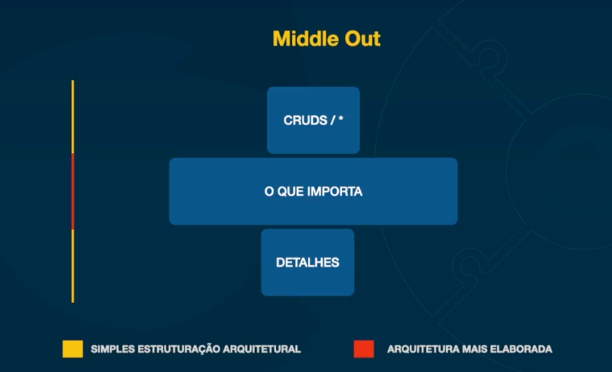

# Decisoes erradas para iniciar o dev de um software

- O resquicios do waterfall
    - AS vezes o arquiteto se dedica muito tempo com muito design sem nada de codigo
- Arquitetura de CRUD
    - Arqitetos que dispoem muito energia e padroes arq, com um simples CRUD. 
    - Acontece tambem de ter outros problemas que exigem mais atencao, mas o arquiteto nao sai do CRUD
- Começar pelas ferramentas
    - Não olhar para o que importa: contexto, negocio, etc.
    - Arquiteto de ferramenta
- Comecar sem testes
    - Não interessa o tamanho da aplicacao. Comece com testes
    - Aplicacao sem testes, está fadada a nao conseguir evoluir
    - Qualquer coisa diferente de um mini script para executar um vez, precisa ter testes
- Comecar sem processos de CI
    - Criando templates ajuda muito
    - Comecar no dia 0

# Entendendo o Middle out

## Por onde começar

- Não gastar energia criando padrao arquitetural para CRUD
- Na hora de entregar os detalhes que importam, gastar enegia para coisas elaboradas

## Middle out

- Foco no desenvolvimento dos componentes core e mais críticos do sistema  
- Flexibilidade: Começar pelo meio permite fazer mais mudanças e eventualmente substituir ou incorporar novas tecnologias sem precisar mudar o core do sistema  
- Desenvolvimento incremental  
- Facilidade na escala  
- Menor complexidade na integração com outros sistemas  

## Não existe arquitetura prematura no Middle Out

- O coração do software / regras de negócio sempre terão que possuir a melhor arquitetura possível  
- Partes periféricas e de suporte não necessariamente terão que ter o mesmo peso.  
