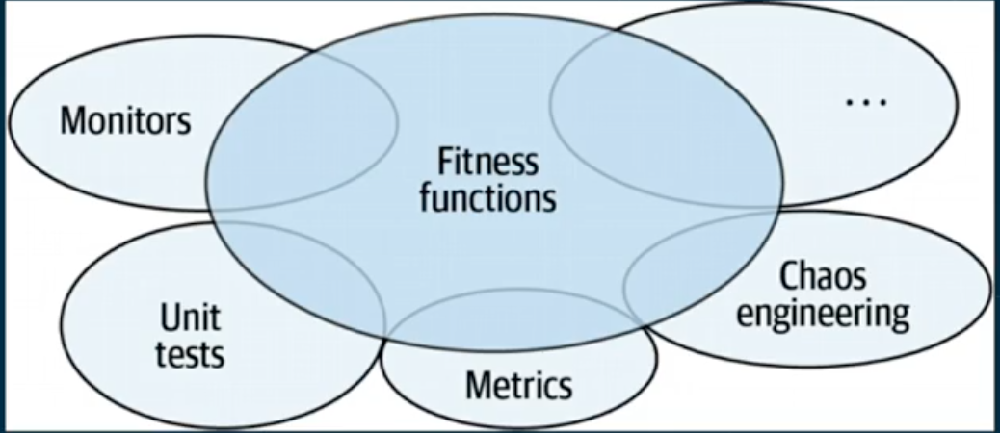
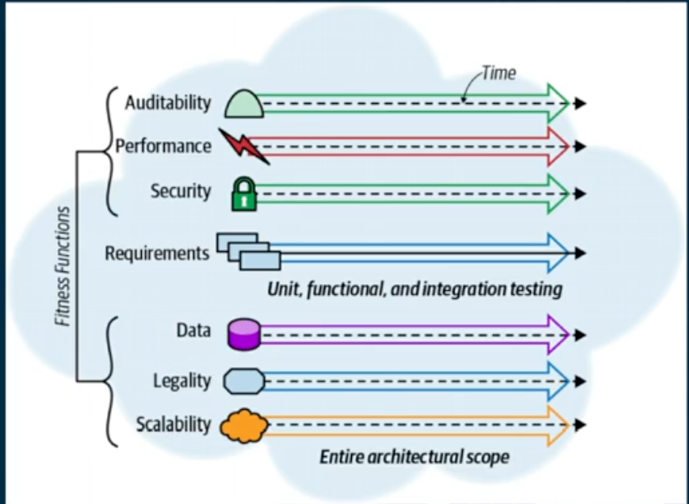
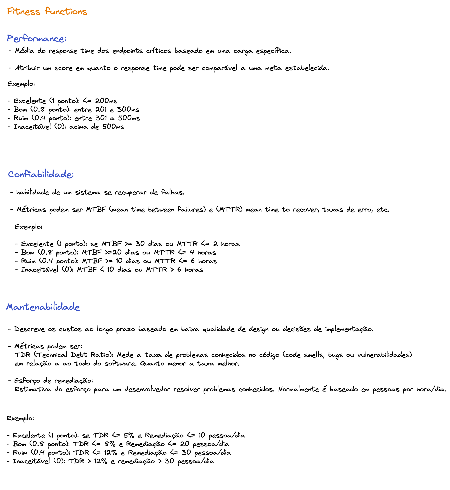
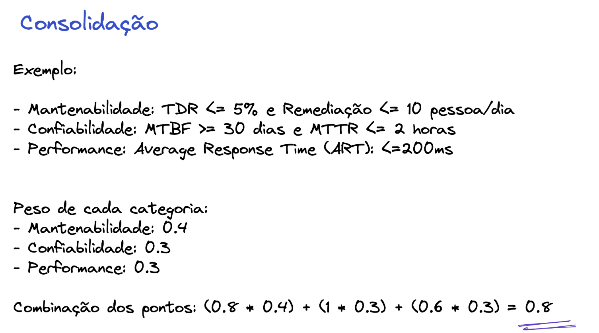

# Dimensoes arquiteturais (Arquitetura multidimensional)

Olhar intencionalmente para as seguintes dimensoes na arquitetura:

- Tecnica
    - tecnologia, frameworks, acoplamento, como esses componentes vão se relacionar, como eu vou conseguir testar, como o software vai se comportar de acordo com as abstrações que eu vou fazer
- Data
    - Muitas vezes, a forma como você vai modelar os dados é um dos pontos principais e um dos principais diferenciais que você vai ter durante a sua arquitetura. E é por isso que é extremamente importante você ter um ótimo repertório nas mais diversas visões, para você conseguir tomar a decisão mais acertada
    - como os dados vão trafegar dentro do meu sistema. Onde os meus dados vão ser armazenados? Em qual formato esses dados vão ser armazenados? Como esses dados, eventualmente, vão ser sincronizados?
- Segurança
    - Como eu consigo isolar esse software na rede para que a comunicação seja apenas com quem eu quero? Como vai funcionar? Você vai ter rate limiting? Você vai ter blacklist, que você vai trabalhar? Como você evita man in the middle para pegar essa informação? Você vai trabalhar com o mutual TLS? Você vai ter uma service mesh para você controlar? Você vai ter um proxy na ponta do seu software? Ou os dados que você tem, está gerando de telemetria? Eles estão ofuscados na parte sensível para evitar vazamento de dados de segurança? Dados que são sensíveis vão aparecer em um log, por exemplo, na parte de observabilidade?
    - Qual é o formato de log que eu vou trazer? Quais os tipos de dados que vão vir no meu log? Quais tipos de dados eu vou ofuscar? Esses tipos de informação vão ser extremamente importantes
- Operacional
    - Como o meu software vai operar? Como vai ser feito o deploy? Quais métricas eu tenho que olhar? Como esse software vai ser observado? Quais são os alarmes que eu vou trazer nesse software para eu conseguir monitorar? Como vão ser as regras de commit, de deploy? Como vai ser o meu pipeline de CI? Como vai ser o meu pipeline de CD? Quais são os tipos de testes que eu tenho que rodar? Eu vou colocar uma ferramenta de análise estática de código, verificação de vulnerabilidade? Eu vou fazer verificação da minha imagem do Docker para ver se está tudo ok? Então, todas essas situações fazem diferença. Como eu vou organizar caso eu tenha algum problema? Como eu vou fazer o rollback? Quais são os tipos de deployment que eu vou fazer? Eu vou ter deploy blue-green? Eu vou ter um deploy canary? Eu vou trabalhar com feature toggle?

# Fiteness functions

An architectural fitness function is any mechanism that provides an objective integrity assessment of some architectural characteristic(s).

Olhando essas dimensoes sempre (medindo), podemos ver existe degradação dele.

Essas metricas podem ter peso. Ex: numero de comentarios ter menos peso do que response time.

Preocupar em medir itens críticos

- Forma de medir a efetividade, performance e fatores relevantes de acordo com a arquitetura de um software  
- Elas são definidas baseadas em diversos critérios, incluindo performance, modularização, manteabilidade, escalabilidade, segurança, etc.  
- Parte de acompanhamento do software conforme ele evolui  
- Importante identificar os aspectos críticos do sistema e deixá-los de forma mensurável e com objetivos claros.  

## Exemplo de fitness functions

## Consolidação 

Avaliar de tempos em tempos