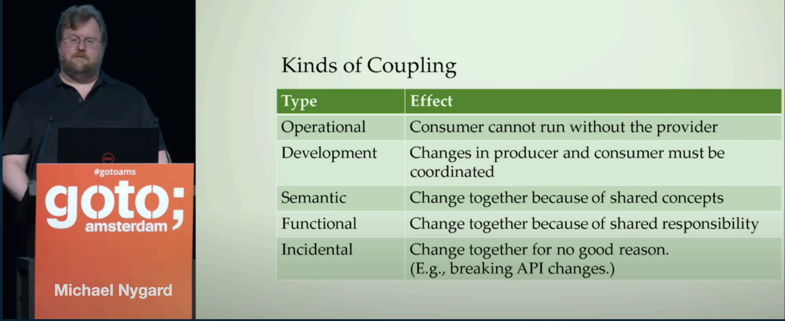
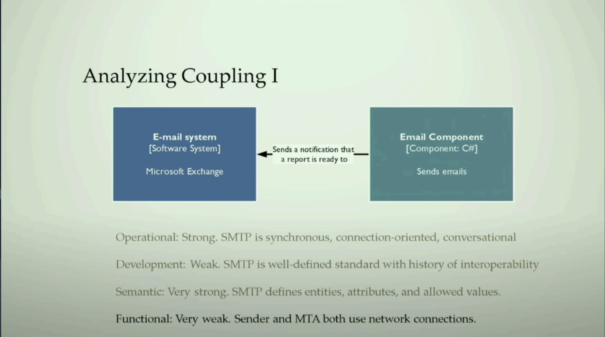
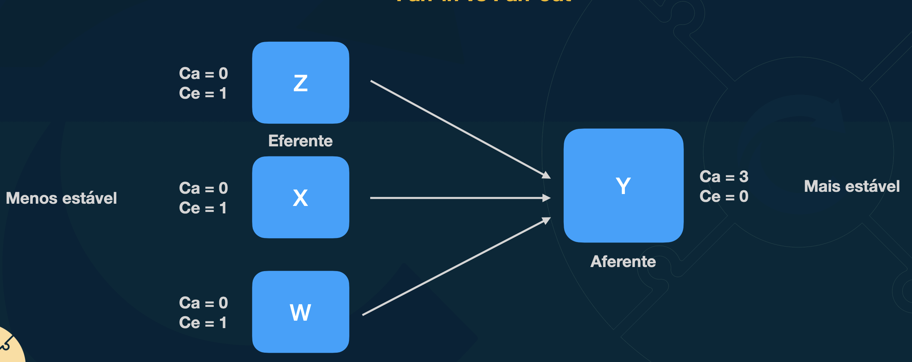
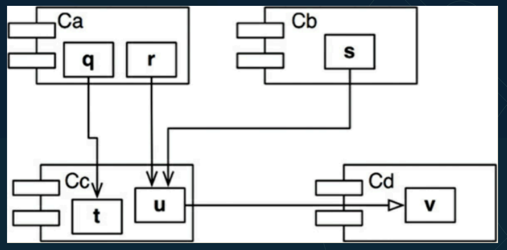
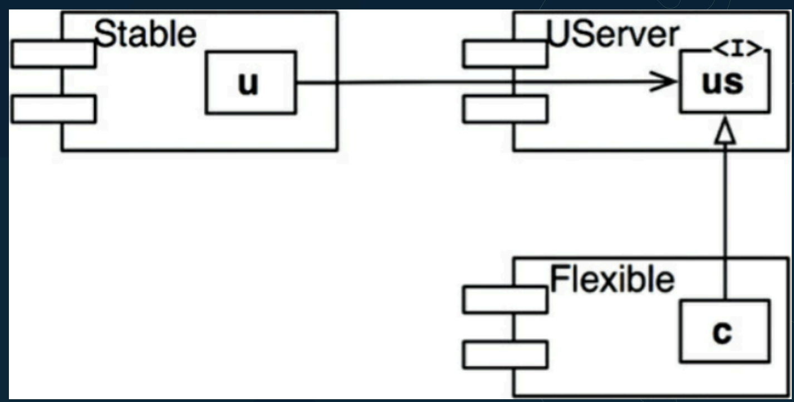

# Acoplamento

- Tudo nesse mundo é acoplado
- Movimento do seu braço e ombro, um trem com vários vagões
- Acoplamento é algo que sempre existiu e sempre continuará existindo
- Mais importante é: Como conviver bem com ele em nossos códigos?

Sem acoplamento não tem software, mas se o seu software estiver extremamente acoplado eu não tenho como modificá-lo de uma forma que eu deixe ele com mais recursos, ou que uma coisa não afete a outra quando ela é mexida

# Evolucao vs Acoplamento

Toda vez que vc desenvolve o software vc tem que estar sempre com olho no futuro

- É comum fugirmos do acoplamento
- É difícil desenvolver um software complexo sem acoplamento
- Identicar, ter ciência do nível de acoplamento e tirar o máximo benefício disso em comparação com seus “malefícios"
- Se tudo tem um lado bom e ruim, vamos tentar fazer o bom ser muito melhor do que o ruim
    - Não vai dar pra desacoplar tudo, entao temos que escolher
    - As vezes vc desacopla tanto, que isso se torna um problema de tao complexo que fica

# Tipo de acoplamento

[video](https://www.youtube.com/watch?v=esm-1QXtA2Q)

- Operacional
    - Você depende de alguma coisa que está com problema, logo, você não consegue funcionar também. Esse acoplamento é muito crítico, porque faz com que você necessariamente tenha problemas mesmo na hora de rodar as coisas
- Desenvolvimento
    - Se eu mudar um lado, eu obrigatoriamente tenho que coordenar a mudança do outro para que essas duas coisas consigam funcionar
    - Pode ser entre microsservicos diferentes
- Semantico
    - É quando você depende de terminologias, de utilizações em diversos lugares da sua aplicação
    - Ex: Todo mundo a gente está chamando de cliente, mas o nosso sistema de suporte  está chamando de pessoa
- Funcional
    - Muita gente utiliza algo, e se mudar esse algo pode quebrar ou fazer com que diversos pedaços da sua aplicação tenha que mudar
    - Comum quando você tem, por exemplo, uma biblioteca
- Incidental 
    - Você mudou e quebrou alguma coisa sem perceber o porquê. Ou mudou o contrato da sua API sem nenhuma razão e quebrou todo mundo que tava te consultando ou qualquer coisa desse tipo

# Acoplamento aferente vc eferente ou fan-in vc fan-out

- Componentes aferentes normalmente possuem um nível de risco crítico, pois afetam diretamente outros componentes. Logo, atenção dobrada ao criar e **manter** esses tipos de componentes.  

- Componentes eferentes, por dependerem diretamente de outros componentes, normalmente estão mais propensos a falha, pois dependem diretamente do bom funcionamento de outros componentes.  

# Metrificando instabilidade

- Instabilidade = Fan out / (Fan-in + Fan-out)  
- Range de 0-1  
- Quanto menor o valor mais estável  
- Quanto maior o valor menos estável  

- Instabilidade = Fan out / (Fan-in + Fan-out)
- Para componente Cc = 1 / (3 + 1) = 1/4

Componentes Core precisam ter instabilidade baixa, senao é vai repassar muita instabilidade para quem depende dele

# Desacoplando (Componentes abstratos)

- Trabalhando com componentes abstratos, você consegue diminutir muito o nível de acoplamento entre os seus componentes.

- Quando eu estou falando de interface de uma classe(que tambems pode ser um componente que faça interface com outro componente) tonrando essas classes abstratas, eu consigo diminuir a instabilidade no meu sistema, porque eu posso ter um componente que é estável e ele vai depender diretamente de uma abstração. Essa abstração pode ser uma interface, e essa interface não muda, assim, eu estou estável. Mas ao mesmo tempo, eu posso ter um outro componente que vai precisar ter mais mudanças, mas se ele falar a mesma linha… a mesma língua que a minha interface, esse cara está tudo “ok”. Então, quando você começa a perceber dessa forma, você começa a ver que realmente, na maioria das vezes, quando a gente não depende de implementações concretas e a gente depende de abstrações, normalmente é isso que acaba fazendo com que o nosso sistema garanta mais estabilidade.

## Exemplo prático

Imagine um sistema de pagamento online:
	1.	Stable: Um módulo de validação de transações que não muda, pois as regras são fixas.
	2.	UServer: Uma interface IPaymentProcessor que define operações como Authorize, Capture, Refund.
	3.	Flexible: Implementações concretas dessa interface, como PaypalProcessor ou StripeProcessor, que podem mudar independentemente.

	•	Se você quiser adicionar suporte para outro provedor, por exemplo, SquareProcessor, basta implementar a interface IPaymentProcessor. Assim, o sistema permanece estável.

# Lei de Postel

> "Seja conservador no que você faz, mas seja liberal no que você aceita dos outros”

- Crie sistemas que sigam padrões ao enviar informações  
- Seja flexível e tolerante ao receber informações que possam ser ligeiramente diferentes do especificado  

Criar sistemas que sigam padrões ao enviar informações. Toda vez que você mandar uma informação, quando alguém vai receber uma informação sua, você tem que seguir padrão. Você define uma especificação, você define o protocolo, você define o formato, você cria um esquema, você trabalha realmente de uma forma muito pesada em especificar, em documentar, para enviar dados para outros sistemas.

Por outro lado, você vai ser mais acessível e mais tolerante ao receber informações que possam ser ligeiramente diferentes do especificado.

Ex: Eu vou mandar um JSON de obrigado para o cara, e eu vou falar que o total da compra é 10, então, eu vou mandar o 10 ali como inteiro, por exemplo. Agora, se o cara manda para mim o valor 10, “numa string”, o meu sistema tem que ser tolerante a isso e conseguir inferir que, por exemplo, aquele 10 não era uma string, mas sim um inteiro

# Leis de Lehman/ Belady (1974)

- Lei da Mudança Contínua: Um sistema de software deve se adaptar às mudanças em seu ambiente, caso contrário, sua ecácia diminuirá ao longo do tempo.
    - Se seu software ta parado a muito tempo, tem outra coisa atendendo a sua empresa

- Lei do Crescimento da Complexidade: À medida que um sistema evolui, suacomplexidade tende a aumentar, a menos que haja um esforço explícito para reduzi-la.
    - Quando mais vc mexe, mais complicado vai ficando seu software
    - Evita aumentar complexidade fazendo uma luta explicita contra ela

- Lei da Conservação da Familiaridade: O conteúdo global de um sistema desoftware deve ser mantido em um nível que seja familiar para os desenvolvedores envolvidos na sua evolução.
    - Software nao pode ficar estranho para membros do time

- Lei da Conservação do Esforço: O esforço total para implementar e manter um sistema de software aumentará ao longo do tempo, mesmo que a quantidade de funcionalidade adicional permaneça constante.
    - Quanto maior o software vai ficando, o esforço vai ficar maior para trabalhar nele