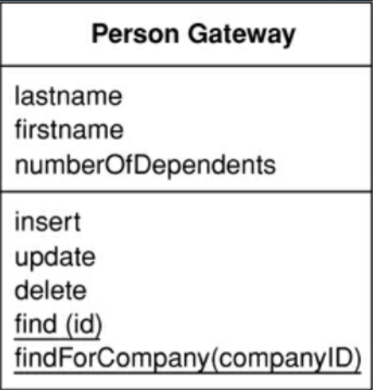
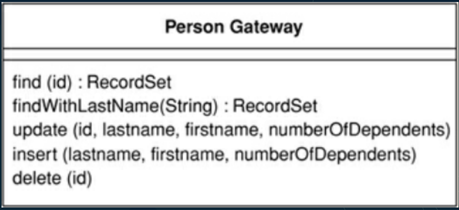
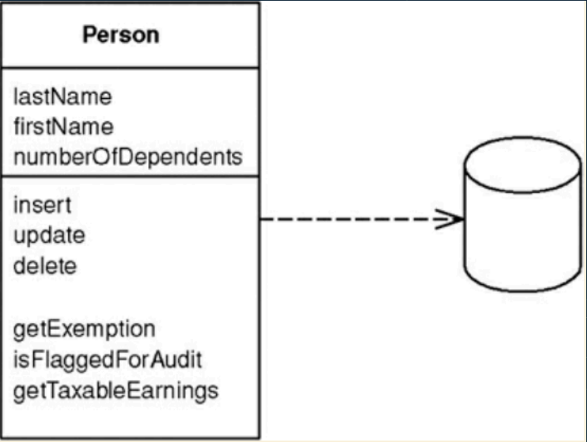
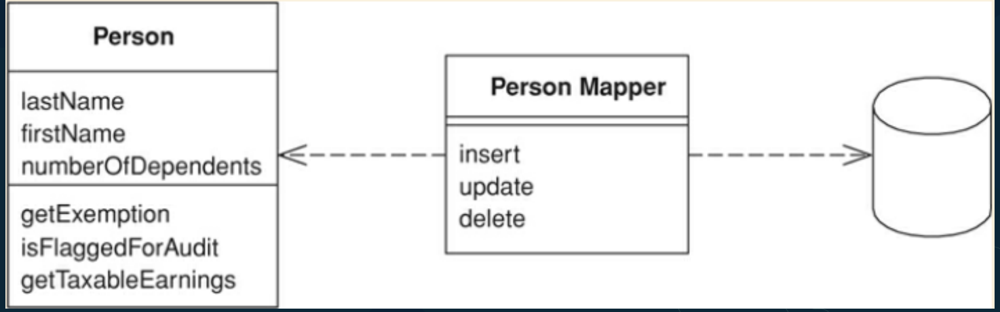
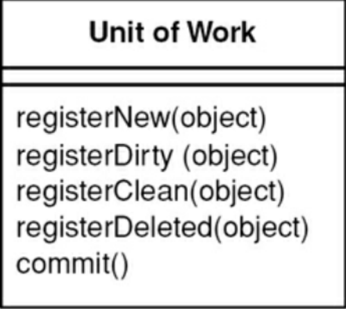
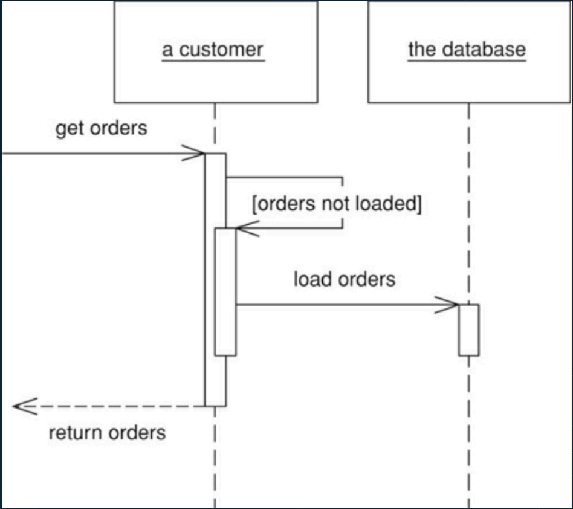

# Layering

- Separação de responsabilidades
- Abstração
    - Tem que saber que na camada atual nao importa saber o que esta abaixo
- Layer vs Tier
    - Camdadas é uma separacao logica
    - Tier já é algo fisico, que podem ser servidores diferentes ou pastas diferentes. Que poder ser usados para deixar ainda mias claro a separacao em camadas


## 3 Layers architecture

É a arquitetura mais basica utilizada.

- Presentation
    - Display Information
    - CLI
    - HTTP Requests
- Domain
    - Coração da aplicação
    - Regras de negócio
- Data Source
    - Banco de dados
    - Mensageria


## Regra de ouro

- Domínio e Data Source nunca podem depender da apresentação

Isso causaria instabilidade na camadas que tentem a ser mais estaveis e tendem a nao mudar com frequencia.

# Domain logic

O que acontece no coração da sua aplicação. E toda vez que a gente está falando disso, você vai perceber que nós vamos ter dois padrões grudados

- Transaction Script
- Domain Model

## Transaction Script

- Regras de negócio em torno de transações
- Segue formato mais “procedural" (ou seja em forma de sequancia)
- Simples e direto
    - Ex: ProcessarPedido
        - Verifica Estoque
        - Aplica Promoções
        - Fidelidade
        - Cria Pedido no Banco
        - Etc


- Vantagens
    - Orientado a transações
    - Totalmente direto ao ponto
    - Adequado para requisitos simples
- Desvantagens
    - Alta complexidade quando o sistema cresce
    - Trabalha normalmente de forma síncrona
    - Pode gerar duplicidade de codigo, pois as regras tendem a nao se comunicar

## Domain Model

- Domínio de uma aplicação em “objetos de domínio”
- Encapsula a Lógica de Negócios
    - O dominio faz isso
- Regras de Negócio em primeiro lugar
    - Nao se pensa em transacao enquanto modela o dominio, jogando a complexidade para esse modelo
- Validações
    - Mantem o estado forte o tempo todo.
    - Ex: Total do pedido vai sempre bater o total dos itens, o modelo mantem esse coerencia


- Vantagens
    - Clareza e Expressividade
        - Enquanto vc faz as coisas ja vao ficando claras o que o dominio representa
    - Flexibilidade
        - Ajuda se focar em solid em design patterns
    - Foco na evolução
    - Alta Testabilidade
        - Muito bom para testes de unidade em cada pedaco
- Desvantagens
    - Complexidade Inicial
        - Fazer uma modelagem para isso nao é facil
    - Curva de Aprendizado
        - É dificil entender um regra olhando para todos os modelos, comparado com olhar uma transacao que ja resolve tudo
    - “Escalabilidade" e “Performance"
        - Tende a ser caro carregar tudo em memoria para o dominio estar completo para trabalhar dessa forma
    - Fácil se perder com Overengineering


## Table Module

- Organização por tabelas do banco de dados
    - Se tenho tabela de pedido e item de pedidos, vou ter models para cada um desses
- Regras de negócio segregadas por tabela
- Alta coesão
- Acoplamento forte com o banco de dados

- Vantagens
    - Simples
    - Fácil mapeamento
    - Simples manutenção em diversas situações
    - CRUD
- Desvantagens
    - Duplicação de código
    - Baixa reutilização
    - Baixa regra de domínio

## Comparativo


As escolha nao precisa ser unica. Ex: Pode tem partes que a regra bem estabelecida, um core, a gente usa domain model e outra mais focada em CRUD se usa table model.

Dependendo pode se optar por comecar com table model para depois caso ter sucesso reescrever para domain model, que realmente exige um entendimento completo do dominio antes de iniciar

# Service layer

- Camada intermediária entre a camada de apresentação e o acesso a dados
- Expõe funcionalidades de alto nível para os “clients"
    - Ela vai ter uma inferface clara para a camada de apresentacao
- Encapsula a lógica de negócios
    - Quando se usa service layers isso acontece, quando se usa domain model isso ja nao é verdade. Ela ja fica no modelo de domínio.
    - Quando se esta com domain model vc nao precisa de alguem que encapsula as regras
    - Quando vc esta trabalhando com Service Layer, suas entidades tentem a ser mais anemicas, pois a regras nao estao lá
    - Suas ententidates tendem a ter apenas getters and setters
- Orquestra a ordem das operações
- Tem acesso a camada de dados
- Gerencia transações de forma atomica

- Vantagens
    - Separação de responsabilidades
    - Reutilização
    - Melhor estabilidade do que transaction scripts
    - Flexibilidade para implementar
- Desvantagens
    - Complexidade ao longo do tempo
        - As classes tendem a ficar grandes
    - Maior acoplamento
        - Comeca a gerar dependencia entre servicos
    - Complexidade no trabalho em equipes
    - Tende a trabalhar com modelos de domínio anêmicos

# Service layer vs trasaction script

- Apesar de terem idéias semelhantes, possuem estruturas diferentes
- Transaction Scripts normalmente trabalham no formato de funções ou conjunto de funções específicas para cada operação. O que tende a gerar muita duplicação de código
- Service Layer tende a ser mais flexível e reutilizável

Transation scripts tendem a ser realmente mais procedurais, do modo a evitar usar metodos e reutilizavel.

Ambas estrategias tendem a ter modelos mais anemicos

## Exemplos ChatGpt:

### Transaction Script

```java
public class OrderService {
    
    public void placeOrder(int customerId, List<Integer> productIds) {
        // 1. Validar o cliente
        Customer customer = Database.getCustomerById(customerId);
        if (customer == null) {
            throw new RuntimeException("Cliente não encontrado!");
        }

        // 2. Calcular o total do pedido
        double totalPrice = 0;
        for (Integer productId : productIds) {
            Product product = Database.getProductById(productId);
            if (product == null) {
                throw new RuntimeException("Produto não encontrado!");
            }
            totalPrice += product.getPrice();
        }

        // 3. Criar o pedido
        Order order = new Order(customerId, productIds, totalPrice);
        Database.saveOrder(order);

        // 4. Enviar notificação
        NotificationService.sendOrderConfirmation(customer.getEmail(), order);
    }
}
```


### Service layer

```java
public class OrderService {
    private CustomerRepository customerRepository;
    private ProductRepository productRepository;
    private OrderRepository orderRepository;
    private NotificationService notificationService;

    public OrderService(
        CustomerRepository customerRepository,
        ProductRepository productRepository,
        OrderRepository orderRepository,
        NotificationService notificationService
    ) {
        this.customerRepository = customerRepository;
        this.productRepository = productRepository;
        this.orderRepository = orderRepository;
        this.notificationService = notificationService;
    }

    public Order placeOrder(int customerId, List<Integer> productIds) {
        // 1. Validar o cliente
        Customer customer = customerRepository.findById(customerId);
        if (customer == null) {
            throw new RuntimeException("Cliente não encontrado!");
        }

        // 2. Calcular o total do pedido
        double totalPrice = calculateTotalPrice(productIds);

        // 3. Criar o pedido
        Order order = new Order(customerId, productIds, totalPrice);
        orderRepository.save(order);

        // 4. Enviar notificação
        notificationService.sendOrderConfirmation(customer.getEmail(), order);

        return order;
    }

    private double calculateTotalPrice(List<Integer> productIds) {
        double total = 0;
        for (Integer productId : productIds) {
            Product product = productRepository.findById(productId);
            if (product == null) {
                throw new RuntimeException("Produto não encontrado!");
            }
            total += product.getPrice();
        }
        return total;
    }
}
```


# Gateways

> Objeto que encapsula e acessa sistemas ou recursos externos

Toda vez que eu estou querendo falar com alguém de fora, ou quero ter acesso a esses recursos externos, eu preciso de uma gateway. E você vai perceber que pelo fato de a gente ter diversas formas de falar o mundo externo, eu posso ter no final do dia diversos tipos de gateway

Raramente a gente cita que vai criar um gateway, mas na pratica toda vez que vc vai acessar um mundo externo provavalemente vc tem uma gateway.

Falando de padroes de persistencia, gataway é uma abstracao para falar com o mundo externo


## 2 Formas - Row Data gateway vs Table data Gateway

Temos duas principais formas de acesso à utilização dessas gateways, quando a gente está falando em objetos que encapsulam responsabilidades para falar com o mundo externo. 

### Row Data Gateway

Uma instância para cada linha retornada por uma consulta



Toda vez que você recupera um dado, você vai perceber que a sua equivalência ao objeto é de uma linha por objeto

### Table Data Gateway

Estrutura genérica de tabelas e linhas que imitam a natureza tabular de um banco(Record Set). Uma classe por tabela. (In Memory Table) -



Então, a ideia dele é conseguir simular como se você tivesse a tabela inteira do banco de dados em memória dentro dos seus objetos. Isso é interessante. E você vai perceber que você vai ter exatamente uma classe por objeto de tabela.  Imagina assim, que eu estou trabalhando e do jeito que a gente está falando especificamente de bancos de dados relacionais. Então, imagina que eu tenho a tabela “pessoa”. Eu tenho um Person Gateway, e na hora que eu faço uma busca, eu tenho esse Person Gateway com todos os registros que eu preciso. E, por isso, eu acabo simulando a tabela do banco de dados no formato de objeto para eu conseguir trabalhar. O ponto importante que você tem que sempre tomar cuidado é em relação à utilização de uso de memória, porque se você traz objetos muito grandes, provavelmente você vai ter problemas com performance


## Table module

Talvez faça sentido utilizar Row Data Gateway ou Table Data Gateway

Toda vez que a gente for utilizar o conceito de modelagem de domínio baseado em tabelas, provavelmente vai fazer um belo sentido você utilizar Row Data Gateway ou Table Data Gateway.

Table module vao ser aplacacoes que sao especificadas baseadas no banco de dados. Ou seja a logica esta realmenete andando lado a lado com a estrutura de banco

## Domain model

Domain Model, no final das contas, é você conseguir modelar o seu domínio de forma mais rica, onde o comportamento da sua aplicação vai se dar baseado na relação entre os seus objetos que normalmente você vai trabalhar. 

Ex: Então, se eu quiser adicionar um novo pedido, automaticamente ele já coloca os itens. Se eu tenho uma pessoa eu posso ter objetos de valor

O grande ponto é que o ponto de partida que você vai ter na hora de programar, na hora de criar lógica do seu domínio, vai ser muito mais pensando na relação entre os objetos, comportamentos e estrutura desses dados. 

Normalmente, quando você trabalha com Domain Model, você vai perceber que conforme o sistema cresce, mais o Domain Model se afasta da estrutura de banco de dados. Quando você trabalha com Domain Model, você vai perceber que o banco de dados é uma coisa quase à parte de você trabalhar.

Por outro lado, você também vai perceber que, quando você tem domínios muito simples, as coisas ficam muito fáceis de serem modeladas. Você vai perceber que acaba tendo uma espécie de coincidência da modelagem do seu domínio ser quase um para um com o seu banco de dados. E, nesse caso, provavelmente em sistemas mais simples, talvez você possa trabalhar nesses formatos de Data Table, Row, Table, Gateway, etc. utilizando o seu domínio de um para um com o seu banco de dados. 

# Active Record

> Um objeto que encapsula uma linha, tabela ou view e ainda adiciona lógica de domínio em seus dados.



Active Record é extremamente simples de ser utilizado, Porem você vai perceber que as suas entidades do Active Record normalmente vão herdar uma classe base de Active Record que possui toda a lógica para você falar com o banco de dados. Então, você começa a ter um acoplamento extremamente forte com a forma de trabalhar com o banco de dados. Você tem que ter muito cuidado com isso. Não é necessariamente é errado, mas eu acredito que é uma ciência que você tem que ter na hora de escolher os tipos de persistência.

- Carrega dados e comportamento
    - Em SOLID, talvez você quebre tranquilamente o Single Responsibility Principle, porque provavelmente você vai mudar a mesma classe por motivos diferentes. Ou seja, eu posso mudar a minha classe para falar com o banco de dados por um motivo, ou eu posso mudar essa minha classe do Active Record para mexer com comportamento de regra de negócio
- Lógica de domínio tende a "vazar" para o comportamento do banco de dados
- Extremamente simples de usar
    - Rails
    - Laravel
        - Eloquent
            - BelognsTo
            - HasMany
    - Django
- Recomendação pessoal:
    - Separe o modelo de domínio do modelo do active record
    - Enquanto Data Table ou Row Table apenas é acoplado no banco, o Active Record tende também a ficar acoplado ao domínio.

## Quando nao usar

- Domínios complexos
    - Caso tenha muita regra de negocio, muitos calcular. ExL sistema fincanceiro
- Active Record precisa de um match exato com as tabelas do banco
    - Em dominios complexos isso é muito dificil
- Conforme a complexidade do domínio aumenta, os objetos de domínio deixam de ser 1:1 com o banco


# Data Mapper

o Data Mapper é uma camada de mapeamento que move os dados entre os objetos de bancos de dados enquanto os mantém independente um do outro. 

Ex: 

Person, podemos ter o nosso domínio complexo. Eu posso ter diversas classes, diversos relacionamentos com a lógica de negócio. No banco de dados eu tenho as minhas tabelas de banco de dados. E para o meu domínio complexo falar com o meu banco de dados, se coloca algo meio que eu chamo de Data Mapper. E esse Data Mapper, toda vez que eu vou inserir alguma coisa, alterar, fazer consultas acessa o banco, converte esses dados no padrão que eu preciso e depois faz uma hidratação desses dados nas minhas entidades dos meus domínios, que são ricos para eu conseguir trabalhar.



- Ideal para domínios complexos
    - Dominio cresce 100% independente do seu banco de dados.
- Domínio não fica refém da estrutura do banco de dados
    - Data Mapper, pelo fato dele ser uma camada entre o seu modelo de domínio e o seu banco de dados, ele é acoplado ao banco e é acoplado ao seu domínio. Isso significa que se eu mudar a modelagem do meu domínio, eu não necessariamente tenho que mudar o banco, mas se eu mudar o banco, eu não necessariamente tenho que mudar o meu domínio, porque quem cuida desse meu meio de campo é o Data Mapper
- Separe as entidades (objetos de mapeamento) do modelo de domínio
    - Ate se for trabalhar com ORMs crie entidades de dominio sepraradas dos entidades de mapeamento (colocando anotacoes por exemplo). Senao é melhor trabalhar com active record, que vai acoplar tambem com banco, porem com mais funcionalidades
    - Utilizar as mesmas entidades fará com que seu domínio fique anêmico


## notas

- Domínios simples: Active Record
- Domínios complexos: Data Mapper
- Não há verdade absoluta

# Atomicidade/Unit of work


Em muitas situações você não vai apenas persistir um objeto, você vai persistir diversos objetos. Então, você vai ter que criar um cliente, um pedido, adicionar um item do pedido, você vai precisar baixar o estoque, você vai precisar fazer um monte de coisa numa única transação. E você vai começar a perceber que essa transação trabalha com diversos objetos. Agora o grande ponto é, como eu consigo garantir numa única transação que você vai ter essa consistência em todos esses dados, em todos esses objetos

- Como trabalhar com diversos objetos?
- Como garantir a persistência?
- Como realizar compensação?

Um padrao chamado de unit of work mantém uma lista de objetos afetados por uma transação de negócios e coordena as mudanças e os problemas de concorrência.

Significa que todas as listas que você for ter de objetos, que você vai fazer uma transação, você adiciona isso numa unidade de trabalho. E, assim,  essa unidade de trabalho vai ter um mapeamento de tudo que está sendo alterado ou inserido. Quando você tiver tudo isso mapeado, você apenas dará um commit e ele vai fazer essa mágica de fazer todas essas alterações



Pensando em gerenciar os objetos e coordenar as transações que devem ser realizadas em conjunto desse objetos, resolvendo inclusive problemas de concorrência ele funciona implementando conceitualmente as funcoes(Nao precisam tem esse nome vindo do livro de patterns): 

- Register New: Um novo objeto que foi criado durante a execução (Insert)
- Register Dirty: Objeto já existente que foi carregado e modificado (update)
- Register Clean: Objeto recuperado e não modificado
- Register Deleted: Objeto recuperado e marcado para remoção
- Commit: Persiste a transação no banco de dados

Ex: imagina que eu adiciono uma nova pessoa, adiciono um novo pedido, marco uma alteração de estoque e removo aquele produto como itens em destaque, nesse caso tenho no meu unit of work, objetos a inserir a alterar e deletar, sendo assim no final ocorrerá o commit, que faria toda essa alteracao no banco como uma transacao. Se algo der problema ele dara um rollback e avisará.

O JPA usa isso com a anotaçao `@Transactional`

# Identity map

> Garante que cada objeto é carregado apenas uma vez e o mantém em um mapa de controle. Quando há busca pelo objeto, primeiramente ela é realizada no mapa

Existem diversos padrões que usam o Identity Map.

Imagina que eu estou utilizando o Data Mapper e eu faço uma consulta dos dados no banco e eu recebi esses dados num objeto. Imagina que eu preciso novamente, utilizando o Data Mapper, pegar esse mesmo registro. Eu já tenho esse registro comigo, correto? Então, se eu já tenho esse registro comigo, eu não preciso fazer a busca desse registro no banco de dados novamente. Logo, o que ele faz? Ele cria um map e esse map fala: “olha, esse objeto tem esses dados”. E você guarda todas as informações. E o que acontece? Todas as vezes que esses objetos são modificados, eu posso também, eventualmente, trabalhar nessas mudanças no Identity Map.

- Estrutura de dados
- Carregamento das entidades em memória
- Garante o carregamento apenas uma vez
- Melhora performance e remove inconsistências
- Mantém o controle dos objetos que foram criados, modificados ou marcados para remoção para ser utilizado em conjunto com o UoW

O JPA é um exemplo que usa Unit of Work em conjunto com identity map

# Lazy loading

Um objeto que não possui todos os dados que você talvez precise, mas sabe onde buscá-lo.



- Carrega os objetos somente quando necessário
- No carregamento inicial ao invés de ter os dados reais, esses dados são substituídos por proxies (apenas representações do objeto real, sem dados)
- Quando os dados relacionados são acessados o proxy carrega os dados do
banco
- Cuidado enorme com N+1
    - Ao usar load lazy loading pode causar isso, pois ao acumular pedido a ser carregado o ORM pode querer fazer várias consultas

# Repository

Mediação entre a camada de domínio e a camada de dados usando uma interface para acessar os objetos de domínio.

Comparando com data-mapper, que apenas faz o mapeamento entre uma entidade de mapeamento com um banco de dados e isso é totalmente independente do domínio da aplicação. O repository lida com entidades de dominio (agregados).

Sendo assim, na camada de dominio deve ter uma interface que define os contratos de como obter os objetos de dominio. Importante saber que é a camada de dominio que define como os dados vao chegar ate ela.

- A interface de dominio fica na cadamda de dominio
    - A implementacao ja é outra historia
        - Geralmente fica em outra camada
        - Ao mesmo tempo que pode tambem ser um active record que tambem roda na camada de dominio


- Mediação entre os objetos de domínio e o data mapper
    - Interface recebendo objetos de dominio e implementacao usando data mapper mapeando uma outra entidade com banco de dados
- Recebe objetos de domínio atendendo uma especificação
    - A especificacao é exatamente a interface
- Retorna objetos de domínio
    - Sempre retorna sua entidade, seu agregado
- Normalmente faz diferentes combinações de especificações gerando o SQL desejado para atender um critério
- “Promove" o padrão “specification" (para criterio de busca, ex id, range de valor)

## Exemplo de como usar specification em repository

Interface de specification a ser utilizada com um atributo generico de um tipo, que recebe esse tipo para verificar

```ts
interface Specification<T> {
    isSatisfiedBy(item: T): boolean;
}
```

Ai gente pode ter um sepecification concreta que tem um metodo que espera um usuario como o tipo T chegando algo desejado

```ts
class UserEmailSpecification implements Specification<User> {
    constructor(private email: string) {}

    isSatisfiedBy(user: User): boolean {
        return user.email === this.email;
    }
}
```

Sendo assim terei uma interface repositorio que fica na camada de dominio. Ele que define o contrato e retorna um objeto de dominio (arry de user)

```ts
interface UserRepository {
    findBySpecification(specification: Specification<User>): User[];
    // Other methods in the UserRepository interface...
}
```


Eu poderia ter minha implementacao especificacao na camada de banco de dados, com busca efetiva. Buscando do banco, memoria, etc...

```ts
class SqlUserRepository implements UserRepository {
    // Other implementation details...

    findBySpecification(specification: Specification<User>): User[] {
        const users: User[] = [];
        for (const user of this.users) {
            if (specification.isSatisfiedBy(user)) {
                users.push(user);
            }
        }
        return users;
    }
}
```

Esse padrao specification serve para dar mais flexibilidade, nao é necessario usar...

Exemplo de utilizacao

```ts
// Exemplo de classe User
class User {
    constructor(public id: number, public name: string, public email: string) {}
}

// Exemplo de uso
const userRepository: UserRepository = new SqlUserRepository(); // Instanciando o repositório

const userSpecification: Specification<User> = new UserEmailSpecification("user@example.com");

// Especificação de busca por email
const users: User[] = userRepository.findBySpecification(userSpecification);

console.log(users); // Exibindo os usuários encontrados
```


# consideracoes finais

Gateways sao forma de acessos da porta pra fora (Table ou row gateways)

Sobre as camadas:

- Presentation
    - Display Information
    - CLI
    - HTTP Requests
- Domain
    - Coração da aplicação
    - Regras de negócio
- Data Source
    - Banco de dados
    - Mensageria

Temos a regra de ouro:

- Domínio e Data Source nunca podem depender da apresentação


Mas da pra acrescentar que considerando que repository é um padrao que a interface fica na camada de dominio e a implementacao na de banco (dependendo da implementacao em si), isso significa que a camada de data source vai depender da camada de dominio. Pois a camada de data source precisa implementar a interface definida no domínio. Isso significa que as classes concretas de repositório conhecem a camada de domínio, mas não o contrário.

A camada de Domínio NÃO depende da Data Source, pois só conhece a interface do repositório, e não sua implementação específica. Isso mantém o domínio isolado e desacoplado de detalhes de persistência.

A camada de Apresentação (Presentation) precisa conhecer tanto a camada de Domínio quanto a camada de Data Source, pois ela orquestra a aplicação e faz a ponte entre a interface do usuário e as regras de negócio.

