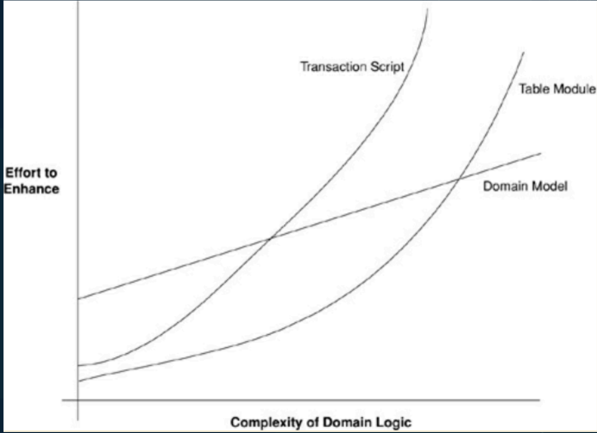

# Layering

- Separação de responsabilidades
- Abstração
    - Tem que saber que na camada atual nao importa saber o que esta abaixo
- Layer vs Tier
    - Camdadas é uma separacao logica
    - Tier já é algo fisico, que podem ser servidores diferentes ou pastas diferentes. Que poder ser usados para deixar ainda mias claro a separacao em camadas

## 3 Layers architecture

É a arquitetura mais basica utilizada.

- Presentation
    - Display Information
    - CLI
    - HTTP Requests
- Domain
    - Coração da aplicação
    - Regras de negócio
- Data Source
    - Banco de dados
    - Mensageria

## Regra de ouro

- Domínio e Data Source nunca podem depender da apresentação

Isso causaria instabilidade na camadas que tentem a ser mais estaveis e tendem a nao mudar com frequencia.

# Domain logic

O que acontece no coração da sua aplicação. E toda vez que a gente está falando disso, você vai perceber que nós vamos ter dois padrões grudados

- Transaction Script
- Domain Model

## Transaction Script

- Regras de negócio em torno de transações
- Segue formato mais “procedural" (ou seja em forma de sequancia)
- Simples e direto
    - Ex: ProcessarPedido
        - Verifica Estoque
        - Aplica Promoções
        - Fidelidade
        - Cria Pedido no Banco
        - Etc

- Vantagens
    - Orientado a transações
    - Totalmente direto ao ponto
    - Adequado para requisitos simples
- Desvantagens
    - Alta complexidade quando o sistema cresce
    - Trabalha normalmente de forma síncrona
    - Pode gerar duplicidade de codigo, pois as regras tendem a nao se comunicar

## Domain Model

- Domínio de uma aplicação em “objetos de domínio”
- Encapsula a Lógica de Negócios
    - O dominio faz isso
- Regras de Negócio em primeiro lugar
    - Nao se pensa em transacao enquanto modela o domnio, jodando a complexidade para esse modelo
- Validações
    - Mantem o estado forte o tempo todo.
    - Ex: Total do pedido vai sempre bater o total dos itens, o modelo mantem esse coerencia

- Vantagens
    - Clareza e Expressividade
        - Enquanto vc faz as coisas ja vao ficando claras o que o dominio representa
    - Flexibilidade
        - Ajuda se focar em solid em design patterns
    - Foco na evolução
    - Alta Testabilidade
        - Muito bom para testes de unidade em cada pedaco
- Desvantagens
    - Complexidade Inicial
        - Fazer uma modelagem para isso nao é facil
    - Curva de Aprendizado
        - É dificil entender um regra olhando para todos os modelos, comparado com olhar uma transacao que ja resolve tudo
    - “Escalabilidade" e “Performance"
        - Tende a ser caro carregar tudo em memoria para o dominio estar completo para trabalhar dessa forma
    - Fácil se perder com Overengineering

## Table Module

- Organização por tabelas do banco de dados
    - Se tenho tabela de pedido e item de pedidos, vou ter models para cada um desses
- Regras de negócio segregadas por tabela
- Alta coesão
- Acoplamento forte com o banco de dados

- Vantagens
    - Simples
    - Fácil mapeamento
    - Simples manutenção em diversas situações
    - CRUD
- Desvantagens
    - Duplicação de código
    - Baixa reutilização
    - Baixa regra de domínio

## Comparativo

As escolha nao precisa ser unica. Ex: Pode tem partes que a regra bem estabelecida, um core, a gente usa domain model e outra mais focada em CRUD se usa table model.

Dependendo pode se optar por comecar com table model para depois caso ter sucesso reescrever para domain model, que realmente exige um entendimento completo do dominio antes de iniciar

# Service layer

- Camada intermediária entre a camada de apresentação e o acesso a dados
- Expõe funcionalidades de alto nível para os “clients"
    - Ela vai ter uma inferface clara para a camada de apresentacao
- Encapsula a lógica de negócios
    - Quando se usa service layes isso acontece, quando se usa domain model isso ja nao é verdade
    - Quando vc esta trabalhando com Service Layer, suas entidades tentem a ser mais anemicas, pois a regras nao estao lá
    - Suas entendidates tendem a ter apenas getters and setters
- Orquestra a ordem das operações
- Tem acesso a camada de dados
- Gerencia transações