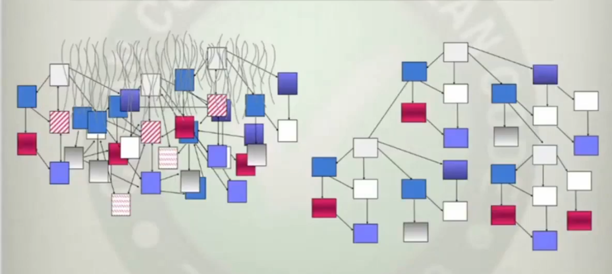
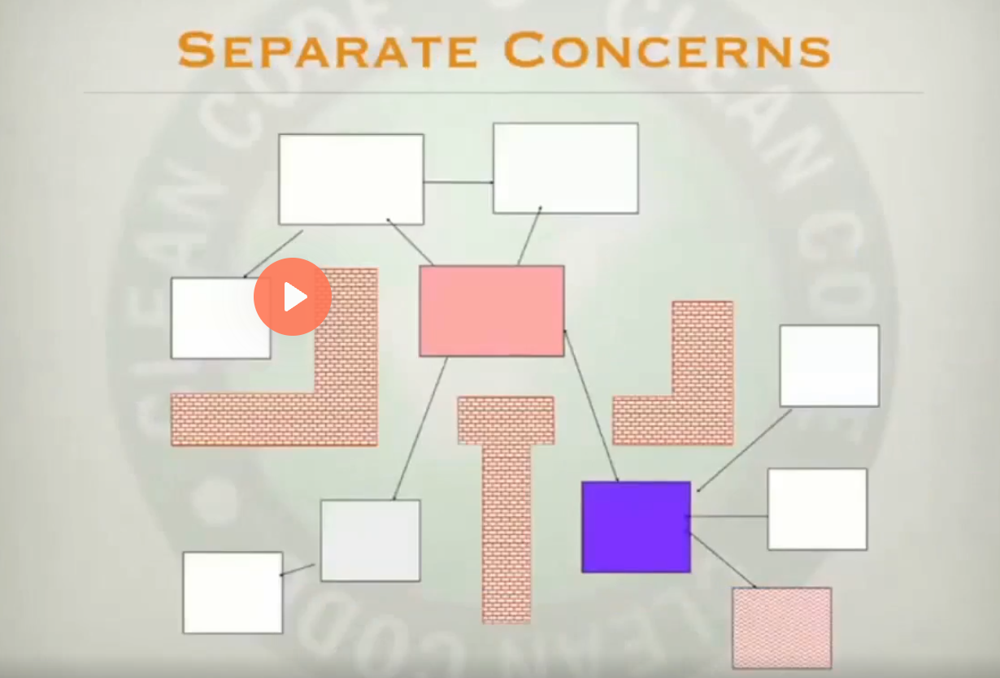
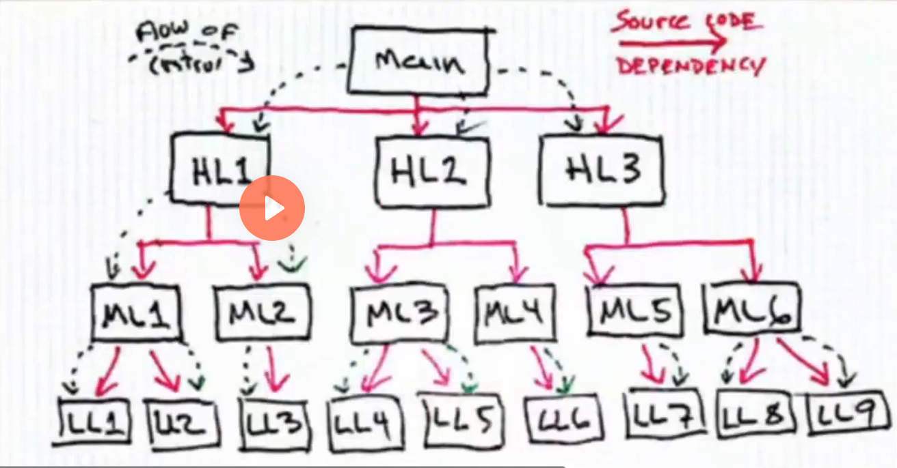
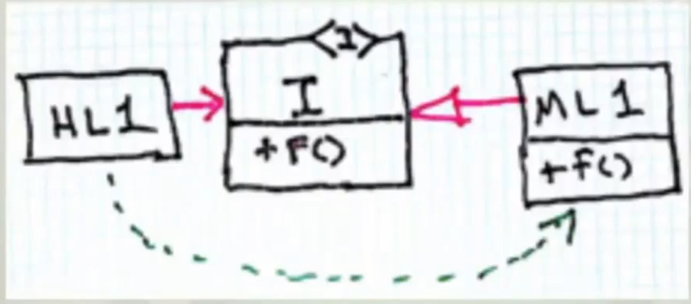
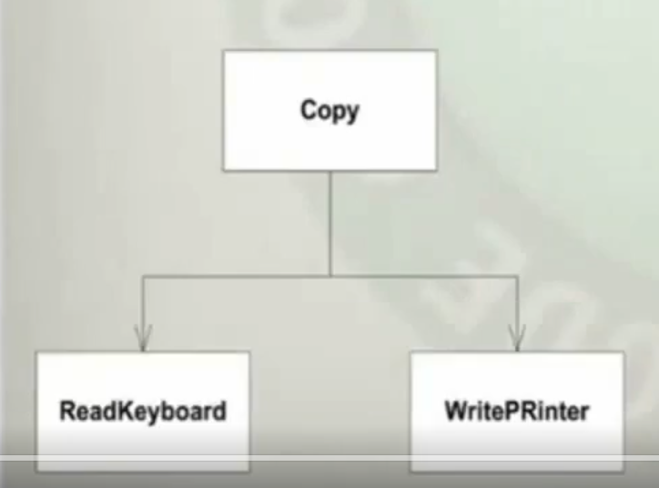
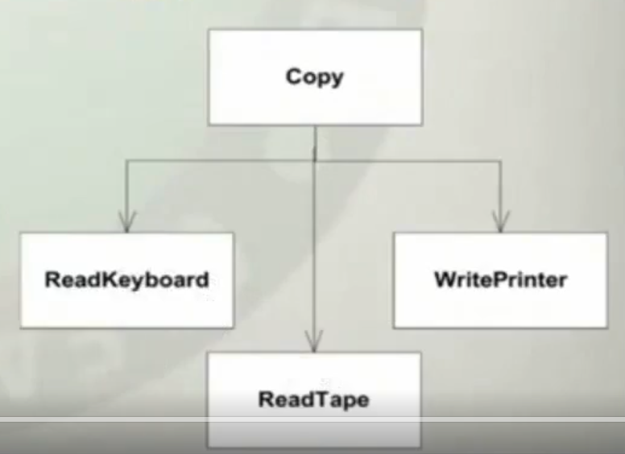
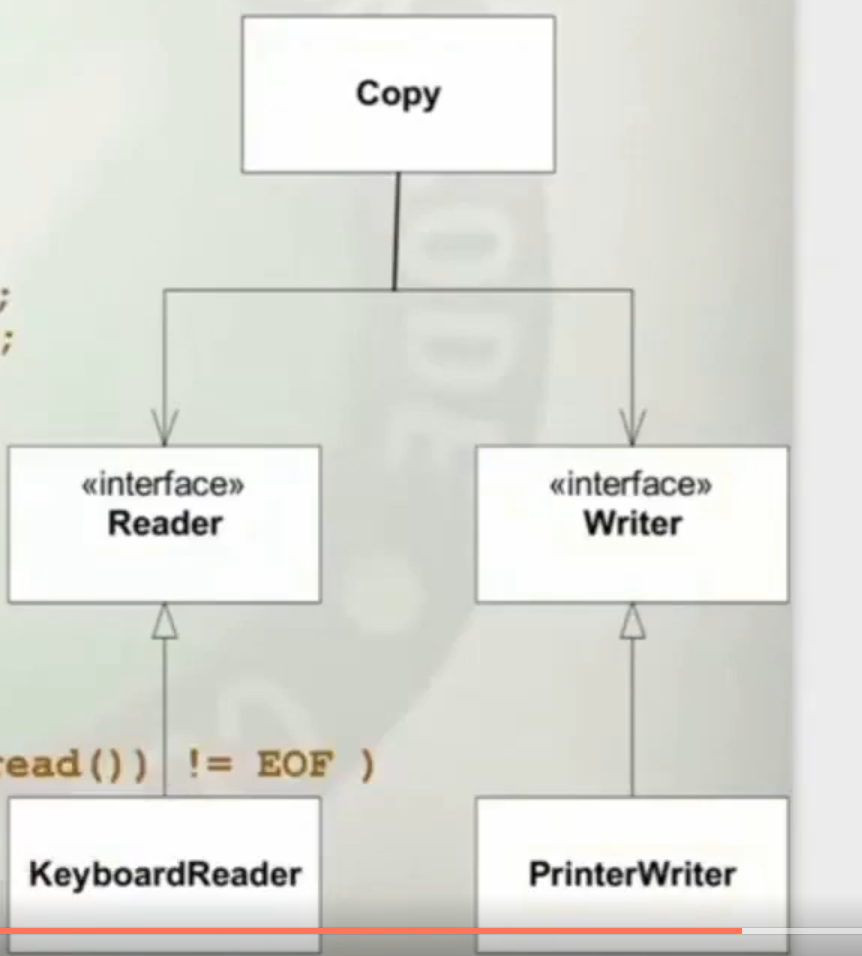
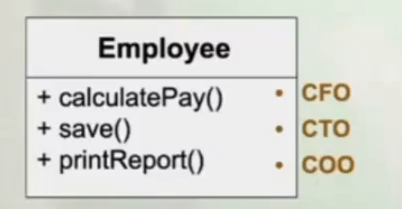
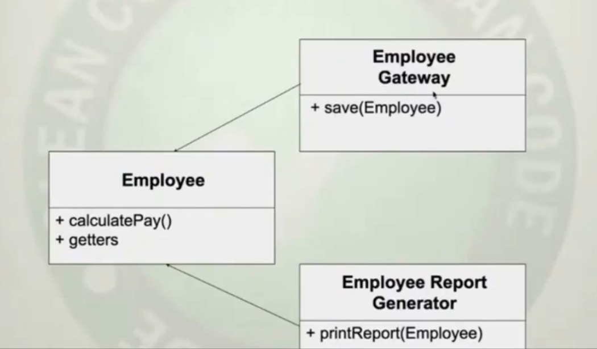

# Introducao

SOLID principles vieram como uma resposta a uma lista de 10 mandamentos de desgin para orientacao objeto, em que essa lista parecia muito simples, e foi comecada a discutir melhor

Hoje em dia a quantidade de computacao na civilizacao aumentou exponencialmente, o que significa: Muita responsabilidade de uma vez em quem desenvolve software

Codigo baguncado, faz todo mundo ficar devagar

- Negligenciamento é contagioso
    - Nao tolerar janelas quebradas

- Rigidez
    - O sistema é dificil de mudar, porque toda mudanca forca muitas outras mudancas em outras partes do sistema
    - Ex: Ao resulver um bug que vc sabe onde está, vc comecar a perceber para mudar uma coisa, varias outras coisas vao sendo impactadas por essa mudanca. Voce nao consegue fazer essa mudanca em impactar tudo

- Fagilidade
    - É um sintoma em que ao alterar uma coisa, outro item nao relacionado quebra.
    - Tendencia um sistema quebrar de forma inexplicavel, quando vc toca outras coisas
    - Gerentes e clientes conseguem ver isso muito bem

- Imobilidade
    - Tentencia de um sistema de ter modulos que sao desejedas para outros contextos ou outros sistemas. Mas esses modulos estao tao conetados que nao pode ser removidos e colocados em outros sitemas.
    - É o oposto de reuso
    - Vc esta tao amarado no seu sistema, que vc nao pode ser utilizado em outro lugar


    

O objetivo do SOLID (no software desing no geral), é construir software que tenha disciplina na interdependencias (como no exemplo a direita). Queremos minimizando o emaranhado e fazendo os sistemas terem um quantidade minima de acoplamento




Os principios ajudam a gente a criar firewalls que prevenem a propagacao de mudanca e o sistema de se tornar interrelacionado.

A coisa primario para isso é a inversao de dependencia



Ate a decada de 70 os sistemas se comportavam como na imagem, em que a linhas vermelha sao os imports, ou uses que criam as dependencias e a linha verde é fluxo de controle(o tempo de execucao de algo). Elas vao sempre na mesma direcao.

A orientacao a objeto nos deu o poder de fazer algo novo



O modulo de alto nivel HL1 consegue depender de uma interface, enquanto o fluxo de controle se opoe a essa dependencia.


## Exemplo (limitacao por nao usar dependency inversion)

Ao criar um codigo onde um metodo precisa copiar da teclado e colar na impressora

```
void copy(void)
{
    int ch;
    while( (ch = ReadKeyboard()) != EOF)
        WritePrinter(ch);
}
```
Criando a estrutura



Porem podemos precisar de alteracoes para ler de tapereader e printar e cartao dependendo de quem chama... Ai no fim precisamos criar um controle interno compartilhado com condicionais

```
bool GtapeReader = false;
bool GtapePunch = false;
// remember to clear

void copy(void)
{
    int ch;
    while( (ch = GtapeReader ? 
                     ReadTape() : 
                     ReadKeyboard()) != EOF)
        GtapePunch ? 
            WritePunch(ch) : 
            WritePrinter(ch);
}
```
Deixando o design com mais dependencias




Isso poderia ter sido melhor com o codigo assim:

```
void Copy()
{
    int c;
    while( (c = getchar()) != EOF)
        putchar(c);
}
```

Considerando `getChar()` e  `putChar()` sao coisas que podem ser trocar em runtime o que esta usando.

O Design ficaria:

```
interface Reader
{ char read(); }

interface Writer
{ void write(char c); }

public class Copy
{
    private Reader itsReader;
    private Writer itsWriter;

    Copy(Reader r, Writer w)
    {
        itsReader = r;
        itsWriter = w;
    }

    public void copy()
    {
        int c;
        while( (c = itsReader.read()) != EOF )
            itsWriter.write(c);
    }
}
```




## Principios do SOLID para a mudanca nao se propague

The **S**ingle Responsibility Principle  
The **O**pen/Closed Principle  
The **L**iskov Substitution Principle  
The **I**nterface Segregation Principle  
The **D**ependency Inversion Principle  


## The Single Responsibility Principle 

- Classe ou modulo deve ter uma e unicamente uma razao para mudar

Não é que o modulo deve ter uma unica responsabilidade!!

- Um ator que é a origem dessa mudanca



Quantas razoes Employee tem para mudar?

A classe nao segue o principio do Single Responsability, pois cada metodo tem um ator que responsavel por mudancas.

Ex: 
- calculate pay, é algo relacionado ao setor finananceiro, o que o ator representante seria o CFO (Chief financial officer) que é quem as pessoas se reportam. Entao é quem seria o ator resposavel por essa mudancas
- printReport é usado pela autidatores ou RH para ver dados pagamentos que se reportam COO(Chief operations officer)
- save quem pediria por mudancas seria os DBAs que se reportariam para o CTO


Olhando por exemplo um problema que pode ocorrer, quem desenvolve o printReport, pode querer reaproveitar metodos que arredondariam numeros, em que para printar melhor o COO pode pedir uma mudanca para imprimir melhor algo... Isso afetaria o pagamento por arredondamento

### Formas de resolver

Criar uma facade, que Employee vai ter os metodos, porem ele nao implementa, ele chama outras classes de servico que tem a regra nela


Ou entao dividir rensposabilidades



EmployeeGateway e Employee Report Generator usam Employee para fazem suas acoes.