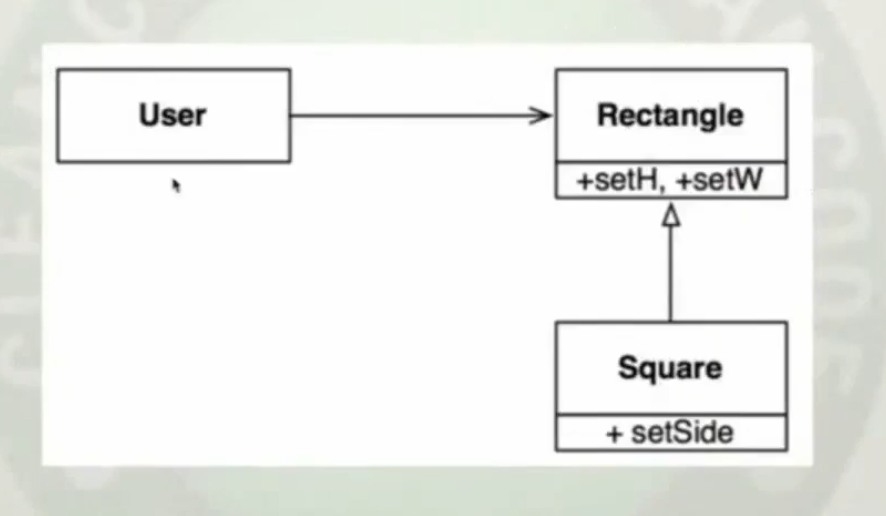
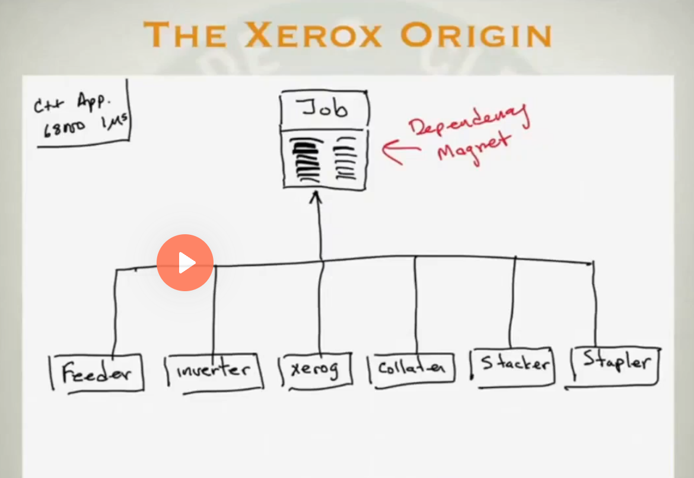
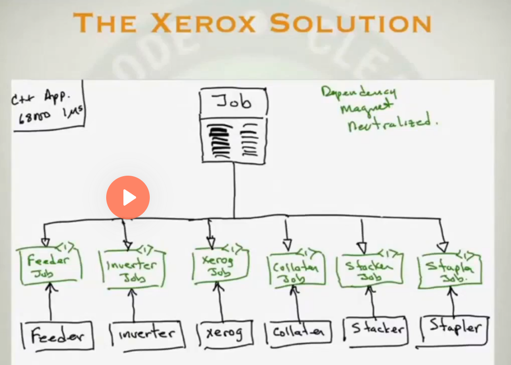
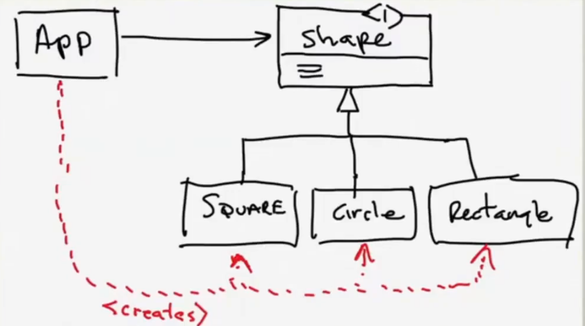
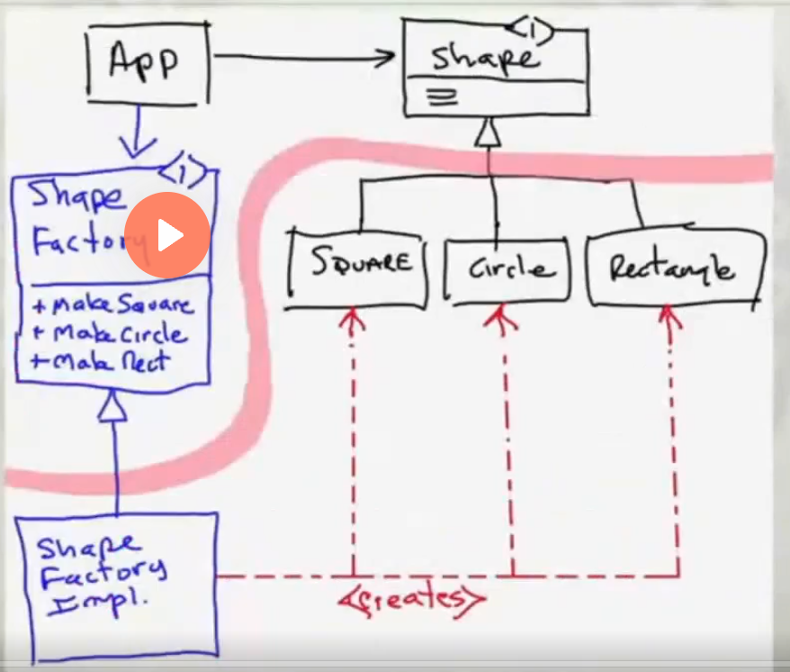
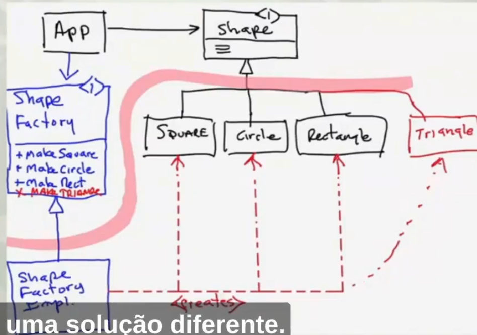
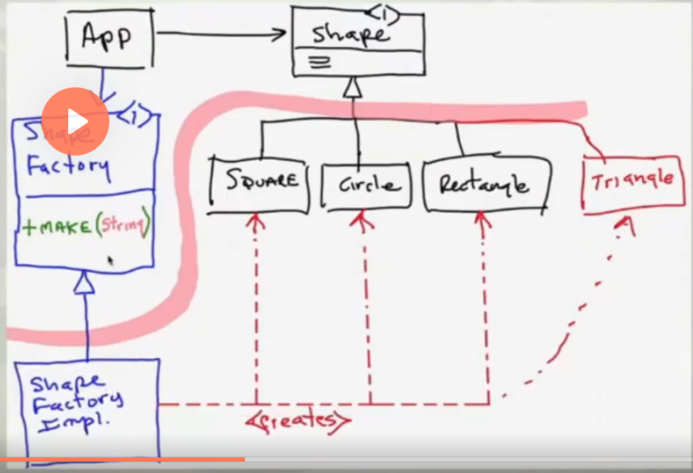

# Introducao

SOLID principles vieram como uma resposta a uma lista de 10 mandamentos de desgin para orientacao objeto, em que essa lista parecia muito simples, e foi comecada a discutir melhor

Hoje em dia a quantidade de computacao na civilizacao aumentou exponencialmente, o que significa: Muita responsabilidade de uma vez em quem desenvolve software

Codigo baguncado, faz todo mundo ficar devagar

- Negligenciamento é contagioso
    - Nao tolerar janelas quebradas

- Rigidez
    - O sistema é dificil de mudar, porque toda mudanca forca muitas outras mudancas em outras partes do sistema
    - Ex: Ao resulver um bug que vc sabe onde está, vc comecar a perceber para mudar uma coisa, varias outras coisas vao sendo impactadas por essa mudanca. Voce nao consegue fazer essa mudanca em impactar tudo

- Fagilidade
    - É um sintoma em que ao alterar uma coisa, outro item nao relacionado quebra.
    - Tendencia um sistema quebrar de forma inexplicavel, quando vc toca outras coisas
    - Gerentes e clientes conseguem ver isso muito bem

- Imobilidade
    - Tentencia de um sistema de ter modulos que sao desejedas para outros contextos ou outros sistemas. Mas esses modulos estao tao conetados que nao pode ser removidos e colocados em outros sitemas.
    - É o oposto de reuso
    - Vc esta tao amarado no seu sistema, que vc nao pode ser utilizado em outro lugar


    

O objetivo do SOLID (no software desing no geral), é construir software que tenha disciplina na interdependencias (como no exemplo a direita). Queremos minimizando o emaranhado e fazendo os sistemas terem um quantidade minima de acoplamento


Os principios ajudam a gente a criar firewalls que prevenem a propagacao de mudanca e o sistema de se tornar interrelacionado.

A coisa primario para isso é a inversao de dependencia


Ate a decada de 70 os sistemas se comportavam como na imagem, em que a linhas vermelha sao os imports, ou uses que criam as dependencias e a linha verde é fluxo de controle(o tempo de execucao de algo). Elas vao sempre na mesma direcao.

A orientacao a objeto nos deu o poder de fazer algo novo


O modulo de alto nivel HL1 consegue depender de uma interface, enquanto o fluxo de controle se opoe a essa dependencia.


## Exemplo (limitacao por nao usar dependency inversion)

Ao criar um codigo onde um metodo precisa copiar da teclado e colar na impressora

```
void copy(void)
{
    int ch;
    while( (ch = ReadKeyboard()) != EOF)
        WritePrinter(ch);
}
```
Criando a estrutura


Porem podemos precisar de alteracoes para ler de tapereader e printar e cartao dependendo de quem chama... Ai no fim precisamos criar um controle interno compartilhado com condicionais

```
bool GtapeReader = false;
bool GtapePunch = false;
// remember to clear

void copy(void)
{
    int ch;
    while( (ch = GtapeReader ? 
                     ReadTape() : 
                     ReadKeyboard()) != EOF)
        GtapePunch ? 
            WritePunch(ch) : 
            WritePrinter(ch);
}
```
Deixando o design com mais dependencias


Isso poderia ter sido melhor com o codigo assim:

```
void Copy()
{
    int c;
    while( (c = getchar()) != EOF)
        putchar(c);
}
```

Considerando `getChar()` e  `putChar()` sao coisas que podem ser trocar em runtime o que esta usando.

O Design ficaria:

```
interface Reader
{ char read(); }

interface Writer
{ void write(char c); }

public class Copy
{
    private Reader itsReader;
    private Writer itsWriter;

    Copy(Reader r, Writer w)
    {
        itsReader = r;
        itsWriter = w;
    }

    public void copy()
    {
        int c;
        while( (c = itsReader.read()) != EOF )
            itsWriter.write(c);
    }
}
```


## Principios do SOLID para a mudanca nao se propague

The **S**ingle Responsibility Principle  
The **O**pen/Closed Principle  
The **L**iskov Substitution Principle  
The **I**nterface Segregation Principle  
The **D**ependency Inversion Principle  


## The Single Responsibility Principle 

- Classe ou modulo deve ter uma e unicamente uma razao para mudar

Não é que o modulo deve ter uma unica responsabilidade!!

- Um ator que é a origem dessa mudanca


Quantas razoes Employee tem para mudar?

A classe nao segue o principio do Single Responsability, pois cada metodo tem um ator que responsavel por mudancas.

Ex: 
- calculate pay, é algo relacionado ao setor finananceiro, o que o ator representante seria o CFO (Chief financial officer) que é quem as pessoas se reportam. Entao é quem seria o ator resposavel por essa mudancas
- printReport é usado pela autidatores ou RH para ver dados pagamentos que se reportam COO(Chief operations officer)
- save quem pediria por mudancas seria os DBAs que se reportariam para o CTO


Olhando por exemplo um problema que pode ocorrer, quem desenvolve o printReport, pode querer reaproveitar metodos que arredondariam numeros, em que para printar melhor o COO pode pedir uma mudanca para imprimir melhor algo... Isso afetaria o pagamento por arredondamento

### Formas de resolver

Criar uma facade, que Employee vai ter os metodos, porem ele nao implementa, ele chama outras classes de servico que tem a regra nela


Ou entao dividir rensposabilidades


EmployeeGateway e Employee Report Generator usam Employee para fazem suas acoes.


## Open-closed principle

Um artefato de software deve ser aberto para extensao mas fechado para modificaçao

- Voce deve ser capaz de mudar o que o modulo faz(extensao, fazer mais coisas), porem sem mudar o modulo

Como fazer isso? 
 - Como dependency inversion
 - Separando high level code e low level detais. Fazendo que dependencia no codigo fonte dos low level esteja invertida para apontar para abstracoes, e o high level tenha codigo fonte que aponte para abstracoes e 

É bem dificil cumprir isso... Sendo assim da para limitar a quantidade de modulos abertos a modificacao, para caso perto da main(entrypoint da aplicacao).

## Liskov substituition principle



Tendo um usuario, um tipo e um subtipo. No contexto do usuario esse subtipo pode ser substituido pelo tipo a qualquer momento.

A imagem é uma violacao do principio

Considerando que square é um retangulo, nesse exemplo square herdara os metodos que trocam altura e largura separadamente, o que nao faz sentido pra ele... Uma solucao seria sobrescrever o metodo, porem ao fazer isso o usuario deverá saber e ter um "if" para saber qual tipo ele esta usando antes de fazer uma acao...

"representative rule" - Os representantes das coisas nao compartilham as relacoes das coisas que eles representam... Nesse caso a classe que representa um square, nao é exatamente um square

- Quando vc cria uma subclasse que faz mais que a clase base, vc está quebrando esse principio
- Quando a subclasse faz algo que a classe usuaria nao espera

Ex: EmptyList no java que implementa List, quando o user utiliza o metodo add, estoura uma exception. 

## Interface segregation principle

Nao dependa de coisas que vc nao precise

- Uma classe nao é obrigada a implementar uma interface que ela nao utilizará

- Não implementar uma interface a nao ser que voce va utilizar todos os metodos que ela contem, se nao for o caso, crie uma nova interface.



Com esse design acima, na xerox cada modulo (feeder, inverter de papel, grampeador, etc) tinha que ter mudanca quando havia uma mudanca em job.



Para resolver, foram criadas diferentes interfaces que elas dependiam do job fazendo cada modulo herdar e ter que implementar apenas as coisas que ele precisa

## Dependency inversion principle

"Dependa da abstatracao"

- High level policy nao deve depender do detalhe
- Detalhe deve depender do high level policy na direcao da abstracao

Todos os principios usam esse como low level anotation



Nessa imagem, tudo que App precisa fazer com as shapes, ele consegue fazer utilizando a interface. Isso obedece o open-closed principle, em que a classes de shapes estao abertas para extensao (adicao de novas features, sem causar mudancas), inclusive incluir novas shapes. Alem disso o dependency principle tambem esta sendo seguindo. 

Porem a linha vermelha mostra um problema, em que existe uma dependencia de codigo fonte em que ao termos um shape novo, precisamos que App saiba que tipo é esse para criar a nova instancia (new() keyword). Sendo assim a gente precisa melhorar como está funcionando open-closed principle entre essa camada de aPP e o resto, deixando criar coisas em low level sem afetar o high(App).



Isso é possivel utilizando o design pattern abstract factory. Em que existe a linha chamada arquicture boundary, em que quero manter o open-closed principle. Colocando essa classe abstrata(seguindo o principio do dependency inversioon, pois low level e high level dependem da abstracao), criando as formas que queremos. Nesse exemplo cada metodo cria a forma especifica desejada porem todos eles retornam uma interface shape. Sendo assim isolamos as duas linhas...

Porem ainda temos um problema... Se adicionamos um nova shape, vamos ter que adicionar uma nova funcao na factory



A solucao seria ter um metodo unico na factory, passando um paramentro que identifica qual a shape que o App quer usar.
Para isso podemos criar uma execao que viola static type safety, que seria pasar via string qual o shape a ser utilizado

