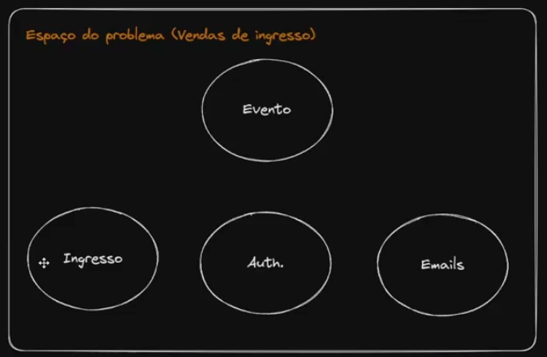
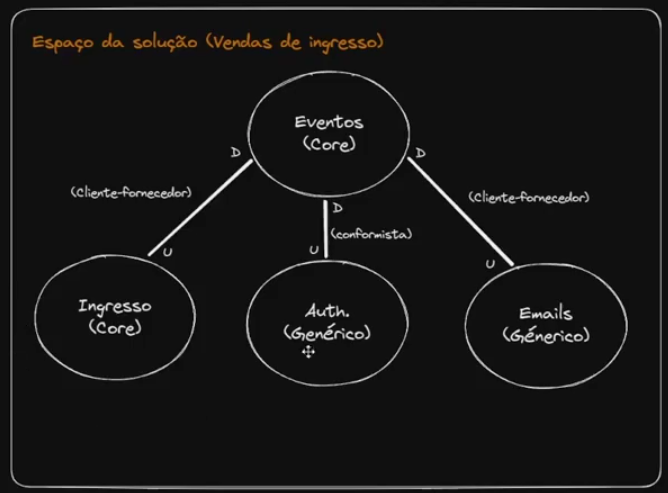
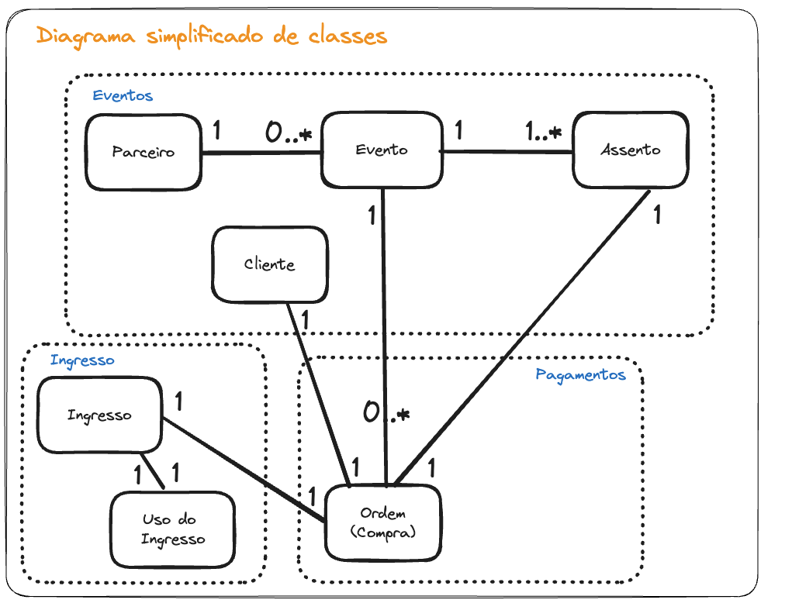

[Excalidraw](<MBA_Full_Cycle_-_Doman_Driven_Design_FINAL.excalidraw>)

# Espaco do problema vs Espaco da solucao

Duas perspectivas,

## Espaco do problema

No espaco do problema é onde é feito estabelecimento do dominio principal e areas (subdominiios dentro do dominio)

- Pode ter uma area pronta, entao pode ser apenas mostrar eles e identificar novos
- Cada subdominio tem seu contexto e sua linguagem ubiqua
- Estabelecer o que cada subdominio faz
- Nao estamos pensando em relacionamento entre os subdominios

- Eventos
    - vai ter a parte dos parceiros, tudo que envolve o evento. Os parceiros, o cliente, o próprio evento em si, que é o acontecimento que vai ter data, hora, os assentos
- Ingresso
    - determinar os QR Codes e também de fazer a validação de ingresso, tanto de participantes do sistema, quanto pelo próprio cliente
- Auth
    - preciso estabelecer a identidade do usuário para poder ver o que cada um pode fazer, o que cada um está autorizado a fazer
- Emails

## Espaco da solucao

Pegar os subdominios e ver como vao ser relacionar

Definimos tanto Eventos e ingressao sao core (pode ser 2). E as duas solucoes estao separadas, pois tenho essa visao de que posso ter um ingresso sem ter necessariamente um evento.

Como ingresso vai gerar documentos e o ssubdomínio de eventos que vai fazer a utilização disso, temos uma relação de upstream e downstream, cliente-fornecedor, pensando no nível da nossa empresa, nesses dois domínios, a gente tem equipes menores. A nossa organização não tem tantos desenvolvedores assim, então, tanto um e outro, que precisarem de alguma coisa, vão estar prestes e dispostos a resolver os problemas uns dos outros. Se o evento precisar de alguma coisa aqui de ingresso, a equipe, sim, vai avaliar, porque vai ser importante, ainda mais porque a gente está no Core Domain.

Esses 2 subdominios é onde a gente vai gastar mais grana, onde a gente vai mais investir, é aqui nesse eixo. E no caso de downstream e upstream, fica claro que eventos é um consumidor de ingresso, então, o ingresso é o fornecedor e eventos é o cliente.

No caso da autenticação, vamos pensar o seguinte: “poxa, vale a pena eu desenvolver a minha autenticação e tudo mais?” A gente já poderia usar alguma coisa pronta, pode até ser um... algum framework, alguma coisa assim que resolva o meu problema, até um software de terceiro. Nesse caso, é um domínio genérico. Normalmente, quando a gente quer ver esse subdomínio que é de apoio, ou principalmente genérico, são softwares de prateleira que a gente pode adquirir, que vai valer muito mais a pena do que você ficar desenvolvendo isso, ou do que eu colocar um desenvolvedor para trabalhar nisso. Eu pego alguma solução e agrego aqui. Então, nós também temos essa relação de upstream e downstream, conformista, porque uma vez que eu preferir agregar um software aqui e tem trocentos softwares no mercado, o pessoal que fizer o software não vai fazer modificações porque o meu evento está precisando.

Na parte de e-mails? Também sou um downstream, porque a gente está usando, eu sou um cliente, o e-mails é um fornecedor. Essa solução também poderia ser genérica, mas acaba que a gente poderia criar uma solução que trabalha com... um terceiro de envio de e-mails. Essa solução vai pegar os e-mails a serem enviados, comunicar com o XPTO, ABC e fazer o envio.

Temos uma relacao de downstream muito alta com um subminio core de eventos, existe um risco que os upstreams mudem e impactem eventos. A gente já tem que ter isso logo de cara. Depois nós vamos ter que pensar em mecanismos para fazer com que esse domínio fique protegido.  também que ingressos não façam esse domínio ficar instável demais, porque sempre quando eu tenho uma relação downstream, sim, esse cara acaba se modificando muitas vezes, porque os outros ups foram modificados. E como ele é um core, tem que ser o mais estável possível, porque quanto mais estáveis, quanto mais estável, eu tenho um custo menor de manutenção, eu tenho menos bugs, eu consigo gerar mais valor.

# Design estrategio vs design tatico 

Design estratégico é uma visão mais gerencial, de alto nível, do que precisa ser feito, do problema a ser resolvido, do que nós precisamos fazer. E a tática seria como nós vamos fazer dado o que é necessário, dada essa estratégia. Como nós vamos implementá-la

## Design estrategio

Tem uma relação mais íntima com o espaço com o espaço do problema e a visão estratégico dos subdomínios

Envolve:
    - Criar subdomínios e sua categorização
    - Criar contextos e seus relacionamentos
    - Criar linguagem ubíqua

## Design tatico 

Tem uma relação mais íntima com o espaço da solução e a visão mais profunda dos contextos.
Permite ter uma visão como seria implementado a solução em nível

Envolve criar:
    - Entidades
    - Objetos de valor
    - Agregados
    - Repositórios
    - Serviços de domínio
    - Módulos
    - Eventos de domínios

# Quando o DDD seria recomendado

Pode ser que valha por exemplo trabalhar com DDD em todos os subdominios indentificados. Assim como pode ser adequado usar apenas em design estrategico e nao utilizr o tatico

## Scorecard

Vaughn Vernon cria um scorecard, se passar de 7 pode ser adequadado usar o DDD

| Seu projeto tem uma pontuação total de 7 pontos ou mais?                                                                                                                                                                                                                                                                                                                                                                                                                                                                                                                                                                                                                                                                                                                                                                                 |        |                                                                                                                                                                                                                                                                                                                                                                                                                                                                                                       |
| ---------------------------------------------------------------------------------------------------------------------------------------------------------------------------------------------------------------------------------------------------------------------------------------------------------------------------------------------------------------------------------------------------------------------------------------------------------------------------------------------------------------------------------------------------------------------------------------------------------------------------------------------------------------------------------------------------------------------------------------------------------------------------------------------------------------------------------------- | ------ | ----------------------------------------------------------------------------------------------------------------------------------------------------------------------------------------------------------------------------------------------------------------------------------------------------------------------------------------------------------------------------------------------------------------------------------------------------------------------------------------------------- |
| Se seu projeto                                                                                                                                                                                                                                                                                                                                                                                                                                                                                                                                                                                                                                                                                                                                                                                                                           | Pontos | Concepções de suporte                                                                                                                                                                                                                                                                                                                                                                                                                                                                                 |
| Se sua aplicação for completamente centrada em dados e se qualificar verdadeiramente para uma solução CRUD pura, em que cada operação é basicamente uma consulta simples de banco de dados para criar, ler, atualizar ou excluir, você não precisa do DDD. Sua equipe só precisa colocar um rosto bonito em um editor de tabelas de banco de dados. Em outras palavras, se você puder confiar no fato de que os usuários irão inserir os dados diretamente em uma tabela, atualizá-los e, às vezes, excluí-los, você nem mesmo precisará de uma interface do usuário. Isso não é realista, mas é conceitualmente rele- vante. Se pudesse usar uma ferramenta simples de desenvol- vimento de banco de dados para criar uma solução, você não desperdiçaria o tempo e dinheiro de sua empresa no DDD. | 0      | Isso parece óbvio, mas normalmente não é fácil determinar simples versus complexo. Não é como se todas as aplicações que não são CRUD puras merecem o tempo e o esforço do uso do DDD. Assim, talvez possamos sugerir outros indicadores para nos ajudar a traçar uma linha entre o que é complexo e o que não é ...                                                                                                                                                                   |
| Se seu sistema exigir apenas 30 ou menos operações de negócio, ele provavelmente é bem simples. Isso significaria que a aplicação não teria um total de mais de 30 histórias de usuário ou fluxos de caso de uso, com cada um desses fluxos tendo apenas uma lógica mínima de negócio. Se você puder desenvolver rápida e facilmente esse tipo de aplicação usando o Ruby on Rails ou o Groovy and Grails e não se importar com a falta de poder e controle em relação à complexidade e alteração, o sistema provavelmente não precisará usar o DDD.                                                                                                                                                                                                                                                             | 1      | Para ser claro, estou falando de 25 a 30 únicos métodos de negócio, não de 25 a 30 interfaces de serviço comple- tas, cada uma com vários métodos. O último pode ser complexo.                                                                                                                                                                                                                                                                                                               |
| Assim, digamos que, em algum lugar no intervalo entre 30 e 40 histórias de usuário ou fluxos de caso de uso, a comple- xidade poderia ser pior. Seu sistema pode estar entrando no território do DDD.                                                                                                                                                                                                                                                                                                                                                                                                                                                                                                                                                                                                                           | 2      | O risco é do comprador: Bem frequentemente a complexi- dade não é reconhecida rapidamente. Nós, desenvolvedores de software, somos realmente muito bons para subestimar a complexidade e o nível de esforços. Só porque talvez queiramos codificar uma aplicação no Rails ou Grails não significa que devemos. No longo prazo, essas aplicações poderiam prejudicar mais do que ajudar.                                                                                             |
| Mesmo que a aplicação não seja complexa agora, a comp exi- dade dela aumentará? Você só pode saber isso ao certo depois que os usuários reais começam a trabalhar com ela, mas há um passo na coluna "Pensamentos de suporte" que pode ajudar a revelar a situação real. Tenha cuidado aqui. Se houver absolutamente qualquer indício de que a aplicação tem complexidade mesmo moderada — este é um bom momento para ser paranoico —, isso pode ser uma indicação suficiente de que ela na verdade será mais do que noderadamente complexa. Incline-se em direção ao DDD.                                                                                                                                                                                                                                 | 3      | Aqui vale a pena analisar os cenários de uso mais complexos com especialistas em domínio e ver aonde eles levam. Os especialistas em domínio ... 1... . já estão solicitando recursos mais complexos? Se sim, isso provavelmente é uma indicação de que a aplicação já é ou em breve se tornará excessivamente complexa para usar uma abordagem CRUD. 2....estão entediado com os recursos ao ponto em que dificilmente vale a pena discuti-los? Provavelmente não é complexa |
| Os recursos da aplicação serão alterados com requencla longo de alguns anos, e você não pode antecipar que as altera- cões serão simples.                                                                                                                                                                                                                                                                                                                                                                                                                                                                                                                                                                                                                                                                                          | 4      | O DDD pode ajudá-lo a gerenciar a complexi a e a refatoraçãode seu modelo ao longo do tempo.                                                                                                                                                                                                                                                                                                                                                                                                          |
| Você não entende o Domínio (2) porque ele é novo. a medida em que você e sua equipe sabem, ninguém fez isso antes. Isso provavelmente significa que ele é complexo ou, pelo menos, merece a devida diligência com análise analítica \*ra. determinar o nível de complexidade.                                                                                                                                                                                                                                                                                                                                                                                                                                                                                                                                                | 5      | Você precisará trabalhar com especialistas em domínio e testar os modelos para fazer a coisa certa. Você certamente também pontuou em um ou mais dos critérios anteriores, portanto, use o DDD.     

# Sobre como aplicar a linguagem ubiqua

Cada contexto tem sua propria linguaguem, vai fazer todo mundo ter o entendimento em comum,
Sendo que entre dois subdominios um termo pode ter 2 significados diferentes

Ex:

- Dicionário de termos
    - Ingresso - se refere ao documento que valida a compra do assento pelo cliente
    - Evento - se refere a um acontecimento com data/hora e lugar
    - Assento - se refere ao espaço que será vendido ao cliente
    - Cliente - se refere ao consumidor que compra assentos
    - Ordem de compra - se refere a compra realizada pelo cliente
    - Parceiro - organização ou pessoa que organiza um evento

- UML
- Qualquer outro tipo de documento que ajuda a todos a entenderem o modelo

# Destilacao do núcleo de domínio

Vai acontecert ainda na visa estategica, sabendo o core domain. Considerando que pode acontecer que no design tatico, de perceber que ter que rever algo feito no design estrategico.

Uma vez identificado o espaco da solucao. Primeiro fazemos a visao do dominio, sem detalhe tecnico queremos colocar a essencia do negocio. Sendo em perspetiva da equipe envolvida.

Ex:

## Declaracao da visao de dominio

O modelo deve permitir que clientes comprem ingressos de eventos apenas com cartão de crédito, não sendo possível haver conflitos de lugares. A validação do ingresso no evento deve estar sempre disponível e ser rápida.

Parceiros devem conseguir criar eventos e determinar lugares. Quando o cliente fizer pagamento, este deve ser repartido entre o parceiro e a nossa organização.

O modelo deve representar as diferentes visões de usuário: (administradores, parceiros e clientes).

O modelo deve permitir a pesquisa dos eventos e compras realizadas pelos clientes e também permitir aos parceiros gerenciar seus eventos, 
alterando informações sobre ele, além de gerenciar os espaços disponíveis.

--- 

Temos tambem um diagrama de classes simplificado em que temos o core domain modelado.

Ex:

Considerando o  domínio de eventos, pagamentos está embutido. Mas podemos fazer questão de fazer essa separação no diagrama. Porque seria muito ruim a gente só enxergar o evento sem ver que, de fato, o pagamento faz parte daquela situação. 

Temos entao, aqueles dois subdomínios, mas um deles está fragmentado em duas partes, para que a gente veja, neste caso, que a compra é o mais importante. Às vezes a gente vê a compra somente que é o cliente passando o cartão de crédito, mas dividindo da forma do diagrama a gente pode fazer análises em cima das vendas, em cima do evento, se tem assentos disponíveis baseado num determinado tempo. Vemos que ordem de compra está apontando para todo mundo, ou seja, ele está usando as informações do nosso Core Domain para poder fazer as coisas acontecerem.

quando a gente olha para a declaração de visão de domínio, nós queremos ainda fazer uma imersão nela para encontrar o que o Evans chama de núcleo segregado. Porque mesmo ainda naquele Core Domain, eu posso ver qual é a essência, qual é a alma ainda desse coração

## Camadas de responsabilidade

Aqui, a gente não está olhando o subdomínio. A gente está olhando os agentes dentro do subdomínio, as entidades.

Nós temos potencial, operaçõe, política e decisao. Quando a gente determina essas responsabilidades, nós temos uma dependência entre essas camadas que vai fluir de cima para baixo.

Uma camada que está abaixo, não depende de uma camada que está acima. Uma camada que está acima pode depender das camadas que estão embaixo

### Pottencial

Lá embaixo, nós temos o potencial, que a gente pode chamar também de capacidade. Qual é o estado atual dos recursos que eu tenho dentro do meu negócio?

E esses recursos são justamente os clientes, os assentos, os event spots, o evento e parceiro.

É o potencial da minha empresa

### Operaçoes

Já as operações vão ser a parte dos ingressos, porque eu tenho que gerar esses ingressos. Tenho também que fazer a validação do uso desses ingressos, apesar de você pensar, de entidades e classes. 

O uso do ingresso tambem poderia estar aqui....

### Política

são estratégias para a gente conseguir continuar melhorando esse negócio, baseado nas ações que eu tenho. Assim, nós poderíamos ter políticas de desconto, cupons de desconto ou até políticas de conflito de compra. Vai que você está comprando... A gente não pode comprar ingressos repetidos, mas uma vez que você tentou comprar um ingresso, e outra pessoa já comprou o primeiro, nós poderíamos ter uma política de cupom, que a gente vai te ofertar um outro show depois ou alguma coisa nesse sentido. São estratégias que nós vamos fazer para poder trabalhar com o potencial e com as operações.

### Decisão

É onde nós vamos ter o apoio à tomada de decisões e tudo parte das vendas. Vendas está utilizando as camadas mais abaixo e as camadas mais abaixo não dependem de vendas? Tudo parte das vendas.

Eu estou recebendo muitos acessos. Então, eu vou ter que tomar uma tomada de decisão aqui, que eu preciso suportar aqueles acessos para poder fazer as minhas vendas. Que tem os pagamentos, a gente não vai jogar nada para um sistema de mensagens para poder fazer o pagamento depois. O pagamento tem que acontecer agora. Então, eu vou ter que escalar essa parte aqui. Isso aqui vai ter que funcionar muito bem.

Cliente, assento, evento, isso aqui não precisa ter grande escalabilidade, não. Os parceiros não vão ficar criando eventos o tempo inteiro. A gente não vai ter um uso extensivo comparado à compra.

O potencial é que define o quanto que eu estou faturando com esse sistema. Porque se o meu potencial estiver baixo, eu não vou conseguir vender, mas vendas é o decisivo.

uso do ingresso, também ligado à decisão. Ele envolve uma tomada de decisão no meu negócio, porque imagina que eu tenho 100 eventos marcados para a mesma hora. Aquilo ali vai envolver uma resposta diferente do meu software.

