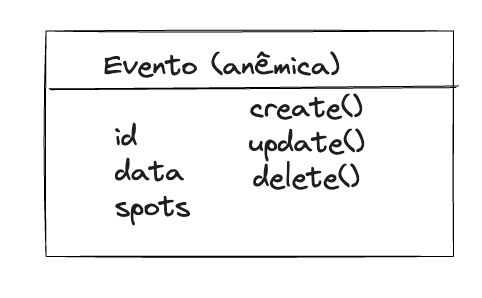
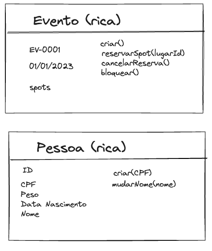
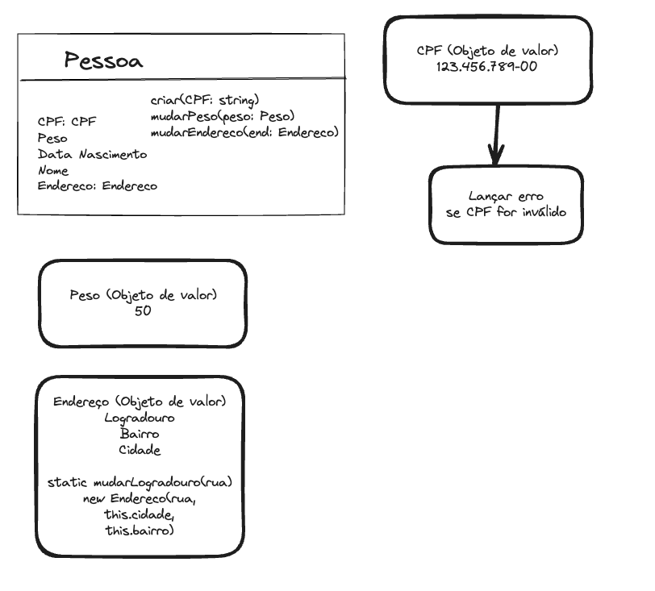

# Sobre o design tatico

Dados os subdominios existentes, como vamos resolver aqueles contextos delimitados

# Modelo anemico vs Modelo rico

DDD faz com que voce pense no modelo rico

Geralmente com ORMs trabalhamos com modelo anemico

Isso no codigo faz com que as regras ficam espalhadas e dificil manter como tempo, a entidade acaba servindo apenas para transitar com o banco de dados(storage)

No modelo rico, sem ficar preso a tecnologia isto isolado de infraestrutura e vai ser bem mais trabalhoso criar as entidades.

# Entidade no DDD

Para saber se alog é uma entidade ou nao, devemos pensar se é preciso diferenciar esse item de outros. E como diferenciar um objeto de outro? A identidade. E nao significa que a identidade vai ser a PK do banco de dados.

Porem preciso ter uma identidade relacionada a negocio, que nao sera pk pois para conversar com o expert de dominio nao vou usar o id hash do banco.

## Tornando rico com as regras de negocio

Usando como exemplo as entidade Evento e Pessoa.

Para pessoa

- Com pessoa preciso criar. Porem estamos falando de uma criaca que nao vai trabalhar com banco de dados, ele, na verdade, vai manipular essas informações para poder gerar aquele objeto para mim. Então, para poder criar uma pessoa, eu preciso de um CPF, no mínimo.

- Vou precisar validar o CPF. Vou validar esse cpf dentro da minha entidade.

- Podemos mudar o nome da pessoa

Para evento

- Vou precisar criar um evento

- Vou precisar reservar um spot(tambem nao implicar armazenamento de dados)

- Vou precisar cancelar uma reserva

- Posso precisar de bloquear o evento

Dica: Evite colocar metodos generico como "update()"

# Objeto de valor

No nosso caso da entidade de pessoa, pensando em CPF temos operacoes que na hora de criar a pessoa que precisam ser feitas com CPF como a validacao do mesmo.

Se colocarmos que pessoa espera um CPF do tipo string estamos definindo isso de maneira muito pobre principalmente pensando em reuso.

Sendo assim o melhor é tratar CPF como se fosse um novo objeto, que seria um objeto de valor. uma classe independente com suas proproas regras que vao acabar sendo utilizadas em outros lugares tambem. 

Isso pode ser feito com outras itens como `Peso`, `Endereco`.

Pensando em Endereco com propriedades como numero, bairro. Se vc precisa trocar apenas o bairro, vc troca todo o endereco. Em objetos de valor nao é adquedo trocar apenas um coisa. Porque um objeto de valor é igual ao outro, se todas as informações que estão dentro desse objeto de valor forem iguais às do outro. Então, esse endereço aqui é igual ao do outro, somente se o logradouro, bairro e cidade forem iguais.

Essa imutabilidade faz nos livrar daqueles efeitos colaterais que uma entidade normalmente tem. Porque uma entidade vai sofrer alterações aqui nas suas informações que vão causar efeitos que são um pouco nefastos no sistema, ou são difíceis de testar. Vai causar mudança de comportamento. O objeto de valor não muda, então é fácil de testar. É fácil de fazer a validação.

O maximo que poderia ocorrer seria, ter um método estático lá dentro do seu objeto de valor, que é “mudar logradouro”. Esse metodo vai gerar um objeto novo

Muitas vezes não é só o reúso. Às vezes, você tem uma entidade com alguns campos, uma entidade um pouco mais complexa, e você fica colocando muitas regrinhas dentro da sua entidade, e você tira essa responsabilidade de lidar com aquele valor e joga ela para o objeto de valor e a entidade só reúsa aquilo.

# Agregados