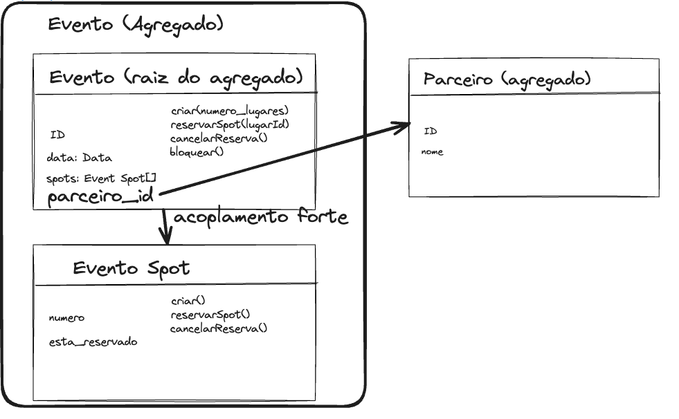
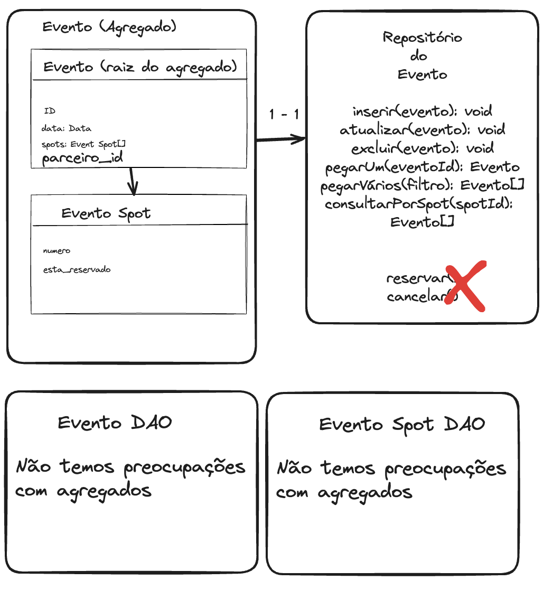
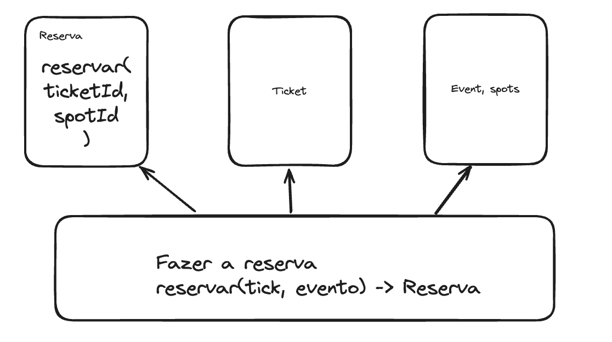
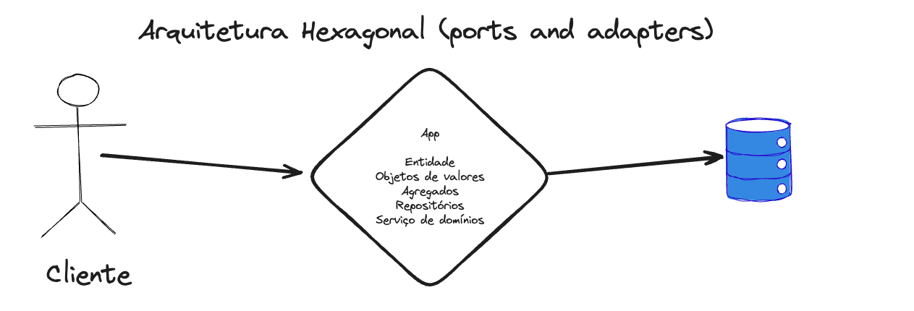

# Sobre o design tatico

Dados os subdominios existentes, como vamos resolver aqueles contextos delimitados

# Modelo anemico vs Modelo rico

DDD faz com que voce pense no modelo rico

Geralmente com ORMs trabalhamos com modelo anemico

Isso no codigo faz com que as regras ficam espalhadas e dificil manter como tempo, a entidade acaba servindo apenas para transitar com o banco de dados(storage)

No modelo rico, sem ficar preso a tecnologia isto isolado de infraestrutura e vai ser bem mais trabalhoso criar as entidades.

# Entidade no DDD

Para saber se alog é uma entidade ou nao, devemos pensar se é preciso diferenciar esse item de outros. E como diferenciar um objeto de outro? A identidade. E nao significa que a identidade vai ser a PK do banco de dados.

Porem preciso ter uma identidade relacionada a negocio, que nao sera pk pois para conversar com o expert de dominio nao vou usar o id hash do banco.

## Tornando rico com as regras de negocio

Usando como exemplo as entidade Evento e Pessoa.

Para pessoa

- Com pessoa preciso criar. Porem estamos falando de uma criaca que nao vai trabalhar com banco de dados, ele, na verdade, vai manipular essas informações para poder gerar aquele objeto para mim. Então, para poder criar uma pessoa, eu preciso de um CPF, no mínimo.

- Vou precisar validar o CPF. Vou validar esse cpf dentro da minha entidade.

- Podemos mudar o nome da pessoa

Para evento

- Vou precisar criar um evento

- Vou precisar reservar um spot(tambem nao implicar armazenamento de dados)

- Vou precisar cancelar uma reserva

- Posso precisar de bloquear o evento

Dica: Evite colocar metodos generico como "update()"

# Objeto de valor

No nosso caso da entidade de pessoa, pensando em CPF temos operacoes que na hora de criar a pessoa que precisam ser feitas com CPF como a validacao do mesmo.

Se colocarmos que pessoa espera um CPF do tipo string estamos definindo isso de maneira muito pobre principalmente pensando em reuso.

Sendo assim o melhor é tratar CPF como se fosse um novo objeto, que seria um objeto de valor. uma classe independente com suas proproas regras que vao acabar sendo utilizadas em outros lugares tambem. 

Isso pode ser feito com outras itens como `Peso`, `Endereco`.

Pensando em Endereco com propriedades como numero, bairro. Se vc precisa trocar apenas o bairro, vc troca todo o endereco. Em objetos de valor nao é adquedo trocar apenas um coisa. Porque um objeto de valor é igual ao outro, se todas as informações que estão dentro desse objeto de valor forem iguais às do outro. Então, esse endereço aqui é igual ao do outro, somente se o logradouro, bairro e cidade forem iguais.

Essa imutabilidade faz nos livrar daqueles efeitos colaterais que uma entidade normalmente tem. Porque uma entidade vai sofrer alterações aqui nas suas informações que vão causar efeitos que são um pouco nefastos no sistema, ou são difíceis de testar. Vai causar mudança de comportamento. O objeto de valor não muda, então é fácil de testar. É fácil de fazer a validação.

O maximo que poderia ocorrer seria, ter um método estático lá dentro do seu objeto de valor, que é “mudar logradouro”. Esse metodo vai gerar um objeto novo

Muitas vezes não é só o reúso. Às vezes, você tem uma entidade com alguns campos, uma entidade um pouco mais complexa, e você fica colocando muitas regrinhas dentro da sua entidade, e você tira essa responsabilidade de lidar com aquele valor e joga ela para o objeto de valor e a entidade só reúsa aquilo.

# Agregado

Sempre um agregado vai ser uma entidade.

No caso do evento, eu posso criar um evento, reservar spot, cancelar reserva, bloquear. Mas pensando aqui, por um lado, sobre a questão dos assentos, a gente vai ter que armazenar também algumas informações dos assentos com o numero dele, se ele está reservado, etc. Sendo assim um spot tambem é uma entidade.

Mas existe uma relação de intimidade entre essas duas entidades aqui. E pensando num nível gerencial, a iniciativa de fazer as coisas, na verdade, está partindo de quem? De evento.

Na criacao de evento que vai ser criados um numero especifico de spots e criado o spot em si e para manter a consistencia no banco de dados o evento que precisa gerenciar quem foi criado ou nao. Sendo assim o Evento é a raiz do agregado(agreggate root). Considerando que um agregado é um conjunto de entidades e objetos de valor.

## Agregados protegem:

- Limite transacional
- Projete e controla as invariâncias

---

Quando criamos as relacoes nas classes, no caso da relacao dentro do mesmo agregado a gente deixa o tipo com a entidade completa, porem pensando em relacao que nao é via agregado, a relacao se trata apenas usando Id. Podemos por exemplo pensar a relacao de evento com outra entidade de `Parceiro` que seria pertencente a outro agreagado. Na entidade de Evento vamos deixar apenas perceiro_id para mostrar esse acoplamento mais fraco.

Dentro do agregado é comum o acoplamento forte

# Repositorios

Repositorio quem deve fazer as operacoes de gravar os dados das entidades, objetos de valores e entidades no storage de dados. E tambem fazer a leitura.

O repositorio deve ter uma relacao de um para um com o agregado. Considerando o respositorio do `Evento` vamos ter as operacoes inserir. atualizar, excluir. 

E não vamos ter operacoes como “reservar evento”, “cancelar evento”. Elas são operações que dizem respeito às entidades 

Um agregado sempre vai ter um repositorio. Nao vamos ter um repositorio para `Spot`. Caso seja necessario uma consulta por spot, ela vai estar no repositorio do agregado do `Evento`, como uma operacao "consultar por spot".

Inclusive um repositório pode retornar um objeto de valor. Às vezes, um objeto de valor pode conter lá dentro o evento, e algumas outras informações, porque esse objeto de valor é imutável. Ele é livre dos efeitos colaterais, e ele vai se auto-validar também.

Na hora de fazer a escrita nao passe nenhuma entidade a nao ser o agregado.

Porem na consulta nao fique consultando apenas o `Spot` 

# Domain service

Pensando em agregados, temos `Reserva`, `Ticket` e `Evento` (com evento e spot). 

considerando que para poder fazer o pedido na `Reserva`, eu tenho que manipular ticket. A gente não sabe ainda como isso vai ser manipulado e tudo mais. Eu tenho que manipular também o evento. Tem tanto o evento quanto os spots. pensando em refinamento dessa operação, até em reutilização dela, para que eu faça a reserva, eu tenho que puxar um número de ticket válido, verificar se o lugar do meu evento não está reservado, se o evento está disponível para poder fazer a reserva, porque às vezes eu posso ter algum tipo de bloqueio ali numa região de assentos e etc.

Pensando numa opracao `reservar()` no agregado `Reserva`. Eu nao posso esperar um agregado/entidade de  `Evento` ou `Ticket`,  isso representa uma grande estabilidade para o nosso domínio, porque uma vez que esses dois caras são agregados, lembra que a gente quer que agregados se relacionem com um acoplamento fraco só através do ID, eles só vão se conhecer pelo ID, para evitar que quando o agregado relacionado se modifique, impacte no outro agregado.

Podemos entao, colocar essa lógica difusa no serviço de aplicação, essa operacao de reservar pode ter mais de um agregado e ser originado de mais de uma forma(pelo cliente, funcionario da empresa). a nível de código, vai ser uma classe que a gente vai criar tendendo a ter um método estático principal, que vai fazer esse processamento.

Esse metodo sim acaba usando o agregado de reserva, o ticket e eventos.

O serviço de domínio atua no coração do nosso software, eu passo o ticket e o evento, ele me devolve a reserva.

Então, se acontecer de ticket, de evento, de reserva mudar, vai impactar nos agregados? Não. Obviamente, se eles mudarem, vai impactar no meu serviço de reservar

# Design patterns e padroes de arquitetura

Sao muito utilizados em DDD:

Design patterns

- Factories (Factory method)
    - Para criar agregados, objetos de valores. Sobre carga ajuda por exemplo em metodos estaticos que dependendo da assinnatura.
    - Pode ser classe separada tambem

- Specification (TODO: Pesquisar melhor)
    - Validacao de dados
    - Regras de negocio (para validar)
    - Pode se usar libs
- Mediator
    - Usado para tratamento de eventos

Arquitetura:

Precisamos separar o que é apresentacos do usuario, negocio e infra. Usando camadas
É bem utilizado arquitetura Hexagonal

# Eventos de dominio e eventos de integracao

Considerando o nosso contexto de eventos, que é Core Domain, a gente acaba tendo aqui uma operação de negócio que é fazer a reserva. 

Esse fazer a reserva vai acabar gerando. um "evento de domínio", que é um acontecimento de uma regra de negócio que foi processada. E a gente pode chamar ele de "reserva feita".

Sempre no passado.

Dentro desse evento, eu tenho a data que ele ocorreu ali, a data-hora que foi ocorrida, mais o agregado que foi envolvido e os devidos dados, que é o ID ali do lugar, o ID do evento, a pessoa que fez e alguma informação financeira da transação que foi feita. Então, qualquer processamento de regra de negócio nossa pode envolver um evento, até uma operação um pouco mais simples

Esse evento de dominio poderia ser tambem um "cliente registrado"

Esse evento pode servir como uma referência para que outros agentes dentro do meu contexto delimitado façam alguma operação. Ou seja, posso criar um ouvinte, que vai ser “diminuir total de spots”. Essa operação é disparada quando esse evento acontece.

Uma recomendacao, é que vc trabalhe manipulando um tipo de agregado para persistência, para poder salvar ele no banco de dados por vez, por negócio. Se você precisa operar outros agregados, faça isso através dos eventos, para que esses agregados fiquem mais independentes ainda

Porém, pode acontecer que um outro contexto esteja interessado nessa reserva que foi feita. No nosso caso o subdominio de emai.l Porque quando uma reserva é feita, a gente vai precisar enviar o e-mail para o cliente que foi tudo feito. Nesse caso, a gente vai chamar esse evento de evento de integração, permitindo a integração entre esses contextos diferentes.

# Contexto delimitado e microsservicos

O contexto pode ser util para deicidir a divisao de microsservicos

# Event storming

Tecnica que se trata de um evento como um monte de post-its para organizar a visao do sistema como DDD em uma "Sala" com envolvidos: "“gerente, desenvolvedor, domain expert".

Os post-its vao ir de direcao de irem virando, basicamente, os eventos, e nós vamos vendo ali todo o fluxo que acontece.

Vamos ter uma ideia mais claro dos contextos.

A gente vai ter um post-ts para evento, outro para comando, um para alguma coisa que seja externa, as Policies(que é algo que vai ser chamado quando um evento acontecer), os próprios agregados, atores.

[Excalidraw](<MBA_Full_Cycle_-_Doman_Driven_Design_whimsical.png>)
