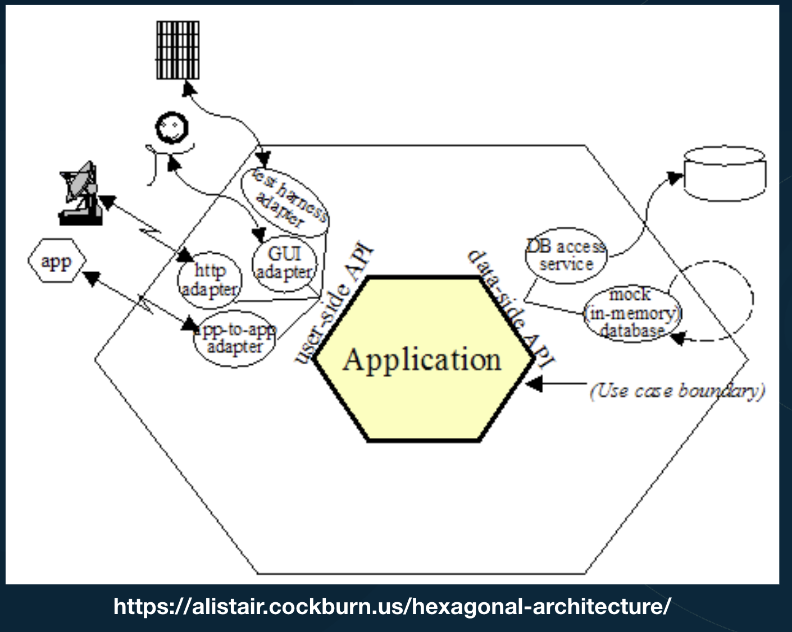
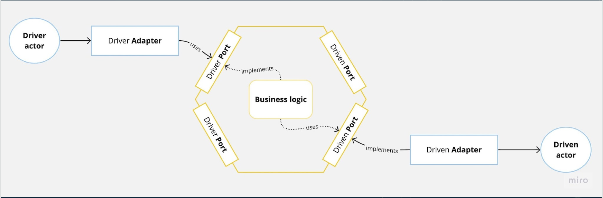

# Hexagonal architecture

Tambem conhecido com ports and adapters

> “Allow an application to be equally be driven by users, programs, automated tests, batch scripts, and to be developed and tested in isolation from its eventual run-time devices and databases” (Alistair Cockburn, 2005).

Focar no core de aplicacao sem ficar travado com acoplamento com saida, banco de dados, dispositivo e entrada.

## O que queremos resolver?

- Evitar big ball of mud
- Manter correta a piramide de testes (muito mais testes unitários, meio termo de testes integrados e pouco manual)

## Destilando a arquiterura hexagonal

Proteger o nucleo da aplicacao (casos de uso, entidades de negocio) dentro de um hexagono do mundo externo.

Blindando casos de casos de usos de drivers(parte da direita) e driven actors(parte da esquerda)

É possivel atraves de ports e adapters

## Principais termos

- Drivers / Primary actors
    - Todo mundo que utiliza um caso de uso
- Adapters
    - Classe/metodos que sao responsavies por entender um driver(e driven actors) e converter os dados para o que o caso de uso espera
- Ports
    - Estao entre adapters e aplicacao
    - Um repository por exemplo
- Driven actors / Secondary actors
    - Quem os casos de uso utiliza

Driver pode ser um teste, http-server, broker. Que passa pela camada de adapter (peguei valores do headers, instancio e passo para um caso de uso). a porta em si é o caso de uso, que é implementada por uma bussines logic. que usa uma porta que é implementada por algo que o driven actor sabe ler...

# Principais conceitos

- Use cases first!
    - Pensar nos casos de uso primeiro, depois define banco, entradas, etc
- Dependence Inversion Principle
- Portas são de entrada ou saída do hexágono
    - 
- Os adapters se localizam entre a porta e o ator
- As portas são agrupadas por contexto
- O padrão não impõem como organizar as pastas da aplicação
