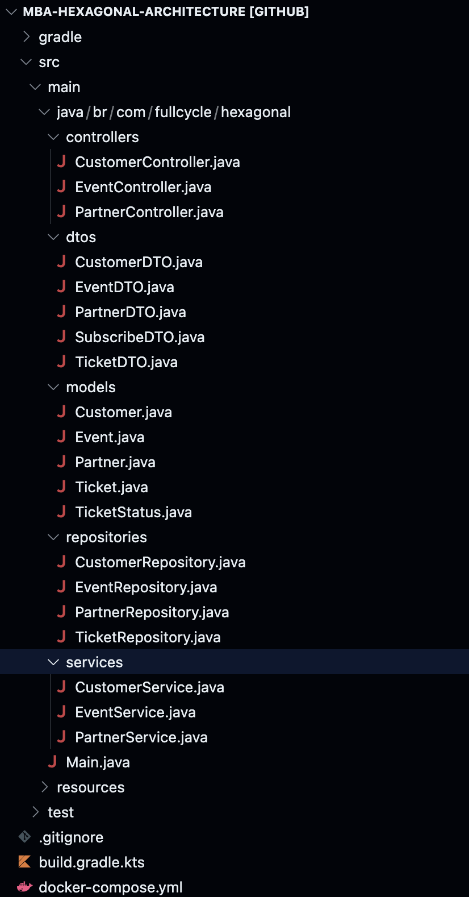

Vamos refatorar um projeto que utiliza spring, [na branch main](fhttps://github.com/devfullcycle/MBA-hexagonal-architecture).

Um servico que é um restapi para compra de tickets de evento. Que está em camadas e utiliza serviceLayers.




A principio um primeiro problema que vemos no codigo, é a quantidade de conteudo no controllers.

Ex: `EventController`

```java
@RestController
@RequestMapping(value = "events")
public class EventController {

    @Autowired
    private CustomerService customerService;

    @Autowired
    private EventService eventService;

    @Autowired
    private PartnerService partnerService;

    @PostMapping
    @ResponseStatus(CREATED)
    public Event create(@RequestBody EventDTO dto) {
        var event = new Event();
        event.setDate(LocalDate.parse(dto.getDate(), DateTimeFormatter.ISO_DATE));
        event.setName(dto.getName());
        event.setTotalSpots(dto.getTotalSpots());

        var partner = partnerService.findById(dto.getPartner().getId());
        if (partner.isEmpty()) {
            throw new RuntimeException("Partner not found");
        }
        event.setPartner(partner.get());

        return eventService.save(event);
    }

    @Transactional
    @PostMapping(value = "/{id}/subscribe")
    public ResponseEntity<?> subscribe(@PathVariable Long id, @RequestBody SubscribeDTO dto) {

        var maybeCustomer = customerService.findById(dto.getCustomerId());
        if (maybeCustomer.isEmpty()) {
            return ResponseEntity.unprocessableEntity().body("Customer not found");
        }

        var maybeEvent = eventService.findById(id);
        if (maybeEvent.isEmpty()) {
            return ResponseEntity.notFound().build();
        }

        var maybeTicket = eventService.findTicketByEventIdAndCustomerId(id, dto.getCustomerId());
        if (maybeTicket.isPresent()) {
            return ResponseEntity.unprocessableEntity().body("Email already registered");
        }

        var customer = maybeCustomer.get();
        var event = maybeEvent.get();

        if (event.getTotalSpots() < event.getTickets().size() + 1) {
            throw new RuntimeException("Event sold out");
        }

        var ticket = new Ticket();
        ticket.setEvent(event);
        ticket.setCustomer(customer);
        ticket.setReservedAt(Instant.now());
        ticket.setStatus(TicketStatus.PENDING);

        event.getTickets().add(ticket);

        eventService.save(event);

        return ResponseEntity.ok(new EventDTO(event));
    }
}
```

Em que por exemplo, caso venhamos a utilizar Uma cli ou graphQl vamos ter que copiar uma grande quantidade de codigo (o subscribe por exemplo, verifica se existe costumer, verifica se existe o evento, etc...)

Vemos tambem que os services acabam sendo um padrao que apenas repassa o conteudo pra frente. Como no exemplo de `EventService`

```java
@Service
public class EventService {

    @Autowired
    private CustomerService customerService;

    @Autowired
    private EventRepository eventRepository;

    @Autowired
    private TicketRepository ticketRepository;

    @Transactional
    public Event save(Event event) {
        return eventRepository.save(event);
    }

    public Optional<Event> findById(Long id) {
        return eventRepository.findById(id);
    }
    
    public Optional<Ticket> findTicketByEventIdAndCustomerId(Long id, Long customerId) {
        return ticketRepository.findByEventIdAndCustomerId(id, customerId);
    }
}
```

# Anatomia de um caso de uso

Um local bom é comecar a extraindo os casos de uso.

Quais os tipo de casos de uso que encontramos? Vamos nesse caso explicitar eles criando classes abstratas(que poderiam ser interfaces). 

Considerando que o caso de uso tem input e output proprio. Não retorna a entidade, o agregado, ou objeto de valor. O caso de uso implementa o padrão Command (Tem apenas um metodo execute)


- Padrao: Recebe um dado e retorna um dado

```java
public abstract class UseCase<INPUT, OUTPUT> {
    public abstract OUTPUT execute(INPUT input);
}
```

- Unit: Recebe um dado e nao retorna

```java
public abstract class UnitUseCase<INPUT> {
    public abstract void execute(INPUT input);
}
```

- Nullary: Nao recebe dado e retorna

```java
package br.com.fullcycle.hexagonal.application.usecases;

public abstract class NullaryUseCase<OUTPUT> {
    public abstract OUTPUT execute();
}
```

Deixando nessa estrutura de pastas

```
br/
 └── com/
     └── fullcycle/
         └── hexagonal/
             └── application/
                 ├── NullaryUseCase
                 ├── UnitUseCase
                 └── UseCase
```

# Extraindo caso de uso createcustumer


Ao criar o primeiro use case `application/usecases/CreateCustomerUseCase` extendemos a classe abstrata `UsecCase` já promvendo um input e output como records

```java
public class CreateCustomerUseCase 
    extends UseCase<CreateCustomerUseCase.Input, CreateCustomerUseCase.Output> {

    @Override
    public Output execute(Input input) {
        return null;
    }

    public record Input(String cpf, String email, String name) {}

    public record Output(Long id, String cpf, String email, String name) {}
}
```

Complementando o useCase

```java
public class CreateCustomerUseCase 
    extends UseCase<CreateCustomerUseCase.Input, CreateCustomerUseCase.Output> {

    @Override
    public Output execute(final Input input) {
        if (customerService.findByCpf(input.cpf).isPresent()) {
            throw new ValidationException("Customer already exists");
        }

        if (customerService.findByEmail(input.email).isPresent()) {
            throw new ValidationException("Customer already exists");
        }

        var customer = new Customer();
        customer.setName(input.name);
        customer.setCpf(input.cpf);
        customer.setEmail(input.email);

        customer = customerService.save(customer);

        return new Output(customer.getId(), customer.getCpf(), customer.getEmail(), customer.getName());
    }

    public record Input(String cpf, String email, String name) {}

    public record Output(Long id, String cpf, String email, String name) {}
}
```


- Por enquanto vamos manter o acomplamento com `CostumerService`.
- Vamos criar um abstracao para uma `ValidationException` que extende a `RuntimeException` ao inves de apensas criar um Runtime
- Mantemos a intanciacao de Custumer por enquqnato
- Retornamos o Output interno


Para o teste do usecase, vamos ter um `CreateCustomerUseCaseTest`

```java
public class CreateCustomerUseCaseTest {

    @Test
    @DisplayName("Deve criar um cliente")
    public void testCreateCustomer() {
        // given
        final var expectedCPF = "12345678901";
        final var expectedEmail = "john.doe@gmail.com";
        final var expectedName = "John Doe";

        final var createInput = new CreateCustomerUseCase.Input(expectedCPF, expectedEmail, expectedName);

        // when
        final var customerService = Mockito.mock(CustomerService.class);
        when(customerService.findByCpf(expectedCPF)).thenReturn(Optional.empty());
        when(customerService.findByEmail(expectedEmail)).thenReturn(Optional.empty());
        when(customerService.save(any())).thenAnswer(a -> {
            var customer = a.getArgument(0, Customer.class);
            customer.setId(UUID.randomUUID().getMostSignificantBits());
            return customer;
        });

        final var useCase = new CreateCustomerUseCase(customerService);
        final var output = useCase.execute(createInput);

        // then
        Assertions.assertNotNull(output.id());
        Assertions.assertEquals(expectedCPF, output.cpf());
        Assertions.assertEquals(expectedEmail, output.email());
        Assertions.assertEquals(expectedName, output.name());
    }
}
```

- Por enquanto vamos manter o service sendo injetado e mockando
- Vamos que criamos o input apenas para o useCase
- Obviamente vamos ter testes para os cenarios de: "Não deve cadastrar um cliente com CPF duplicado" e "Não deve cadastrar um cliente com e-mail duplicado"


Sendo assim agora podemos trocar o Controller para usar o useCase no create

```java
@RestController
@RequestMapping(value = "customers")
public class CustomerController {

    @Autowired
    private CustomerService customerService;

    @PostMapping
    public ResponseEntity<?> create(@RequestBody CustomerDTO dto) {
        try {
            final var useCase = new CreateCustomerUseCase(customerService);
            final var output = useCase.execute(new CreateCustomerUseCase.Input(
                dto.getCpf(), dto.getEmail(), dto.getName()
            ));
            return ResponseEntity.created(URI.create("/customers/" + output.id())).body(output);
        } catch (ValidationException ex) {
            return ResponseEntity.unprocessableEntity().body(ex.getMessage());
        }
    }
}
```

- Por enquanto nao estamos usando injecao de dependencia para o `CreateCustomerUseCase`
- O controller fica com a responsabilidade de converter para o body adequado e responseCodes


Assim como agora podemos ter uma implementacao para GraphQl, utilizando o useCase

```java
```

- Por enquanto nao estamos usando injecao de dependencia para o `CreateCustomerUseCase`


Sendo assim tirar as regras de negocio acopladas ao driver(RestAPI).

- O restApi é o driver
- O caso de uso está expondo a porta
- Que torna o controller um adapter
- Assim como resolver do GraphQl tambem um adapter, que acessa a porta do useCase do createCostumer