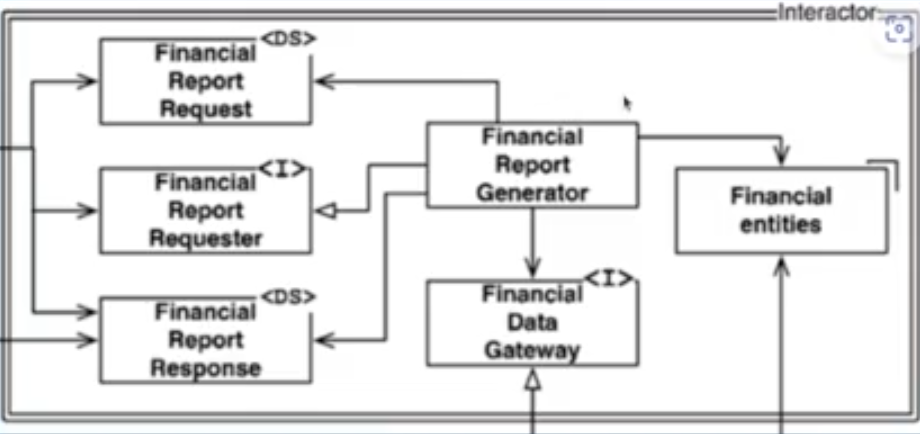
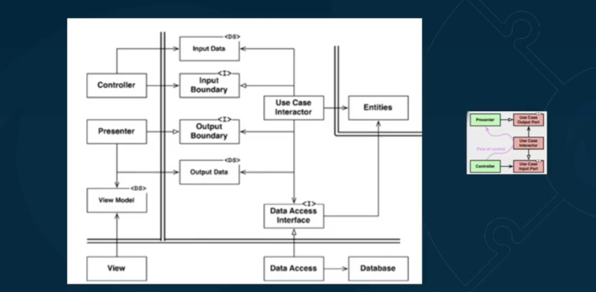

Mais uma domain centric architeture

Tem muita coisa parecida ports and adpaters

Tem 4 camadas

# Principais termos

- Entities
    - Ou enterprise businesse rule
    - entidade de dominio
        - Nessa epoca existia o conceito de lib de regra de negocio, em contrato com caso de uso que sao regras da aplicacao
- Use Case interactors
    - REgras de negocio da aplicacao
- Controllers
    - Visao por mundo web
    - Nao tem acoplamento com framework
- Presenter
    - maneira de converter um output do caso de uso para um estrutura do munodo externo
- Gateway
    - O que conhecido no hexagonal como repository
    - Interface com mundo externo
    - Da pra trabalhar como uma mistura de gateway e repository (mapeando agregado)
- Framework and Drivers
    - Unica layar que deveria ser acoplado a framework

Diferenca entre Enterprise business rules e Application business rules

Ex: Nota fiscal 
- Emissor da nota fiscar nao pode o mesmo do tomador, essa regra é da bussiness...
- Nota fiscal nao pode ter valor, porem essa validacao pode ser a nivel de aplicacao por confiamos em regras internas

# Principais conceitos

- Data Mappers
    - Implemntacao do gateway (repository)

- Humble Object Pattern
    - FAcilitar teste de dependencia dificil

- Screaming Architecture
    - Conceito importante - Sua arquiterura deveria dizer(deixar claro) aos leitores os caso de uso e nao o framework.
    - Assim com uma planta de uma casa
    - Organizar nomes mais claros
- The Dependency Rule
    - acoplamento sempre da camada e fora pra de dentro
    - so é possivel atravez da inversao dependencia

- Application Business Rules
    - regras especifica da aplicacao
- Enterprise Business Rules
- Isolar casos de uso, entidades e interface adapters de frameworks e bibliotecas externas
    - Pode acontecer vista grossa para algumas libs (Lombok por exemplo). como construcoes que faltam na linguagem

# Digarama de classes

Esse seria o diagama da Enterprise bussines rule

- Financial Report generator seria o caso de uso (arquivo principal)
- Que implmenta uma interface Financial Report requester que é quem é acoplado no controller
- Dementa uma estrutura de dados de entrada Financial report request
- demanda uma estrutura de dados de saida Financial report response
- Pode estar acoplado a uma interface que é um gateway fincancial data gateway
- E esta acoplado a entidades Financial entities

depois disso tempos controller (em interface adapters)
- Fazem meio de campo entre framework e caso de caso
- Conhece bem saida e entrada
- Nessa versao o presenter ta fora da camada de caso de uso

Layer de database
- temos a implementacao do gateway e o acesso ao database em si

Na vcamanda de presenter temos a implentacao da interface (que pode estar na camada de caso de uso)

# Diagrama de classes e Flow control

# Entidades e sua relativitizacao

- Modelo anemico
    - Vem linguagem orientado a objeto, classe sem comportamento...
    - Regras do modelo vazadas para outro lugar
    - Para fugir usamos domain model
    - vamos ter por exemplo para JPA
- Relacionamento entre entidades
    - Agregado se vincula a outra apenas pelo ID
    - Se estamos falando de uma raiz de agregacao que tem um entidade nela, ai a relacao é pela entidade inteira
    - Razao para isso: tambem relacionado na forma com que isso é armazenado
- Posso utilizar libs externa no domain
    - A principio nao, porem ok para funcionalidades que ajudam em algo que nao tem na linguagem
- Entidades de dominio vs entidade JPA
    - Uma coisa nao tem nada a ver com a outra
    - Nao podemos dar caracteristicas de banco para entidades de domini
- Ate onde usar DTO/Data structure
    - Em entrada e saida de caso de uso por exemplo
    - Entrada e saida de controller/presenters
    - E nunca dominio

# Usecases e suas controversias