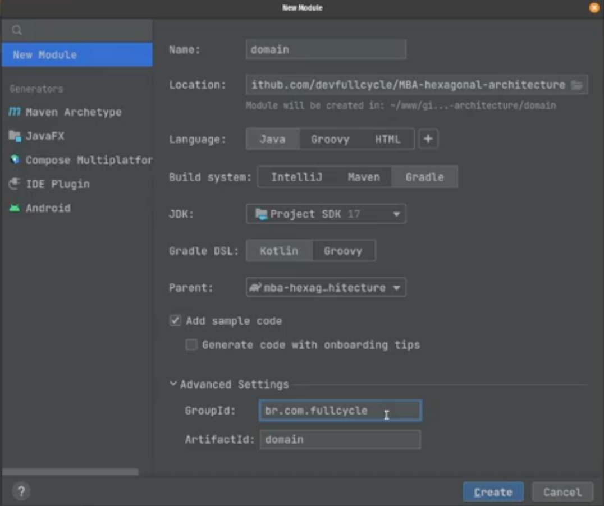
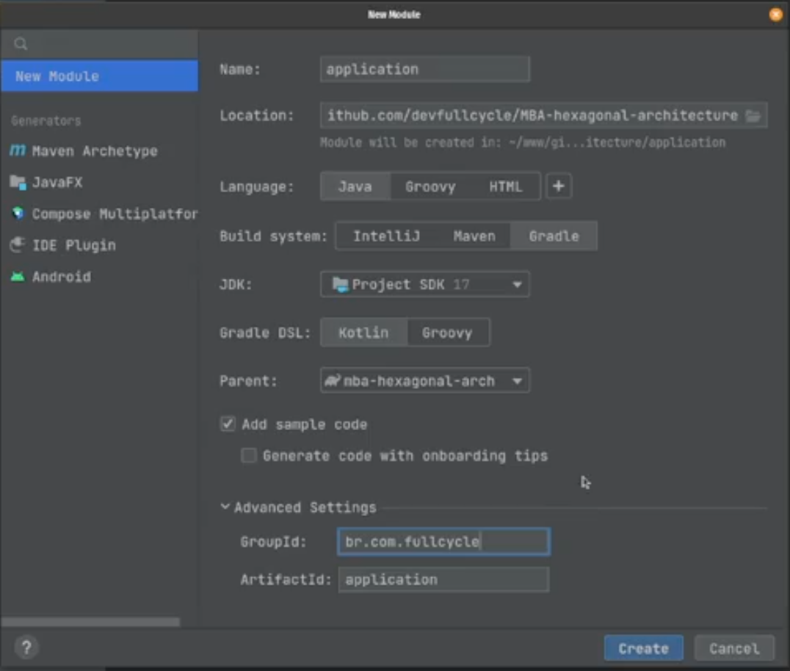

Link do [repo](https://github.com/devfullcycle/MBA-hexagonal-architecture/tree/clean-arch) a ser refatorado tendo como origem o conteudo anterior do modulo de arquiteura hexagonal na sua branch correspondente

Utilizando java mais spring é dificil fazer toda separacao proposta na teoria, pois o spring tenta cobrir de ponta a pontas com funcionalidades. Gestao de dependencias, web router, persistencia...


# Segregando as camadas de domain e application

- Podemos criar um modulo novo em na raiz chamado `domain` escolhendo build system gradle com DSL do kotlin


Nao precisamos de pastas resources que pode ser apagaga do modulo domain junto com o arquivo main
E podemos mover toda a folder `src/main/java/br/com/fullcycle/hexagonal/application/domain` para `domain/src/main/java/br/com/fullcycle/domain` movendo os testes tambem.

- Apos isso criar um module `application`


Movendo o restante que ficou em `src/main/java/br/com/fullcycle/hexagonal/application` para la `repositories` e `usecases`, deixando eles em `application/src/main/java/br/com/fullcycle/application`, sendo desnecessario manter o diretorio `usecases`. Copiando tambem os testes (apenas os integrados)

Uma boa pratica tambem deixar as interfaces do repository dentro do domain, junto com sua entidade correspondente

Como os testes do module application vao precisar de entidades na classe de domain vamos precisar de importar a dependencia. 

```
dependencies {
    implementation(project(":domain"))
}
```


# Segregando as camadas de infrastructure

- Podemos criar um modulo novo `infrastructure` 
Movendo todo conteudo de `src/main/java/br/com/fullcycle/hexagonal/infrastructure` para `infrastructure/src/main/java/br/com/fullcycle/infrastructure`.

Tambem copiando e conteudo do `build.gradle.tks` para o modulo infrastructure.

E copiar tambem os testes.

O `src` restante que estava na raiz nao sera mais necessario

O arquivo `settings.grafle.tks` deve ficar correto:

```
rootProject.name = "mba-hexagonal-arch"
include("domain")
include("application")
include("infrastructure")
```

E o `build.gradle.tks` de `infrastructure` deve incluir como dependencia `domain` e `application`

```
dependencies {
    implementation(project(":domain"))
    implementation(project(":application"))

    implementation("io.hypersistence:hypersistence-tsid:2.1.0")
    implementation("org.springframework.boot:spring-boot-starter-data-jpa")
    implementation("org.springframework.boot:spring-boot-starter-graphql")
    implementation("org.springframework.boot:spring-boot-starter-web")

    implementation("jakarta.inject:jakarta.inject-api:2.0.1")

    runtimeOnly("com.mysql:mysql-connector-j")

    testImplementation("org.springframework.boot:spring-boot-starter-test")
    testImplementation("org.springframework:spring-webflux")
    testImplementation("org.springframework.graphql:spring-graphql-test")

    testRuntimeOnly("com.h2database:h2")
}
```


Vamos criar um novo diretorio chamado `buildSrc` em que vamos criar um `buil.gradle.kts`

```
plugins {
    `kotlin-dsl`
}

version = "0.0.1-SNAPSHOT"

java {
    targetCompatibility = JavaVersion.VERSION_17
    sourceCompatibility = JavaVersion.VERSION_17
}

repositories {
    mavenCentral()
}
```

- vamos criar script otimizados de build do gradle, porem utilizando dsl do kotlin
- Todos os modules tem targetCompatibility e sourceCompatibility
- mesma coisa para o version e o repositories com mavenCentral
- Podemos tirar esses itens dos build.gradle do outros arquivos no modules

Tambem vamos criar outro arquivo `buildSrc/src/main/kotlin/java-conventions.gradle.kts` com conteudo:

```
plugins {
    java
    jacoco
}

java {
    targetCompatibility = JavaVersion.VERSION_17
    sourceCompatibility = JavaVersion.VERSION_17
}

repositories {
    mavenCentral()
}

dependencies {
    testImplementation(platform("org.junit:junit-bom:5.9.1"))
    testImplementation("org.junit.jupiter:junit-jupiter")
}

jacoco {
    toolVersion = "0.8.9"
}

tasks.test {
    useJUnitPlatform()
}
```

- Que vai utilizar essa config em tudo que importar esse arquivo
- java e jacoco todos projetos precisam. jacoco é para cobertura


Dessa forma podemos ajustar `application/build.gradle.kts` do modulo de application para ficar:

```
plugins {
    `java-conventions`
    `java-library`
}

group = "br.com.fullcycle.application"

dependencies {
    implementation(project(":domain"))
}
```

O `domain/build.gradle.kts` pado modulo de domain para ficar

```
plugins {
    `java-conventions`
    `java-library`
}

group = "br.com.fullcycle.domain"
```

O `infrastructure/build.gradle.kts` do modulo de infrastructure para ficar

```
plugins {
    java
    `java-conventions`
    `jacoco-report-aggregation`
    id("org.springframework.boot") version "3.1.2"
    id("io.spring.dependency-management") version "1.1.2"
}

group = "br.com.fullcycle.infrastructure"

tasks.bootJar {
    archiveBaseName.set("application")
    destinationDirectory.set(file("${rootProject.buildDir}/libs"))
}

dependencies {
    implementation(project(":domain"))
    implementation(project(":application"))

    implementation("io.hypersistence:hypersistence-tsid:2.1.0")
    implementation("org.springframework.boot:spring-boot-starter-data-jpa")
    implementation("org.springframework.boot:spring-boot-starter-graphql")
    implementation("org.springframework.boot:spring-boot-starter-web")

    implementation("jakarta.inject:jakarta.inject-api:2.0.1")

    runtimeOnly("com.mysql:mysql-connector-j")

    testImplementation("org.springframework.boot:spring-boot-starter-test")
    testImplementation("org.springframework:spring-webflux")
    testImplementation("org.springframework.graphql:spring-graphql-test")

    testRuntimeOnly("com.h2database:h2")
}

tasks.testCodeCoverageReport {
    reports {
        xml.required.set(true)
        xml.outputLocation.set(file("$rootDir/build/reports/jacoco/test/jacocoTestReport.xml"))

        html.required.set(true)
        html.outputLocation.set(file("$rootDir/build/reports/jacoco/test/"))
    }
}

tasks.named("jacocoTestReport") {
    dependsOn(tasks.named<JacocoReport>("testCodeCoverageReport"))
}
```

- Trazendo o java-conventions
- Incluir o `jacoco-report-aggregation` que vai fazer gerar a fusao dos relatorios de cobertura de teste de cada module
- Devemos costumizar o arquivo bootJar tambem
- Criando tasks para fazer o report do code coverage
- Observando que o spring está como dependencia nesse module


//TODO: Saber mais sobre kotlin tks, 

# Adicionando suporte ao padrão presenter

Em casos que faz sentido utilizar presenter é poosivel adicionar dessa maneira.

Criar no module de aplication uma interface para isso em `application/src/main/java/br/com/fullcycle/application/Presenter.java`

```java
package br.com.fullcycle.application;

public interface Presenter<IN, OUT> {

    OUT present(IN input);

    OUT present(Throwable error);
}
```

- Estamos deixando um presenter generico de `IN` e `OUT`
- Metodo que retorna um `OUT` apos receber um `IN`

Em que vamos utilizar eles nos use cases, em que podemos mudar a classe abstrata `application/src/main/java/br/com/fullcycle/application/UseCase.java`

```java
package br.com.fullcycle.application;

public abstract class UseCase<INPUT, OUTPUT> {

    // 1. Cada caso de uso tem um Input e um Output próprio. Não retorna a entidade, o agregado, ou objeto de valor.
    // 2. O caso de uso implementa o padrão Command

    public abstract OUTPUT execute(INPUT input);

    public <T> T execute(INPUT input, Presenter<OUTPUT, T> presenter) {
        try {
            return presenter.present(execute(input));
        } catch (Throwable t) {
            return presenter.present(t);
        }
    }
}
```
- Criamos um metodo abstrato que espera receber um presenter junto com o input
- Esse presenter vai ser de Output do usecase como tipo generico e de um T novo, que tambem será retorno nesse execute
- Podemos obviamente fazer as mesma aplicacoes para os outros tipos de usecase 

Para utilizar vamos implementar no module de `infrastructure` criando por exemplo 2 presenters em `infrastructure/src/main/java/br/com/fullcycle/infrastructure/rest/presenters`

`GetCustomerByIdResponseEntity`

```java
import java.util.Optional;

@Component("privateGetCustomer")
public class GetCustomerByIdResponseEntity implements Presenter<Optional<GetCustomerByIdUseCase.Output>, Object> {

    private static final Logger LOG = LoggerFactory.getLogger(GetCustomerByIdResponseEntity.class);

    @Override
    public ResponseEntity<?> present(final Optional<GetCustomerByIdUseCase.Output> output) {
        return output.map(ResponseEntity::ok)
                .orElseGet(ResponseEntity.notFound()::build);
    }

    @Override
    public ResponseEntity<?> present(Throwable error) {
        LOG.error("An error was observer at GetCustomerByIdUseCase", error);
        return ResponseEntity.notFound().build();
    }
}
```

`PublicGetCustomerByIdString`

```java
@Component("publicGetCustomer")
public class PublicGetCustomerByIdString implements Presenter<Optional<GetCustomerByIdUseCase.Output>, Object> {

    private static final Logger LOG = LoggerFactory.getLogger(PublicGetCustomerByIdString.class);

    @Override
    public String present(final Optional<GetCustomerByIdUseCase.Output> output) {
        return output.map(o -> o.id())
                .orElseGet(() -> "not found");
    }

    @Override
    public String present(Throwable error) {
        LOG.error("An error was observer at GetCustomerByIdUseCase", error);
        return "not found";
    }
}
```

E utilizar no `CustomerController`

```java
@RestController
@RequestMapping(value = "customers")
public class CustomerController {

    private final CreateCustomerUseCase createCustomerUseCase;
    private final GetCustomerByIdUseCase getCustomerByIdUseCase;
    private final Presenter<Optional<GetCustomerByIdUseCase.Output>, Object> publicGetCustomerPresenter;
    private final Presenter<Optional<GetCustomerByIdUseCase.Output>, Object> privateGetCustomerPresenter;

    public CustomerController(
            final CreateCustomerUseCase createCustomerUseCase,
            final GetCustomerByIdUseCase getCustomerByIdUseCase,
            final Presenter<Optional<GetCustomerByIdUseCase.Output>, Object> privateGetCustomer,
            final Presenter<Optional<GetCustomerByIdUseCase.Output>, Object> publicGetCustomer
    ) {
        this.publicGetCustomerPresenter = publicGetCustomer;
        this.privateGetCustomerPresenter = privateGetCustomer;
        this.createCustomerUseCase = Objects.requireNonNull(createCustomerUseCase);
        this.getCustomerByIdUseCase = Objects.requireNonNull(getCustomerByIdUseCase);
    }

    ...

    @GetMapping("/{id}")
    public Object get(@PathVariable String id, @RequestHeader(name = "X-Public", required = false) String xPublic) {
        Presenter<Optional<GetCustomerByIdUseCase.Output>, Object> presenter = privateGetCustomerPresenter;

        if (xPublic != null) {
            presenter = publicGetCustomerPresenter;
        }

        return getCustomerByIdUseCase.execute(new GetCustomerByIdUseCase.Input(id), presenter);
    }
}
```

- Podemos ver é o presenter é passado para o novo execute criado no usecase
- Usamos qualifiers para importar a bean por sao 2 do mesmo tipo
- Dependendo do header escolhemos qual presenter utilizar
- Podemos nao utilizar injecao de dependencia instanciando diretamente no controller sem problemas (uncle bob indica instanciar, mas nao parece nao ter muita necessidade)

# Separando frameworks and drivers de interface adapters

# Aplicando eventos de domínio para desacoplar agregados

Vamos usar Domain events para resolver a questao do use case `SubscribeCustomerToEventUseCase` que altera 2 repos (causando a anotacao `transactional` tambem)

```java
        ticketRepository.create(ticket);
        eventRepository.update(anEvent);
```

- A longo prazo essa persistencia poderia ser desacoplada, entao seria um problema

Uma coisa importante primeiro, é criar um pk em `EventTicket` propria que nao dependa de ticket em si

```java
public class EventTicket {

    private final EventTicketId eventTicketId;
    private final EventId eventId;
    private final CustomerId customerId;
    private TicketId ticketId;
    private int ordering;

    public EventTicket(final EventTicketId eventTicketId, final EventId eventId, final CustomerId customerId, final TicketId ticketId, final Integer ordering) {
        if (eventTicketId == null) {
            throw new ValidationException("Invalid eventTicketId for EventTicket");
        }

        if (eventId == null) {
            throw new ValidationException("Invalid eventId for EventTicket");
        }

        if (customerId == null) {
            throw new ValidationException("Invalid customerId for EventTicket");
        }

        this.eventTicketId = eventTicketId;
        this.eventId = eventId;
        this.customerId = customerId;
        this.ticketId = ticketId;
        this.setOrdering(ordering);
    }

    public static EventTicket newTicket(final EventId eventId, final CustomerId customerId, final int ordering) {
        return new EventTicket(EventTicketId.unique(), eventId, customerId, null, ordering);
    }

    public EventTicket associateTicket(final TicketId aTicket) {
        this.ticketId = aTicket;
        return this;
    }

    public EventTicketId eventTicketId() {
        return eventTicketId;
    }

    public TicketId ticketId() {
        return ticketId;
    }

    public EventId eventId() {
        return eventId;
    }

    public int ordering() {
        return ordering;
    }

    public CustomerId customerId() {
        return customerId;
    }

    private void setOrdering(final Integer ordering) {
        if (ordering == null) {
            throw new ValidationException("Invalid ordering for EventTicket");
        }

        this.ordering = ordering;
    }
}
```

- Claro que vamos precisar mudar a entidade do JPA tambem

```java
package br.com.fullcycle.infrastructure.jpa.entities;

import br.com.fullcycle.domain.customer.CustomerId;
import br.com.fullcycle.domain.event.EventId;
import br.com.fullcycle.domain.event.EventTicket;
import br.com.fullcycle.domain.event.EventTicketId;
import br.com.fullcycle.domain.event.ticket.TicketId;
import jakarta.persistence.*;

import java.util.Objects;
import java.util.UUID;

@Entity(name = "EventTicket")
@Table(name = "events_tickets")
public class EventTicketEntity {

    @Id
    private UUID eventTicketId;

    private UUID ticketId;

    private UUID customerId;

    private int ordering;

    @ManyToOne(fetch = FetchType.LAZY)
    private EventEntity event;

    public EventTicketEntity() {
    }

    public EventTicketEntity(
            final UUID eventTicketId,
            final UUID customerId,
            final int ordering,
            final UUID ticketId,
            final EventEntity event
    ) {
        this.eventTicketId = eventTicketId;
        this.ticketId = ticketId;
        this.customerId = customerId;
        this.event = event;
        this.ordering = ordering;
    }

    public static EventTicketEntity of(final EventEntity event, final EventTicket ev) {
        return new EventTicketEntity(
                UUID.fromString(ev.eventTicketId().value()),
                UUID.fromString(ev.customerId().value()),
                ev.ordering(),
                ev.ticketId() != null ? UUID.fromString(ev.ticketId().value()) : null,
                event
        );
    }

    public EventTicket toEventTicket() {
        return new EventTicket(
                EventTicketId.with(eventTicketId.toString()),
                EventId.with(this.event.id().toString()),
                CustomerId.with(this.customerId.toString()),
                this.ticketId != null ? TicketId.with(this.ticketId.toString()) : null,
                this.ordering
        );
    }

    public UUID eventTicketId() {
        return eventTicketId;
    }

    public void setEventTicketId(UUID eventTicketId) {
        this.eventTicketId = eventTicketId;
    }

    public UUID ticketId() {
        return ticketId;
    }

    public void setTicketId(UUID ticketId) {
        this.ticketId = ticketId;
    }

    public UUID customerId() {
        return customerId;
    }

    public void setCustomerId(UUID customerId) {
        this.customerId = customerId;
    }

    public int ordering() {
        return ordering;
    }

    public void setOrdering(int ordering) {
        this.ordering = ordering;
    }

    public EventEntity event() {
        return event;
    }

    public void setEvent(EventEntity event) {
        this.event = event;
    }

    @Override
    public boolean equals(Object o) {
        if (this == o) return true;
        if (o == null || getClass() != o.getClass()) return false;
        EventTicketEntity that = (EventTicketEntity) o;
        return Objects.equals(eventTicketId, that.eventTicketId);
    }

    @Override
    public int hashCode() {
        return Objects.hash(eventTicketId);
    }
}

```

Assim dentro de `Event` vamos fazer 2 mudar a para `reserveTicket` chamar as modifacoes e ainda chamar disparar um domain event (controlando uma lista de domain events)

```java

public class Event {

    private static final int ONE = 1;

    private final EventId eventId;
    private final Set<EventTicket> tickets;
    private final Set<DomainEvent> domainEvents;

    private Name name;
    private LocalDate date;
    private int totalSpots;
    private PartnerId partnerId;

    public Event(
            final EventId eventId,
            final String name,
            final String date,
            final Integer totalSpots,
            final PartnerId partnerId,
            final Set<EventTicket> tickets
    ) {
        this(eventId, tickets);
        this.setName(name);
        this.setDate(date);
        this.setTotalSpots(totalSpots);
        this.setPartnerId(partnerId);
    }

    ... 
    private Event(final EventId eventId, final Set<EventTicket> tickets) {
        if (eventId == null) {
            throw new ValidationException("Invalid eventId for Event");
        }

        this.eventId = eventId;
        this.tickets = tickets != null ? tickets : new HashSet<>(0);
        this.domainEvents = new HashSet<>(2);
    }

    public EventTicket reserveTicket(final CustomerId aCustomerId) {
        this.allTickets().stream()
                .filter(it -> Objects.equals(it.customerId(), aCustomerId))
                .findFirst()
                .ifPresent(it -> {
                    throw new ValidationException("Email already registered");
                });

        if (totalSpots() < allTickets().size() + ONE) {
            throw new ValidationException("Event sold out");
        }

        final var aTicket =
                EventTicket.newTicket(eventId(), aCustomerId, allTickets().size() + 1);

        this.tickets.add(aTicket);
        this.domainEvents.add(new EventTicketReserved(aTicket.eventTicketId(), eventId(), aCustomerId));

        return aTicket;
    }

    public Set<DomainEvent> allDomainEvents() {
        return Collections.unmodifiableSet(domainEvents);
    }

    ....
}
```

Para isso temos a estrutura com a enitadade de DomainEvent: `domain/src/main/java/br/com/fullcycle/domain/DomainEvent.java`

```java
public interface DomainEvent {

    String domainEventId();

    String type();

    Instant occurredOn();
}

```

E a primeira implementacao de um especifico `domain/src/main/java/br/com/fullcycle/domain/event/EventTicketReserved.java`

```java
public record EventTicketReserved(
        String domainEventId,
        String type,
        String eventTicketId,
        String eventId,
        String customerId,
        Instant occurredOn
) implements DomainEvent {

    public EventTicketReserved(EventTicketId eventTicketId, EventId eventId, CustomerId customerId) {
        this(UUID.randomUUID().toString(), "event-ticket.reserved", eventTicketId.value(), eventId.value(), customerId.value(), Instant.now());
    }
}
```

E o caso de uso pode ser ajustado para remocao de um repositorio

```java
package br.com.fullcycle.application.event;

import br.com.fullcycle.application.UseCase;
import br.com.fullcycle.domain.customer.CustomerId;
import br.com.fullcycle.domain.customer.CustomerRepository;
import br.com.fullcycle.domain.event.EventId;
import br.com.fullcycle.domain.event.EventRepository;
import br.com.fullcycle.domain.event.EventTicket;
import br.com.fullcycle.domain.event.ticket.TicketRepository;
import br.com.fullcycle.domain.exceptions.ValidationException;

import java.time.Instant;
import java.util.Objects;

public class SubscribeCustomerToEventUseCase extends UseCase<SubscribeCustomerToEventUseCase.Input, SubscribeCustomerToEventUseCase.Output> {

    private final CustomerRepository customerRepository;
    private final EventRepository eventRepository;

    public SubscribeCustomerToEventUseCase(
            final CustomerRepository customerRepository,
            final EventRepository eventRepository
    ) {
        this.customerRepository = Objects.requireNonNull(customerRepository);
        this.eventRepository = Objects.requireNonNull(eventRepository);
    }

    @Override
    public Output execute(final Input input) {
        var aCustomer = customerRepository.customerOfId(CustomerId.with(input.customerId()))
                .orElseThrow(() -> new ValidationException("Customer not found"));

        var anEvent = eventRepository.eventOfId(EventId.with(input.eventId()))
                .orElseThrow(() -> new ValidationException("Event not found"));

        final EventTicket ticket = anEvent.reserveTicket(aCustomer.customerId());

        eventRepository.update(anEvent);

        return new Output(anEvent.eventId().value(), ticket.eventTicketId().value(), Instant.now());
    }

    public record Input(String customerId, String eventId) {
    }

    public record Output(String eventId, String eventTicketId, Instant reservationDate) {
    }
}
```

Falta agora lidar com o broker. Vamos utilizar o outbox pattern ao inves de ja enviar o evento antes na persistencia de alguma forma.

Vamos entao na hora de persistir o vamos usar um outbox table que depois vai pegar o registro e enviar para o broker

Vamos criar entao um `OutboxEntity`

```java
@Entity(name = "Outbox")
@Table(name = "outbox")
public class OutboxEntity {

    @Id
    private UUID id;

    @Column(columnDefinition = "JSON", length = 4_000)
    private String content;

    private boolean published;

    public OutboxEntity() {
    }

    public OutboxEntity(UUID id, String content, boolean published) {
        this.id = id;
        this.content = content;
        this.published = published;
    }

    public static OutboxEntity of(final DomainEvent domainEvent, final Function<DomainEvent, String> toJson) {
        return new OutboxEntity(
                UUID.fromString(domainEvent.domainEventId()),
                toJson.apply(domainEvent),
                false
        );
    }

    public UUID id() {
        return id;
    }

    public void setId(UUID id) {
        this.id = id;
    }

    public String content() {
        return content;
    }

    public void setContent(String content) {
        this.content = content;
    }

    public boolean published() {
        return published;
    }

    public void setPublished(boolean published) {
        this.published = published;
    }

    @Override
    public boolean equals(Object o) {
        if (this == o) return true;
        if (o == null || getClass() != o.getClass()) return false;
        OutboxEntity that = (OutboxEntity) o;
        return Objects.equals(id, that.id);
    }

    @Override
    public int hashCode() {
        return Objects.hash(id);
    }

    public OutboxEntity notePublished() {
        this.published = true;
        return this;
    }
}
```

- Criado a partir de um `DomainEvent`


Vamos ajustar o `EventDatabaseRepository`

```java
// Interface Adapter
@Component
public class EventDatabaseRepository implements EventRepository {

    private final EventJpaRepository eventJpaRepository;
    private final OutboxJpaRepository outboxJpaRepository;
    private final ObjectMapper mapper;

    public EventDatabaseRepository(
            final EventJpaRepository EventJpaRepository,
            final OutboxJpaRepository outboxJpaRepository,
            final ObjectMapper mapper
    ) {
        this.eventJpaRepository = Objects.requireNonNull(EventJpaRepository);
        this.outboxJpaRepository = outboxJpaRepository;
        this.mapper = mapper;
    }

    @Override
    public Optional<Event> eventOfId(final EventId anId) {
        Objects.requireNonNull(anId, "id cannot be null");
        return this.eventJpaRepository.findById(UUID.fromString(anId.value()))
                .map(EventEntity::toEvent);
    }

    @Override
    @Transactional
    public Event create(final Event event) {
        return save(event);
    }

    @Override
    @Transactional
    public Event update(Event event) {
        return save(event);
    }

    @Override
    public void deleteAll() {
        this.eventJpaRepository.deleteAll();
    }

    private Event save(Event event) {
        this.outboxJpaRepository.saveAll(
                event.allDomainEvents().stream()
                        .map(it -> OutboxEntity.of(it, this::toJson))
                        .toList()
        );

        return this.eventJpaRepository.save(EventEntity.of(event))
                .toEvent();
    }

    private String toJson(DomainEvent domainEvent) {
        try {
            return this.mapper.writeValueAsString(domainEvent);
        } catch (JsonProcessingException e) {
            throw new RuntimeException(e);
        }
    }
}
```

- Incluimos a dependencia de um `OutboxJpaRepository`
- Colocamos aqui uma serializacao a ser passada para o `OutboxEntity` que usa objectMapper


Sendo que o `OutboxJpaRepository` ficaria

```java

public interface OutboxJpaRepository extends CrudRepository<OutboxEntity, UUID> {

    @Lock(LockModeType.PESSIMISTIC_WRITE)
    @QueryHints({
            @QueryHint(name = "jakarta.persistence.lock.timeout", value = "2")
    })
    List<OutboxEntity> findTop100ByPublishedFalse();
}
```

# Event Driven architecture para finalizar o fluxo

Para fazer um relay de forma simples (usando a mesma app para executar um job), vamos habilitar `EnableScheduling` na main


```java
@EnableScheduling
@SpringBootApplication
public class Main {

	public static void main(String[] args) {
		SpringApplication.run(Main.class, args);
	}
}
```

Vamos criar um `infrastructure/src/main/java/br/com/fullcycle/infrastructure/job/OutboxRelay.java`

```java
@Component
public class OutboxRelay {

    private final OutboxJpaRepository outboxJpaRepository;
    private final QueueGateway queueGateway;

    public OutboxRelay(final OutboxJpaRepository outboxJpaRepository, final QueueGateway queueGateway) {
        this.outboxJpaRepository = outboxJpaRepository;
        this.queueGateway = queueGateway;
    }

    @Scheduled(fixedRate = 2_000)
    @Transactional
    void execute() {
        this.outboxJpaRepository.findTop100ByPublishedFalse()
                .forEach(it -> {
                    this.queueGateway.publish(it.content());
                    this.outboxJpaRepository.save(it.notePublished());
                });
    }
}
```

- Em que será o que entrypoint schedulado
- Injeta o repositorio que obtem o repo do outbox criado anteriormente
- com um gateway que publica as mensagens
- e salva no repositorio de novo mas marcando a mensagem como publicada modificando sua entidade do JPA


Sobre a injecao criamos uma interface de gateway `infrastructure/src/main/java/br/com/fullcycle/infrastructure/gateways/QueueGateway.java`

```java
package br.com.fullcycle.infrastructure.gateways;

public interface QueueGateway {
    void publish(String content);
}
```

//TODO: ver sobre isso no repository, o que foi chamado de trabalhar de forma atomica
```java
    @Lock(LockModeType.PESSIMISTIC_WRITE)
    @QueryHints({
            @QueryHint(name = "jakarta.persistence.lock.timeout", value = "2")
    })
```

Precisamos configurar o queueExecutor, para quando utilizarmos a anotacao async, de forma a ternoar um thread pool. Entao criamos `infrastructure/src/main/java/br/com/fullcycle/infrastructure/configurations/OutboxConfig.java`

```java
@Configuration
public class OutboxConfig {

    @Bean
    public TaskExecutor queueExecutor() {
        var executor = new ThreadPoolTaskExecutor();
        executor.setQueueCapacity(200);
        executor.setMaxPoolSize(Runtime.getRuntime().availableProcessors() * 4);
        executor.setCorePoolSize(2);
        return executor;
    }
}
```

E a implementacao simples do QueueGateway podemos implementar com `infrastructure/src/main/java/br/com/fullcycle/infrastructure/gateways/ConsumerQueueGateway.java`

```java
@Component
public class ConsumerQueueGateway implements QueueGateway {

    private final CreateTicketForCustomerUseCase createTicketForCustomerUseCase;
    private final ObjectMapper mapper;

    public ConsumerQueueGateway(final CreateTicketForCustomerUseCase createTicketForCustomerUseCase, final ObjectMapper mapper) {
        this.createTicketForCustomerUseCase = Objects.requireNonNull(createTicketForCustomerUseCase);
        this.mapper = Objects.requireNonNull(mapper);
    }

    @Async(value = "queueExecutor")
    @Override
    public void publish(final String content) {
        if (content == null) {
            return;
        }

        if (content.contains("event-ticket.reserved")) {
            final var dto = safeRead(content, EventTicketReserved.class);
            this.createTicketForCustomerUseCase.execute(new CreateTicketForCustomerUseCase.Input(dto.eventTicketId(), dto.eventId(), dto.customerId()));
        }
    }

    private <T> T safeRead(final String content, final Class<T> tClass) {
        try {
            return this.mapper.readValue(content, tClass);
        } catch (JsonProcessingException e) {
            throw new RuntimeException(e);
        }
    }
}

```

- Implementacao simples que represntaria a utilizacao de um broker
- Chamada direta de um UseCase apos reconhecer o evento correto

# Uso dos gateways x repositories

Para o Uncle bob a porta de saida do application bussines rules sao os gateways. No nosso caso usamos repositories (que vem do DDD).

O gateway é o padrao para acessar qualquer recurso fora da aplicacao

- Poderiamos por exemplo usar o gateway para acesso a cache por exemplo tambem (a ser utilizada na application bussines rules layer)
- Filesytem, outro tipo de storage...
