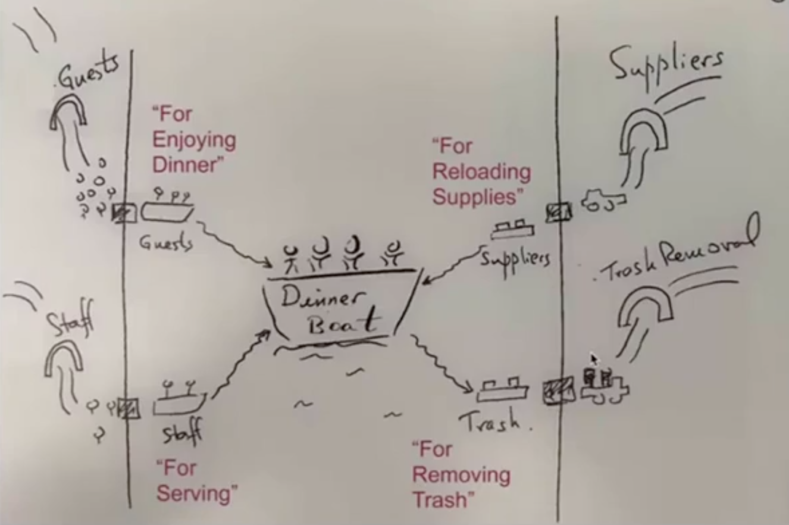

Como por isso em sofware?
Dock e entradas diferentes para cada pessoa(confidados, funcionario) e necessidade(pegar material ou jogar lixo fora)

Hexagonal nao importa como vc organiza dentro do hexagono(o Domain), se usa DDD, clean... O importante é ter as portas

Adapters tem que estar fora da aplicacao

- Porta é uma razao o intencao para uma conversa

