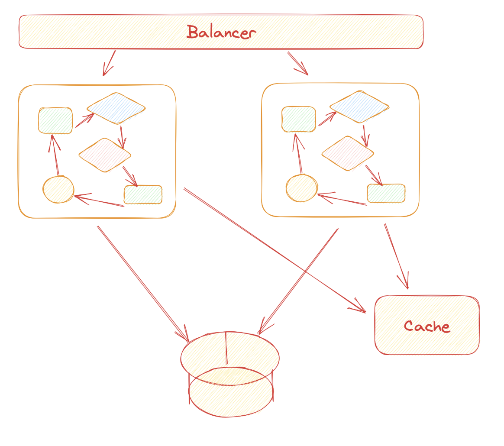
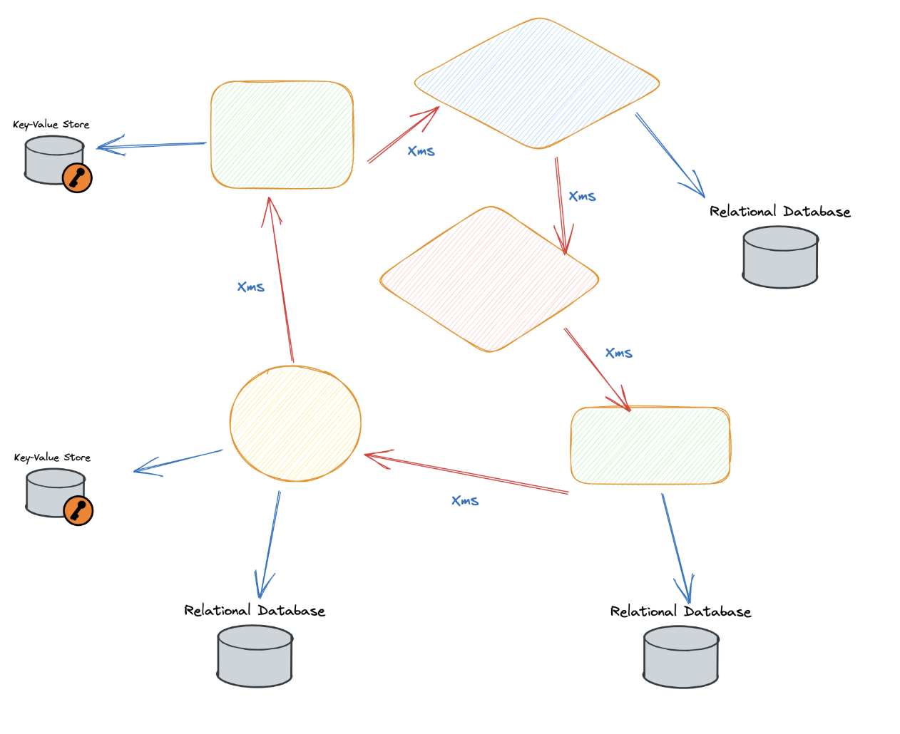
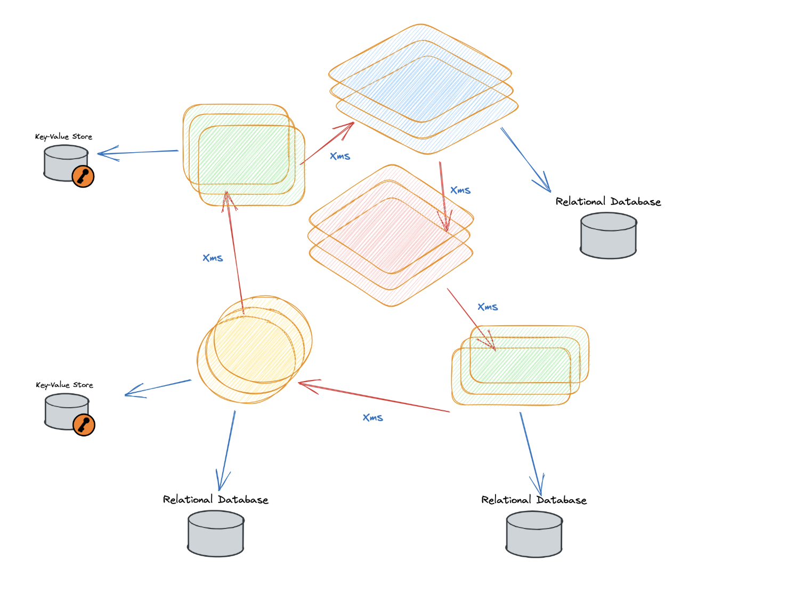
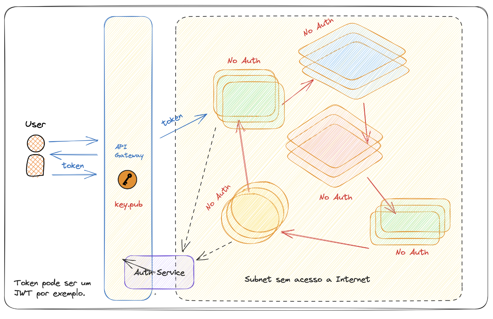

# Monolito classico

Quando estamos falando de monolito classico que dentro temos diversos componentes(modulos, classes)

conforme a demanda escalamos horizontalmente(mais maquina)

Com pontos importantes como

- Disco efemero
- Logs devem ser "uploadados"
- Sessoes do usuarios nao podem ficar armezanados em disco
- Não armazenar estado

# Twelve factor app

https://12factor.net/pt_br

Guidelines focados principalmente e nao manter estado..

- Codebase
    - User sistema de versionamento de codigo
- Dependencias
    - Devem ser isoladas de forma declarativa para portar melhor
- Config
    - Configs separadas de forma organizada, para mudar comportamento
- Backing services
    - todos servicos como recursos que vc vai atachar
    - Ter como trocar itens como host de cache ou banco facilmente (ate para usar ambientes diferentes)
- Build, release, run
    - Ter pipe automatizado
- Process
    - Nao armeazana estados
- Port binding
    - Exportar via portas
- Concurrency
    - Escalar atrave de processos
- Disposability
    - Maneiras de dar shutdown, mantendo o sistema online e de forma graceful
- De/Prod parity
    - Manter ambientes parecidos e ter ele
- Logs
    - Fluxos continuo de log e expostador
- Admin processess
    - Capaz de Rodar/admistrar tafefas especificas de amdin

# Arquitetura basesada em microsserviços

Cada componento do monolito pode virar uma aplicação. Gerando muito efeitos colaterais

- Microsservicos vao precisar de se comunicar entre si
    - Isso vai causar uma latencia de rede que nao existe no monolito
- Ter estratgias para evitar chamadas em domino, ou entao nao disponibilizar em tempo real
    - Pensar por exemplo em formas de comunicacao async 
- Cada microsservico vai ter seu proprio banco de dados

# Aumentando a complexidade

Vamos precisar mais é com escala horizontal, para os servicos darem ocnta da demanda. Precisando de um balancer por exemplo

OBS:

- Múltiplos processos de CI / CD  
- Verificações de segurança  
- Mais provisionamento de infraestrutura  
- +Custo  
- Governança mais complexa  
- + Risco / Efeito dominó  
- + latência  
- Observabilidade mais complexa  
- Troubleshooting  

# Coreografia vs death star

Cada um trabalha da forma com que quer... chamada um ao outro sem nenhum processo (Que chamamos de livre comunicacao). Causando efeitos colaterais, como a death star

Olhando o grafico da comunicacao dos microsserviços vemos isso

# Topologia de microsservicos

Para minimizar problemas de controle de chamadas entre todos os microsservicos da cia.

Considerando separacao de subdominios que esses microsservicos estão presente, mesmo eles tendo funcionalidades espeficicas, eles sempre vao fazer parte de um desses contextos. Se a gente delimita isso bem.

Podemos controlar a chamadas diretas entre microsservicos de contextos diferentes, criando na frente de cada contexto um Api gateway. Que vai acabar agrupando esses microsservico. Quando um microsservicos precisa chamar outro de outro contexto, ele chama o Api gateway na verdade, que vai proteger o contexto.

Todos os microsservicos vão estar dentro de uma rede maior, trabalhando assim (comunicando pelo gateway), os times nao precisam saber exatamente com qual microsservicos (de outro contexto) eles vao comunicar. Sendo assim as equipes de outros contexto, vao poder mudar, refazer, reconstruir, trocar linguam de forma transaparente. Endpoints serão mantidos por exemplo.

Podemos colocar no api gateway ainda recusos interessantes:
- Retry
- Seguranca
- rate limiting

Deixe a API gatewaus de forma stateless (Para poder matar e subir de forma tranquila)
Opensources stateless (Sem banco de dados)
- Kong
- KrakenD

É bom preparar network polices proibindo chamadas diretas entre microsservicos de contextos diferentes

# Enterprize gateways

Vai ter um portal que vc expoe de forma mais global, para acompanhar tudo desde o inicio.

- Exposição  
- Gerenciamento de APIs externas / internas  
- Sistemas de administração de APIs  
- Suporte a vários ambientes (dev, prod)  
- Recursos específicos do vendor (lock-in)  
- Possui dependência externa  
    - costuma precisar de controlar estado com bando de dados, cache, etc

Ex: sensidia

# Micro gateway

São mais similares ao exemplo do desenho acima
A maioria nao possui um painel de controle, sendo configurada de forma declarativa, fazendo um deploy para cada mudanca. Geralmente nao armazena estado

Normalmente para a situacao descrita no desenho micro gateway funcionam melhor e com custo mais baixo.

- Roteamento de tráfego  
- Não há sistemas de administração de APIs  
- Equipe precisa manualmente configurar os endpoints e fazer o deploy  
- Não possui dependência externa  
- Suporte a vários ambientes (dev, prod)  
    - Tem se vc sair criando mais ambientes
- Não vendor lock-in 
- Standalone sem dependência externa  

# Autenticacao

Normalmente seu microservico ja receber a requisicao autenticada

Um servidor de identidade vai ver se autenticao está correta e retorna um token que o usuario que vai usar como chave para fazer a proxima requisicao.

Ele vai tem um access token e um id token. Que hoje é dia é muito comum ser no formato JWT.

Usando Api gateway ele fica por conta de checkar o token. Porem para evitar ponto unico de falha ou gargalho no servidor de identidade ele pode checar se a o token é valido com um chave publica.

Isso é feito usando uma expiracao no token tambem. Se caso a expiracao foi muito alta, terá um problema para desativar algum usuário forma muito rapida (ficar sem controle)

Uma pratica boa é essa de nao fazer cada micro servico e ter chave publica cada um deles. E deixar tudo isso para o api gateway. Está tudo bem essa pratica considerando os servicos em um rede privada.

**Observações:**

- Caso não haja uma API Gateway, os microsserviços precisarão da chave pública para verificar a autenticidade do token.

- O Token normalmente possui um tempo de validade.

- Quanto maior a validade, menos requests teremos no Auth Service.

- Quanto maior a validade maior será o tempo que um usuário que venhamos desativar terá acesso ao sistema.

- Caso você precise invalidar um usuário imediatamente, seu microsserviço precisará acessar o Auth Service a cada request.

- *Você poderá também possuir um modelo híbrido, onde somente alguns microsserviços façam a validação diretamente no Auth Service a cada request*

