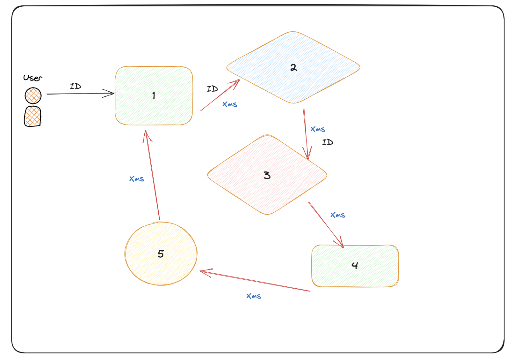
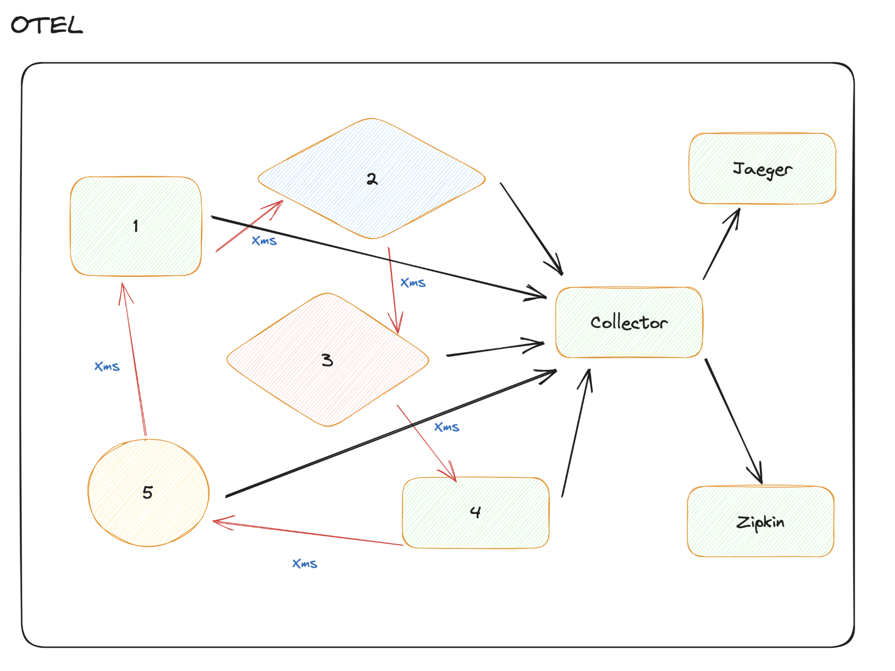
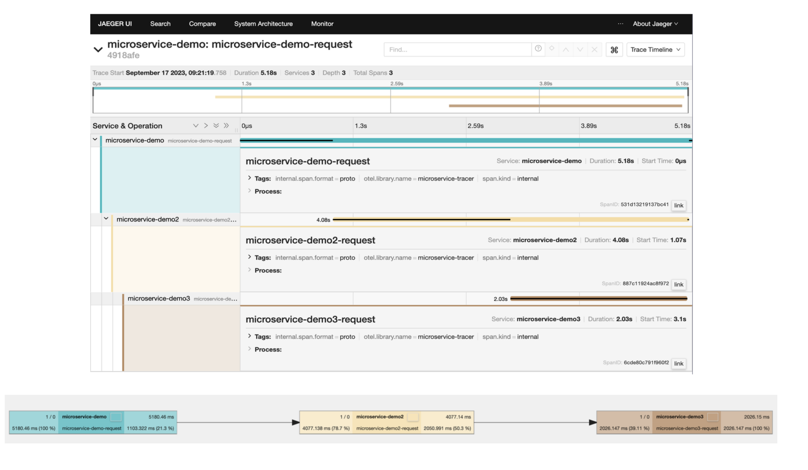

# Tracing

[Codigo fonte](https://github.com/devfullcycle/microsservicos-comunicacao)



é um dos 3 pilares da observabilidade (Logs, metricas, tracing)

## Correlation ID

ID passado entre as requests para identificar a request.

Assim conseguimos intentificar um request de ponta a ponta.

Se vc receber uma requisicao que nao tiver um correlationId, vc cria e sempre repassa. Se ja receber repasse ele.

Hoje em dia exitem libs para fazer isso

## Open Telemetry

Open Telemetry possui SDKs e collector para receber e entregar as informacoes para algum vendor

Um do projeto mais populares da CNCF.

Para nao ter que fazer implementacoes especificas de informacao de log, tracing para cada vendor, tem uma especificacao unica padrao

## Tracing e collector



Collector é um coletor de dados de telemetria, ou seja, ele é um coletor de logs, de métricas e também de tracing.

Todos os meus microsserviços vão se comunicar e mandar essas informações nesse coletor. Ou seja, esse coletor centraliza essas informações. Ou seja, ele é um servidor que acaba trabalhando como um outro microsserviço. Também existem algumas variações, onde você coloca esse coletor do lado de cada microsserviço, ou seja, como um sidecar, por exemplo.

Microsserviços mandam para o coletor e na configuração do seu coletor, você escolhe para qual vendor as informações vão ser enviadas. E se, por algum momento, você quiser trocar de vendor, você mexe apenas no arquivo de configuração aqui desse coletor.

Exemplo de informacao de tracing:



## Comunicacao na pratica

Considerando o docker-compose contendo 3 conteiners(buidadas com mesma imagem) e conteiner jaegertracing, zipkin e otel-collector, temos uma demo de tracing funcionado

```yml
version: '3'
services:
  jaeger-all-in-one:
    image: jaegertracing/all-in-one:latest
    restart: always
    ports:
      - "16686:16686"
      - "14268"
      - "14250"
  
  zipkin-all-in-one:
    image: openzipkin/zipkin:latest
    restart: always
    ports:
      - "9411:9411"

  prometheus:
    container_name: prometheus
    image: prom/prometheus:latest
    restart: always
    volumes:
      - ./.docker/prometheus.yaml:/etc/prometheus/prometheus.yml
    ports:
      - "9090:9090"

  otel-collector:
    image: otel/opentelemetry-collector:latest
    restart: always
    command: ["--config=/etc/otel-collector-config.yaml"]
    volumes:
      - ./.docker/otel-collector-config.yaml:/etc/otel-collector-config.yaml
    ports:
      - "1888:1888"   # pprof extension
      - "8888:8888"   # Prometheus metrics exposed by the collector
      - "8889:8889"   # Prometheus exporter metrics
      - "13133:13133" # health_check extension
      - "4317:4317"   # OTLP gRPC receiver
      - "55679:55679" # zpages extension

  goapp:
    container_name: goapp
    build:
      context: .
    environment:
      - TITLE=Microservice Demo
      - CONTENT=This is a demo of a microservice
      - BACKGROUND_COLOR=green
      - RESPONSE_TIME=1000
      - EXTERNAL_CALL_URL=http://goapp2:8181
      - EXTERNAL_CALL_METHOD=GET
      - REQUEST_NAME_OTEL=microservice-demo-request
      - OTEL_SERVICE_NAME=microservice-demo
      - OTEL_EXPORTER_OTLP_ENDPOINT=otel-collector:4317
      - HTTP_PORT=:8080
    ports:
      - "8080:8080"
    depends_on:
      - jaeger-all-in-one
      - zipkin-all-in-one
      - prometheus
      - otel-collector

  goapp2:
    container_name: goapp2
    build:
      context: .
    environment:
      - TITLE=Microservice Demo 2
      - CONTENT=This is a demo of a microservice
      - BACKGROUND_COLOR=blue
      - EXTERNAL_CALL_URL=http://goapp3:8282
      - EXTERNAL_CALL_METHOD=GET
      - RESPONSE_TIME=2000
      - REQUEST_NAME_OTEL=microservice-demo2-request
      - OTEL_SERVICE_NAME=microservice-demo2
      - OTEL_EXPORTER_OTLP_ENDPOINT=otel-collector:4317
      - HTTP_PORT=:8181
    ports:
      - "8181:8181"
    depends_on:
      - jaeger-all-in-one
      - zipkin-all-in-one
      - prometheus
      - otel-collector

  goapp3:
    container_name: goapp3
    build:
      context: .
    environment:
      - TITLE=Microservice Demo 3
      - CONTENT=This is a demo of a microservice
      - BACKGROUND_COLOR=green
      - RESPONSE_TIME=2000
      - REQUEST_NAME_OTEL=microservice-demo3-request
      - OTEL_SERVICE_NAME=microservice-demo3
      - OTEL_EXPORTER_OTLP_ENDPOINT=otel-collector:4317
      - HTTP_PORT=:8282
    ports:
      - "8282:8282"
    depends_on:
      - jaeger-all-in-one
      - zipkin-all-in-one
      - prometheus
      - otel-collector
```

- Cada conteiner de app vai ter variaveis de ambientes diferentes para diferenciar itens a serem exibidos ou enviados para colector

No codigo fonte vemos como é feita a conexao com o collector

```go
...

func initProvider(serviceName, collectorURL string) (func(context.Context) error, error) {
	ctx := context.Background()

	res, err := resource.New(ctx,
		resource.WithAttributes(
			semconv.ServiceName(serviceName),
		),
	)
	if err != nil {
		return nil, fmt.Errorf("failed to create resource: %w", err)
	}
	ctx, cancel := context.WithTimeout(ctx, time.Second)
	defer cancel()
	conn, err := grpc.DialContext(ctx, collectorURL,
		grpc.WithTransportCredentials(insecure.NewCredentials()),
		grpc.WithBlock(),
	)
	if err != nil {
		return nil, fmt.Errorf("failed to create gRPC connection to collector: %w", err)
	}

	traceExporter, err := otlptracegrpc.New(ctx, otlptracegrpc.WithGRPCConn(conn))
	if err != nil {
		return nil, fmt.Errorf("failed to create trace exporter: %w", err)
	}

	bsp := sdktrace.NewBatchSpanProcessor(traceExporter)
	tracerProvider := sdktrace.NewTracerProvider(
		sdktrace.WithSampler(sdktrace.AlwaysSample()),
		sdktrace.WithResource(res),
		sdktrace.WithSpanProcessor(bsp),
	)
	otel.SetTracerProvider(tracerProvider)

	otel.SetTextMapPropagator(propagation.TraceContext{})

	return tracerProvider.Shutdown, nil
}


func main() {
	sigCh := make(chan os.Signal, 1)
	signal.Notify(sigCh, os.Interrupt)

	ctx, cancel := signal.NotifyContext(context.Background(), os.Interrupt)
	defer cancel()

	shutdown, err := initProvider(viper.GetString("OTEL_SERVICE_NAME"), viper.GetString("OTEL_EXPORTER_OTLP_ENDPOINT"))
	if err != nil {
		log.Fatal(err)
	}
	defer func() {
		if err := shutdown(ctx); err != nil {
			log.Fatal("failed to shutdown TracerProvider: %w", err)
		}
	}()

	tracer := otel.Tracer("microservice-tracer")

	templateData := &web.TemplateData{
		Title:              viper.GetString("TITLE"),
		BackgroundColor:    viper.GetString("BACKGROUND_COLOR"),
		ResponseTime:       time.Duration(viper.GetInt("RESPONSE_TIME")),
		ExternalCallURL:    viper.GetString("EXTERNAL_CALL_URL"),
		ExternalCallMethod: viper.GetString("EXTERNAL_CALL_METHOD"),
		RequestNameOTEL:    viper.GetString("REQUEST_NAME_OTEL"),
		OTELTracer:         tracer,
	}
	server := web.NewServer(templateData)
	router := server.CreateServer()

	go func() {
		log.Println("Starting server on port", viper.GetString("HTTP_PORT"))
		if err := http.ListenAndServe(viper.GetString("HTTP_PORT"), router); err != nil {
			log.Fatal(err)
		}
	}()

	select {
	case <-sigCh:
		log.Println("Shutting down gracefully, CTRL+C pressed...")
	case <-ctx.Done():
		log.Println("Shutting down due to other reason...")
	}

	// Create a timeout context for the graceful shutdown
	_, shutdownCancel := context.WithTimeout(context.Background(), 10*time.Second)
	defer shutdownCancel()
}
```

- funcao `initProvider`, faz a conexao

Enquanto ao lidar com a request, trabalhamos com o span

```go
func (h *Webserver) HandleRequest(w http.ResponseWriter, r *http.Request) {
	carrier := propagation.HeaderCarrier(r.Header)
	ctx := r.Context()
	ctx = otel.GetTextMapPropagator().Extract(ctx, carrier)
	ctx, span := h.TemplateData.OTELTracer.Start(ctx, h.TemplateData.RequestNameOTEL)
	defer span.End()

	time.Sleep(time.Millisecond * h.TemplateData.ResponseTime)

	if h.TemplateData.ExternalCallURL != "" {
		var req *http.Request
		var err error
		if h.TemplateData.ExternalCallMethod == "GET" {
			req, err = http.NewRequestWithContext(ctx, "GET", h.TemplateData.ExternalCallURL, nil)
		} else if h.TemplateData.ExternalCallMethod == "POST" {
			req, err = http.NewRequestWithContext(ctx, "POST", h.TemplateData.ExternalCallURL, nil)
		} else {
			http.Error(w, "Invalid ExternalCallMethod", http.StatusInternalServerError)
			return
		}
		if err != nil {
			http.Error(w, err.Error(), http.StatusInternalServerError)
			return
		}
		otel.GetTextMapPropagator().Inject(ctx, propagation.HeaderCarrier(req.Header))
		resp, err := http.DefaultClient.Do(req)
		if err != nil {
			http.Error(w, err.Error(), http.StatusInternalServerError)
			return
		}
		defer resp.Body.Close()
		bodyBytes, err := io.ReadAll(resp.Body)
		if err != nil {
			http.Error(w, err.Error(), http.StatusInternalServerError)
			return
		}
		h.TemplateData.Content = string(bodyBytes)
	}

	tpl := template.Must(template.New("index.html").ParseFS(templateContent, "template/index.html"))
	err := tpl.Execute(w, h.TemplateData)
	if err != nil {
		http.Error(w, fmt.Sprintf("Error executing template: %v", err), http.StatusInternalServerError)
		return
	}
}
```

- Pegamos o correlation do header em `propagation.HeaderCarrier(r.Header)`
- Repassamos o correlation com `otel.GetTextMapPropagator().Inject(ctx, propagation.HeaderCarrier(req.Header))` 
- criamos um novo span com `h.TemplateData.OTELTracer.Start(ctx, h.TemplateData.RequestNameOTEL)`


O collector vai ter configuracoces para obter o dados em OTEL e enviar para os vendors

```yml
receivers:
  otlp:
    protocols:
      grpc:

exporters:
  prometheus:
    endpoint: "0.0.0.0:8889"
    const_labels:
      label1: value1

  logging:

  zipkin:
    endpoint: "http://zipkin-all-in-one:9411/api/v2/spans"
    format: proto

  otlp:
    endpoint: jaeger-all-in-one:4317
    tls:
      insecure: true

processors:
  batch:

extensions:
  health_check:
  pprof:
    endpoint: :1888
  zpages:
    endpoint: :55679

service:
  extensions: [pprof, zpages, health_check]
  pipelines:
    traces:
      receivers: [otlp]
      processors: [batch]
      exporters: [logging, zipkin, otlp]
    metrics:
      receivers: [otlp]
      processors: [batch]
      exporters: [logging, prometheus]
```

