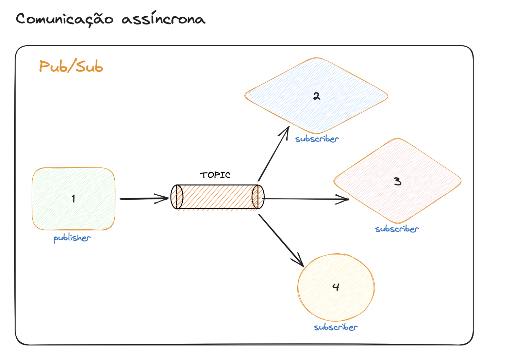

# O perigo do rest

Com comunicacao async ganhamos em resiliencia...

Com rest podemos perder requisicoes que nao poderiam ser perdidas (transacoes bancarias)

# Conceito basico

- Sistemas nao vao mais se comunicar diretamente
- Momentos sao diferentes
- Sistemas nao sao acoplado entre si

# Economia em recursos

Com comunicao async eu posso enfileirar para evitar escalar, caso o tempo de resposta final mais alto seja aceitavel, comparando com comunicacao sync em que eu deveria ter intancias suficientes para lidar com um thupt muito alto em tempo real.

# Comunicacao assincrona na pratica

# Topicos vs Exchange

Topico tambem é chamado de padrao pub/sub

RabbitMq tem o conceito de exchange... Em que vc produz mensagens para ela e ela possui filtros para redirecionar para filas em si.

Nessa fila a mensagem apagada quando é lida.