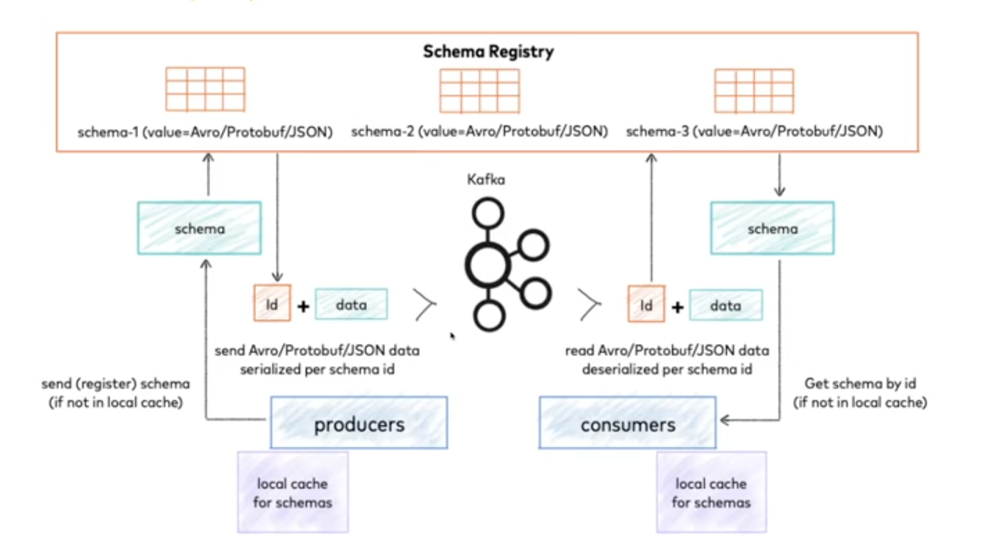

## Eventos

- Informacoes que ja aconteceram
    - Compra aprovada, porta abriu, site acessado...

# Tipos de evento

## Event notification

Normalmente ele vai trazer dados mínimos sobre algum evento, obviamente, que aconteceu. Focado em trabalhar muito com estado.


```json
{
  order_id: 1,
  status: aprovado
}
``` 

Vantagem de ter dados muito pequenos, geralmente se envia quando muda o estado e os sistema podem tomar suas decisoes

## Event-carried state transfer

Esse tipo de evento, no final das contas, é um evento de stream. O que isso significa? Significa que ele é um evento que carrega todos os dados que aconteceram.

Ex: depois de uma compra se precisa emitir nota fiscal, que exige saber muitas informacoes dela

```json
{
  order_id: 1,
  status: aprovado,
  product_id: 1,
  product_name: "Carrinho de brinquedo",
  descricao: "O melhor carrinho do mundo",
  preco: 100,
  user_id: 1,
  nome: "Wesley",
  email: "w@www.com"
  ...
}
```

Tende a ser utilizado quando essas informacoes foram necessarias.

Comum trabalhar de forma hibrida

# Event sourcing

A utilizacao ajuda a guardar o historico de tudo no sistema.

Cada vez o que evento ocorre os dados sao perstidos em banco de dados. Versionando cada evento. Sendo possivel fazer o replay

Vamos imaginar que eu estou num extrato bancário, e eu tenho um saldo bancário ali no meu banco. Você acha que toda vez que o sistema vai calcular o saldo, ele pega todos os débitos e todos os créditos e gera o saldo todas as vezes? Você tem 20 anos de conta no banco e ele vai fazer essa conta, essa matemática, cada vez para você trabalhar dessa forma? Claro que não. Normalmente, eles vão trabalhar com alguns snapshots, que mostra o seu saldo, e depois de tempos em tempos ele vai fazendo essa conta ali para você. Agora, já pensou se cada vez que eu mudasse o meu saldo, eu não lançasse, eu não fizesse o lançamento do que aconteceu do meu débito, do meu depósito? Se alguém chega e muda ou dá um erro no sistema onde ele adiciona o saldo de um milhão, e o cara não tem um milhão, o cara tava negativo, como você vai saber o saldo final desse cara? Bom, se você tiver todos os eventos que resultam numa alteração de saldo, basta pegar o seu sistema, apagar o saldo final e mandar ele reprocessar todas essas mudanças de estado, que assim você vai chegar naquele saldo final de forma correta. Então, é muito interessante para a auditoria; É muito interessante para você conseguir pegar erros no sistema, porque você sabe o que está acontecendo; É muito importante para você conseguir dar o replay, e você garante muito mais segurança.


## Schema evolutivo

### Forward compatibility
Os dados são produzidos com um novo schema, mas ainda mantém compatibilidade de leitura com o schema antigo.  
Não há alteração de código pelo consumidor.

Produto muda, porem sem quebrar o produtor, incluindo novos dados

### Backward compatibility
O dado produzido com um schema antigo pode ser lido como se fosse um novo schema.  
Permite o consumidor a se preparar para uma nova feature.  
Reprocessamento de mensagens antigas.

o consumidor consegue colocar uma nova feature mesmo antes dessa feature dos dados serem enviados para ele

### Full compatibility
Combinação dos dois mundos.  
Difícil conseguir.

# Schema registry



## ✅ Visão Geral

- **Schema Registry** é um serviço que armazena os **schemas** (formatos de dados) utilizados na comunicação entre produtores e consumidores no Kafka.
- Facilita a **compatibilidade e evolução dos dados** trocados em sistemas distribuídos.

---

## 🔄 Funcionamento

- O **produtor**:
  - Lê o schema previamente definido (Avro, Protobuf ou JSON Schema).
  - Envia o **ID do schema** junto com a mensagem.
  - **Valida** a mensagem com o Kafka antes do envio.
  - **Cacheia localmente** o schema para não precisar buscá-lo a cada envio.

- O **consumidor**:
  - Lê o schema correspondente ao ID da mensagem recebida.
  - Usa esse schema para **desserializar** os dados corretamente.

---

## 🗂️ Vantagens

- **Centralização de contratos**: todos os times seguem os schemas definidos.
- **Menos erros e conflitos** entre times.
- **Facilidade na evolução dos dados** (versionamento dos schemas).
- **Validação automática** de mensagens conforme o schema.

---

## 🧪 Compatibilidade

- Ao criar um schema no registry, é necessário definir o **tipo de compatibilidade**, como:
  - `backward`
  - `forward`
  - `full`

Isso define como novos schemas se relacionam com versões antigas (essencial para evolução segura).

---

## 📝 Dica para quem não usa Schema Registry

Caso não seja possível usar um schema registry:

- Crie um **repositório centralizado** de contratos de dados.
- Compartilhe entre os times como **fonte única da verdade**.
- Nomeie e organize os schemas claramente.
- Todos devem **baixar e seguir** esses contratos.

---

## ⚠️ Observações Finais

- Em sistemas distribuídos, o **desacoplamento** entre produtor e consumidor exige padrões bem definidos.
- Schemas tendem a **evoluir** com o tempo; sem controle, isso gera erros e retrabalho.
- O uso do Schema Registry **ajuda a mitigar esses problemas** de forma eficiente.