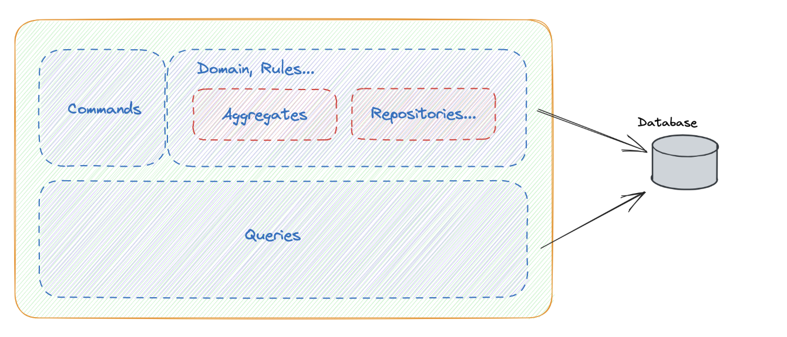
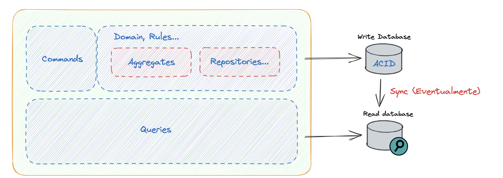
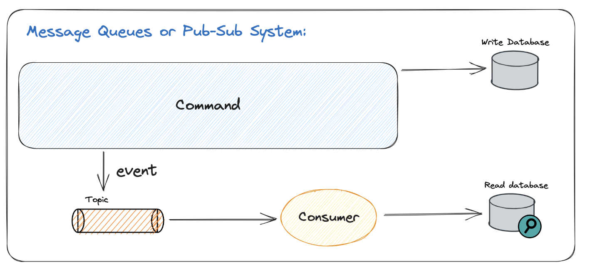
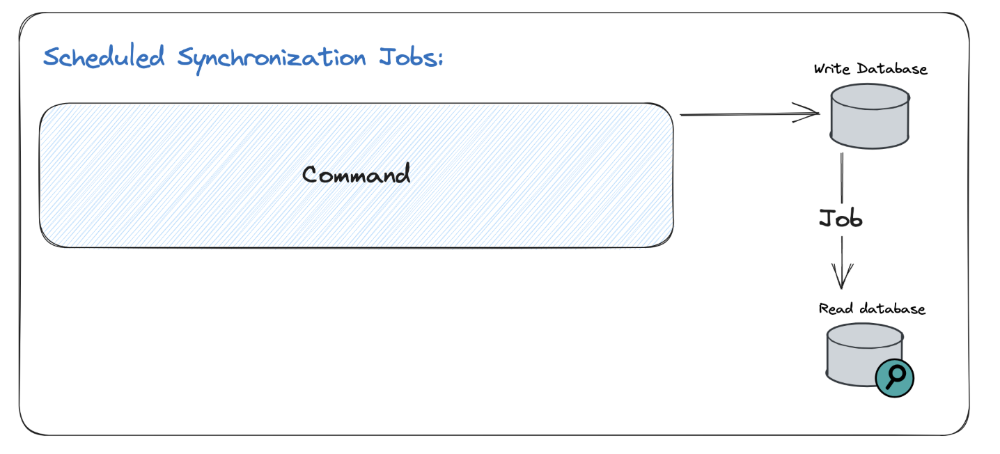
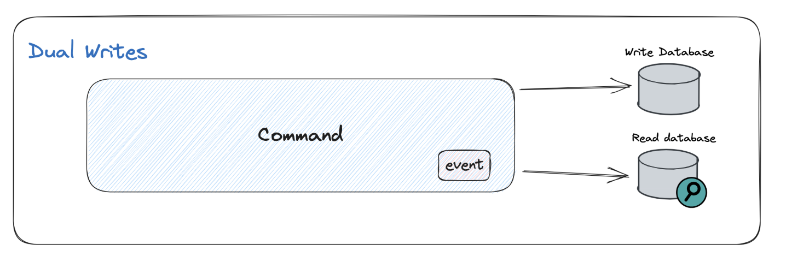
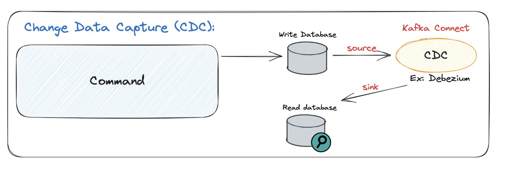

# Falando sobre CQRS

## 🧩 Introdução

- CQRS é um padrão arquitetural muito utilizado em sistemas com **escrita e leitura intensivas**.
- Antes de entender CQRS, é importante conhecer o conceito de **CQS (Command Query Separation)**.

---

## 📚 CQS - Command Query Separation

- Criado por **Bertrand Meyer**.
- Princípio: **um método deve ter uma única responsabilidade**:
  - **Command** → executa uma ação (ex: inserir, atualizar, deletar).
  - **Query** → retorna dados (ex: buscar, listar).

### ❌ Exemplo de violação do CQS:
- Uma API REST que faz um `POST` para inserir um dado e **retorna o ID** do dado recém-criado.
  - Aqui há duas responsabilidades: **escrever** e **ler/retornar**.
- CQS defende que comandos **não retornam nada** — apenas executam ações.

---

## 🚀 Evolução para CQRS

- Conceito proposto por **Greg Young**.
- CQRS = **Command Query Responsibility Segregation**
- Leva o CQS a um novo nível: **separa completamente os modelos de leitura e escrita** em um sistema.

---

## 🔍 Próximos passos

- O conceito de CQRS possui **diversas nuances** que serão exploradas com mais profundidade nas próximas partes da aula.
- Entender bem essa separação é crucial para sistemas escaláveis e distribuídos.

# Conceitos basicos sobre CQRS



## 🏗️ Evoluindo para CQRS

- **CQRS (Command Query Responsibility Segregation)** é uma evolução do CQS em nível arquitetural.
- **Separa totalmente** os caminhos de escrita e leitura do sistema:
  - **Comando**: representa uma **intenção do usuário** (ex: criar cliente, processar pagamento).
  - **Consulta**: representa um **pedido de dados** (ex: listar parcelas do financiamento).

---

## ⚙️ Parte de Comandos

- Envolve **processamento de regras de negócio complexas**.
- Trabalha com:
  - **Modelo de Domínio**
  - **Aggregates**
  - **Value Objects**
  - **Repositórios**
- Exemplo:
  - Comando: simular financiamento.
  - Processo: aplica regras, calcula parcelas, grava no banco.
  - **Não retorna** o resultado para o usuário (apenas executa).

### ✅ Características dos comandos:

- Alta complexidade.
- Envolvem regras de negócio.
- Recomendado uso de **modelagem rica de domínio** (DDD).

---

## 🔎 Parte de Consultas

- Responsável apenas por **ler dados e retornar ao usuário**.
- **Sem regras de negócio** envolvidas.
- Pode ser implementada com:
  - **DAOs**
  - **Consultas SQL otimizadas**
  - **Projeções específicas para visualização**
- Exemplo:
  - Consulta: buscar as parcelas calculadas no comando anterior.

### ✅ Características das consultas:

- Simples, rápidas e diretas.
- Não requerem modelagem de domínio.
- Foco na performance de leitura.

---

## 🧩 Resumo da Separação

| Aspecto         | Comando                          | Consulta                          |
|-----------------|----------------------------------|-----------------------------------|
| Objetivo        | Executar ações                   | Retornar dados                    |
| Retorno         | Não retorna dados                | Retorna dados                     |
| Complexidade    | Alta (regras de negócio)         | Baixa (consulta direta)           |
| Modelagem       | Domínio rico (DDD, agregados)    | Simples (DAOs, SQL)               |

---

## 🚨 Observação Importante

- Muitos materiais simplificam o CQRS e não explicam a diferença de complexidade entre comando e consulta.
- Entender isso é essencial para usar o CQRS de forma eficaz.

---

# Banco de dados



## 🛠️ Estratégias de Banco de Dados no CQRS

### 1. ✅ Banco Único (Leitura e Escrita)

- **Comandos e consultas usam o mesmo banco**.
- Simples de implementar.
- Boa opção quando:
  - A carga de leitura e escrita é equilibrada.
  - A complexidade do sistema é baixa.
  - Não há problemas de performance.

---

### 2. 🔄 Bancos Separados (Write DB / Read DB)

- **Dois bancos diferentes**: um para escrita, outro para leitura.
- Os dados são **sincronizados eventualmente** entre eles.

#### 🧠 Motivos para usar bancos separados:

- Evitar sobrecarga de um único banco (leitura ou escrita intensiva).
- Possibilidade de **modelagens diferentes** para escrita e leitura:
  - Escrita → estrutura rica, normalizada, com transações e consistência.
  - Leitura → estrutura simples, otimizada para performance.

#### 🧾 Exemplo:

- Banco de escrita → relacional, com regras complexas.
- Banco de leitura → colunar, documentos, etc., ideal para relatórios rápidos.

---

## ⚖️ Trade-off: Consistência Eventual

- A separação gera **inconsistência temporária** entre os bancos.
- Isso significa que a leitura **não refletirá imediatamente** o que foi escrito.
- Pode haver um **atraso de milissegundos** (ou mais) na sincronização.

### ❗ Pergunta-chave:

> O seu sistema **tolera inconsistência** por pequenos períodos?

- **Sim** → pode adotar dois bancos.
- **Não** → mantenha um banco único para garantir consistência forte.

# Mecanismos de sincronizacao

## 🧩 Introdução

- Em sistemas que usam **dois bancos de dados** (escrita e leitura), é necessário definir **como os dados serão sincronizados** entre eles.
- Existem **vários mecanismos de sincronização**, com diferentes níveis de complexidade, performance e consistência.

## 📦 1. Message Queues / PubSub (Eventos)



### 🛠️ Funcionamento

- O **comando** grava no banco de escrita e emite um **evento**.
- Um **consumidor** lê o evento de um **tópico** (ex: Kafka, RabbitMQ, etc).
- O consumidor grava os dados no **banco de leitura** no formato desejado.

### ✅ Vantagens

- Alta **resiliência**: eventos são armazenados até serem processados.
- Baixa **latência** (milissegundos).
- Flexibilidade de transformar os dados no melhor formato para leitura.
- Alta **segurança na entrega** dos dados.

### ⚠️ Desvantagens

- Adiciona **infraestrutura** (sistema de mensageria).
- Aumenta o **response time** por depender da propagação via rede.

## ⏱️ 2. Scheduled Synchronization Jobs



### 🛠️ Funcionamento

- Os dados são gravados no banco de escrita.
- Um **job agendado** (ex: cron) roda periodicamente e copia os dados para o banco de leitura.

### ✅ Vantagens

- **Simples de implementar**.
- **Menor custo de infraestrutura** (sem filas, apenas um job).
- Útil para casos onde a atualização **não precisa ser em tempo real** (ex: relatórios diários).

### ⚠️ Desvantagens

- Pode gerar **maior inconsistência temporal** (ex: dados atualizados a cada 10s, 1min, etc).
- Menor frequência de sincronização comparado ao PubSub.


## ✍️ 3. Dual Writes



### 🛠️ Funcionamento

- O **comando**, ao ser executado, grava **simultaneamente**:
  - No **banco de escrita**
  - No **banco de leitura**
- Pode utilizar **eventos internos** para estruturar essa lógica.
- Requer controle para manter **consistência entre as duas gravações**.

### 🔄 Compensação

- Se a gravação em um dos bancos **falhar**, deve-se aplicar um **rollback** na outra.
- Necessário **tratar transações distribuídas** ou implementar lógica de **compensação manual**.

### ✅ Vantagens

- **Menor latência**: gravação ocorre na mesma operação.
- **Sem necessidade de fila ou agendador**.

### ⚠️ Desvantagens

- Mais difícil de garantir **consistência transacional**.
- **Erro em uma das gravações** pode gerar inconsistência se não for tratado corretamente.

---

## 🔍 4. CDC (Change Data Capture)



### 🛠️ Funcionamento

- Um sistema externo **lê os logs de alteração do banco de dados de escrita**.
- Essas mudanças são então **replicadas no banco de leitura**.
- Usa logs binários do banco (como o binlog do MySQL ou WAL do Postgres).

### 🧰 Exemplo de Ferramentas

- **Kafka Connect** com o plugin **Debezium**:
  - **Source Connector**: lê alterações no banco.
  - **Sink Connector**: grava em outro banco (ex: MongoDB, Elasticsearch).

### ✅ Vantagens

- **Desacoplamento total** entre escrita e leitura.
- **Alta escalabilidade** — ideal para grandes volumes de dados.
- Útil também para **integração entre sistemas** com bancos distintos.

### ⚠️ Desvantagens

- Requer ferramentas e **infraestrutura adicional**.
- Pode ter **delay** pequeno entre escrita e leitura (dependente da frequência de leitura dos logs).

---

## 🧠 Outras possibilidades

- **Replicação nativa do banco** (ex: PostgreSQL read replica):
  - Útil quando o **schema de leitura e escrita é o mesmo**.
  - Não resolve quando se deseja **modelos diferentes** entre escrita e leitura.

---

## 📌 Conclusão

### 🔄 Resumo dos 4 principais mecanismos:

| Mecanismo             | Complexidade | Consistência | Latência | Observações |
|----------------------|--------------|--------------|----------|-------------|
| **Message Queue**    | Média        | Eventual     | Baixa    | Alta resiliência |
| **Scheduled Job**    | Baixa        | Mais eventual| Alta     | Simples e barato |
| **Dual Write**       | Alta         | Forte (com esforço) | Baixa | Requer lógica de rollback |
| **CDC**              | Alta         | Eventual     | Média/baixa | Ideal para grandes integrações |

> A escolha do mecanismo depende do **nível de consistência, complexidade e performance** exigido pelo sistema.

# 🧬 Replicação Nativa de Banco de Dados (ex: PostgreSQL Read Replica)

## 📌 O que é replicação nativa?

- A **replicação nativa** é um mecanismo oferecido pelo **próprio banco de dados** para **copiar dados de um banco principal (master)** para um ou mais bancos secundários (replicas).
- É comumente usada para **aumentar a escalabilidade de leitura** e/ou garantir **redundância e tolerância a falhas**.

---

## 🐘 PostgreSQL Read Replica

### 🔧 Como funciona

- O PostgreSQL oferece **replicação física** ou **replicação lógica**:
  - **Replicação física**:
    - Copia os **WAL logs (Write-Ahead Logs)** do servidor primário.
    - As réplicas são essencialmente uma cópia idêntica do banco primário (mesmo schema, dados e estrutura).
  - **Replicação lógica**:
    - Permite replicar **tabelas específicas** e até usar **schemas diferentes**, com mais flexibilidade.

### 📈 Casos de uso comuns

- **Distribuição de carga**: enviar consultas de leitura para a réplica e manter o primário focado em escrita.
- **Alta disponibilidade**: se o primário falhar, uma réplica pode ser promovida a novo primário.
- **Backups sem impacto**: realizar backups na réplica sem afetar o desempenho do banco principal.

---

## ✅ Vantagens

- **Fácil de configurar** (especialmente em serviços gerenciados como AWS RDS, Google Cloud SQL).
- **Consistência garantida pelo próprio banco**.
- Reduz a carga do banco principal (escrita vs leitura).
- Boa performance para **workloads de leitura intensiva**.

---

## ⚠️ Limitações

- As réplicas são **somente leitura**.
- **Latência de replicação**: há um pequeno atraso entre a escrita no primário e a leitura na réplica.
- **Mesma estrutura de dados**: útil apenas quando **schema de leitura e escrita são iguais**.
- Não resolve casos onde a leitura exige **modelagens otimizadas diferentes** da escrita (como em CQRS avançado).

# Exemplo pratico de commands

[codigo fonte](https://github.com/devfullcycle/cqrs)

Temos 2 camadas base `command` e `query`. 

```
internal/
├── command/
│   ├── create_product.go
│   ├── place_order.go
│   ├── domain/
│   ├── event/
│   └── repository/
└── query/
    └── find_product.go
```

Sendo na commando tem algumas divisoes. 

No dominio temos as regras de negocio em `order.go`

E temos an raiz os comandos como por exmplo o `create_product.go`

```go
package command

import (
	"github.com/devfullcycle/cqrs/internal/command/domain"
	"github.com/devfullcycle/cqrs/pkg/events"
)

type CreateProductInput struct {
	Name  string
	Price float64
}

type CreateProductEventPayload struct {
	ID    string
	Name  string
	Price float64
}

type CreateProductCommand struct {
	Repository          domain.ProductRepository
	EventDispatcher     events.EventDispatcherInterface
	ProductCreatedEvent events.EventInterface
}

func (c *CreateProductCommand) Handle(input *CreateProductInput) {
	product := domain.NewProduct(input.Name, input.Price)
	c.Repository.Save(product)
	c.ProductCreatedEvent.SetPayload(
		CreateProductEventPayload{
			ID:    product.ID,
			Name:  product.Name,
			Price: product.Price,
		},
	)
	c.EventDispatcher.Dispatch(c.ProductCreatedEvent)
}
```

- Injeta o repository, o disparador de eventos e estrutura para evento de ProductCreated
- Usa as regras de negocio em domain para criar um product (Usando modelo rico)
- Salva o modelo rico usando repository
- Dispara o evento que o produto foi criado
- Metodo handle nao retorna nada


No repository temos

```go
package repository

import (
	"database/sql"

	"github.com/devfullcycle/cqrs/internal/command/domain"
)

type ProductRepositoryMysql struct {
	DB *sql.DB
}

func (r *ProductRepositoryMysql) FindByID(id string) *domain.Product {
	var product domain.Product
	r.DB.QueryRow("SELECT id, name, price FROM products WHERE id = ?", id).Scan(&product.ID, &product.Name, &product.Price)
	return &product
}

func (r *ProductRepositoryMysql) Save(product *domain.Product) {
	r.DB.Exec("INSERT INTO products (id, name, price) VALUES (?, ?, ?)", product.ID, product.Name, product.Price)
}
```

- A utilizacao de Mysql para gravar esses produtos
- O findById vai ser utilizado apenas como pre requisito para gravar outra coisa


O handler que consume o evento vai ser responsavel por gravar em outro banco de dados que vai ser utilizado como leitura, nessa caso mongoDb

```go
// Handle is a method that implements EventHandlerInterface
// persist data using mongodb
package handler

import (
	"context"
	"encoding/json"
	"log"
	"sync"

	"github.com/devfullcycle/cqrs/pkg/events"
	"go.mongodb.org/mongo-driver/bson"
	"go.mongodb.org/mongo-driver/mongo"
)

type ProductCreatedEventHandler struct {
	MongoDBConnection *mongo.Client
}

type ProductCreatedEventData struct {
	ID    string
	Name  string
	Price float64
}

func (h *ProductCreatedEventHandler) Handle(event events.EventInterface, wg *sync.WaitGroup) {
	defer wg.Done()

	// Unmarshal the event data into a struct
	var eventData ProductCreatedEventData
	payload, ok := event.GetPayload().([]byte)
	if !ok {
		log.Printf("Error getting event payload as []byte")
		return
	}
	err := json.Unmarshal(payload, &eventData)
	if err != nil {
		log.Printf("Error unmarshalling event data: %v", err)
		return
	}

	// Insert the event data into MongoDB
	collection := h.MongoDBConnection.Database("ecommerce").Collection("products")

	// use id event as id mongodb
	_, err = collection.InsertOne(context.Background(),
		bson.M{
			"_id":   eventData.ID,
			"name":  eventData.Name,
			"price": eventData.Price,
		})
	if err != nil {
		log.Printf("Error inserting event data into MongoDB: %v", err)
		return
	}
}

```

# Exemplo pratico de queries

Como essa parte serve apenas para consulta, nao vai ter regra de dominio dentro.

sendo assim vamos ter apenas um file `find_product.go`


```go
package query

import (
	"context"
	"fmt"

	"go.mongodb.org/mongo-driver/bson"
	"go.mongodb.org/mongo-driver/mongo"
)

type FindProductQuery struct {
	mongoClient *mongo.Client
}

type Product struct {
	ID    string  `bson:"_id" json:"id"`
	Name  string  `json:"name"`
	Price float64 `json:"price"`
}

func NewFindProductQuery(mongoClient *mongo.Client) *FindProductQuery {
	return &FindProductQuery{mongoClient: mongoClient}
}

// find all products
func (q *FindProductQuery) FindAll() ([]*Product, error) {
	products := []*Product{}

	collection := q.mongoClient.Database("ecommerce").Collection("products")
	cursor, err := collection.Find(context.TODO(), bson.M{})
	if err != nil {
		fmt.Println(err)
		return nil, err
	}
	defer cursor.Close(context.TODO())

	for cursor.Next(context.TODO()) {
		product := &Product{}
		if err := cursor.Decode(product); err != nil {
			fmt.Println(err)
			return nil, err
		}
		products = append(products, product)
	}
	return products, nil
}

// find product by id
func (q *FindProductQuery) FindByID(id string) (*Product, error) {
	product := &Product{}
	collection := q.mongoClient.Database("ecommerce").Collection("products")
	f := collection.FindOne(context.TODO(), bson.M{"_id": id})
	if err := f.Decode(product); err != nil {
		fmt.Println(err)
		return nil, err
	}
	return product, nil
}

```

- Diretamente injeta um mongoClient
- Metodos `FindByID` e `FindAll` que retorna diretamente um classe mapeada do banco product.

