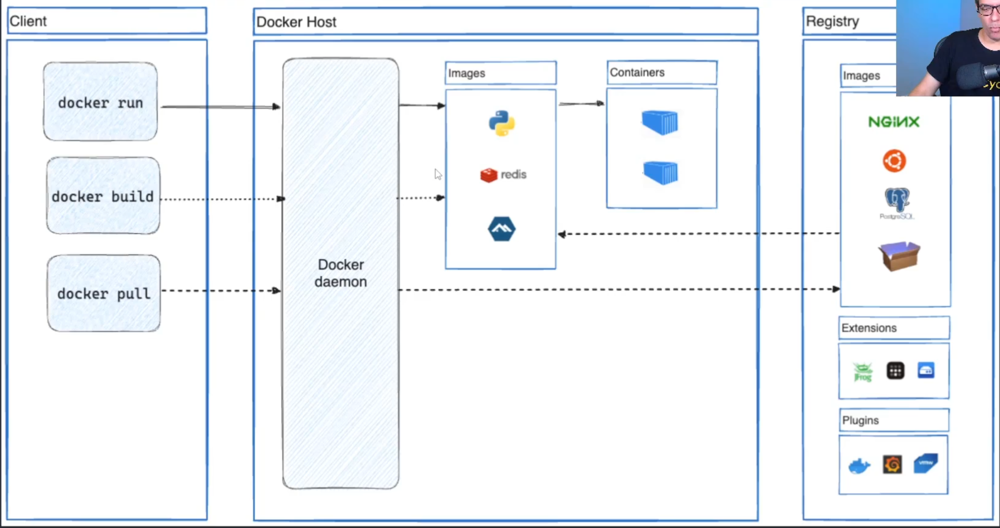

# 05 - Arquitetura do Docker

## Componentes principais do Docker

O Docker é composto por 3 componentes principais:
- **Docker Engine**: É o componente principal do Docker, ele é responsável por rodar os containers. O Docker Engine é composto por 3 componentes: o daemon, a API e o CLI.
- **Docker Hub**: É um repositório de imagens, ele é muito parecido com o GitHub, mas ao invés de armazenar código, ele armazena imagens. O Docker Hub é um serviço gratuito, mas também possui um plano pago que permite criar repositórios privados.
- **Docker Desktop**: É uma ferramenta que facilita o uso do Docker no Windows e no Mac, pois permite instalar o Docker Engine, o Docker CLI e o Docker Compose com apenas um instalador.

## Arquitetura do Docker Engine

O Docker Engine é composto por 3 componentes:
- **Docker daemon**: É o processo principal do Docker, ele é responsável por rodar os containers. O daemon é um processo que roda em background e fica escutando a API do Docker.
- **Docker API**: É uma API HTTP que permite interagir com o Docker daemon. A API é uma API HTTP que roda em background e fica escutando a porta 2375.
- **Docker CLI**: É uma ferramenta que permite interagir com a API do Docker. O CLI é uma ferramenta que roda em foreground e envia requisições HTTP para a API do Docker.

Fontes:

[https://stackoverflow.com/questions/46649592/dockerd-vs-docker-containerd-vs-docker-runc-vs-docker-containerd-ctr-vs-docker-c](https://stackoverflow.com/questions/46649592/dockerd-vs-docker-containerd-vs-docker-runc-vs-docker-containerd-ctr-vs-docker-c)