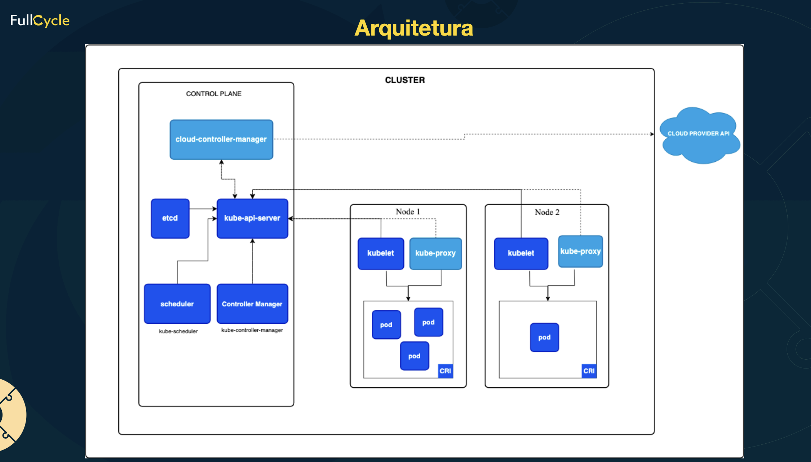

Control plane tambem chamado Node master

## Componentes

- API Server: Ponto central de gerenciamento ecomunicação.
- Scheduler: Distribui os Pods entre os Nodes.
- Controller Manager: Orquestra os controladores de nó, endpoint, serviço e outros.
- Etcd: Armazenamento consistente e de alta disponibilidade do estado do cluster

