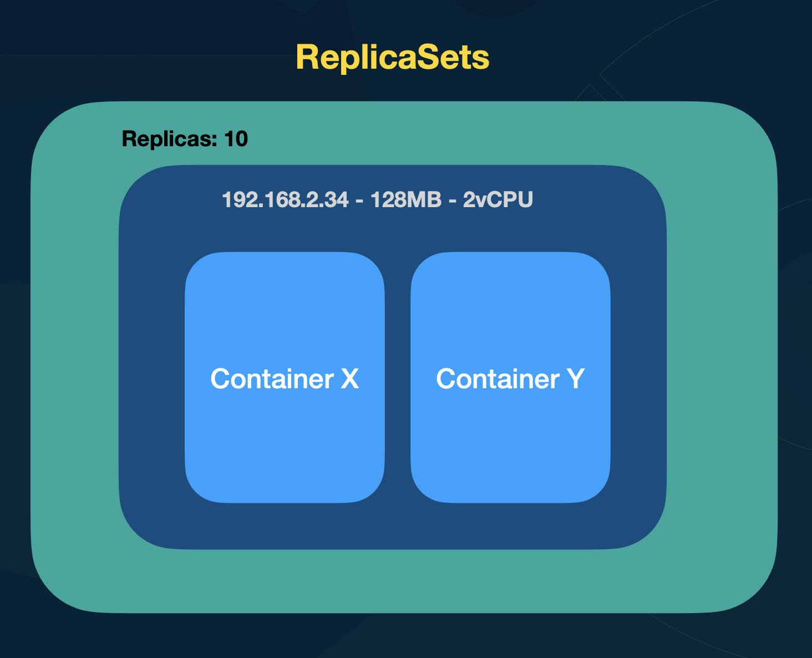

# ReplicaSets

- Gerencia o estado dos Pods
- Determina a quantidade de Pods em execução
- Garante a quantidade mínima de Pods em execução



O replica set sabe que sao suas pods pelo selector

```yml
apiVersion: apps/v1
kind: ReplicaSet
metadata:
  name: nginx-rs
spec:
  selector:
  replicas: 5
    matchLabels:
      app: nginx
  template:
    metadata:
      labels:
        app: nginx
    spec:
      containers:
        - name: nginx
          image: nginx:latest
          ports:
            - containerPort: 80
```

O objetivo do replicaset é manter a quantidade de pods... 
Se tem outra versao do replicaset, ele nao atualiza os pods automaticamente, pois a quantidade é a mesma... Mesmo que troque a pod/container


