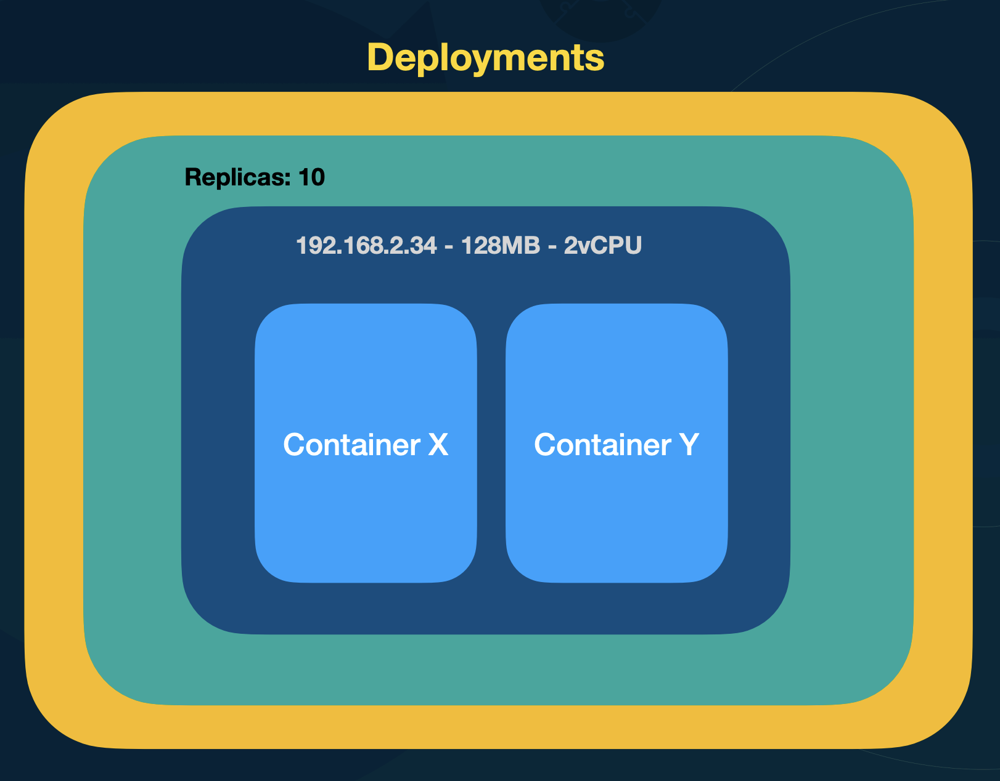

# Deployments

- Exerce controle sob os ReplicaSets
- A cada mudança de versão do container, o Deployment cria um novo ReplicaSet
    - Tambem manda a o replicaSet antigo ficar com desired = 0
- Caso a versão anterior seja aplicada novamente, ele utiliza a versão antiga (já criada) do ReplicaSet

