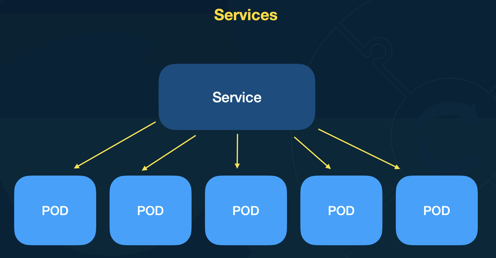

- Pontos de entrada para os PODs
- PODs não são acessados diretamente. Você acessa o service que balanceia a carga e envia a requisição para um dos PODs
- Resolução automática de DNS.
    - Recomendado sempre usar o nome do service para fazer chamadas
- 4 tipos de services

Exemplo com pods utilizando a mesma aplicacao, com varias replicas

O service que sabe qual melhor pode para balencear a carga