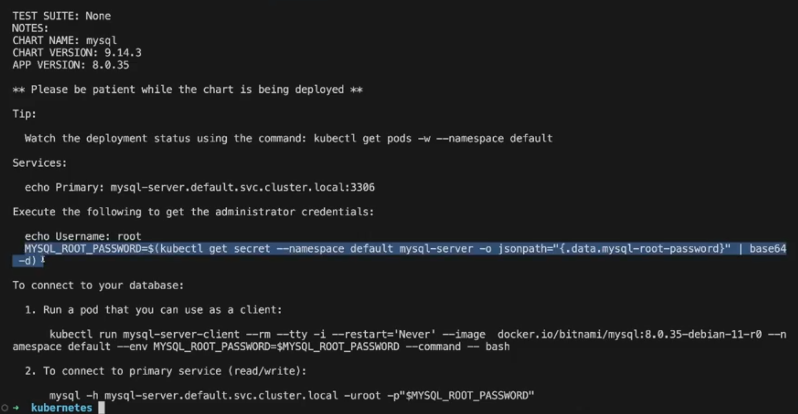
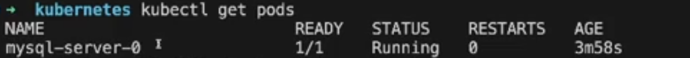

A instalando é feita no cluster configurado no contexto da maquina em que o comando esta sendo executado.

Usando [mysql](https://artifacthub.io/packages/helm/bitnami/mysql) como exemplo, vamos instalar como

```sh
helm install myqsl-server oci://registry-1.docker.io/bitnamicharts/mysql
```

em que `myqsl-server` será o nome da instalacao 

Esse output mostra como pegar o senha do root do mysql instalado



- com instrucoes para abrir criar um pod, executar um bash nele (com `kubectl run`) e com o client mysql acessar o servidor que foi instalado.

Ao ver os pods do cluster:



- Vemos um statefulset criado

Logicamente tambem um service foi criado nesse caso

Para desintalar seria:

```
helm delete mysql-server
```

