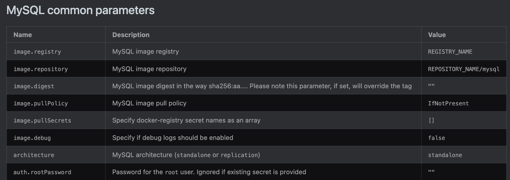
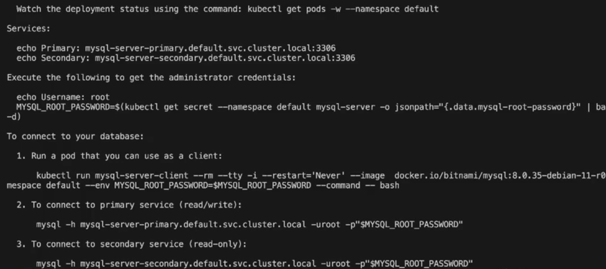
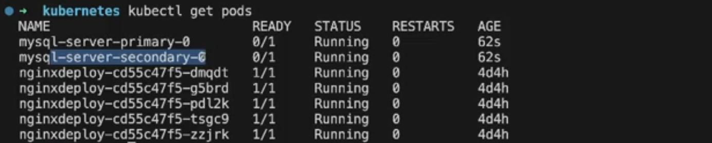
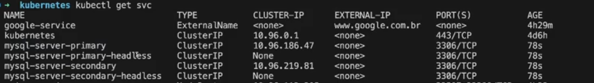

No caso do [mysql](https://artifacthub.io/packages/helm/bitnami/mysql) vamos testar alguns parametros:

- architecture (para ter mais pod)
- auth.rootPassword	




```sh
helm install myqsl-server oci://registry-1.docker.io/bitnamicharts/mysql --set architecture=replication --set auth.rootPassword=senha
```




- O ouput agora é diferente com replicacao automatica



- Temos um servico pro secundario tambem


