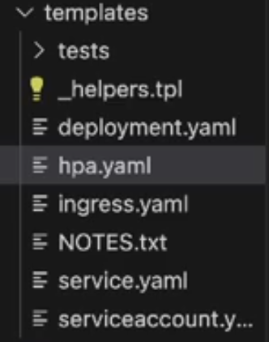

o comando `helm create mychat`, vai criar um template em um pasta com o nome do chart (mychart) com diversos arquivos.

- vai ter um arquivo `values.yalm` com valores default para parametros, em que esse arquivo pode ser passado na hora de install para utilizar os valores definidos nele.

    - Nele vao estar itens como imagem, endereco do registry, numeo de replicas, configuracoes do HPA. Tudo isso em variaveis para ser modificados


Exemplo de uma parte

```yml
---
# Required metadata
# impactLevel -- Application impact level on iFood's critical path (one of: `0`, `1`, `2`, `3`, `4`, `5`) - [read more](https://bit.ly/3ZsdQ08)
impactLevel: ""
# tribe -- The iFood tribe that owns the application
tribe: ""
# squad -- The iFood squad that owns the application
squad: ""

# nameOverride -- Overrides the release name
nameOverride: ""

# clusterName -- Cluster name used to help with ingress DNS hosts
clusterName: ""

# replicaCount -- Desired number of pods (ignored when hpa.enabled=true. See [replicaCount](docs/replicaCount.md))
replicaCount: 2

# logType -- Which kind of strutured log message the app is using (json, logfmt, none)
logType: "json"

# labels -- Map of additional labels for all resources
labels: {}

# serviceName -- Application service name, populated automatically via CI
serviceName: ""

# ownerLayerSlug -- OwnerLayerSlug associated to serviceName, populated automatically via CI with values from repository-metadata.yaml
ownerLayerSlug: ""

# subType -- Resource subtype for catalog
subType: []

# enableTimestampAnnotations -- Enable timestamp annotations to force creating pods whenever a new release is deployed
enableTimestampAnnotations: false

# customSelectorLabels -- Override selectorLabels in deployment and service
customSelectorLabels: {}

# Source revision (used for rollback strategy)
sourceHelmRevision: ""

# Previous stable revision (used for rollback strategy)
previousStableHelmRevision: ""

image:
  # image.repository -- Image name
  repository: ""
  # image.tag -- Image tag
  tag: ""
  # image.pullPolicy -- Image pull policy
  pullPolicy: IfNotPresent
```

- No arquivo `Chart.yaml` vai ter o manifesto basico do chart com seu nome etc

```
---
apiVersion: v2
name: app
version: 0.115.2
description: A typical application that runs on Kubernetes.
kubeVersion: ">= 1.14-0"
type: application
home: https://xxxx/xxx/charts/xxx-app
icon: https://avatars2.githubusercontent.com/u/26223435
keywords:
  - xxx-app
maintainers:
  - name: team axxxx
    email: xxxx@xxx.com.br
```


- O principal acontece no diretorio templates, em que sao feitos os replaces para criar o objetos k8s usando os manifestos



Ex:

```yml
{{- if (eq .Values.workload.kind "Deployment") -}}
{{- $appFullName := include "app.fullname" . }}
apiVersion: apps/v1
kind: Deployment
metadata:
  name: {{ $appFullName }}
  labels:
    {{- include "app.labels" . | nindent 4 }}
    {{- with .Values.labels }}
    {{- toYaml . | nindent 4 }}
    {{- end }}
    {{- if .Values.workload.mesh.enabled }}
    istio.io/rev: stable
    {{- if .Values.workload.mesh.ratelimit.enabled }}
    ifood/mesh-ratelimit: "true"
    {{- end }}
    {{- end }}
    {{- if .Values.serviceDiscovery.enabled }}
    ifood/service-discovery: "true"
    {{- end }}
  annotations: &annotations
    {{- include "app.annotations" . | nindent 4 }}
    {{- if .Values.deployment.annotations }}
    {{- toYaml .Values.deployment.annotations | nindent 4 }}
    {{- end }}
spec:
  {{- if .Values.rollout.enabled  }}
  revisionHistoryLimit: 5
  {{- end }}
  replicas: {{ include "deployment.replicas" . | int }}
  selector:
    matchLabels:
      {{- include "app.selectorLabels" . | nindent 6 }}
  {{- if not .Values.rollout.enabled  }}
  strategy:
    {{ if eq .Values.deploymentStrategy.type "RollingUpdate" }}
    rollingUpdate:
      maxSurge: {{ .Values.deploymentStrategy.maxSurge }}
      maxUnavailable: {{ .Values.deploymentStrategy.maxUnavailable }}
    {{ end }}
    type: {{ .Values.deploymentStrategy.type }}
  {{- end }}

```
