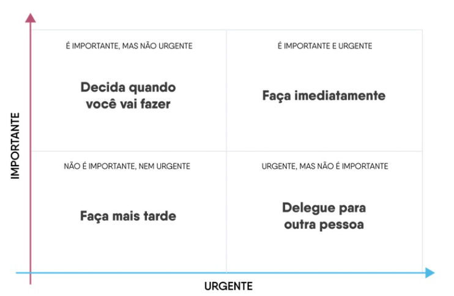

# Mindset fixo

(Mindset é configuracao mental)

Entender que Configuracao mental nao pode ser modificada...

Ex: ser timido e nao vai mudar...

## Frases:

- é muito dificil, melhor nem tentar
- Eu sabia que isso ia dar errado
- Eu nao posso mudar isso (nasci assim mesmo)
- Tenho que fazer tudo pelo meu time

## Principais caracteristicas na pessoa:

- O erro é sempre incopetencia
- Desafios devem ser evitados
- feedbacks tendem a nao ser bem vindos
- Nunca enxerga que é momento de mudar

# Mindset de crescimento

Compreende que com esforco e dedicacao sempre haverá espaco para o aperfeicomento (proximo nivel)

Em casos de erros, quem tem essa mentalidade nao taxa as pessoas de incopetentes por conta disso

## Frases:

- Ja aprendi muita coisa, mas posso aprender mais
- Se eu errar, eu vou aprender com o meu erro
- Eu posso mudar a situacao se concentar os meus esforcos nisso
- Meu time a capaz de se desenvolver de forma autonoma

## Principais caracteriscticas

- Coragem
- Esforco
- Aprendizado constante
- Da para ter mindset fixo em situacoes especificas

# Criatividade na pratica

Criatividade é a capacidade de resolver problemas de forma diferente do que se costuma fazer

Principal chave da criatividade é repertorio 
- Quanto mais bagagem

Porem quem tem menos experiente tendem a se permitir ser mais criativas (mas costuma precisar de ter validacoes, avaliar consequencias)

É preciso tomar cuidado com o midset fixo para lidar bem com a criatividade

# Proposito

Melhor liderar quando o proposito está de acordo com o proosito da empresa e os projetos...  Para inspirar as pessoas adequadamente

# Visao

Trabalhar com o olhar nao so no agora... mas entendendo onde quer chegar de acordo com o que esta sendo feito agora... Ate para onde queremos que as pessoas do time cheguem

Pode ser preciso se munir de informacoes com outras pessoas para reunioes de alinhamento para se adequadr melhor a isso...

# Gestão de tempo

é necessario que a lideranca tem o minimo de capacidade de gerar o seu tempo e das pessoas

Tomando cuidado com o micro gerenciamento

Dicas:

- Muitas pessoas utilizam de desculpas como: nao deu tempo. Ao inves de responsabilizar que o item nao é prioridade. 
    - Ex pessoal: Ir na academia... 
    - A falta de decisao tambem é uma decisao
    - Mudar a fala, ao inves de falar que nao tem tempo
- Tente entender o que realmente é minha prioridade
    - Parar para cronometrar o que foi prioridade
    - Pode entender que vc da prioridade para coisas que vc nao tem consciencia
        - Pode fazer isso com tempo de rede social com ferramentas de precisao

# Priorizacao

# Escuta ativa

Realmente estar ouvindo a pessoa em questao, nao apenas mecanicamente...

Exercicio

- Buscar nao interromper a outra pessoa
- Tentar lembrar exatamente as palavras exatas que a pessoa utilizou para se expressar

# Filtro emocional

As pessoas podem nao lembrar das palavras exatas que vc usou, mas vao se lembrar da emocao que vc causou

# Reescrita inconsciente

Quando vamos buscar recordar de algo que outra pessoa falou, o cerebro ainda fazer uma reescrita de forma inconsciente.

Sendo assim, isso reforca ainda mais a presença plena

# Principio 1 da escuta

## Empatia

O que fazer para melhorar:

- Respirar profundamente antes de responder
    - Para evitar a reatividade
    - Ajuda a refletir 
- Atencao na linguagem corporal
- Mente livre de julgamentos
- De tempo ao tempo da conversa
- Criar um ambiente de seguranca
    - Comeca em nao interromper a pessoa

# Principio 2 da escuta

## Validacao

O quanto estamos vendo se tudo está sendo entendido

- Parafrasear com suas proprias palavras
- Pedir pra pessoa explique o que voce está dizendo

# Principio 3 da escuta

## Investigacao

Garantir que a pessoa se sinta escutada

- Valorizar o que a pessoa esta dizendo
- Fazer peguntas investigativas que demontra vc que esta presetando atencao
    - Pode usar frases extatas
    - Fazer perguntar "abertas" e nao de sim ou nao
        - Como foi sua experiencia
        - O que vc mais gostou nessa atividade
    