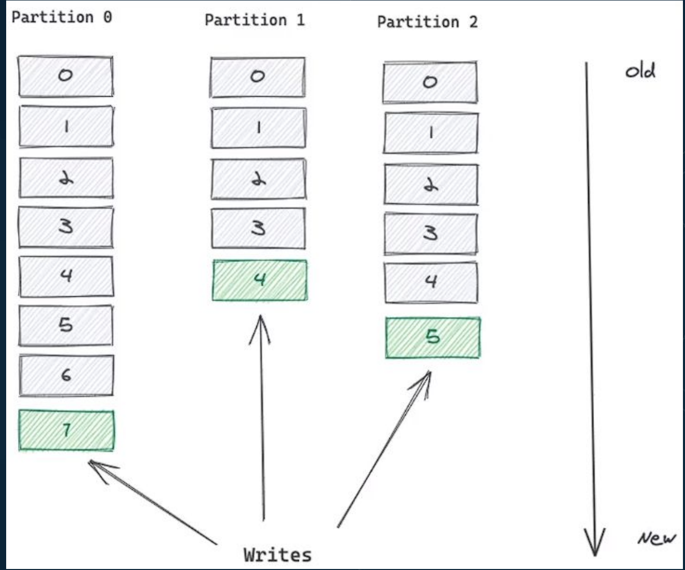

# Apache Kafka e oZookeeper

## Apache Kafka
- Broker de Mensageria
- Grava dados no disco
- Single node (dev) ou Cluster (prod)

## Apache Zookeeper
- Coordenador dos nós do Cluster Kafka.
- Eleição de líder.
    - se um nó cai, tem que eleger um novo lider
- Manutenção de metadados.
    - Para saber por exemplos quantos particoes, consumidores, offsets existem, nao precisa calcular na hora
- Gestão de configuração
    - Ex: quanto tempo reter mensagens

Um producao vao ter mais de um no do zookeper

## Remoção do Zookeeper?
- Substituição pelo Kraft (Apache Kafka Raft).
- Variação do algoritmo de Consenso Raft.
- Versão estável Apache Kafka 3.3
    - A partir dessa versao nao precisa mais de zookeper

# Produtores, Consumidores, Tópicos e suasprincipais linguagens e drivers

## Tópicos e partições
- Tópicos são unidades lógicas, divididos fisicamente em partições.
    - O topico é como se fosse apenas o schema(contrato) o dado fica realmente salvo nas particoes 
- Um tópico pode ter milhares de partições.
- Partições garantem escalabilidade.
- Princípio FIFO (First-In-First-Out) por partição.
- Cada mensagem possui: Value, Key e Headers.
- Mensagens são entregues na partição baseado na hash da Key
    - é como decide em qual particao que é... se for CPF, toda mensagem com mesmo CPF vai na mesma particao

## Tópicos e partições

- Tópicos e partições

A mensagem é replicada sempre para um follower

## Produtores

- Responsável por produzir mensagens na partição.
- Define como será a entrega da mensagem baseado no ACK = 0,1 ou all.
    - ACK = 0 . Não espera resposta, fire-and-forget.
    - ACK = 1 . Espera a resposta apenas no líder.
    - ACK = all . Espera a resposta de todos os brokers configurados no min.insync.replica.

## Consumidores

- São logicamente distribuídos em consumer groups.
- Cada consumer dentro do mesmo consumer group recebe apenas uma vez uma mensagem de uma partição.
    - Todos as intancias da sua aplicacao devem estar no mesmo consumer group
- Consumers groups diferentes podem receber a mesma mensagem.
- Cada partição não pode ter mais de um consumidor para o mesmo consumer group.
    - Em geral, cada pod vai ser um consumer. Uma particao nao pode ser consumida por mais de uma pod
    - Porem uma pod pode consumir mais de uma particao

## Principais linguagens e drivers

 - Exemplos de produtores e consumidores em várias linguagens no Github. (Java, Golang, Python, .NET, NodeJsentre outras).
- A maioria das linguagens usam o librdkafka escrito em C como wrapper para comunicação de baixo nível com o Kafka. Com exceção de Java, Scala, Clojure, Kotlin e o próprio C.

