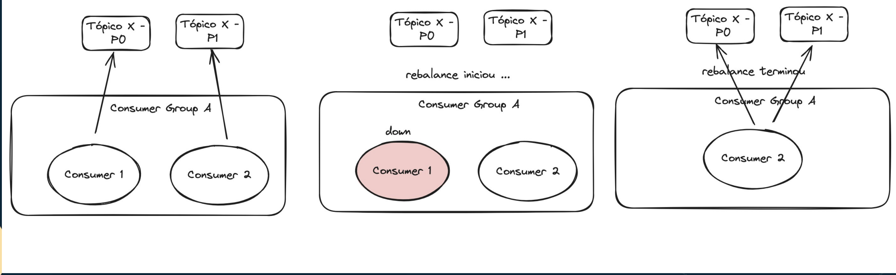

## Consumidores no Apache Kafka

- Possuem um agrupamento lógico chamado de “Grupo de Consumidores” (Consumer Groups).
    - Group.id é o consumer group
    - Ele pode ter um ou mais consumer
- Cada Consumer Groups pode possuir 1 ou muitos consumidores.
- Os consumidores, dentro dos Consumer Groups, são as aplicações que irão consumir do tópico do Kafka.

## Características de um Consumer Group
- Pode possuir um ou vários consumers.
- Cada mensagem recebida é enviada para apenas um ÚNICO consumer dentro do grupo.
- Consumer groups distintos podem receber a mesma mensagem.
- Offsets de Commit são compartilhados entre todos os consumers do grupo.
- Quando um consumer entra ou sai do grupo ocorre o evento de Rebalance.
- Os commits são gravados no tópico __commit_offsets
    - é um topico interno do kafka para controlar por consumer group

## Características de um Consumer
- Cada thread pode se inscrever em apenas uma única partição.
- Cada thread pode estar em apenas um único Consumer Group.
- Realizam os Commits das mensagens

# Estratégias de Commit e Seek

## O que é Offset?
- Offset é um número que identifica a posição da mensagem na partição de um tópico.
- Cada partição tem sua sequência de offsets.

## O que é Commit?
Commit é uma “marcação” que cada Consumer Group possui para dizer qual o último offset lido. Dessa forma cada consumer sabe qual a próxima mensagem a ser lida.

- A marcacao é uma unica para o consumer group é nao do consumer em si

### Auto Commit
Você pode optar por configurar seu consumidor para fazer o auto commit. Dessa forma toda mensagem que você receber será automaticamente comitada. Mas lembre-se que com esse cenário você poderá perder mensagens.

### Commit Manual

Em 99% dos casos você vai preferir usar o commit manual, ou seja, você escolhe quando realizar o commit. E geralmente isso é feito após o processamento.

### Auto Offset Reset

Propriedade de consumer

Pode ter os valores EARLIEST ou LATEST, onde EARLIEST irá consumir todas as mensagens do tópico quando novos consumidores foram iniciados e LATEST apenas as novas mensagens. 

## O que é Seek?

Usualmente apenas avançamos o offset a cada commit, porém certas vezes precisamos ir para um offset específico. O Seek permite que você mova o commit do Consumer Group para uma posição específica no tempo.

### Estratégia de Retry com Seek

O Seek é uma feature muito poderosa que permite você fazer retry de uma mensagem. 

# Rebalance

## O que é Rebalance?

- Quando um consumidor entra/sai de um consumer group ocorre o que chamamos de Rebalance.
- O Rebalance é a tentativa de redistribuir as partições entre os consumidores, garantindo balanceamento.

## Outros triggers para o Rebalance ...
- Consumer ocioso por muito tempo, sem consumir mensagens.
- Novas partições adicionadas ao tópico.
    - Por isso é bom sempre deixar o numero de particoes com um numero alto de particoes
    - Vai precisar recalcular o hask em cima da key para criar a divisao de quem vai pra cada particao

## Quais os problemas do Rebalance ? Porque evitar ...

- Latência aumenta. Dependendo do tamanho do cluster pode levar minutos ou horas.
- Vazão diminui.
- Aumenta uso de recursos (CPU, Memória e Network).
- Potencial duplicação e/ou perda de dados.

## Dicas para evitar..

- Evite configurar Auto Scaling nas suas aplicações. Operações de Scale In e Out irão causar rebalance no consumer group. Se for realmente necessário, faça em momentos de pouco uso.
- Evite adicionar partições a tópicos existentes.
- Evite processamentos muito demorados, ao receber mensagens.
- Use estratégias de rebalance e particionamento corretas

## Estratégias de Particionamento

- Algumas vezes o rebalance é inevitável, mas podemos reduzir o impacto, usando a estratégia de particionamento correta.
- Particionamento ocorre quando uma partição precisa ser assinada a um consumidor.
- Quando um consumidor entra/sai do Consumer Group, usualmente as partições são redistribuídas entre todos, causando o “stop-the-world”.
- As estratégias existentes são: Round Robin, Sticky, Range

### Estratégias de Particionamento: Range

- Consumidores são colocados em ordem lexicográfica.
- Partições são ordenadas de forma numérica. Então temos: A0,B0,A1,B1 e consumidores: C1,C2,C3.
- Casos de uso: colocation.

### Estratégias de Particionamento: Round Robin

- Neste modelo as partições são distribuídas entre os consumidores usando o Algoritmo Round Robin.
- Aumenta o número de consumidores que serão usados, mas não diminui o número de movimentos.

### Estratégias de Particionamento: Sticky

- Aplica a mesma regra do Round Robin.
- A diferença está quando um dos consumidores sai do grupo, apenas essa partições é redistribuída, diminuindo o número de movimentos.

### Static Group Membership

- Define para cada consumer um set de partições, baseado no group.instance.id.
- Este consumer pode sair e entrar do grupo, as mesmas partições serão atribuídas a ele e nenhum outro consumer será afetado. (Zero Rebalance).
- O Rebalance ainda pode ocorrer, se o consumer ficar muito tempo fora (acima do session timeout). 

- Se basea em ter um numero de instancias da app mais fixo.

