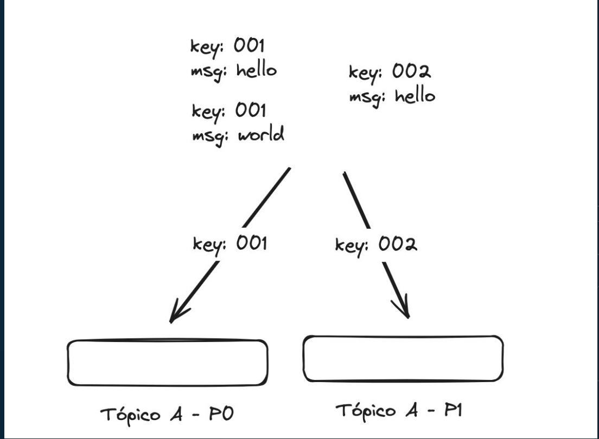
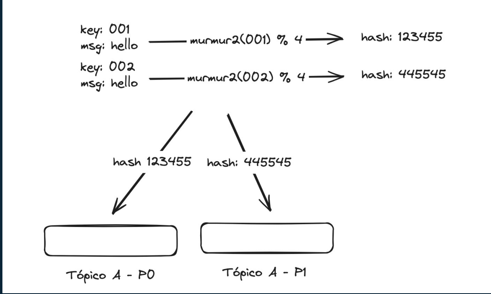
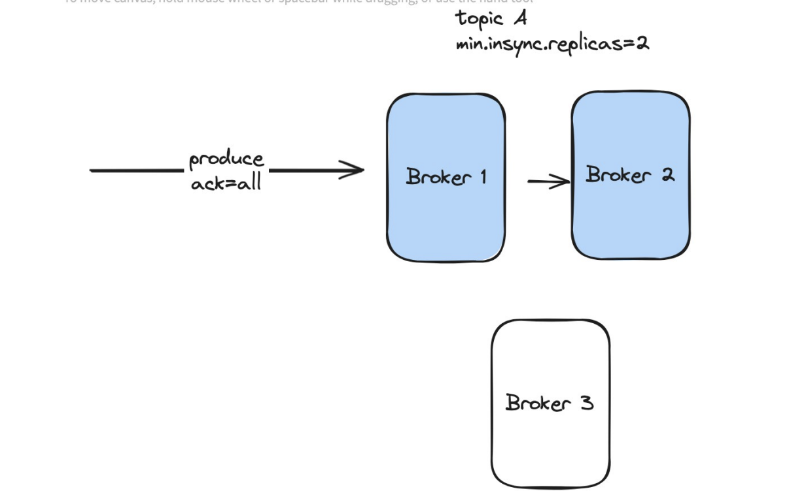
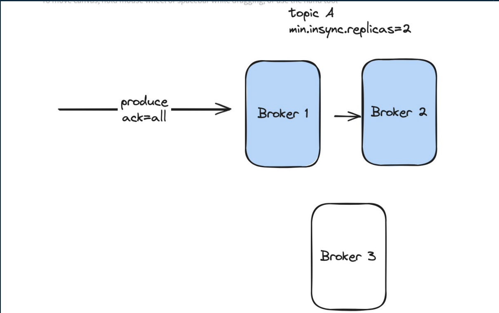

# Tópicos, Partições,Keys e seus algoritmos de distribuição

## Tópicos, Partições e Keys
- A junção desses três itens permite a ordenação e distribuição correta dos dados

O que é garantido que a key 002 sempre vai cair na mesma particao

# Hashing

- Kafka usa murmur2 como estratégia de hashing. O resultado do hash é aplicado a um módulo/resto (%) correspondente ao número de partições.
- Assim é possível determinar a partição correta, através do hash da key.
- Sem key uma partição é escolhida aleatoriamente.

Alterar o numero de particoes pode causar problema de ordenacao pois o calculo de hash vai ter resultados diferentes

# Estratégias de Produção de Mensagens

## Existem 3 estratégias de produção

### At most once
- Conhecido como “fire and forget”, a mensagem é enviada mas sem aguardo de retorno.
- Configuração ack=0 (sem aguardo de retorno).

### At least once
- Entrega no número de brokers configurado no “min.insync.replicas”.
- Configuração ack=all/-1, entrega na quantidade do min.insync.replicas

ack all funciona em conjunto com o “min.insync.replicas”

## Exactly Once

- Igual o At least once.
- Porém, usamos a propriedade “enable.idempotence=true” no producer para evitar duplicidade. 
    - Propriedade do produtor que vai chegar em um id da mensagem para enviar mandar de novo
    - Claro que piora a latencia

