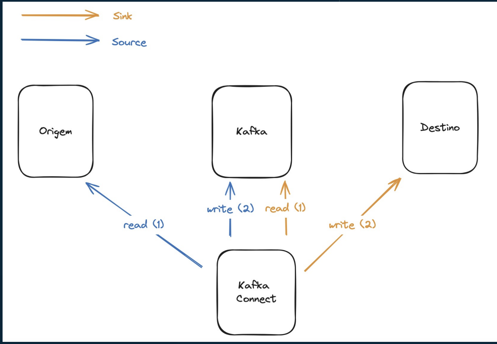
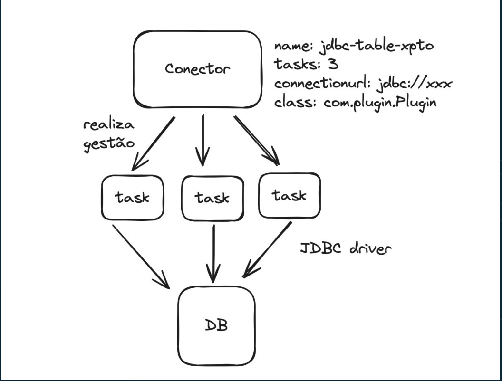

# O que é Kafka Connect ?

## Kafka Connect
- Ferramenta que auxilia na ingestão e extração de dados do Kafka.
- Instalação separada do cluster de Kafka, com monitoria e logs próprios


## Source e Sink
- O modo Source permite a leitura de uma origem qualquer e gravação no Kafka. (Ingestão).
- O modo Sink permite a leitura de um tópico do Kafka e gravação em um destino qualquer. (Extração).



## Conectores, Tasks e Plugins
- Plugins são efetivamente as bibliotecas implementadas em Java que fazem extração ou ingestão em diversas origens/destinos.
- Conectores usam esses plugins e fazem o setup da configuração, por exemplo: número de tasks, URLs de conexão, e etc.
- As tasks são onde efetivamente o processamento de extração e ingestão acontecem.





## Um pouco mais sobre plugins ...
- Existem milhares de plugins disponíveis, para conexão nas mais diferentes origens e destinos.
- Você pode encontrar alguns na Confluent Hub.


# Kafka Connect Rest API

## Como gerenciar seus conectores ?
- Em modo produtivo, usamos a API Rest do Kafka Connect para gerenciar os conectores.
- Existem diversos Endpoints que nos ajudam nessa tarefa.
- Aqui você encontra todos: https://docs.confluent.io/platform/current/connect/references/restapi.html#connectors
- Veremos os mais importantes nos próximos slides.

## Os endpoints para você salvar nos favoritos ...
- GET /connectors : Retorna a lista de conectores do seu cluster.
- GET /connectors/{nome-do-seu-conector}/status: Retorna o status do seu conector, com detalhes de erros se houver.
- GET /connectors/{nome-do-seu-conector}: Retorna os detalhes de configuração do conector.
- GET /connector-plugins: Retorna todos os plugins instalados no cluster.


- POST /connectors: Cria um conector.
- POST /connectors/{nome-do-seu-conector}/restart: Reiniciao o seu conector.
- DELETE /connectors/{nome-do-seu-conector}: Deleta o seu conector.


Um conector precisa de um plugin instalado... Sendo assim quando for criar um conector, vc informa qual plugin vai usar no body

# Subindo um cluster

O kafka conect vai ser uma instancia a mais que vai criar topicos de configs, ofsets e status. Juntamente consumer group proprio.

docker-compose de exemplo com broker kafka, kafka-connect e interface e zookeper

```yaml
version: '2'
services:
  zookeeper:
    image: confluentinc/cp-zookeeper:7.2.1
    ports:
      - "2181:2181"
    environment:
      ZOOKEEPER_CLIENT_PORT: 2181
      ZOOKEEPER_TICK_TIME: 2000

  broker:
    image: confluentinc/cp-server:7.2.1
    depends_on:
      - zookeeper
    ports:
      - "9092:9092"
    environment:
      KAFKA_BROKER_ID: 1
      KAFKA_ZOOKEEPER_CONNECT: 'zookeeper:2181'
      KAFKA_LISTENER_SECURITY_PROTOCOL_MAP: PLAINTEXT:PLAINTEXT,PLAINTEXT_HOST:PLAINTEXT
      KAFKA_ADVERTISED_LISTENERS: PLAINTEXT://broker:29092,PLAINTEXT_HOST://localhost:9092
      KAFKA_OFFSETS_TOPIC_REPLICATION_FACTOR: 1
      KAFKA_GROUP_INITIAL_REBALANCE_DELAY_MS: 0
      KAFKA_CONFLUENT_LICENSE_TOPIC_REPLICATION_FACTOR: 1
      KAFKA_CONFLUENT_BALANCER_TOPIC_REPLICATION_FACTOR: 1
      KAFKA_TRANSACTION_STATE_LOG_MIN_ISR: 1
      KAFKA_TRANSACTION_STATE_LOG_REPLICATION_FACTOR: 1
      KAFKA_JMX_HOSTNAME: localhost
      CONFLUENT_SUPPORT_CUSTOMER_ID: 'anonymous'

  kconnect:
    image: confluentinc/cp-kafka-connect:6.2.4
    ports:
     - 8083:8083
     - 5005:5005
    environment:
     - CONNECT_BOOTSTRAP_SERVERS=broker:29092
     - CONNECT_GROUP_ID=kconnect
     - CONNECT_PLUGIN_PATH=/data/plugins
     - CONNECT_CLIENT_ID=kconnect
     - CONNECT_CONFIG_STORAGE_TOPIC=_kconnect-configs
     - CONNECT_OFFSET_STORAGE_TOPIC=_kconnect-offsets
     - CONNECT_STATUS_STORAGE_TOPIC=_kconnect-status
     - CONNECT_REST_ADVERTISED_HOST_NAME=kconnect
     - KAFKA_OFFSETS_TOPIC_REPLICATION_FACTOR=1
     - CONNECT_CONFIG_STORAGE_REPLICATION_FACTOR=1
     - CONNECT_OFFSET_STORAGE_REPLICATION_FACTOR=1
     - CONNECT_STATUS_STORAGE_REPLICATION_FACTOR=1
     - CONNECT_PRODUCER_COMPRESSION_TYPE=lz4
     - CONNECT_CONSUMER_FETCH_MIN_BYTES=10000
     - CONNECT_CONSUMER_MAX_POLL_INTERVAL_MS=1800000
     - CONNECT_OFFSET_FLUSH_TIMEOUT_MS=600000
     - TZ=America/Sao_Paulo
     - CONNECT_KEY_CONVERTER=org.apache.kafka.connect.storage.StringConverter
     - CONNECT_VALUE_CONVERTER=org.apache.kafka.connect.storage.StringConverter
     - KAFKA_OPTS=-agentlib:jdwp=transport=dt_socket,server=y,suspend=n,address=*:5005
    volumes:
     - "./data:/data/"
    healthcheck:
      disable: true
    depends_on:
     - broker

  akhq:
    image: tchiotludo/akhq
    environment:
      AKHQ_CONFIGURATION: |
        akhq:
          connections:
            kafka:
              properties:
                bootstrap.servers: "broker:29092"
              connect:
                - name: kafka-connect
                  url: http://kconnect:8083
    depends_on:
     - broker
     - kconnect
```


# Configurando um JDBC sourceu ai