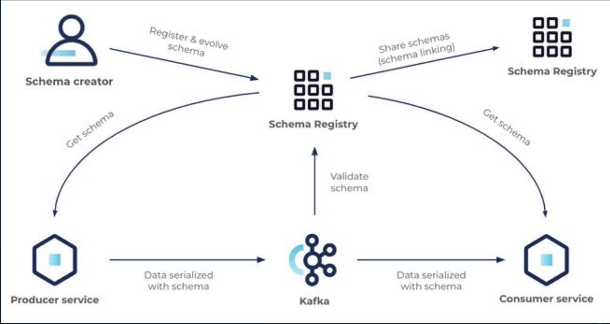

# O que é Schema Registry ?

## Principais Objetivos
- Garantia de contrato entre produtor e consumidor
- Evolução de contrato de forma retro compatível.
- Governança de dados
    - Nao permitir dados confidenciais por exemplo

é um cluster separado que fica o schema registry

- Produtor bate no schema registry para obter o schema e produz a mensagem serializada com o schema no corpo
- Kafka bate no schema registry para validar o schema da mensagem
- Consumidor bate no schema registry para obter o schema e usa para desarializar
- Produtor e consumidor guardam o schema em memoria para evitar bater o tempo todo

## Formatos Suportados
- Avro
- Protobuf
- JSON Schema

## Formatos Suportados
• Avro
• Protobuf
• JSON Schema

# Entendendo o ciclo de vida de um Schema

## Ciclo de Vida de um Schema

- Qualquer alteração no schema segue um padrão de compatibilidade, que pode ser escolhido por você.
- Assim garantimos, ou não, a retro compatibilidade entre schemas.
- Os tipos possíveis são:

BACKWARD
BACKWARD_TRANSITIVE
FORWARD
FORWARD_TRANSITIVE
FULL
FULL_TRANSITIVE
NONE

## Schema Compatibility Types

| Compatibility Type  | Changes allowed                | Check against which schemas | Upgrade first |
|----------------------|--------------------------------|-----------------------------|---------------|
| **BACKWARD**         | - Delete fields   - Add optional fields | Last version                | Consumers     |
| **BACKWARD_TRANSITIVE** | - Delete fields   - Add optional fields | All previous versions        | Consumers     |
| **FORWARD**          | - Add fields   - Delete optional fields | Last version                | Producers     |
| **FORWARD_TRANSITIVE** | - Add fields   - Delete optional fields | All previous versions        | Producers     |
| **FULL**             | - Add optional fields   - Delete optional fields | Last version                | Any order     |
| **FULL_TRANSITIVE**  | - Add optional fields   - Delete optional fields | All previous versions        | Any order     |
| **NONE**             | - All changes are accepted    | Compatibility checking disabled | Depends    |

