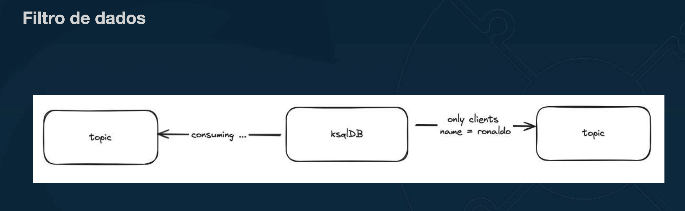
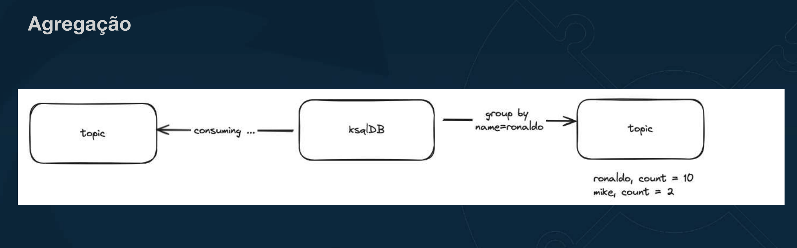
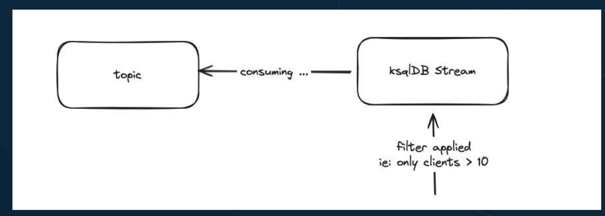
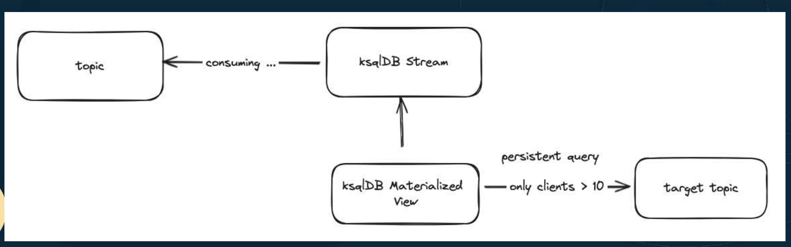
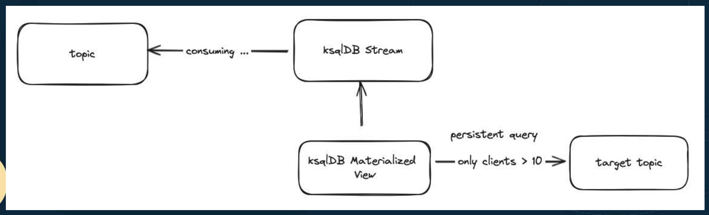

# O que é ksqlDB ?

kqlDB
- Ferramenta apartada do cluster de Kafka.
- Permite agregação, filtro e transformação de dados em real time.
- Funciona com uma linguagem similar ao SQL, já conhecido de bases relacionais.

## Alguns links importantes...
- https://docs.ksqldb.io/en/latest/developer-guide/ksqldb-reference/aggregate-functions/
- https://docs.ksqldb.io/en/latest/developer-guide/ksqldb-reference/scalar-functions/
- https://docs.ksqldb.io/en/latest/developer-guide/ksqldb-reference/table-functions/

# Streams, Tables, Queries e Materialized Viewes

## Streams
- Possui o histórico completo dos eventos.
- Append Only.
- Usa o comando CREATE STREAMS
- Pode originar de outras streams, ou de um tópico.

## Tables e Materialized Views

- Escreve o resultado em um tópico de destino.
- Mantém o último registro, dado uma função de agregação.
- Normalmente usado a partir de um stream previamente criado.

## Queries
- Podem ser do tipo Persistent, Pull e Push.
- Persistent originam novos streams ou tables e rodam em background por um longo período.
- Push recebem uma notificação a cada novo registro.
- Pull retornam os registros por demanda, ou seja, não há notificação quando novos registros chegam.

