# Ranking db-engines

https://db-engines.com/en/ranking

# Definicao de banco de dados

## Definicao oracle

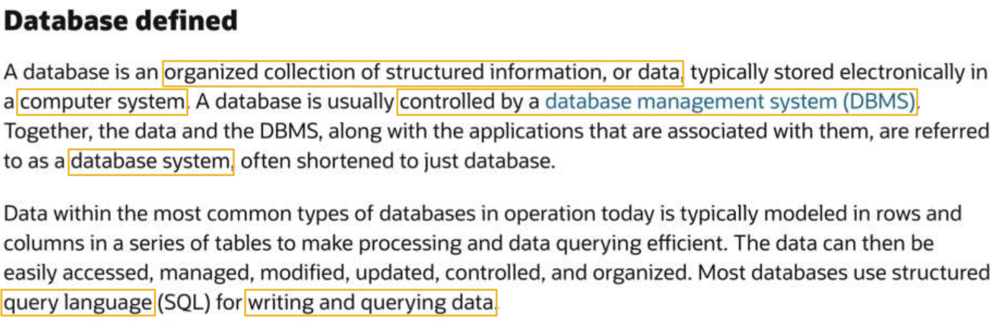


## Definicao mongoDB


### Definicao propria

Banco de dados ou base de dados:
- é uma coleção organizada de
    - informações ou
    - dados estruturados e não estruturados
        - armazenados eletronicamente
            - em uma máquina local ou
            - em nuvem.
- é controlado por um Sistema Gerenciador de Banco de Dados (SGBD),
    - traduzido do inglês Database Management System (DBMS).
- usa uma linguagem de consulta (query language) para escrever e ler os dados.

# Dados Estruturados, Semi-Estruturados e Não-Estruturados

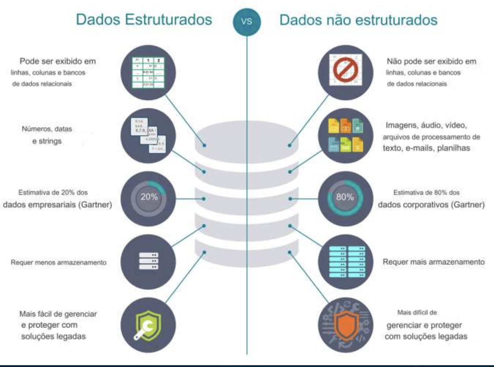

## Dados semi estruturados
- json
- xml

# Bancos de Dados SQL e NoSQL

Em geral, existem 2 tipos comuns de bancos de dados:

1) Bancos de Dados de Linguagem de Consulta Estruturada Structured Query Language (SQL)
2) e Bancos de Dados NoSQL.

O banco de dados de uma aplicação deve ser determinado por suas necessidades e restrições.

## Bancos de Dados Relacionais (SQL)

- Projetados na década de 1970.
- Geralmente usa Structured Query Language(SQL) para operações como criação, leitura, atualização e exclusão de dados (CRUD).
- Armazena dados em tabelas com colunas e linhas, que podem ser unidas por campos conhecidos como chaves  estrangeiras, estabelecendo relacionamentos entre as
    - Modelo pre definido
    - Mapeamento objeto relacional, considerando que usamos orientacao objeto
    - Geralmente sao mais tabelas para um objeto
- PostgreSQL, MySQL, Microsoft SQL Server e Oracle são exemplos.

“Future users of large data banks must be protected from having to know how the data is organized in the machine. A prompting service which supplies such information is not a satisfactory solution.
Activities of users at terminals and most application programs should remain unaffected when the internal representation of data is changed and even when some aspects of the external representation are changed.” (Edgar Codd,1970).

## Bancos de Dados Não Relacionais (NoSQL)

o coneceito esta mais para NOT ONLY SQL 

- O big data trouxe bem essa necessidade... Para permitir receber dados nao estruturados de forma performatica
- O banco de dados tradicional escala de forma vertical

- Comumente chamados de Bancos de Dados NoSQL.
- Amadureceu devido às aplicações web modernas cada vez mais complexas.
- As variedades desses bancos de dados proliferaram na década de 2010.
- Exemplos populares são MongoDB, Cassandra, DynamoDB, Redis e Neo4j.

# Tipos de Bancos de Dados NoSQL

No relacional precisa aumentar capacidade da maquina em si (escalabilidade vertical)... 
Ambientes produtivos bancos NoSQL vao ser clusterizados, isto é, com mais de um nó

### Bancos de Dados NoSQL de Documento

Ex (mongoDB)

- Armazena dados em documentos JSON, BSON ou XML.
- Elementos específicos podem ser indexados para consultas mais rápidas.
    - indice permite vc acessar qualquer registro da base na mesma quantidade de tempo
- Formato muito mais próximo dos objetos de dados usados na aplicação.
- Menos tradução é necessária para usar e acessar os dados.
- Flexibilidade de retrabalhar suas estruturas de documentos.
    - Fica mais proxima do codigo, geralmente as libs sao mais intuitivas por conta disso
- Os dados se tornam como código e ficam sob o controle dos desenvolvedores.
- Não requer intervenção dos administradores de banco de dados para alterar a estrutura de um banco de dados.

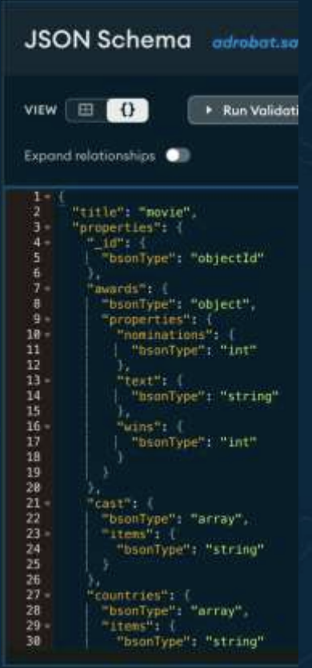

## Bancos de Dados NoSQL de Chave-Valor

- Tipo mais simples de banco de dados NoSQL.
- Cada elemento é armazenado como um par chave-valor que consiste em um nome de atributo (“chave”) e um conteúdo (“valor”).
- Este banco de dados é como um RDBMS com duas colunas: o nome do atributo (como "estado") e o valor (como "SP").
- Os casos de uso incluem carrinhos de compras, preferências e perfis de usuário.


(Se fosse um documental, mas com um documento mais simples)
O precursor é vc precisar operacao de leituras que nao precisam de join


## Bancos de Dados NoSQL Colunar

(Ex: cassandra)

- Também denominados “orientados à coluna” e “coluna larga”.
- Organizados como um conjunto de colunas.
- Consultas diretamente nas colunas selecionadas, sem consumir memória com dados indesejados.
- Colunas são do mesmo tipo e se beneficiam de uma compactação mais eficiente, tornando as leituras ainda mais rápidas. Entregam alta velocidade em operações de agregação.
- A maneira como os dados são gravados dificulta a consistência, pois as gravações de todas as colunas no banco de dados orientado a colunas exigem vários eventos de gravação no disco.

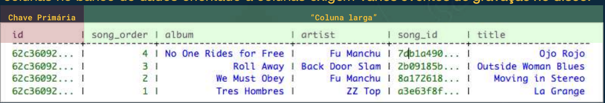

## Banco de Dados NoSQL de Grafo

(Ex: Neo4J)

- Concentra-se no relacionamento entre os elementos de dados.
- Cada elemento está contido como um nó.
- As conexões entre os elementos do banco de dados são chamadas de links ou relacionamentos.
- Otimizado para capturar e pesquisar as conexões entre os elementos, superando a sobrecarga associada ao JOIN de várias tabelas em SQL.
- Os casos de uso incluem detecção de fraudes e redes sociais.

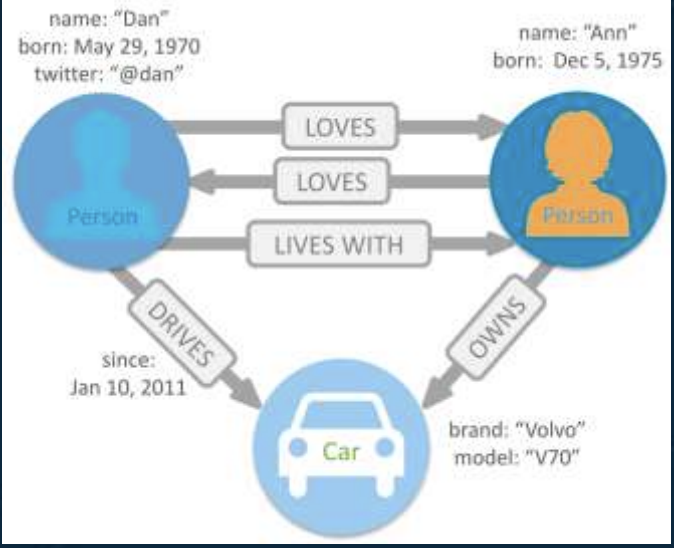


<details>


🧩 Tipos de Bancos de Dados NoSQL — Explicação Ampliada

📄 1. Banco de Dados de Documento

Exemplos: MongoDB, CouchDB, Firebase Firestore, Amazon DocumentDB

💡 Conceito
	•	Armazena documentos semi-estruturados (geralmente em JSON ou BSON).
	•	Cada documento pode ter campos diferentes, o que dá flexibilidade de schema.
	•	Ideal quando os dados representam entidades complexas com propriedades variáveis.
	•	Permite consultas por campos específicos, inclusive dentro de subdocumentos.

⚙️ Características
	•	Alta flexibilidade: não precisa definir schema fixo.
	•	Facilidade de integração com aplicações orientadas a objetos (mapeamento direto).
	•	Escalabilidade horizontal (clusterização automática).
	•	Bom equilíbrio entre leitura e escrita.

🧠 Casos de uso típicos

Caso	Descrição
E-commerce	Catálogo de produtos com atributos diferentes (ex: roupas, eletrônicos, alimentos).
CMS / Blogs	Armazenamento de artigos, comentários, usuários e tags em estrutura flexível.
Aplicativos Mobile	Dados sincronizados em tempo real via Firestore.

🚀 Exemplos reais
	•	MongoDB usado pela Adobe para armazenar configurações e dados de usuário no Creative Cloud.
	•	CouchDB usado pela BBC para guardar metadados de conteúdo multimídia.
	•	Firestore usado por apps como Lyft para sincronizar estados de corrida em tempo real.

⸻

🔑 2. Banco de Dados de Chave-Valor

Exemplos: Redis, Amazon DynamoDB (modo key-value), Riak KV, Memcached

💡 Conceito
	•	Estrutura extremamente simples: uma chave e um valor.
	•	Sem relacionamentos, sem schema — rápido e direto.
	•	Voltado para altíssima performance e baixa latência.

⚙️ Características
	•	Leitura e escrita muito rápidas (dados geralmente em memória).
	•	Excelente para caching e sessões.
	•	Escalabilidade horizontal fácil.
	•	Não é ideal para consultas complexas (sem “queries” estruturadas).

🧠 Casos de uso típicos

Caso	Descrição
Cache de aplicações	Guardar resultados de consultas caras (Redis + Spring Cache, por exemplo).
Sessões de usuários	Armazenar tokens e estado de sessão rapidamente.
Ranking e contadores	Jogos online e sistemas de pontuação (uso intensivo de operações INCR e ZADD).

🚀 Exemplos reais
	•	Redis usado pela Twitter e GitHub para cache e filas.
	•	DynamoDB usado pela Amazon no carrinho de compras (persistência de sessão distribuída).
	•	Memcached amplamente usado no Facebook para cache de páginas dinâmicas.

⸻

🧱 3. Banco de Dados Colunar

Exemplos: Apache Cassandra, HBase, ScyllaDB, Amazon Keyspaces

💡 Conceito
	•	Organiza os dados por colunas, não por linhas.
	•	Excelente para leituras analíticas e agregações, pois carrega apenas as colunas necessárias.
	•	Ideal para grandes volumes de dados distribuídos.

⚙️ Características
	•	Alta performance em leitura agregada (soma, média, contagem).
	•	Alta disponibilidade e replicação distribuída.
	•	Consistência eventual (trade-off típico do modelo BASE).
	•	Complexidade maior de escrita (múltiplos eventos por coluna).

🧠 Casos de uso típicos

Caso	Descrição
IoT e Telemetria	Grava milhões de eventos por segundo com leitura posterior agregada.
Logs e métricas	Armazenar logs distribuídos e consultas de performance (como Datadog, Prometheus).
Análise de séries temporais	Métricas financeiras, sensores e dados de desempenho.

🚀 Exemplos reais
	•	Cassandra usado pelo Netflix para armazenar histórico de streaming (logs e metadados de filmes assistidos).
	•	ScyllaDB utilizado pela Discord para mensagens e metadados de chats.
	•	HBase usado pelo Spotify para processar estatísticas de uso e recomendações.

⸻

🕸️ 4. Banco de Dados de Grafo

Exemplos: Neo4j, Amazon Neptune, ArangoDB, JanusGraph

💡 Conceito
	•	Armazena dados como nós (entidades) e arestas (relacionamentos).
	•	Otimizado para percorrer relações complexas — consultas de “quem está conectado com quem”.
	•	Ideal para análises de relacionamento e recomendação.

⚙️ Características
	•	Consultas rápidas sobre conexões complexas (sem JOINs pesados).
	•	Linguagens específicas como Cypher (Neo4j) e Gremlin.
	•	Escalabilidade horizontal limitada, mas desempenho relacional excelente.
	•	Modelo muito intuitivo para representar redes, grafos sociais e caminhos.

🧠 Casos de uso típicos

Caso	Descrição
Redes Sociais	Conexões entre usuários, seguidores, amigos, curtidas.
Detecção de Fraudes	Detectar cadeias de transações suspeitas entre contas.
Sistemas de Recomendação	“Usuários que compraram X também compraram Y”.

🚀 Exemplos reais
	•	Neo4j usado pela eBay para recomendação de produtos relacionados.
	•	LinkedIn usa uma abordagem de grafo interno (Galene) para modelar conexões profissionais.
	•	PayPal usa Amazon Neptune para detectar fraudes financeiras entre contas relacionadas.

⸻

🧭 Resumo Comparativo

Tipo	Estrutura	Foco principal	Exemplos	Casos típicos
Documento	JSON/BSON	Flexibilidade e integração com app	MongoDB, Firestore	Catálogos, conteúdo, apps mobile
Chave-Valor	Key → Value	Desempenho e simplicidade	Redis, DynamoDB	Cache, sessões, filas
Colunar	Colunas	Leitura analítica e escalabilidade	Cassandra, HBase	IoT, logs, análises
Grafo	Nós e Arestas	Relacionamentos complexos	Neo4j, Neptune	Recomendação, fraude, redes


⸻

Se quiser, posso te gerar um diagrama visual (tipo mapa mental ou tabela ilustrada em Markdown) com as categorias, bancos e casos — ajuda bastante pra revisão de prova ou resumo de módulo. Quer que eu monte?

<summary>Resumo chatGPT</summary>

</details>

-- 
<details>

Essa é uma dúvida bem comum quando se começa a estudar bancos NoSQL.
Vamos ver a diferença entre bancos de chave-valor e de documentos, com exemplos e comparações práticas 👇

⸻

🧱 1. Bancos de Chave-Valor

🧩 Estrutura
	•	Armazenam os dados como pares simples de chave e valor.
Exemplo:

"user:123" → "{name: 'Bruno', age: 30, city: 'BH'}"


	•	A “chave” é única e usada para buscar o valor.
	•	O “valor” é opaco para o banco: ele não entende o que há dentro — pode ser uma string, JSON, binário, etc.

⚙️ Características
	•	Altíssima performance em leitura e escrita (pois o acesso é direto pela chave).
	•	Nenhuma estrutura fixa: o banco não precisa saber o formato interno do valor.
	•	Pouca flexibilidade de consulta: você só consegue buscar por chave, não por campos dentro do valor.

🧰 Exemplos
	•	Redis
	•	Amazon DynamoDB (modo mais básico)
	•	Riak
	•	Memcached

📖 Analogia

É como um dicionário em programação:
você dá uma chave e recebe o valor, mas não pode fazer buscas complexas dentro dos valores.

⸻

📄 2. Bancos de Documento

🧩 Estrutura
	•	Armazenam dados em documentos estruturados (geralmente JSON ou BSON).
	•	Cada documento é autocontido e tem campos e valores (inclusive aninhados).
Exemplo (MongoDB):

{
  "_id": 123,
  "name": "Bruno",
  "age": 30,
  "address": { "city": "BH", "state": "MG" },
  "orders": [1001, 1002, 1003]
}


⚙️ Características
	•	Permitem consultas complexas: buscar por qualquer campo (ex: age > 25, address.city = "BH").
	•	Suportam índices em campos internos → performance melhor em buscas.
	•	Estrutura semiestruturada, próxima aos objetos usados em código.
	•	Mais pesados que chave-valor puros, mas muito mais flexíveis.

🧰 Exemplos
	•	MongoDB
	•	CouchDB
	•	Firestore
	•	AWS DocumentDB

📖 Analogia

É como uma coleção de objetos JSON:
você pode buscar por qualquer atributo interno, filtrar, agrupar, etc.

⸻

⚖️ Comparativo direto

Característica	Chave-Valor 🔑	Documento 📄
Estrutura dos dados	Par chave → valor opaco	Documento estruturado (JSON/BSON)
Tipo de consulta	Apenas pela chave	Por qualquer campo
Velocidade	Extremamente rápida	Muito rápida, mas um pouco menor
Flexibilidade de esquema	Alta	Alta
Indexação interna	Não	Sim
Casos de uso típicos	Cache, sessão, fila, contadores	Catálogos, perfis de usuário, logs, aplicações web
Exemplo de banco	Redis, DynamoDB (básico)	MongoDB, Firestore


⸻

💬 Resumo intuitivo
	•	Chave-valor → ótimo para acesso direto e simples (cache, sessão, lookup rápido).
	•	Documento → ótimo quando você precisa armazenar e consultar dados estruturados e flexíveis, como se fossem objetos JSON do seu sistema.

⸻


<summary>chatGPT - diferencas entao chave valor e documento </summary>

</details>

# Bancos de Dados NewSQL

- Com a ascensão do Kubernetes e sua capacidade de oferecersuporte a aplicações stateful, vimos uma nova geração de bancos de dados aproveitar as vantagens da conteinerização.

- Esses novos bancos de dados nativos da nuvem visam trazer os benefícios de escalabilidade e disponibilidade do Kubernetes para os bancos de dados.

NewSQL é uma classe de sistemas de gerenciamento de banco de dados relacionais que busca fornecer a escalabilidade de sistemas NoSQL para cargas de trabalho de processamento de transações online (OLTP), mantendo as garantias ACID de um sistema de banco de dados tradicional.
- OLTP: OnLine Transaction Processing
- ACID: Atomicidade - Consistência - Isolamento - Durabilidade

STONEBRAKER e CATTEL (2011) definem cinco aracterísticas de um NewSQL:
1. Linguagem SQL como meio de interação entre o SGBD e a aplicação;
2. Suporte para transações ACID;
3. Controle de concorrência não bloqueante, para que as leituras e escritas não causem conflitos entre si;
4. Arquitetura que forneça um maior desempenho por nó de processamento;
5. Arquitetura escalável, com memória distribuída e com capacidade de funcionar em um cluster com um grande número de nós.


# Outros tipos

## Bancos de Dados Hierárquicos

- Desenvolvido na década de 1960, o banco de dados hierárquico se parece com uma árvore genealógica.
- Um único objeto (o “pai”) possui um ou mais objetos abaixo dele (o “filho”).
- Nenhum filho pode ter mais de um pai.
- Oferece alto desempenho pois possui acesso fácil e tempo de consulta rápido como consequência do padrão rígido e
complexo de navegação pela árvore.
- O Registro do Windows é um exemplo desse sistema (sistema de arquivos FAT)

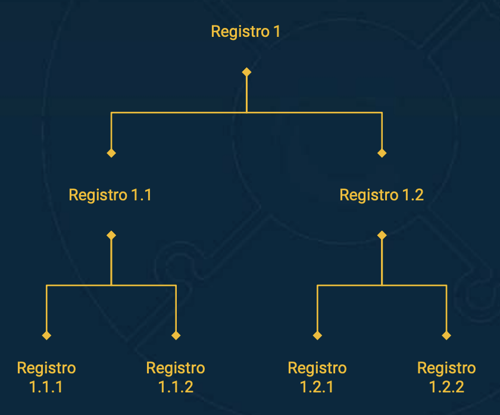

## Bancos de Dados Orientados a Objetos

- Informação representada na forma de objetos, como na ProgramaçãoOrientada a Objetos.
- Armazenam e gerenciam objetos no disco de um servidor de banco de dados.
- As consultas de dados em relacionamentos complexos são rápidas e poderosas.
- Um exemplo de banco de dados orientado a objetos é o MongoDB Realm, onde a linguagem de consulta constrói objetos
nativos por meio do SDK escolhido.

```
class Carro extends Realm.Object {
static schema = {
name: 'Carro',
properties: {
fabricante: 'string',
modelo: 'string',
quilometragem: {type: 'int', default: 0},
timestamp: {
type: 'int',
default: () => Math.round(new Date().getTime() / 1000),
},
},
};
}
```

## Para escolher o banco de dados da maneira adequada:

Compreenda os Requisitos do seu Caso de Uso

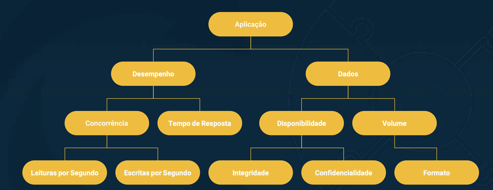


# Computação em Nuvem

## Características Essenciais

É uma abordagem de negócio e de entrega de tecnologia da informação que é composta por 5 características essenciais:

1) autosserviço sob demanda,
    Ser capazes de consumir o servicos de computacao em nuvem sozinhos, sem intervençao de alguem
    Usar(pagar) exatamente aqui de hardware que precisamos
2) amplo acesso pela rede,
    Independe da geografiam, precisamos ter acesso
3) compartilhamento dos recursos tecnológicos coletivos entre múltiplos clientes,
4) elasticidade rápida e aparentemente infinita e
5) medição, controle e observabilidade do consumo dos recursos.

## Modelos de serviço

1) Software como Serviço (SaaS, Software as a Service),
    Maior parte da resp fica no provedor de nuvem
    Preocupamos com criacao de usarios, dados apenas
2) Plataforma como Serviço (PaaS, Platform as a Service) e
    Um pouco mais de resp.
    Maior parte do banco de dados
3) Infraestrutura como Serviço (IaaS, Infrastructure as a Service).
    Classicas maquinas virtuais


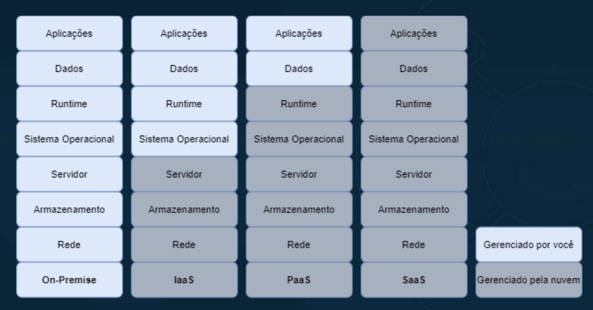    

## Modelos de Implantação e Nativo da Nuvem

1) Nuvem Privada,
    Evolucao do datacenter tradicional
2) Nuvem Comunitária,
    Empresas se reunem para contratar uma privada em conjunto
3) Nuvem Pública e
    AWS, azure, etc
4) Nuvem Híbrida composta pela combinação dos modelos de serviço anteriores.

## Cloud native

Uma aplicação nativa da nuvem é um programa de computador especificamente projetado para realizar o seu propósito de negócio e que satisfaz às características essenciais da computação em nuvem, adota os modelos de serviço e implantação adequadamente e de forma otimizada.
As aplicações nativas da nuvem são especificamente projetadas para tirar vantagem das inovações da computação em nuvem. Facilmente integramse com suas respectivas arquiteturas em nuvem, alavancando os recursos em nuvem e capacidades elásticas.


Aplicações que não foram projetadas para a nuvem não podem tirar vantagem da escalabilidade e resiliência do ambiente em nuvem.
As aplicações nativas da nuvem são resilientes, gerenciáveis e alavancadas pelo conjunto de serviços do provedor de nuvem que as acompanham, tais como alto nível de observabilidade, automação e previsibilidade

# Cargas de Trabalho Transacionais e Analíticas

## OLTP → OnLine Transaction Processing

É um tipo de processamento de dados que consiste na execução de várias transações que ocorrem simultaneamente (transações bancárias online, compras, entrada de pedidos ou envio de mensagens de texto, por exemplo).

Normalmente envolve inserir, atualizar e/ou excluir pequenas quantidades de dados em um armazenamento de dados para coletar, gerenciar e proteger essas transações, sejam elas econômicas ou financeiras (em sua definição original).

- Tipo de carga mais tradicional que o banco relacionais mais usam
- A estrutura deles favorece isso

## OLAP → OnLine Analytical Processing

OLTP permite a execução em tempo real de um grande número de transações por um grande número de pessoas, enquanto o processamento analítico online (OLAP) geralmente envolve a consulta dessas transações (também chamadas de registros) em um banco de dados para fins analíticos.


O OLAP ajuda as empresas a extrair insights de dados de transações para que possam usá-los em tomadas de decisões mais informadas.

## OLTP vs OLAP

| OLTP | OLAP |
|------|------|
| Executa em **tempo real** um grande número de transações de banco de dados por um grande número de pessoas. | Envolve a **consulta de muitos registros** (até mesmo todos os registros) em um banco de dados para **fins analíticos**. |
| Tempos de resposta **extremamente rápidos**. | Requer tempos de resposta **mais lentos** do que os exigidos pelo OLTP. |
| **Modifica** pequenas quantidades de dados **com frequência** e geralmente envolve um equilíbrio de leituras e gravações. | **Não modifica** os dados de forma alguma; cargas de trabalho são geralmente de **leitura intensiva**. |
| Usa **dados indexados** para melhorar os tempos de resposta. | Armazena dados em **formato colunar** para permitir **acesso fácil** a um grande número de registros. |
| Exige **backups frequentes ou simultâneos**. | Exige **backups muito menos frequentes**. |
| Exige relativamente **menos espaço de armazenamento**. | Armazena **grandes quantidades de dados históricos**. |
| Geralmente executa **consultas simples** envolvendo apenas um ou alguns registros. | Executa **consultas complexas** envolvendo um **grande número de registros**. |


Portanto, OLTP é um sistema de modificação de dados em tempo real, enquanto OLAP é um sistema de armazenamento de dados multidimensional histórico em tempo real usado para recuperar grandes quantidades de dados para fins analíticos. OLAP geralmente fornece análises sobre dados que foram capturados por um ou mais sistemas OLTP.


# Cloud DBMS

São produtos de software que armazenam e manipulam dados e que são entregues principalmente como software como serviço (SaaS) na nuvem. 

Os SGBDs em nuvem podem, opcionalmente, serem capazes de executar localmente (on-premises) ou em configurações híbridas, multi nuvem ou inter nuvem.

Podem ser usados para trabalho transacional e/ou analítico.

Podem ter recursos de um ecossistema de dados mais amplo.


## Sistemas Gerenciadores de Banco de Dados em nuvem entregam pelo menos 1 destes casos de uso:

1. OLTP: foco transacional com esquema de dados fixo e estável.
2. Transações leves: volumes muito elevados de transações simples com alta simultaneidade, potencialmente com consistência relaxada.
    - Ate esse ponto isso nao era possivel com bancos relacionais tradicionais
3. Inteligência operacional: grande número de usuários simultâneos que executam consultas analíticas curtas, ao mesmo tempo em que entrega cargas de trabalho operacionais.
    - Da pra entender como um relacional porem com modelos preditivos
4. Data Warehouse Tradicional: dados estruturados históricos de múltiplas origens.
    - Dados estruturados historicos e de multiplas origens
5. Data Warehouse Lógico: camada lógica ou virtual para uma variedade de origens
    - diferente sistemas de origens virtualizados em uma unica camada
6. Data Lake e Machine Learning: armazenamento e processamento de dados com diferentes estruturas e origens.


## Sistemas Gerenciadores de Banco de Dados em nuvem entregam estas capacidades:

1. Disponibilidade de software como serviço (SaaS) em nuvens públicas ou privadas.
2. Gestão dos dados em armazenamento em nuvem, ou seja, não é infraestrutura como serviço (IaaS).
3. Persistir dados no armazenamento controlado pelo próprio SGBD em nuvem.
4. Componentes de gerenciamento de dados que armazenam, leem, atualizam e gerenciam dados. Não é um aglomerado de diferentes ferramentas.
5. Suporte a operações transacionais ou analíticas ou ambas.
6. Opcionalmente, suportar múltiplos modelos de dados e tipos de dados (relacionais, não-relacionais, geoespaciais, séries temporais e outros).


# Databases, Data Warehouses e Data Lakes

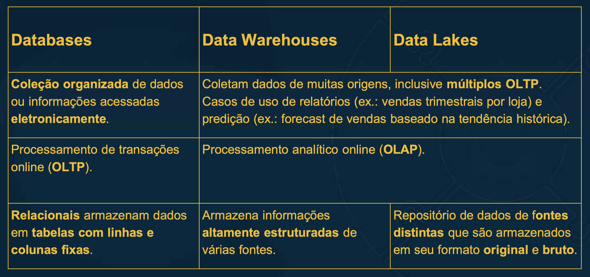

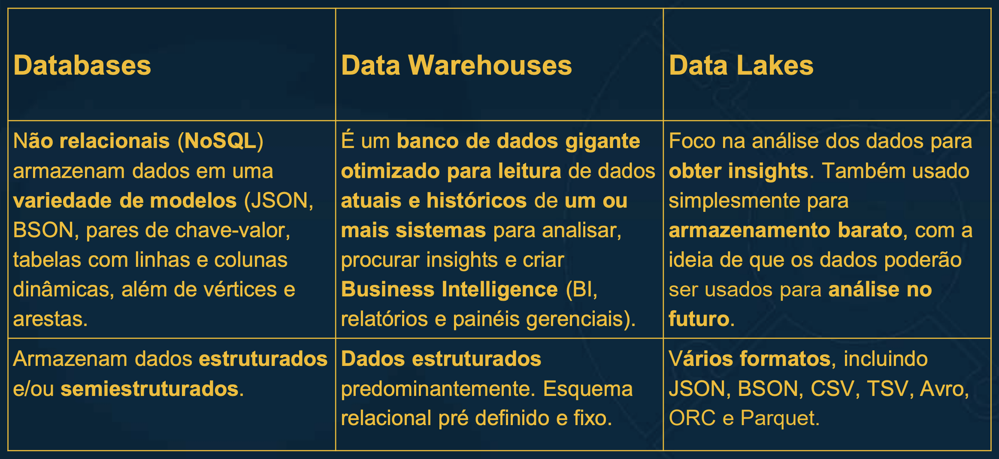

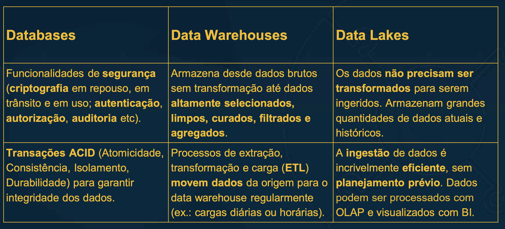

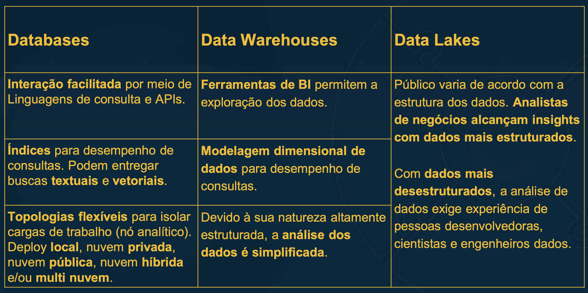

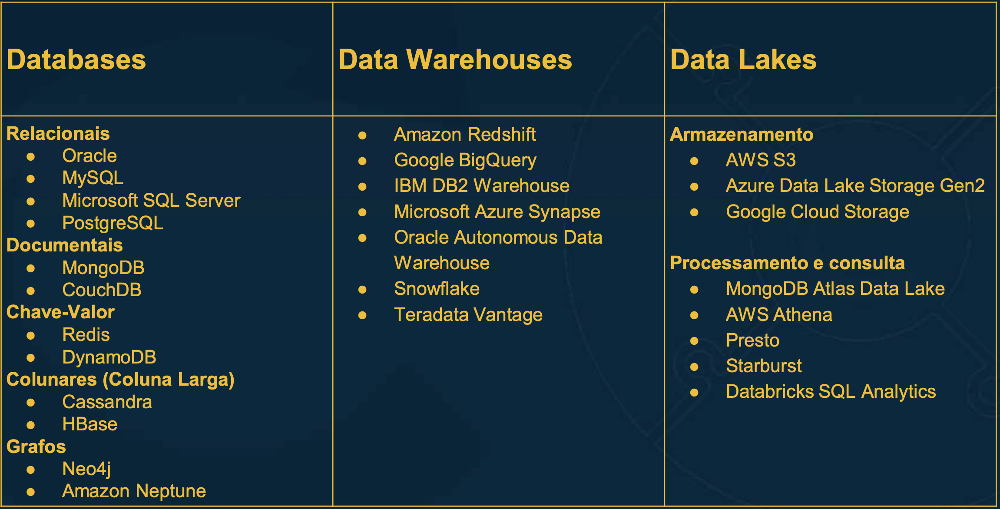

# Arquitetura Data Warehouse

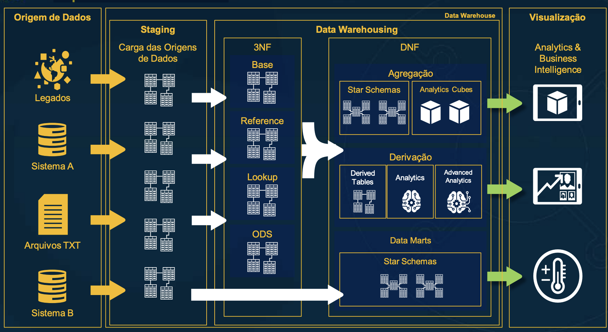

## 3 elementos principais

- Pilar de origem de dados - OLTP da empresa
	- As vezes carrega planilhas txts, etc
	- Predominantemente sera estruturado
- Data warehouse
	- é o artefato que é repositorio de dados, frequentemente em dado relacional
	- Costuma ser implementacao personalizada para cada caso
	- Data warehousing se trata do processo de movimentacao do dados da origem ate a estrutura que faz limpeza, curadoria, e preparacao ate a vizualizacao
- Vizualicao
	- Camada com ferramentas para exibir com ferramentas 

## dentro do Data warehouse tem as estrutas

- Stagging
	- faz carga da origem para uma area. de forma mais rapida fazendo uma copia fiel
	- É util ter a camada identica, para evitar depois ter um volume a mais lendo do processo de negocio
- Data warehousing
	- 3Mf (terceira forma normal)
		- Camada nessa forma com todos os dados juntando versoes de todas as aplicacoes (Ex: clientes de todas origens possiveis)
	- DNF (dimentional normal form)
		- o modelo admita um denormalizacao para otimizar
			- Vai utilizar dimensoes e tabelas fato
				- Dimensao é entidade
				- Fato é o ocorrido
			- Start schema é a dimensao no meio e fatos nas pontas
	- Podemos tambem ter tabelas derivadas
	- Podemos tambem data mart, que seria formas de compartilhar dimensoes que tem relacoes umas com as outras

# Fama do Data Warehouse

- Percepcao do mercado sobre ele durante o tempo

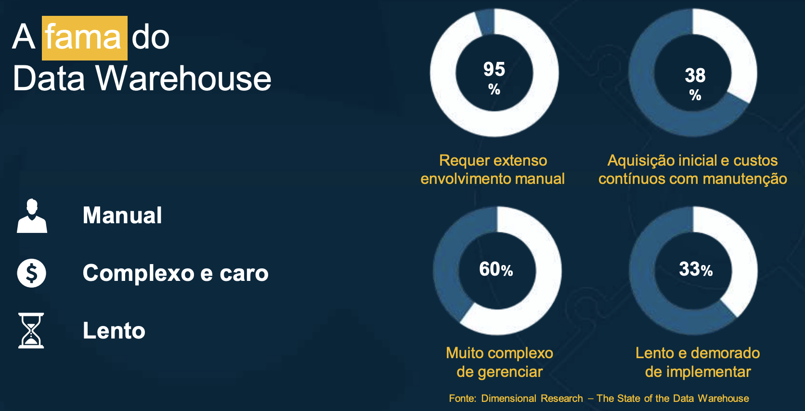

- Geramente é entendido como um processo muito manual
	- Cada um é de uma jeito
	- Nao se compra pronto
- Complexidade e custo elevado
	- Encaixar no elementos
	- Modelar tudo
	- Gestao é complexa
- Lentidao
	- Do ponto de vista do projeto
	- Auge no waterfall
	- Se quer um relatorio hoje, vai vir depois de meses


# Arquitetura Data Lake

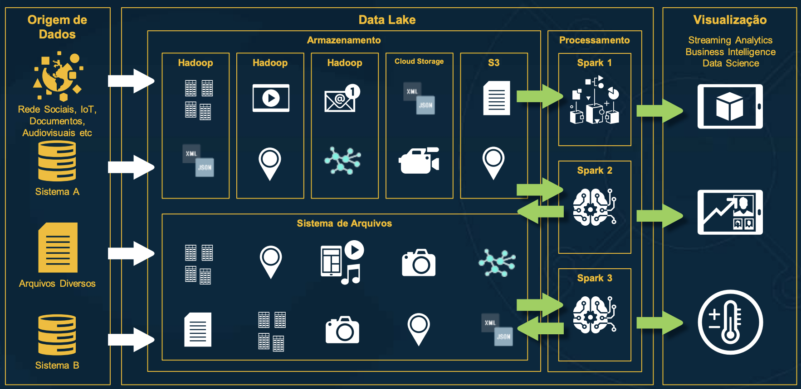

## 3 elementos principais

- Pilar de origem de dados
	- Com mais formatos que o DW, e bem diversa
	- Mais toleravel a dados nao estruturados
		- Dados de rede socias
		- PDF
		- Imagens
- Datalake
	- Com armazenamento
		- separado do processamento
		- comecou com hadoop
			- Distribuicao da persistencia
			- Processamento distribuido (chamado de mapreduce)
	- Com processamento
		- como se fossem jobs
		- podem devolver para o datalake
		- podem ser usado para vizualizacao
- Consumo
	- Pode ser uma ferramenta de BI (mesma do DW)
	- Notebooks para usuarios mais avancados (DS e eng de dados)

# Maturidade do Data Lake

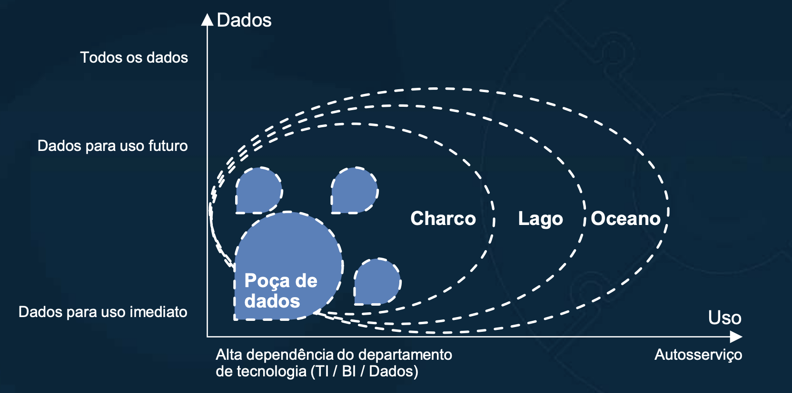


# A Fama do Data Lake

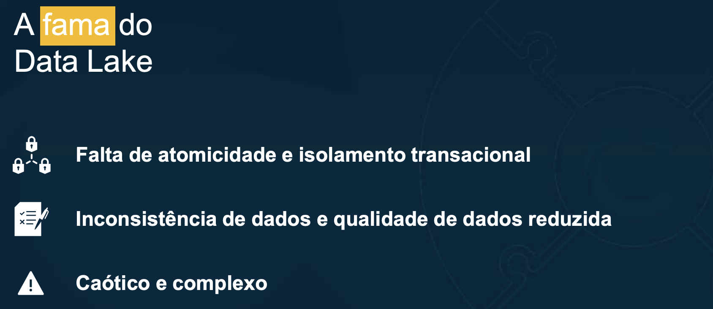

- Falta de atomicidade e isolamento transacional
	- Vamos perceber que como acontece muita coisa ao mesmo tempo e distribuido, perdemos atomicidade (transacoes pela metade)
- Inconsistencia de dados e qualidade reduzida
	- acontece de leituras de coisas que ja nao fazem mais sentido
	- em camadas mais crus e brutas isso é pior
- Complexo e caotico


# Arquitetura Lakehouse

Lakehouse: um novo paradigma que combina elementos de Data Lake e Data Warehouse.


- Acid
	- Trazem um integridade forte para os dados
- Conformidade de esquema
	- Mecanismos de validacao do esquema de dados
	- é possivel utilizar ou nao
- Formatos diversos e abertos
	- A ideia é ter arquivos que qualquer um pode ler
- Abordagem amba transacional e analitica para leitura de arquivos
- Upsert e deletes paralelos
	- Promessa de garantia de integridade
- Governanca de dados
	- Evitar tornar um pantano

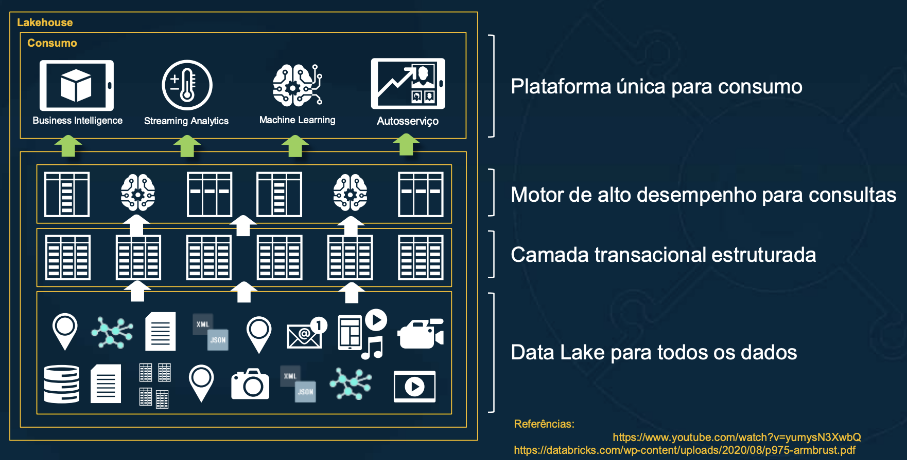


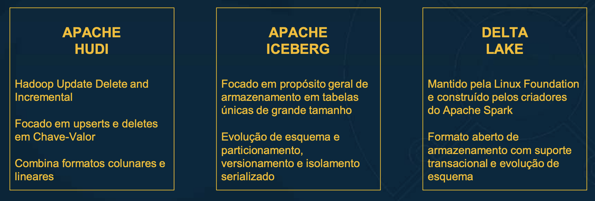

- Delta lake é o mais famoso

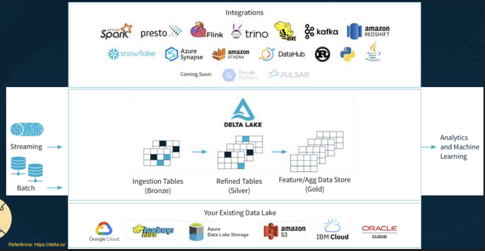


# Estratégia de Dados

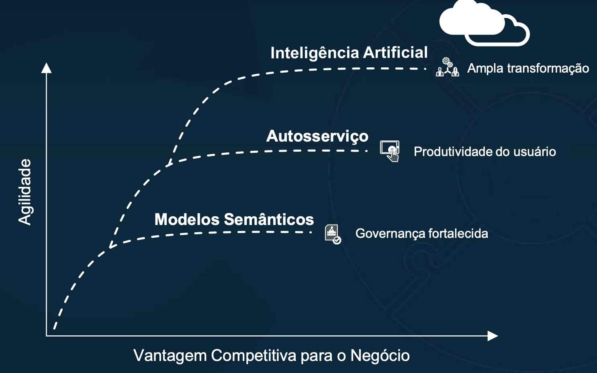

- Modelos semanticos

# Repositório Ideal de Dados

Pergunta: Qual o repositorio ideal de dados?

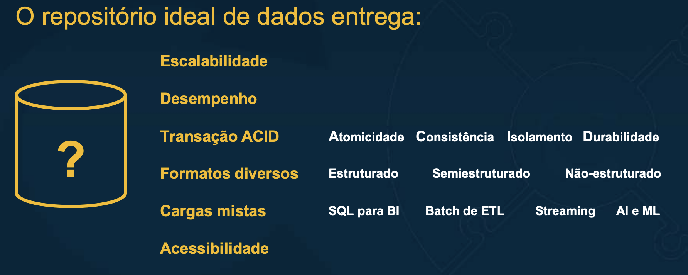

- Escalabilidade
	- comeca com o tamanho certo para o problema atual, conforme de demanda cresce ele cresce junto.
	- Focado muito em nuvem
	- Originalmente banco de dados relacional tem muitos desafios nessa parte
- Desempenho
	- Tempo de reposta, etc...
- Transaçoes ACID
	- É esperado capacidade Atomicidade, consistencia, isolamento e durabilidade
- Divesos formatos
	- Estruturado, Semiestruturado, Não-estruturado
- Cargas mistas
	- SQL para BI 
	- Batch de ETL 
	- Streaming 
	- AI e ML
- Acessibilidade
	- Oracle e SQL server é fechado
	- Json, avro, parquas sao abertos


# ACID

## Atomicidade
Define todos os elementos que compõem uma transação completa do banco de dados.
Todas as operações são bem-sucedidas ou nenhuma delas.
## Consistência
 Define as regras para manter os pontos de dados em um estado correto após uma transação.
Alterações feitas em uma transação serão consistentes com as restrições vigentes (database constraints).
## Isolamento
Mantém o efeito de uma transação invisível para as demais até que esta seja confirmada.
Todas as transações são executadas em um ambiente isolado, sem interferir umas nas outras.
## Durabilidade
Garante que as alterações de dados se tornem permanentes quando a transação for confirmada.

## Transação
É a representação de uma operação econômica no mundo real.
Exemplos: uma compra de produto; um saque de conta-corrente.

Em computação a transação representa o estado transitório do dado o qual é alterado por uma ou mais operações de transformação deste dado.
Um banco de dados transacional ou OLTP (Online Transaction Processing) permite adicionar ou modificar um grande conjunto de dados com muita concorrência e bastante desempenho, permitindo o processamento em tempo real de uma operação de negócio.

## Transação ACID

ACID garante que os dados estarão em um estado consistente e esperado após a execução de um grupo de operações de leitura e gravação, isto é, uma transação que só será bem-sucedida se todas as operações da transação forem bem-sucedidas.
As transações podem impactar um único registro ou vários registros.
Uma transação aderente à Atomicidade, Consistência, Isolamento e Durabilidade é, portanto, uma transação ACID.

# Restrições de Banco de Dados (Database Constraints)

## Consistência, integridade, precisão e confiabilidade

As restrições de banco de dados são um recurso importante dos sistemas de gerenciamento de banco de dados, pois garantem que as regras definidas na criação do modelo de dados sejam aplicadas quando os dados são manipulados (inseridos, atualizados ou excluídos) em um banco de dados.

É uma prática comum definir regras para os dados de um banco de dados.
Isto evita dados incorretos em uma coluna. Por exemplo: uma sequência de texto em uma coluna numérica ou um valor nulo em uma coluna com obrigatoriedade de preenchimento.

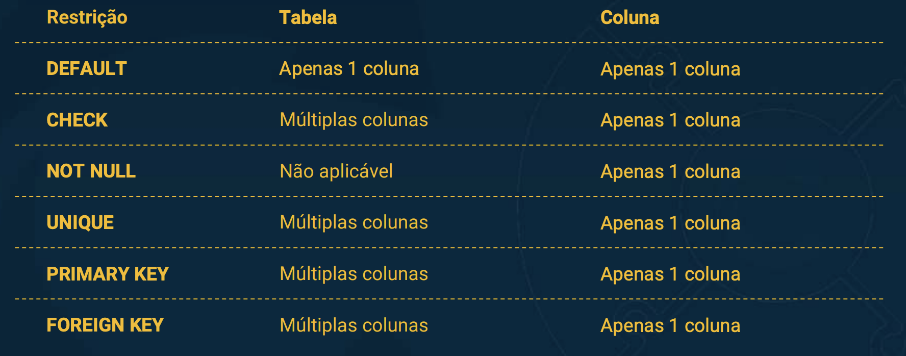

## DEFAULT

Define um valor inicial padrão a ser usado para uma determinada coluna quando nenhum dado for fornecido no momento da inserção.

Se uma coluna com uma restrição DEFAULT for omitida na instrução INSERT, o banco de dados usará automaticamente o valor definido.
Se não houver DEFAULT definido e a coluna for omitida, o banco de dados atribui um valor NULL.
Os padrões podem ser valores fixos ou chamadas para funções SQL do sistema ou definidas pelo usuário.

## CHECK

Impõe uma regra na(s) coluna(s) da tabela e define uma condição lógica a cada vez que uma linha é inserida ou atualizada, a condição é verificada automaticamente e um erro é gerado se a condição for falsa. A condição
pode ser uma expressão que avalia uma ou mais colunas. Também pode incluir valores hardcoded, funções SQL do sistema ou definidas pelo usuário.

## NOT NULL

Como o próprio nome indica, impede que a coluna que a implementa armazene valores nulos. Em outras palavras, deve sempre ter um valor.
Por padrão, todas as colunas de uma tabela aceitam valores nulos (NULL).

Uma restrição NOT NULL impede que uma coluna aceite NULL como valor.

Em geral, as restrições NOT NULL não são nomeadas explicitamente.

## UNIQUE

Use esta restrição para que um valor de coluna específico seja exclusivo para cada registro da tabela. Esta restrição proíbe a coluna que a
implementa de armazenar valores duplicados. Também pode conter diversas colunas; nesse caso, a combinação destas colunas deve ser única.
As chaves exclusivas (UNIQUE KEYs) são definidas no nível da tabela e podem incluir uma ou mais colunas. Eles garantem que os valores de uma linha não se repetem em outra. Você pode criar quantas chaves exclusivas forem necessárias em cada tabela para garantir que todas as regras de negócios associadas à exclusividade sejam aplicadas.

## PRIMARY KEY

É definida em uma ou mais colunas de uma tabela. Indica que esta coluna (ou conjunto de colunas) deve identificar exclusivamente cada linha da tabela. As colunas que fazem parte da PRIMARY KEY devem obedecer às restrições UNIQUE e NOT NULL ao mesmo tempo, ou seja, a(s) coluna(s) não pode(m) conter valores duplicados ou nulos.

## FOREIGN KEY

É definida em uma ou mais colunas de uma tabela como uma referência à(s) coluna(s) PRIMARY KEY de outra tabela. A restrição FOREIGN KEY cria um relacionamento entre as tabelas.

É vital para manter a integridade referencial em um banco de dados. Garante que cada linha em uma tabela filha (como Pedido) tenha uma e somente uma linha associada em uma tabela pai (como Produto)

As chaves estrangeiras são criadas em tabelas filhas e “referenciam” uma tabela pai. Para poder fazer referência a uma tabela, deve existir uma restrição que garanta a exclusividade (UNIQUE ou PRIMARY KEY) para as colunas referenciadas da tabela pai.

Cada valor inserido ou atualizado nas colunas que fazem parte de uma FOREIGN KEY existe exatamente uma vez na tabela pai. Não é possível inserir ou atualizar uma linha com referência a outra linha que não exista na tabela pai. O registro pai não poderá ser excluído caso existam filhos.

### NoSQL também dispõe de técnicas para integridade!

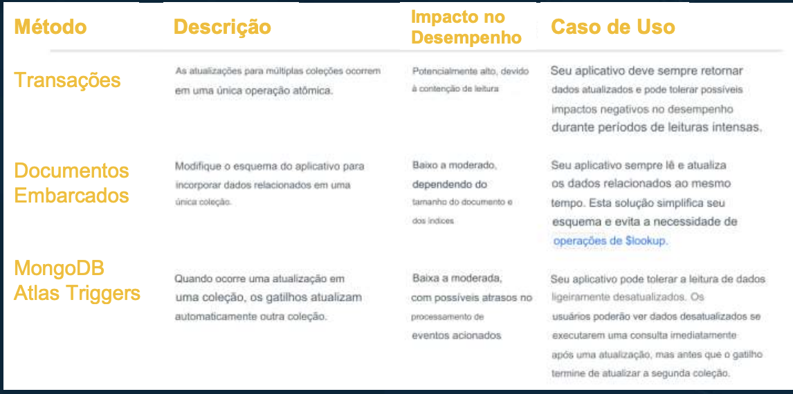


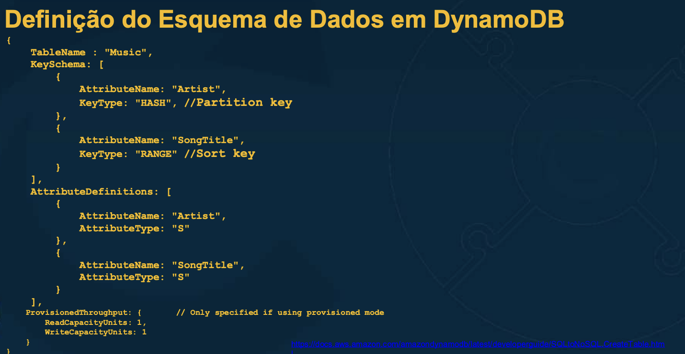

# Teorema CAP

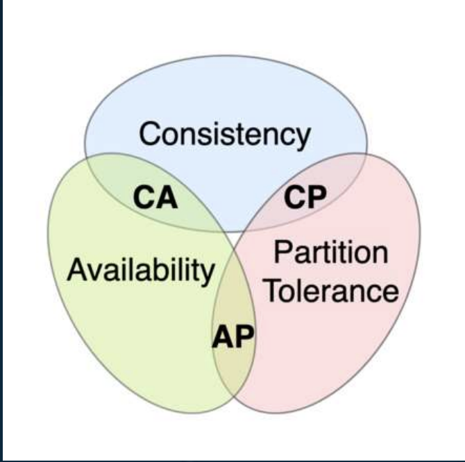

Qualquer armazenamento de dados distribuído pode fornecer apenas 2 das 3 garantias:

- Consistência - Consistency -  Cada leitura recebe a escrita mais recente ou um erro.

- Disponibilidade - Availability -  Cada requisição recebe uma resposta sem a
garantia de que esta contém a escrita mais recente.

- Tolerância à Partição - Partition Tolerance - O sistema continua a operar mesmo com perdas e/ou atrasos de mensagens ocasionados pela rede entre os nós ou seja, partição de rede.

Durante uma partição de rede, decide-se entre:
1) cancelar a operação e diminuir a disponibilidade, mas, garantir a consistência
2) prosseguir com a operação e fornecer disponibilidade,

Tradicionalmente bancos relacionais nao trabalham clusterizados, entao nao sao tolerantes ao particionamento. Proporcionado disponibilidade e consistencia

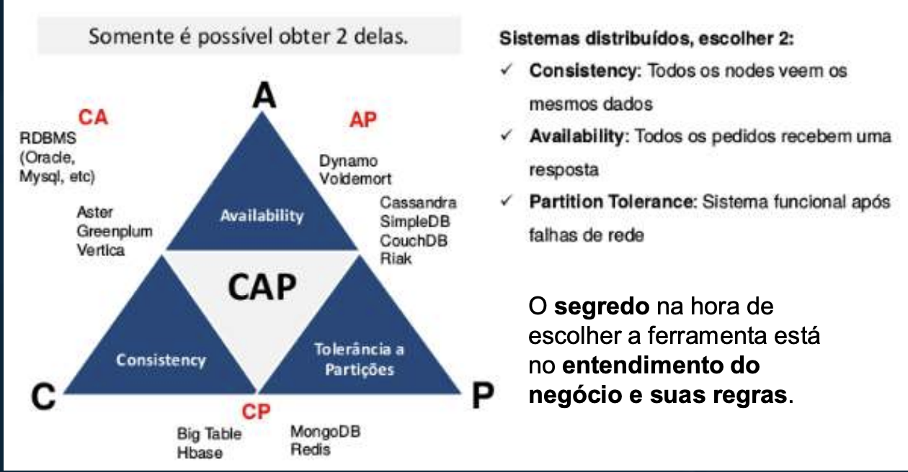

## Teorema CAP - 12 anos depois (2012)

Ao manipular explicitamente as partições de rede, as pessoas desenvolvedoras podem otimizar a consistência e a disponibilidade, conseguindo assim alguma compensação entre os três estados desejáveis de Consistência, Disponibilidade e Tolerância à Partição.

Embora as pessoas desenvolvedoras ainda precisem escolher entre consistência e disponibilidade quando há partições presentes, há uma variedade incrível de flexibilidade para lidar com partições e a respectiva recuperação destas.

> Isto é nao é tao simples agora, tem mais nuances na pratica

O objetivo do CAP moderno é maximizar combinações de consistência e disponibilidade que façam sentido para a aplicação.

O movimento NoSQL trata da criação de possibilidades que se concentram primeiro na disponibilidade e depois na consistência; bancos de dados que aderem às propriedades ACID (atomicidade, consistência, isolamento e durabilidade) fazem o oposto.


Quando em P, a escolha entre C e A pode ocorrer muitas vezes dentro do mesmo sistema com granularidade muito fina; não apenas os subsistemas podem fazer escolhas diferentes, mas a escolha pode mudar de acordo com a operação ou mesmo com os dados específicos ou com o usuário envolvido.

> Pensando em um caixa eletronico distribuido por exemplo: Se a comunicacao entre dois caixas eletronicos caiu (Problema em P), para saque podemos cortar a diponibilidade para manter a consistencia. Porem podemos manter na operacao de deposito tudo normal (mantendo C e A). Pensando ainda na operacao de saque, dependendo do usuario podemos agir diferente. (O tesoureiro do banco pode seguir fazendo os saques)

CAP permite C e A perfeitos na maioria das vezes.

Quando partições estão presentes ou são percebidas, uma estratégia que detecte partições e as considere explicitamente é adequada em 3 etapas: detectar partições, entrar em um modo de partição explícito que possa limitar algumas operações e iniciar um processo de recuperação para restaurar a consistência e compensar erros cometidos durante uma partição.

O Teorema CAP é demasiado simplista e mal compreendido para a tomada de decisão sobre qual banco de dados utilizar.

- Consistência na CAP significa linearização, que é uma noção muito específica e muito forte de consistência. Em particular, não tem nada a ver com o C no ACID, embora esse C também signifique “consistência”.

- Consistência no ACID é a garantia de que uma transação só pode levar o banco de dados de um estado consistente para outro consistente.

## Consisitencia no CAP

No sentido de linearidade

Se a operação B tiver sido iniciada após a conclusão com êxito da operação A, então, a operação B deverá ver o sistema no mesmo estado em que estava na conclusão da operação A ou em um estado mais recente.


- Disponibilidade no CAP é definida como:
	- “cada solicitação recebida por um nó sem falha [de banco de dados] no sistema deve resultar em uma resposta [sem erro]”.

- Não é suficiente que algum nó seja capaz de lidar com a solicitação:
	- qualquer nó que não apresente falha precisa ser capaz de lidar com ela
	- Muitos sistemas chamados de “altamente disponíveis” (ou seja, com baixo tempo de inatividade), na verdade, não atendem a essa definição de disponibilidade

Replicação: sempre que dados forem gravados em um datacenter, também deverão ser gravados na réplica do outro datacenter.

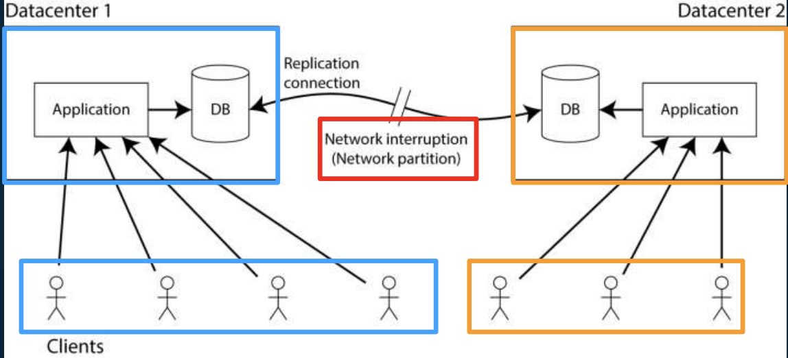

Escolha possíveis:
1) O aplicativo continua tendo permissão para escrever no banco de dados. Portanto permanece totalmente disponível em ambos os datacenters. Entretanto, enquanto o link de replicação for interrompido, quaisquer alterações gravadas em um datacenter não aparecerão no outro datacenter. Isso viola a linearizabilidade.

2) Para não perder a linearização, todas as leituras e escritas precisam ocorrer em um único datacenter. No outro datacenter (que não pode ser atualizado devido à falha no link de replicação), o banco de dados deve parar de aceitar leituras e gravações até que a partição de rede seja reparada e o banco de dados esteja sincronizado novamente.

Assim, embora o outro banco de dados não tenha falhado, ele não pode processar solicitações, portanto não está disponível para CAP.

Portanto, se um sistema escolhe a linearização, isso não significa necessariamente que uma partição de rede leva automaticamente a uma interrupção do aplicativo.


Na prática, os sistemas multi datacenter são frequentemente projetados com replicação assíncrona e, portanto, não linearizáveis.

No entanto, a razão para essa escolha é muitas vezes a latência das redes de longa distância, e não apenas o desejo de tolerar falhas de datacenter e de rede.

Muitos sistemas não são linearizáveis (consistentes) nem CAP-disponíveis.

Considere qualquer banco de dados replicado com um único líder, que é a forma padrão na maioria dos bancos de dados relacionais.

Se um cliente for particionado do líder, não poderá escrever.

Mesmo que ele possa ler de um seguidor (uma réplica somente leitura), o fato de não poder escrever significa que toda configuração de líder único não é CAP-disponível. Tais configurações são frequentemente comercializadas como “alta disponibilidade”

Se a replicação de líder único não é CAP-disponível ("AP") então é “CP”?

Se for permitido que o aplicativo faça leituras de um seguidor e a replicação for assíncrona (o padrão na maioria dos bancos de dados), um seguidor poderá ficar um pouco atrás do líder quando ocorrer a leitura dele.

Nesse caso, suas leituras não serão linearizáveis, ou seja, não é CAP-consistente.

Nem CP, nem AP.

# Teorema PACELC

O fato de não termos conseguido classificar nenhum banco de dados como inequivocamente “AP” ou “CP” deve significar algo: esses simplesmente não são os rótulos corretos para descrever sistemas.

Como alternativa ao CAP, propomos um simples framework de sensibilidade ao atraso para dispor sobre as compensações entre garantias de consistência e tolerância de rede em um banco de dados replicado (A Critique of the CAP Theorem. Martin Kleppmann).

## PACELC

- Se P (Existe falha de particionamento/falha entre as partes)então compensação entre AC Else (senão) compensação entre LC (Daniel Abadi, 2010)
- Quando há particionamento é necessário decidir entre disponibilidade (A) ou consistência (C).
- Quando não há particionamento é necessário decidir entre latência (L) ou consistência (C).

Um requisito de alta disponibilidade implica que o sistema deve replicar dados.
Assim que um sistema distribuído replica dados, surge uma compensação entre consistência e latência.

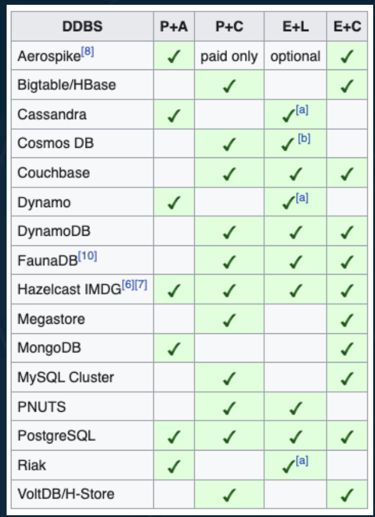

# Modelos de Consistência

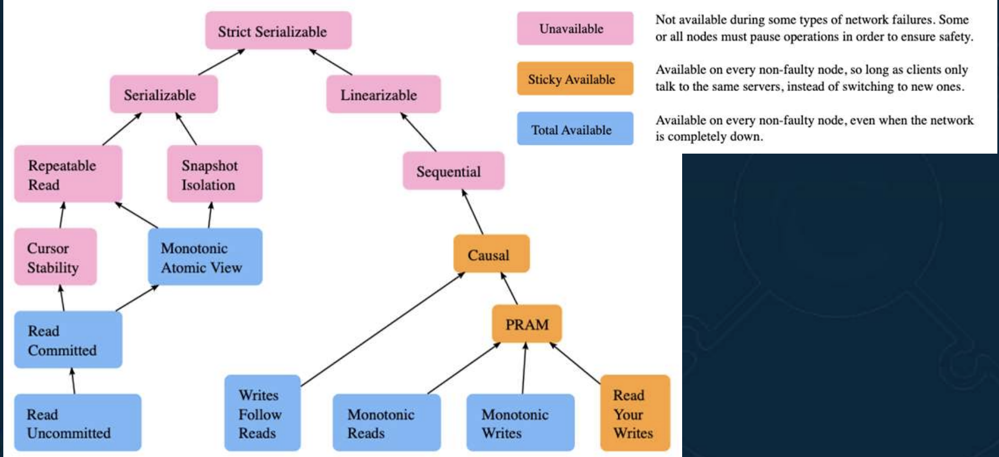

# BASE

- BA
	- Basically Available: basicamente disponível, ou seja, o sistema parece estar funcionando o tempo todo.
- S
	- Soft State: em estado leve, o sistema não precisa ser consistente o tempo todo.
- E
	- Eventual Consistency: eventualmente consistente, o sistema torna-se consistente com o tempo.

## Resolução de Conflitos
Para garantir a convergência das réplicas, um sistema deve reconciliar as diferenças entre múltiplas cópias de dados distribuídos.

Isto consiste em duas partes:

1) troca de versões ou atualizações de dados entre servidores (frequentemente conhecido como antientropia);
2) escolher um estado final apropriado quando ocorrerem atualizações simultâneas, chamado reconciliação.

## BASE Momento da Reconciliação

A reconciliação de escritas simultâneas deve ocorrer algum tempo antes da próxima leitura e pode ser agendada em instantes diferentes:
- Reparo de leitura: A correção é feita quando uma leitura encontra uma inconsistência. Isso retarda a operação de leitura.
- Reparo de escrita: A correção ocorre durante uma operação de gravação, retardando a operação de escrita.
- Reparo assíncrono: A correção não faz parte de uma operação de leitura ou gravação.

# Bloqueio e Simultaneidade

Conflitos podem surgir em um banco de dados quando vários usuários ou aplicativos tentam alterar os mesmos dados ao mesmo tempo.

Técnicas de bloqueio e simultaneidade reduzem o potencial de conflitos, mantendo a integridade dos dados.

O bloqueio impede que outros usuários e aplicativos acessem dados enquanto estão sendo atualizados


Em alguns bancos de dados, o bloqueio se aplica à tabela inteira, o que cria um impacto negativo no desempenho do aplicativo.

Outros aplicam bloqueios no nível de registro, deixando os outros registros dentro da tabela disponíveis, ajudando a garantir um melhor desempenho do aplicativo.

A simultaneidade gerencia a atividade quando vários usuários ou aplicativos fazem consultas ao mesmo tempo no mesmo banco de dados. Esse recurso fornece o acesso correto de acordo com as políticas definidas para o controle de dados.

## Bloqueio otimista

- Pressupõe que conflitos e erros são raros. (Mario parte é concluida sem conflitos)
- A maioria das transações pode ser concluída sem interferência.
- Não bloqueia os dados antes da leitura ou escrita, mas, verifica se há alterações no final da transação.
- Se outra transação tiver modificado os dados, a transação atual será abortada e deverá ser tentada novamente.
- Adequado para cenários onde as operações de leitura são mais frequentes do que as operações de gravação e onde o bloqueio dos dados causaria muita degradação do desempenho.

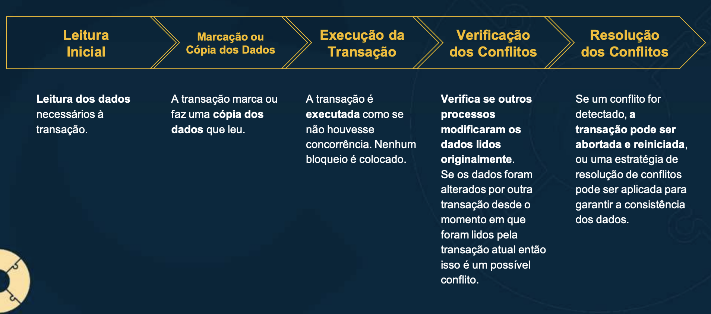

### Vantagens
- Mitiga o risco de impasse (deadlock).
- Melhor desempenho e escalabilidade em sistemas com muitas transações concorrentes.
### Desvantagens
- Exige que as pessoas desenvolvedoras implementem a detecção e resolução de conflitos nas aplicações.
- Aumenta a latência e a complexidade das transações.
- Potencialmente reduz a consistência e a confiabilidade dos dados.

## Bloqueio Pessimista

- Recursos são bloqueados exclusivamente para a transação que os está acessando.
- Assume que conflitos e erros são comuns.
- A maioria das transações precisa de acesso exclusivo aos dados.
- Bloqueia os dados antes da leitura ou escrita e evita que outras transações os modifiquem até que a transação atual seja confirmada ou revertida.
- Adequado para cenários onde as operações de escrita são mais frequentes do que as operações de leitura e onde cancelar e repetir transações seria muito caro ou complexo.


### Vantagens
- Simplifica a lógica e o código das transações.
- Reduz a latência e a complexidade.
- Favorece a consistência e a confiabilidade dos dados.
### Desvantagens
- Cria o risco de impasse (deadlock).
- Sobrecarga de bloqueio e desbloqueio.
- Limita a simultaneidade e a taxa de transferência (throughput).


### Tratamento de Conflitos

- Bloqueio pessimista, não elimina a possibilidade de conflitos e erros.
- Transfere a responsabilidade de tratamento destes cenários na aplicação para o banco de dados.
- Cenários comuns:
	- Impasse (deadlock);
		- duas ou mais transações estão aguardando que a outra libere um recurso que precisa para continuar, criando uma situação em que nenhuma das transações pode progredir.
	- Esgotamento de tempo limite (timeout)
		- Período máximo de espera permitido para que uma operação seja concluída antes que seja considerada falha ou interrompida.
	- Escalada de bloqueio (lock escalation)
		-  O banco de dados decide consolidar bloqueios individuais que estão em níveis mais baixos (em linhas ou registros individuais) em um nível mais alto (como uma tabela inteira) para reduzir a sobrecarga de gerenciamento de bloqueios e melhorar a eficiência.


- Geralmente, o banco de dados detecta e resolve por meio do cancelamento de uma das transações e liberando seus bloqueios.
- A aplicação deve capturar a exceção e tentar novamente a transação cancelada.
- Para controlar o comportamento de bloqueio e reduzir a contenção de outras transações, a aplicação também deve:
	- evitar bloquear muitas linhas ou colunas;
	- usar níveis de isolamento e
	- usar dicas (hints) de bloqueio apropriados.

# Niveis de isolamento

## Problemas da ausência de isolamento entre transações:

- Leitura Suja (Dirty Read)
	- Uma transação Aatualiza um registro enão confirma (commit) as alterações.
	- O banco de dadospermite que a transação B leia este registro antes da 
	confirmação de A.

- Leitura Irrepetível (Non-repeatable read)
	- Leituras consecutivas podem recuperar resultados diferentes quando é permitido que outra transação faça atualizações entre estas leituras.

- Leitura Fantasma Phantom Read
	- Transação A faz duas leituras da mesma consulta enquanto a transação B insere ou exclui linhas e há a alteração no número de linhas recuperadas pela transação A em sua segunda leitura.


# Tipos bloqueio

Tipos de bloqueio que podem acontecer sobre os recursos de um banco dados

- Bloqueio de Leitura Read Lock (R)
	- Aplicado quando uma transação precisa ler dados de um recurso.
	- Permite que várias transações leiam os mesmos dados simultaneamente.
	- Pode bloquear transações de escrita, resultando em atrasos para transações de modificação.

- Bloqueio de Escrita Write Lock (W)
	- Aplicado quando uma transação precisa modificar ou escrever dados em um recurso.
	- Impede que outras transações leiam, atualizem ou excluam os dados enquanto o bloqueio estiver ativo.
	- Garante a exclusividade durante operações de escrita.
	- Pode causar bloqueios e atrasos durante muitas transações concorrentes.

- Bloqueio Compartilhado Shared Lock (S)
	- Permite que várias transações leiam os mesmos dados simultaneamente.
	- Impede que outras transações modifiquem os dados durante a vigência do bloqueio.
	- Pode ter bloqueios de escrita e atrasos em atualizações

- Bloqueio Exclusivo Exclusive Lock (X)
	- Aplicado quando uma transação precisa de acesso exclusivo a um  recurso para modificar ou escrever dados nele.
	- Impede que outras transações acessem o recurso enquanto o bloqueio estiver vigente.
	- Evita conflitos de escrita.

- Bloqueio de AtualizaçãoUpdate Lock (U)
	- É uma combinação de bloqueio de leitura e bloqueio de escrita.
	- Permite que uma transação leia e atualize os dados de forma exclusiva.
	- Evita leituras sujas. Similar ao Bloqueio Compartilhado, porém,com mais flexibilidade.

- Bloqueio de Intenção Compartilhado - Intent Shared Lock (IS)
	- Indica a intenção de uma transação de adquirir bloqueios de leitura em níveis mais baixos
	- Usado para coordenar bloqueios em diferentes níveis de granularidade

- Bloqueio de Intenção Exclusivo-  Intent Exclusive Lock (IX)
	- Indica a intenção de uma transação de adquirir bloqueios de escrita em níveis mais baixos.
	- Usado para coordenar bloqueios em diferentes níveis de granularidade.

- Bloqueio de Intenção Compartilhado Exclusivo - Shared Intent Exclusive Lock (SIX)
	- Indica a intenção de uma transação de	adquirir bloqueios de leitura e escrita em níveis mais baixos.
	- Indica que outros processos podem adquirir bloqueios de leitura em níveis inferiores.

# Níveis de Bloqueio

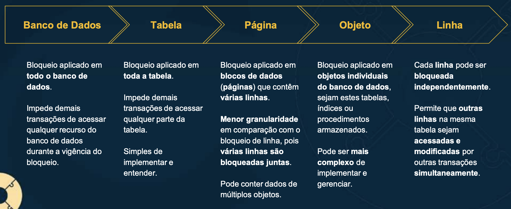

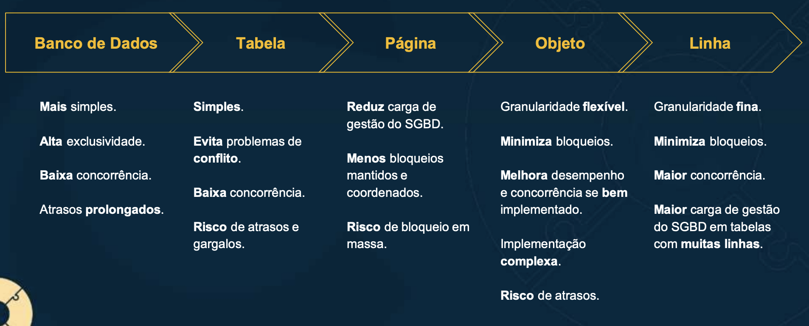