# Transações Distribuídas

- Bancos de dados distribuídos normalmente dividem suas tabelas (ou coleções) em partições (ou nós ou shards) espalhadas por diferentes servidores que são acessados por muitos clientes.
- Transações dos clientes geralmente abrangem diferentes servidores, pois as transações demanda leituras em várias partições.
- Uma transação distribuída é uma transação de banco de dados que abrange vários servidores.
- Ocorrem em sistemas distribuídos, onde múltiplos nós ou servidores participam da execução de uma transação.
- Podem abranger vários recursos distribuídos e, portanto, exigem coordenação entre os nós para garantir a consistência dos dados.
- Protocolos de coordenação como 2PC, 3PC, Paxos e Raft são usados para facilitar essa coordenação e garantir a integridade dos dados.

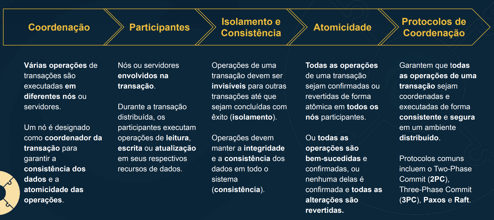

## Transações Distribuídas: Confirmação Atômica (Atomic Commit)

- Uma transação é confirmada ou revertida.
- Se é confirmada então as atualizações são duráveis.
- Se é revertida então não há efeitos visíveis.
- Consistência ACID (preservar estado válido) depende de atomicidade.

Se a transação atualiza dados em múltiplos nós então:
- Todos os nós confirmam ou todos revertem a transação.
- Se um nó falhar então todos os nós revertem a transação.

Portanto, este é um problema de Confirmação Atômica (Atomic Commit).

Confirmacao atomica em contra partida com consenso

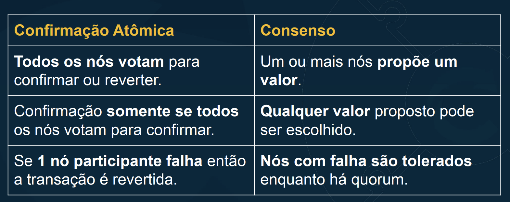

# Protocolos de Coordenação: Two-Phase Commit (2PC)

- A confirmação em 2 fases busca garantir que todas as operações de uma transação sejam confirmadas ou revertidas de forma atômica em todos os nós participantes.
- Fase 1 de preparação: os nós concordam em executar a transação e preparam-se para confirmá-la.
- Fase 2 de confirmação: os nós confirmam ou revertem a transação com base na preparação.

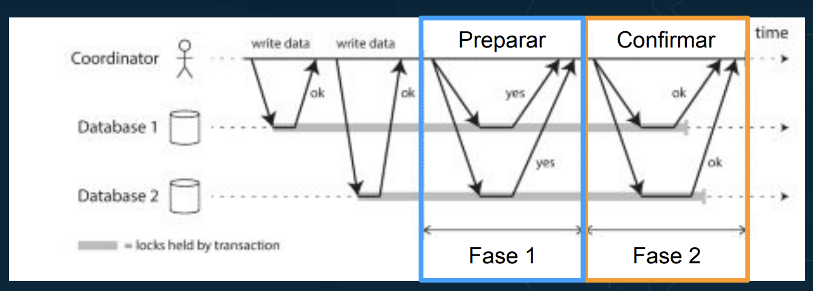

## Fase 1

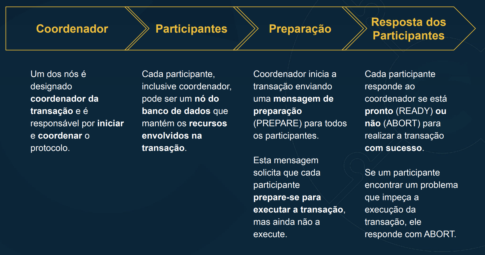

## Fase 2

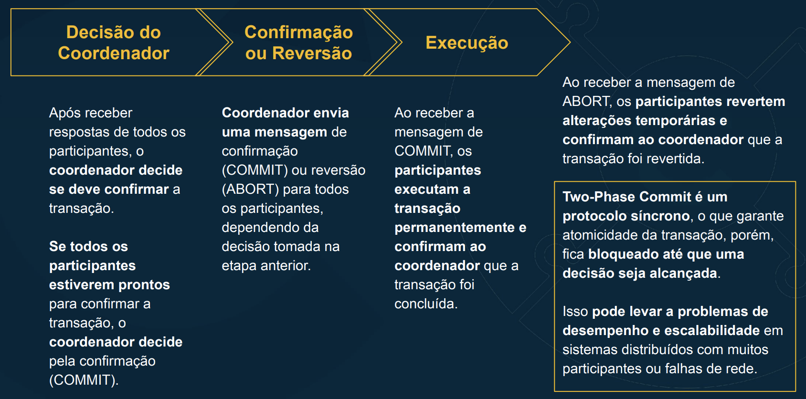

# Protocolos de Coordenação: Fault Tolerant Two-Phase Commit (2PC)

- Fornece maior robustez e resiliência à falha.
- Garante ao mesmo tempo a atomicidade das transações.
- Vulnerabilidade do 2PC é que o coordenador é um ponto único de falha.
- Durante a falha do coordenador logo após a preparação não há a confirmação e, logo, não há progresso da transação nos nós.

# Protocolos de Coordenação: Three-Phase Commit (3PC)

- Extensão do protocolo Two-Phase Commit (2PC) para mitigar bloqueio indefinido

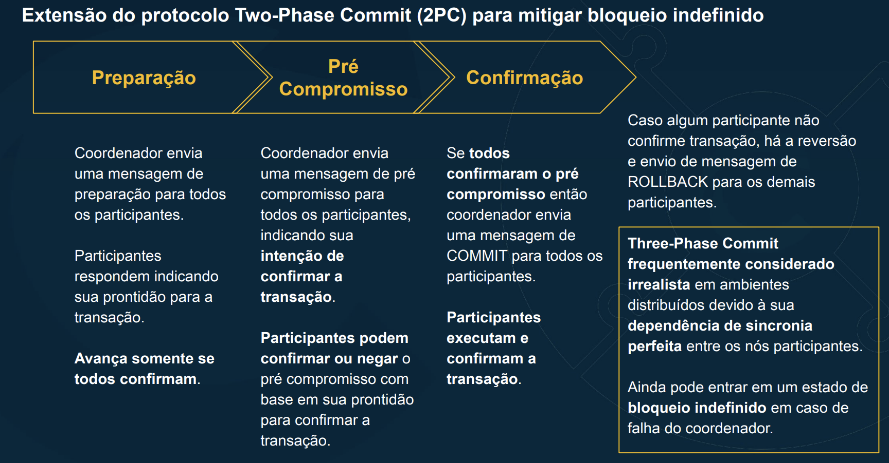

# Modelos de Sistemas Distribuídos 

## Problema dos 2 Generais

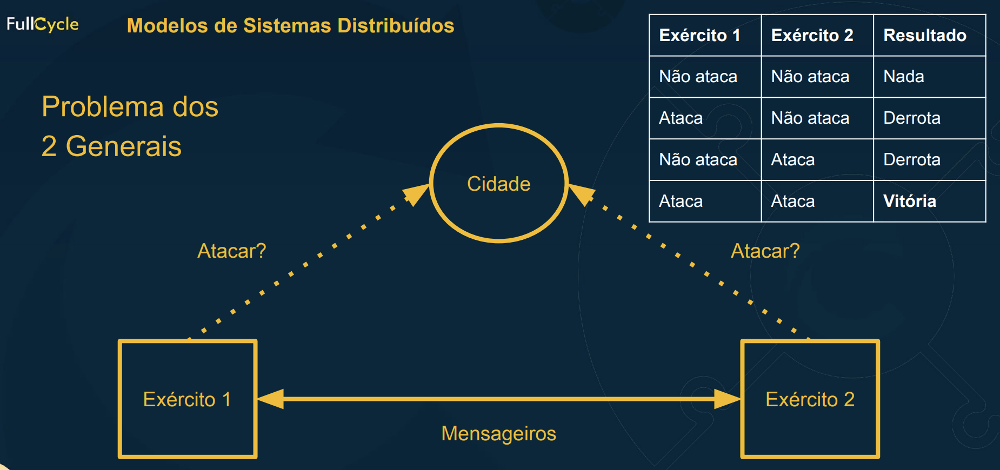

- Desejado: Exército 1 ataca se e somente se Exército 2 ataca
- Para o General 1 estas situações são indistinguíveis!
- Para decidir é necessário comunicar!

## Problema dos Generais Bizantinos

- Problema: alguns generais podem ser traidores!

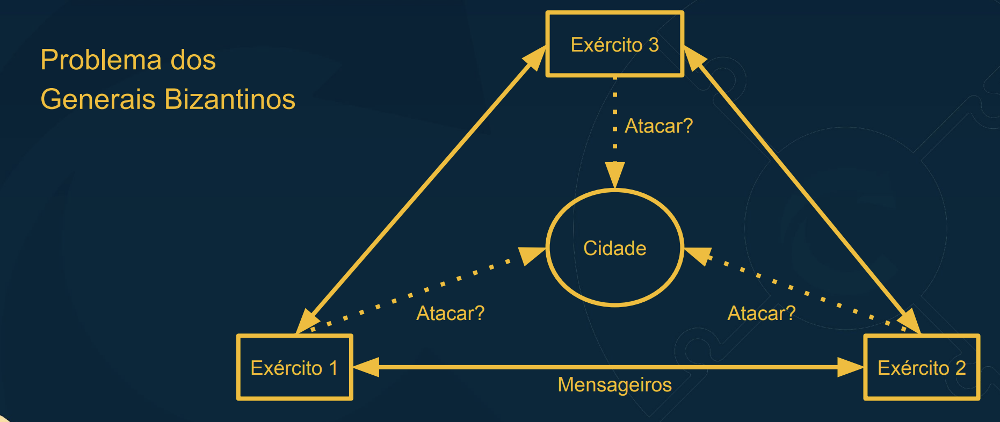

- Para o General 3 estas situações são indistinguíveis!
- Generais honestos precisam concordar com o plano de ação.

Precisamos encontrar um forma de consenso para agir quando realmente a maioria disser

- Cada general pode ser honesto ou malicioso.
- Teorema: 3ƒ + 1 generais honestos para tolerar ƒ generais maliciosos.
- Generais honestos não sabem quem é malicioso.
- Generais maliciosos podem conspirar juntos.
- Criptografia com assinaturas digitais ajuda.
- Portanto, generais honestos precisam estar de acordo com o plano de ação

## Conclusao

- Problema dos 2 Generais = Modelo de Redes
- Problema dos Generais Bizantinos = Modelo de Comportamento do Nó

Em sistemas reais ambos nós e redes podem falhar.
Modelos de Sistemas Distribuídos Modelo consistem em premissas para:

- REDE
- NÓ
- SINCRONIA

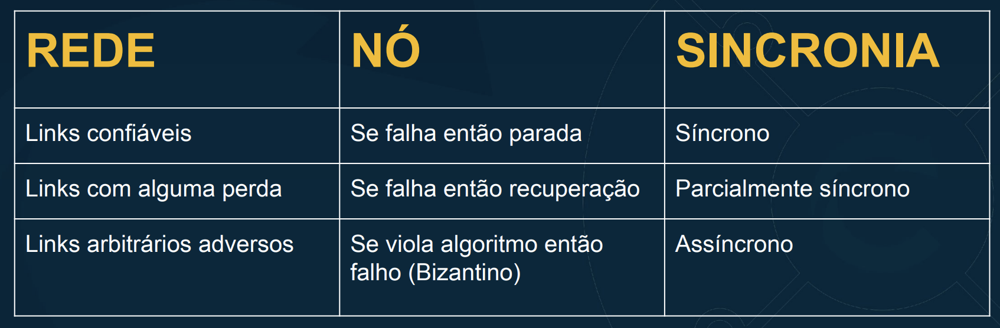

Base para algoritmos distribuídos:
Para cada 1 dessas 3 partes escolha 1 desses comportamentos.

# Replicação

## Medir o tempo é necessários nos sistemas distribuídos:

- Agendadores (schedulers),
- Temporizadores (timeouts & retries),
- Detectores de falha,
- Medição de desempenho,
- Rastreabilidade (log),
- Dados com validade temporal (cache)
- **Determinar ordem de ocorrência de eventos em múltiplos nós.**

## Tipos de relógio

- Relógio Físico: contagem do número de segundos decorridos.

- Relógio Lógico: contagem de eventos/mensagens enviados.
    - Relógio Lógico Lamport → ordem causal
    - Relógio Lógico Vetorial → detecta eventos concorrentes

## Transmissão ou multitransmissão é uma comunicação em grupo:

- Um nó envia mensagens e todos os nós entregam estas mensagens;
- Membros do grupo podem ser estáticos ou dinâmicos;

- Transmisao Pode ser:
    - Melhor esforço → perde algumas mensagens;
    - Confiável → todas as mensagens são transmitidas.

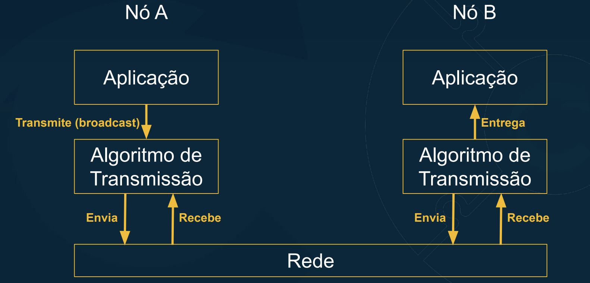

## Formas de transmissão confiável (reliable broadcast):

- FIFO broadcast
    - Se m1 e m2 são transmitidas pelo mesmo nó e a transmissão de m1 precede a transmissão de m2 então m1 tem que ser entregue antes de m2.
- Causal broadcast
    - Se a transmissão de m1 precede a transmissão de m2 então m1 tem que ser entregue antes de m2.
- Total order broadcast
    - Se m1 é entregue antes de m2 em um nó então m1 tem que ser entregue antes de m2 em todos os nós.
- FIFO-total order broadcast
    - Combinação de FIFO broadcast + total order broadcast.

### Ordem de confiabilidade, quando mais acima mais forte

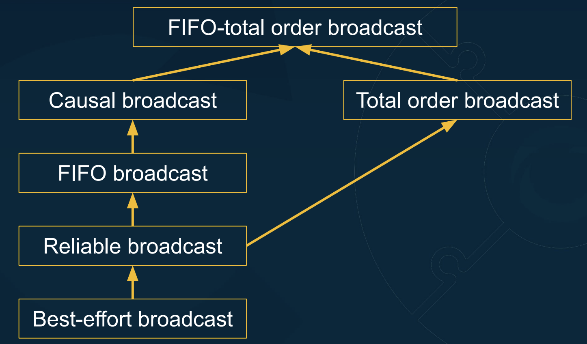

No fim das contas Replicação é manter uma cópia dos mesmos dados em múltiplos nós.
- Um nó com uma cópia dos dados é uma réplica.
- Se algumas réplicas estão indisponíveis, outras estarão acessíveis.
- Replicação permite a distribuição de carga sobre muitas réplicas.
- Replicação é fácil com dados estáticos: é apenas uma cópia.
- Requer foco em mudança dos dados.

### Replicação baseada em total order broadcast é amplamente utilizada.

# Quorum

A replicação é útil porque melhora a confiabilidade de um sistema. Com tolerância à falha a confiabilidade aumenta.

Enquanto uma réplica estiver indisponível, as demais réplicas restantes continuam o processamento das solicitações.

Indisponibilidade pode ocorrer devido à:
1. falha no nó (travamento, falha de hardware etc);
2. partição de rede (incapacidade de comunicação com outros nós);
3. manutenção planejada (reiniciar um nó com atualizações).

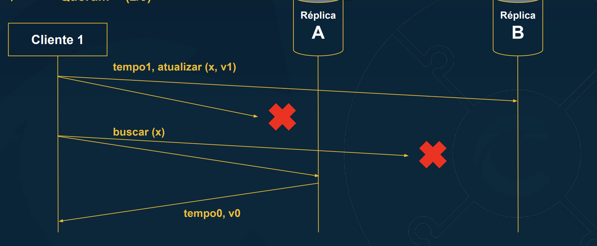

Escrever na Réplica B e ler da Réplica A = Cliente não recebe o último valor.
Exigir escritas e leituras em ambas as réplicas não é tolerante à falha.

Imagine…
1) postar na sua rede social favorita;
2) atualizar o feed;
3) não ver o seu post recém postado!
Este comportamento é confuso para os usuários.
Por esta razão, sistemas exigem consistência "ler após escrita".
→ read-after-write consistency

- Consistência "ler após escrita" pode não devolver para o cliente original o valor escrito por ele mesmo pois outro cliente concorrente pode ter atualizado o valor.

- Consistência "ler após escrita" exige ler o último valor escrito ou o valor mais recente.

- Com 3 réplicas o problema da tolerância à falha é resolvido. Todas as requisições de leitura escrita são enviadas às 3 réplicas. A requisição é um sucesso com 2 ou mais respostas recebidas.

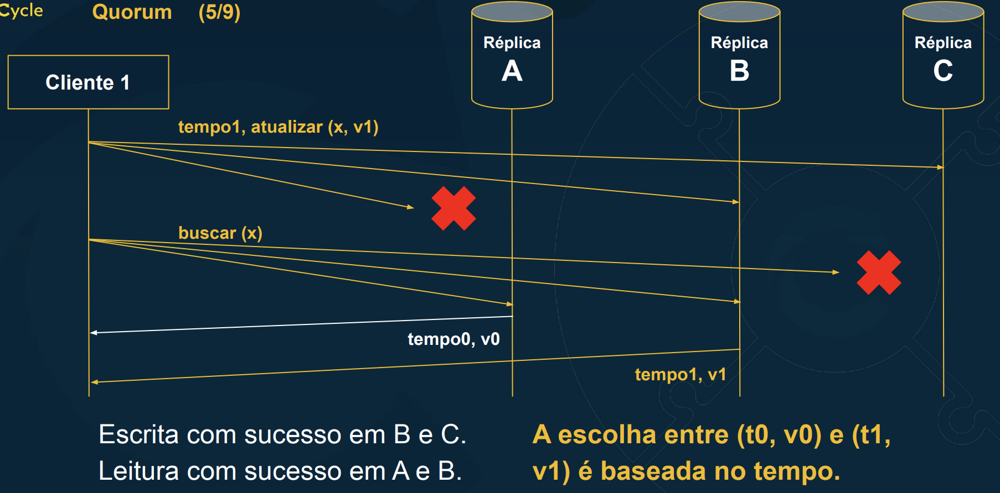

Conceito: quorum é o número mínimo de membros cuja presença é imprescindível para dar validade às deliberações e votos de um
determinado órgão colegiado.

Em um sistema com n réplicas:
1) Se uma escrita é reconhecida por w réplicas (quorum de escrita);
2) e subsequentemente é lida a partir de r réplicas (quorum de leitura);
3) e r + w > n

Então, a leitura verá o valor escrito ou o valor mais recente.
Quoruns de leitura e escrita compartilham 1 ou mais réplicas.
Maioria → r = w = (n+1) / 2 para n = 3, 5, 7
Leituras toleram n-r réplicas indisponíveis
Escritas toleram n-w réplicas indisponíveis

- MongoDb utiliza isso, pois esse o numero de replicas elegives possiveis tem esses valores como opcao (impares)

Porem nesta abordagem de quorum para replicação, algumas atualizações podem estar pendentes para algumas réplicas em algum dado momento.

Uma solução para ressincronizar réplicas novamente entre si é aplicar um processo de antientropia.

- Réplicas periodicamente comunicam-se entre si para verificar inconsistências.
- Registros com o último tempo são propagados.
- Registros com tempos mais cedo são descartados.

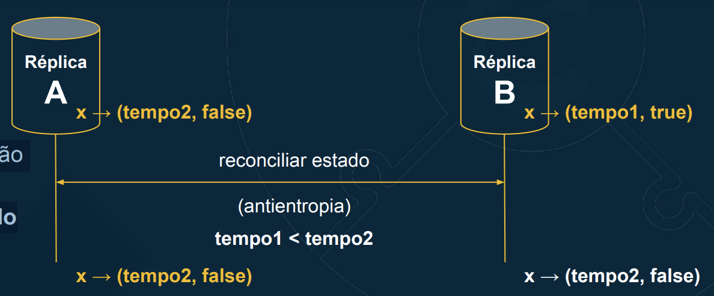

A solução alternativa para ressincronizar réplicas é utilizar os clientes para apoiar no processo de propagar as atualizações dos dados. Este processo é o reparo de leitura.

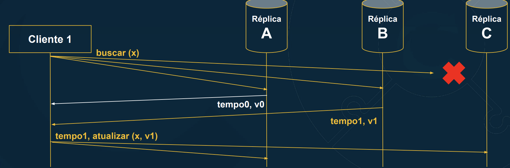

# Consenso

Replicação baseada em total order broadcast é amplamente utilizada e é feita com um nó líder que roteia as mensagens. Este nó líder distribui as
mensagens via FIFO broadcast (First In First Out). Assim, todos os nós
entregam a mesma sequência de mensagens na mesma ordem.
Problema: nó líder é um ponto único de falha.
Soluções:
1) Intervenção humana - operador humano seleciona novo líder e reconfigura
cada nó seguidor para seguir o novo líder.
2) Algoritmo de Consenso - transferência automática de lideranç